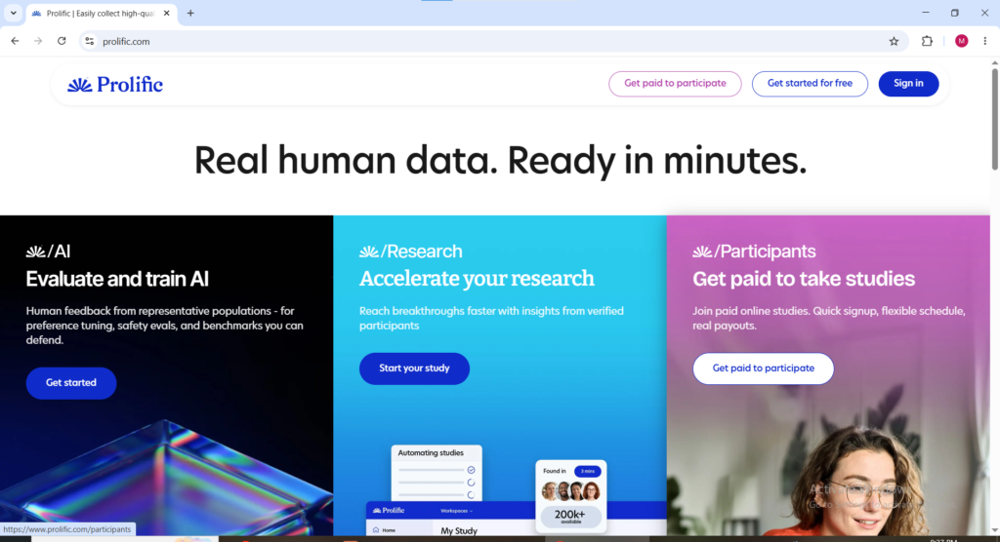
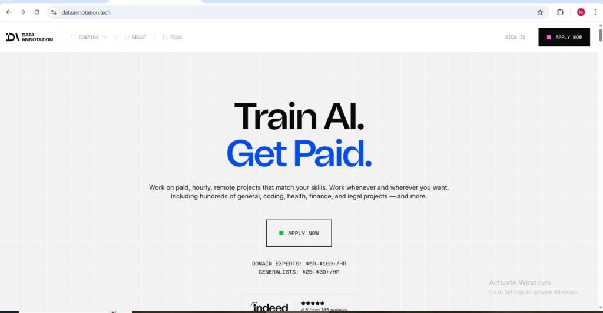
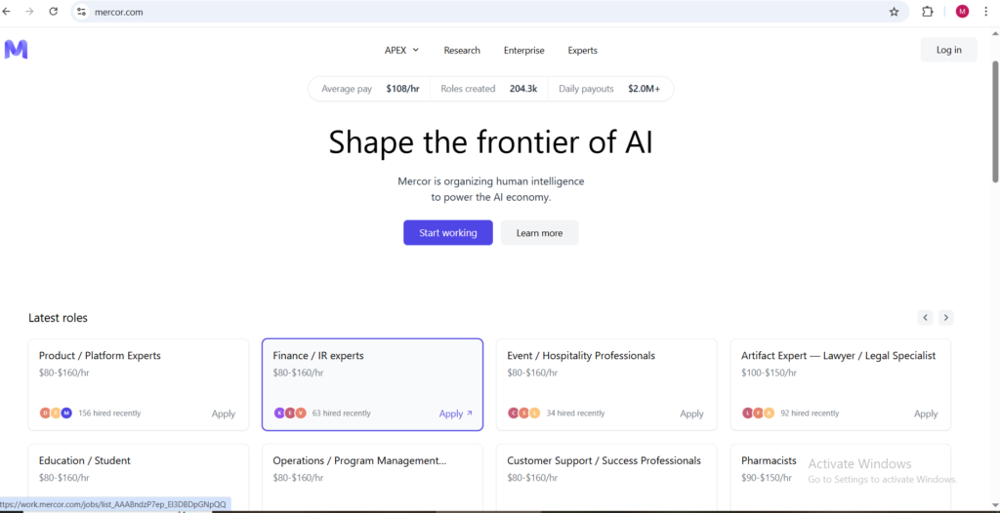
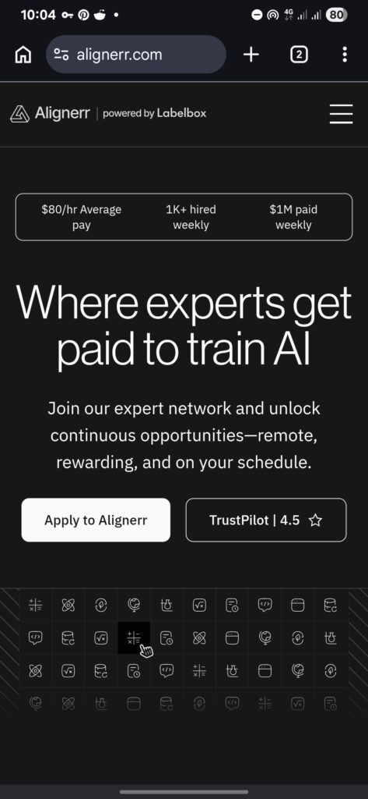
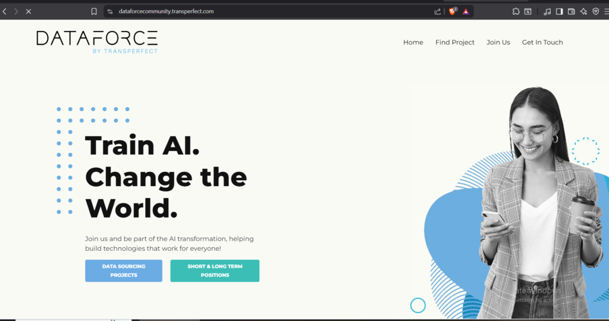

Artificial intelligence has created a new category of online jobs where companies pay people to help train and improve AI systems. These roles are known as AI training jobs, AI data annotation jobs, or paid-to-train AI jobs.

Workers review chatbot responses, label data, evaluate search results, and complete other tasks to make AI more accurate.

Demand has grown rapidly because companies building AI chatbots and automation tools need large amounts of human feedback. This creates flexible remote income opportunities for people in the UK.

While some platforms require advanced skills like coding or math, many accept beginners for simple labeling and evaluation tasks. This guide covers the best paid-to-train AI platforms currently working in the UK and how they operate..

* * *

## BELOW ARE THE 1O PLATFORMS; THEIR DIFFERENCES, HOW TO APPLY, REALISTIC MONTHLY INCOME, PERSONAL ADVICE ETC

### 1\. Prolific

Website: [Prolific.com](http://Prolific.com)

Prolific is one of the most trusted online research and AI feedback platforms available in the UK. Unlike many survey websites that offer extremely low earnings, Prolific is known for fair payment rates and reliable payouts. The platform originally focused on academic research studies, but many AI companies now use it to gather human feedback for artificial intelligence systems.

Workers on Prolific may complete:

- AI evaluation studies,

- chatbot feedback tasks,

- research experiments,

- surveys,

- and behavioral studies.

One reason many UK users prefer Prolific is because tasks are beginner-friendly. You do not necessarily need technical skills to start earning. Some studies only require answering questions honestly or reviewing AI-generated outputs.

Payments vary depending on study length and complexity. Some short tasks only pay a few pounds, while specialized AI studies can pay significantly more per hour. The platform is also respected because it usually avoids the extremely low-paying tasks common on other microtask websites.

The downside is that study availability changes depending on your profile. Users who complete their profiles carefully often receive more invitations.

For beginners looking to enter the AI training industry, Prolific is considered one of the safest starting points.

* * *

### 2\. Outlier AI

Website: [Outlier.ai](http://Outlier.ai)

Outlier AI has become one of the fastest-growing AI training platforms online. The platform pays workers to help improve advanced AI systems and chatbots through human feedback tasks.

Common tasks on Outlier AI include:

- comparing chatbot responses,

- rewriting AI answers,

- fact-checking responses,

- evaluating reasoning quality,

- and ranking AI-generated content.

Unlike simple survey sites, Outlier AI often offers projects requiring stronger analytical or writing skills. Some tasks also involve coding, mathematics, science, or professional expertise.

One reason Outlier AI became popular is because of its relatively high earning potential. Certain projects reportedly pay much more than traditional online gig platforms. However, task availability may fluctuate because projects can start or stop suddenly.

Workers usually complete onboarding assessments before gaining access to projects. Those with specialized skills often qualify for higher-paying opportunities faster.

Although many workers report positive experiences, others complain about inconsistent project flow and sudden pauses. Because of this, Outlier AI is often best treated as a side hustle instead of guaranteed full-time income.

Still, for people in the UK looking for AI-related remote work, Outlier AI remains one of the most discussed platforms in 2026.

* * *

### 3\. DataAnnotation.tech

Website: [DataAnnotation.tech](http://DataAnnotation.tech)

DataAnnotation.tech is another major AI training platform that pays people to evaluate and improve artificial intelligence systems. The platform has become extremely popular among remote workers because many tasks involve writing, reasoning, and reviewing chatbot outputs.

Workers on DataAnnotation.tech may:

- evaluate AI responses,

- rank answers,

- summarize text,

- write explanations,

- and improve language quality.

Some projects are beginner-friendly, while others require technical expertise or advanced writing ability. Users who perform well on qualification tests often gain access to better-paying tasks.

The platform is attractive because many workers report higher hourly rates than typical online survey sites. However, acceptance into projects can be competitive, especially for specialized roles.

One important thing about DataAnnotation.tech is that quality standards matter heavily. Workers who consistently submit strong work are more likely to receive ongoing projects.

For UK residents interested in flexible AI training jobs, DataAnnotation.tech is one of the strongest options currently available.

* * *

### 4\. TELUS

Website: [Telusinternational.com](http://Telusinternational.com)

TELUS International AI Community is a well-known remote work platform focused on AI data services and search evaluation. The company hires remote contractors from many countries, including the UK.

Tasks may include:

- search engine evaluation,

- content moderation,

- AI testing,

- speech evaluation,

- and data annotation.

Many workers use TELUS as part-time remote income because projects are flexible and can often be completed from home.

Some positions require passing qualification exams before starting work. These exams test attention to detail and understanding of guidelines. Workers who follow instructions carefully usually perform better on the platform.

TELUS is often recommended because it has been operating for years and has a relatively strong reputation in the remote work industry.

However, project availability can vary depending on region and client demand.

* * *

### 5\. Remotasks

Website: [Remotasks.com](http://Remotasks.com)

Remotasks is one of the most beginner-friendly AI data labeling platforms online. It allows workers to complete various annotation and categorization tasks that help train machine learning systems.

Tasks on Remotasks may involve:

- image labeling,

- audio transcription,

- text categorization,

- and AI data annotation.

The platform provides training materials for beginners, which makes it attractive for people without previous AI work experience.

Pay varies significantly depending on project complexity. Basic tasks may pay less than specialized AI projects, but experienced workers who qualify for advanced tasks often earn more.

One advantage of Remotasks is flexibility. Workers can usually choose when to complete tasks.

The downside is that lower-level tasks sometimes have inconsistent pay rates. Still, it remains a popular entry point into the AI training industry.

* * *

### 6\. Toloka

Website: [Toloka.ai](http://Toloka.ai)

Toloka is a microtask platform designed for AI training and data collection. Workers complete small online tasks that help improve machine learning systems and search engines.

Common Toloka tasks include:

- image categorization,

- AI validation,

- search relevance evaluation,

- and language-related testing.

The platform is available internationally and supports users in many countries, including the UK.

Toloka is often considered beginner-friendly because many tasks are relatively simple. However, individual tasks may pay small amounts, so workers often need consistency to build meaningful earnings.

Users who maintain good accuracy ratings generally receive access to better opportunities over time.

For beginners looking for simple online AI work, Toloka can be a useful starting platform.

* * *

### 7\. Mercor

Website: [Mercor.com](https://t.mercor.com/tjNOK)

Mercor focuses more heavily on expert-level AI training jobs rather than basic microtasks. The platform connects companies with professionals who can help evaluate advanced AI systems.

Mercor often recruits:

- developers,

- engineers,

- mathematicians,

- legal experts,

- and technical specialists.

Projects may involve:

- coding evaluation,

- advanced reasoning,

- AI testing,

- and expert verification tasks.

Because of the technical nature of many projects, Mercor can offer higher earning potential than beginner platforms.

However, entry requirements are usually stricter. Workers often need strong resumes, technical knowledge, or professional backgrounds.

For skilled professionals in the UK, Mercor may provide access to some of the highest-paying AI training opportunities available online.

* * *

### 8\. Scale AI

Website: [Scale.com](http://Scale.com)

Scale AI is one of the largest companies operating in the AI data industry. The company works with machine learning systems that require huge amounts of labeled and verified data.

Scale AI supports projects involving:

- autonomous systems,

- machine learning datasets,

- AI model training,

- and data annotation.

Some workers access opportunities through contractor systems or project partnerships.

Scale AI is highly respected within the artificial intelligence industry because of its large-scale operations and partnerships with major technology organizations.

Although direct task access may vary depending on location and project demand, the company remains an important player in the AI training ecosystem.

* * *

### 9\. Alignerr

Website: [Alignerr.com](http://Alignerr.com)

Alignerr is another AI training and annotation platform that hires remote workers to help improve artificial intelligence systems. The platform focuses on tasks involving AI evaluation, writing improvement, reasoning analysis, and expert feedback for machine learning projects.

Workers on Alignerr may complete:

- AI response evaluations,

- chatbot testing,

- writing tasks,

- coding projects,

- and data annotation assignments.

The platform has gained popularity among remote workers because it offers opportunities for both beginners and skilled professionals. Some projects are simple enough for general users, while others target experts in areas such as programming, mathematics, and science.

One advantage of Alignerr is that it focuses heavily on quality scoring and human feedback, which are becoming increasingly important in the AI industry. Companies developing advanced AI systems rely on platforms like Alignerr to improve chatbot accuracy and reasoning capabilities.

As with many AI training platforms, work availability can fluctuate depending on project demand. However, many online discussions mention Alignerr as one of the growing alternatives to Outlier AI and DataAnnotation.tech for remote AI work opportunities.

For UK workers interested in AI-related remote jobs, Alignerr is becoming one of the newer platforms worth monitoring in 2026.

* * *

### 10\. DataForce by Transpect

DataForce.ai (part of TransPerfect) offers paid opportunities to help train AI through tasks like data annotation, data sourcing/collection, rating/evaluation, voice recording, photo/image collection, and user studies.  
These are mostly freelance/gig-style remote tasks (flexible, choose when and how much you work), with some longer-term or full/part-time positions available. Pay varies by project and location, but it's a legitimate platform used by many for side income.

  
**How to Get Started  
1\. Go to the DataForce Community site: Visit** [https://dataforcecommunity.transperfect.com](https://dataforcecommunity.transperfect.com)  
2\. **Sign up**: It takes less than 5 minutes. Create an account (they have over 1.3 million contributors worldwide).  
3\. **Browse available projects**: Go to the Projects page.  
Preview requirements (e.g., must reside in a specific country, language skills, age 18+, device needs like being able to record audio or upload RAW photos).  
Examples: Voice recording for assistants, image annotation, photo collection for AI training, content rating/evaluation.  
4\. **Apply to projects** you qualify for. Some tasks can be done directly from your mobile device.  
5\. **For team positions** (short/long-term): There's a separate "Join Our Team" option leading to [community.transperfect.com/](http://community.transperfect.com/)  
**Tips**  
Availability depends on your location, native language, and skills (e.g., specific accents, teaching experience, or ability to provide certain data types).  
Tasks are project-based, so work isn't always constant check regularly for new ones.  
Check their FAQ for payments and other details.  
It's similar to platforms like Appen or Clickworker but focused on high-quality AI training data. Many people use it as a flexible side hustle. Good luck!

* * *

### Final Thoughts

AI training jobs have become one of the fastest-growing remote work categories in recent years. As artificial intelligence systems continue to expand, companies increasingly rely on human workers to improve chatbot accuracy, evaluate machine learning outputs, and train AI models.

Platforms like Prolific, Outlier AI, DataAnnotation.tech, and TELUS International AI Community continue to attract remote workers in the UK because they provide flexible online earning opportunities.

However, workers should understand that AI training jobs are not always perfectly stable. Task availability can fluctuate depending on project demand, qualifications, and quality performance. Many experienced workers recommend joining multiple platforms instead of relying on only one source of income.

For beginners, platforms such as Prolific, Toloka, and Remotasks may offer easier entry points. Skilled professionals with backgrounds in coding, mathematics, writing, or technical fields may find higher-paying opportunities through platforms like Outlier AI or Mercor.

As the AI industry continues growing in 2026, paid-to-train AI jobs are likely to remain one of the most popular remote work opportunities available online.
