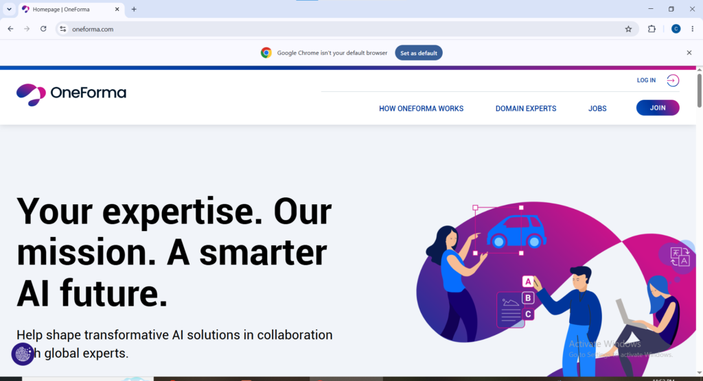
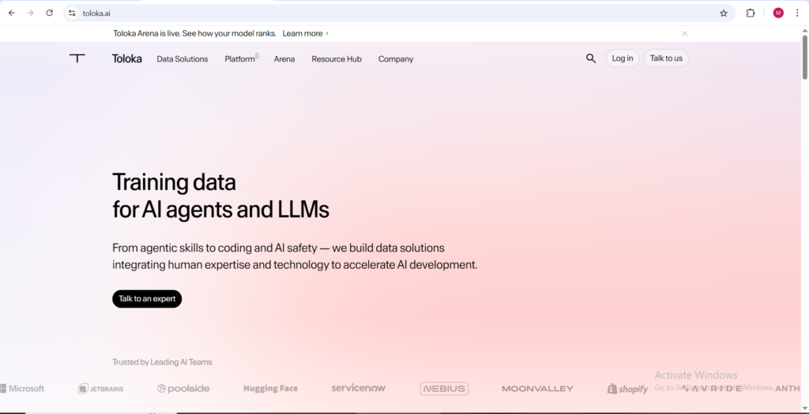
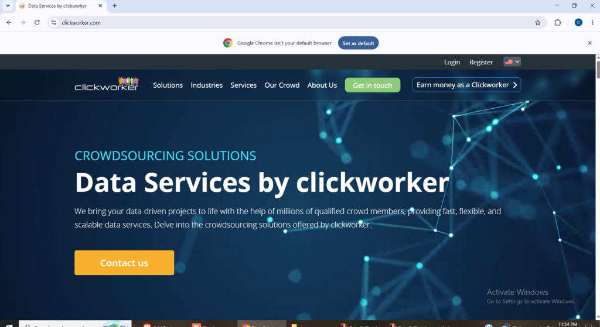
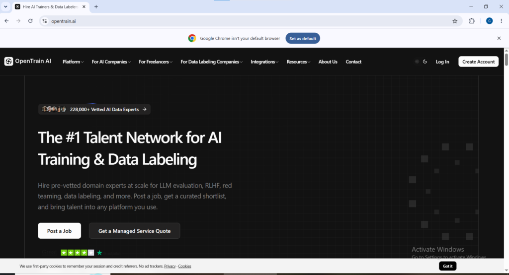
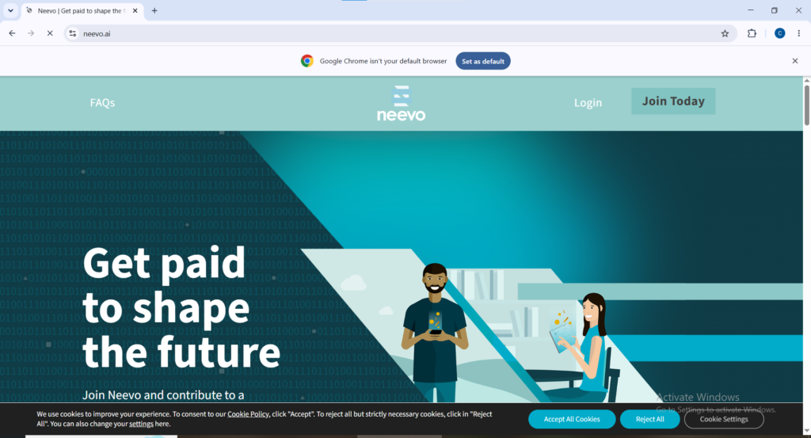
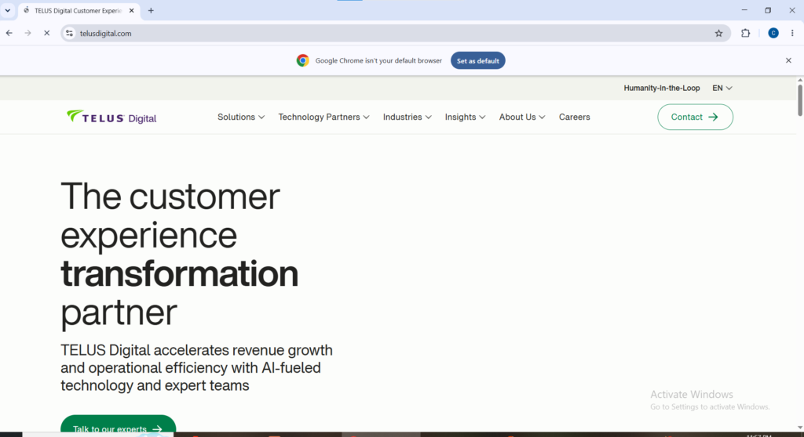

Artificial intelligence systems do not learn on their own. Behind every chatbot, voice assistant, and recommendation engine is a large amount of human generated feedback that teaches the system what a good answer looks like, what an image actually contains, or whether a piece of text is accurate and safe. Companies building these systems need real people to provide that feedback, and they are increasingly looking beyond the United States and Europe to find them.

Nigeria has become one of the strongest sources of this kind of remote work. Strong English proficiency, a large young population comfortable with technology, and genuine cultural and contextual knowledge that global AI companies need all make Nigerians attractive contributors. The challenge is not whether opportunities exist. The challenge is knowing which platforms actually deliver consistent task availability and reliable payment for contributors based in Nigeria, since not every platform that technically lists Nigeria as eligible follows through with real, steady work.

This guide focuses on platforms that have a track record of working for Nigerian contributors, along with honest notes on payment methods and what to expect from each one.

**Mindrift**  
Website: [mindrift.ai](https://mindrift.ai)  
Mindrift recruits what it calls AI Tutors across a wide range of subject areas, from general writing to specialized technical and academic fields. Instead of fixed shifts, contributors claim tasks whenever they are available, which makes it flexible around a full time job or studies. Consistent contributors report earning around $300 per week. Payments are processed through Payoneer, which works smoothly for Nigerian bank accounts.

**OneForma**  
Website: [oneforma.com](https://oneforma.com)  
OneForma specializes in multilingual and localization projects, which plays directly to the strength of Nigerian contributors with strong English skills and exposure to multiple local languages. Tasks include data annotation, search relevance evaluation, and linguistic quality checks. It is project based, so contributors can apply to several active projects at once to keep a steady stream of work.

**Appen**  
Website: [appen.com](https://appen.com)  
Appen has operated in the AI data space for over a decade and works with major technology companies on tasks like search evaluation, social media assessment, and voice data collection. Rather than constant microtasks, Appen tends to assign contributors to specific projects that can run for weeks or months, which gives more predictable income than pure task based platforms. Most projects pay between $10 and $15 per hour. Payments are sent via PayPal or Payoneer depending on the project.

**Toloka**  
Website: [toloka.ai](https://toloka.ai)  
Toloka is one of the simplest platforms to start on, with no professional experience required and tasks available in over 100 countries including Nigeria. Individual microtasks pay small amounts, typically between $0.01 and $1.00 per task, but the volume of available work is consistently high, which makes it a solid supplementary platform to run alongside higher paying ones. Payments are processed through Payoneer and PayPal.

**Clickworker**  
Website: [clickworker.com](https://clickworker.com)  
Clickworker has been running since 2005 and offers a wide variety of short tasks including data categorization, short text writing, and surveys, alongside AI training work through its UHRS system. Clickworker supports several payment methods including PayPal, Payoneer, and SEPA transfer, though availability depends on your country, so confirm Payoneer is selected during signup. Pay varies significantly by task, from small per task amounts up to low double digit sums for more involved work.

**Pareto AI**  
Website: [pareto.ai](https://pareto.ai)  
Pareto AI connects contributors with companies needing AI response review, training example creation, and data labeling. Pay is strong, ranging from $35 to $65 per hour depending on skill level and task complexity, with payments processed weekly. One important note for Nigerian contributors: Pareto pays through PayPal, and PayPal does not support direct receiving of funds within Nigeria. Most Nigerian workers handle this by linking a Payoneer USD account to receive PayPal transfers, which is a standard and widely used setup rather than anything against platform rules.

**OpenTrain AI**  
Website: [opentrain.ai](https://opentrain.ai)  
OpenTrain AI works differently from the other platforms on this list. Instead of being a single employer, it functions as an aggregator that pulls AI training and data labeling jobs from more than 20 platforms, including some of the bigger names in the space, into one searchable feed. Contributors set their own rates and get paid through a secure escrow system, with most payouts processed within a day of approval. OpenTrain AI supports payment in more than 100 countries, making it one of the more globally accessible options.

**Neevo**  
Website: [neevo.ai](https://neevo.ai)  
Neevo offers a wide range of simple tasks including speech collection, transcription, translation, and image annotation, and is known for being easy to join with a flexible schedule and no fixed quotas. Pay per completed task ranges from around $10 to $50 depending on the project. The main limitation for Nigerian contributors is that Neevo currently only supports PayPal for payment, so the same Payoneer linking approach mentioned above applies here as well. Task availability on Neevo can also be inconsistent, so it works best as a side platform rather than your main source of income.

**TELUS Digital AI Community**  
Website: [telusdigital.com](https://telusdigital.com)  
Formerly part of Lionbridge, TELUS Digital AI Community offers roles like Internet Assessor, which involves rating search results and evaluating AI generated content. It is one of the more established names in this space and pays monthly via direct deposit, PayPal, or Payoneer depending on your country. Workers in lower income regions including parts of Africa have reported hourly rates in the $3 to $5 range, noticeably lower than what contributors in the US or UK typically earn for similar work. It is worth applying to as one platform among several rather than relying on it alone.

**A note on Outlier and DataAnnotation**  
Both platforms list Nigeria as an eligible country. However, a meaningful number of Nigerian applicants have reported being approved but then receiving very few or no task invitations afterward, and some have mentioned needing a foreign issued payment card to complete account setup. This blog does not recommend using a VPN or a third party card to get around these restrictions, since doing so can violate the platform's terms and put your account and earnings at risk. If access genuinely improves for Nigerian contributors, this guide will be updated to reflect that.

**A few honest tips before you start**

Apply to several platforms at once rather than relying on a single one. Task availability fluctuates constantly, and contributors who are signed up across four or five platforms tend to have much steadier income than those waiting on one.

Set up Payoneer early, even for platforms that primarily use PayPal. It solves the receiving problem for Nigeria and is accepted across most of the platforms on this list.

Take training modules seriously where they are offered. Platforms like Remotasks unlock higher paying task categories once you demonstrate accuracy, so rushing through training tasks early on usually costs you money later.

Track your earnings and hours across platforms in a simple spreadsheet. This makes it easy to see which platforms are actually worth your time after a few weeks, rather than guessing.

Be patient in the first two to three weeks. Most contributors report slower task flow when an account is brand new, with availability picking up once a platform's system has more history with your accuracy and reliability.
