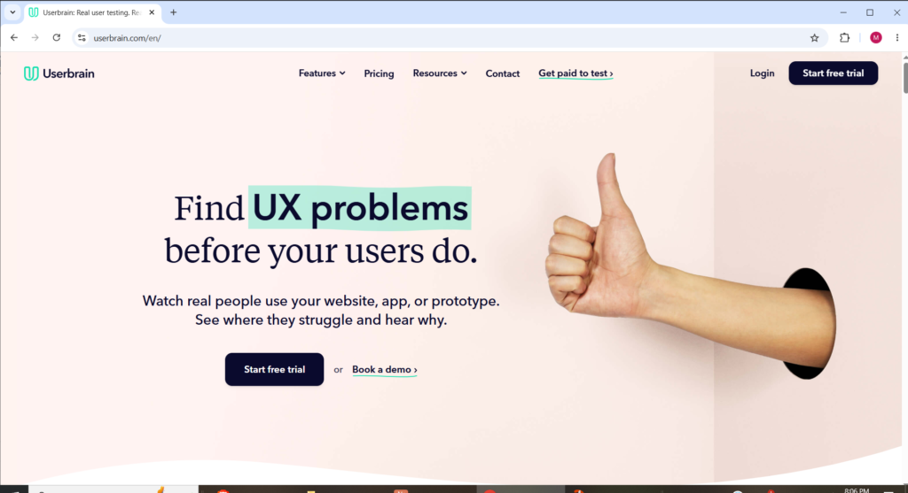
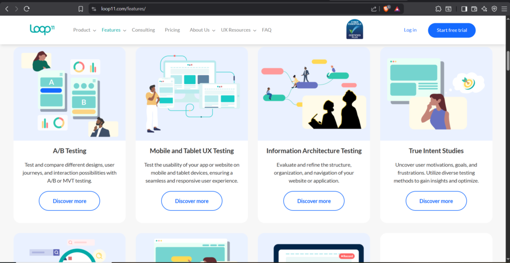
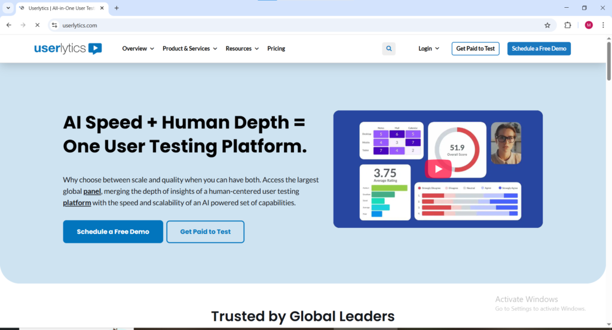
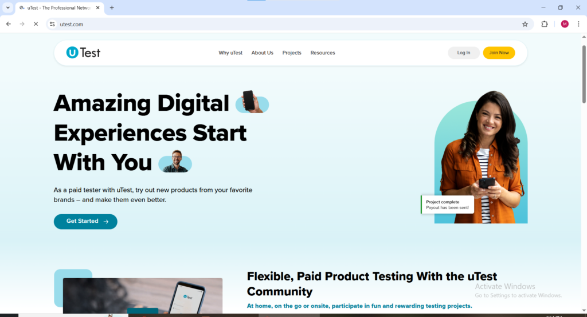
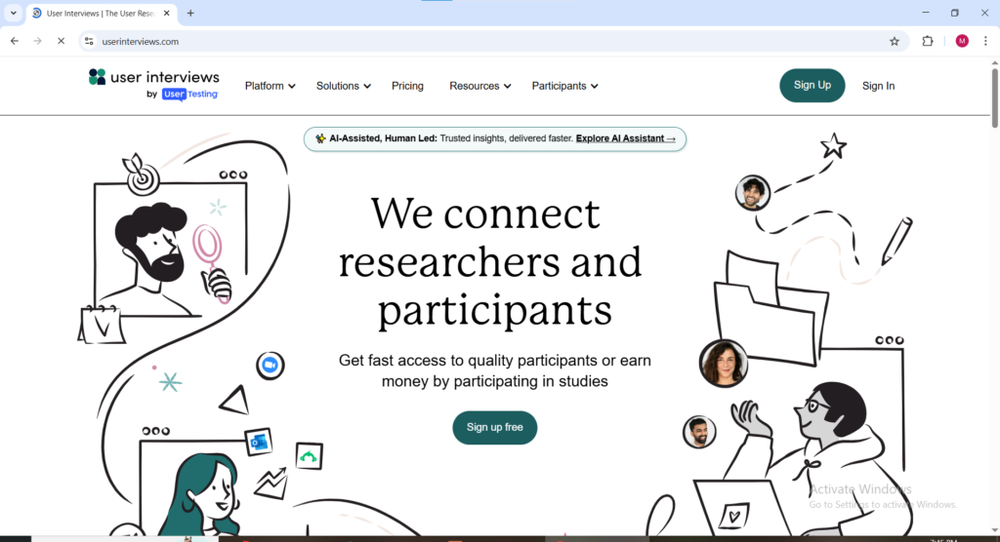
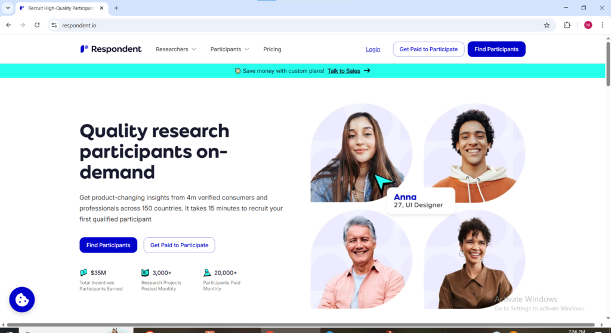
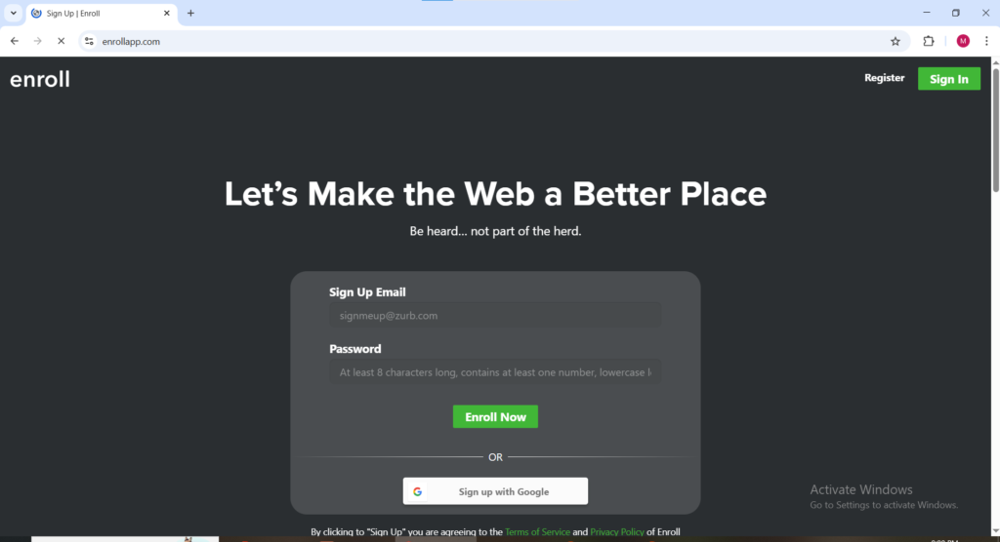

Australia is one of the most valuable testing markets in the world for global technology companies. This creates genuine earning opportunities for Australian residents who want to get paid for their honest feedback on websites and apps.

Australian testers are highly sought after due to high smartphone penetration, strong English proficiency, high household incomes, and geographic diversity that offers a perspective distinctly different from North American and European panels.

2026 is an exciting year for Australians, with growing local platforms in the space. Loop11, a globally respected usability testing platform, is Australian-built and actively recruits local testers. This gives Australians priority access and ensures their feedback is valued rather than treated as secondary to US or UK users.

### Informations You will Get By Reading This Article

- What Australian App and Website Testers Actually Do

- What Australian App and Website Testers Actually Do

- 14 Platforms that pay you to test apps and websites and what you need to do and have to be eligible for Pay.

- How Australian Testers Can Maximize Their Earnings

* * *

### What Australian App and Website Testers Actually Do

Australian app and website testers are paid to give honest, real-user feedback on digital products.

Typical tasks include:

- Navigating websites or apps while thinking aloud

- Completing specific tasks (e.g., booking a flight, signing up, or checking out)

- Rating ease of use, clarity, speed, and overall experience

- Identifying bugs, confusing elements, or frustrating parts

- Answering survey questions about their thoughts and impressions

Tests usually last 10–30 minutes for unmoderated studies, or 30–60 minutes for moderated (live) sessions. You record your screen and voice while using the site or app exactly as you normally would. Companies use this feedback to improve their products before launching to the public.

No special skills are required; Companies want genuine reactions from everyday Australian users.

* * *

**Best App and Website Testing Sites for Australians in 2026**

**IntelliZoom** [intellizoom.com](https://intellizoom.com) Available as: Website

IntelliZoom is a product feedback and usability testing platform that accepts Australian testers and focuses on gathering genuine first-time user reactions to websites, apps, and digital product prototypes. The platform is owned by Schlesinger Group, one of the most established market research companies in the world, giving it a credibility and client quality that newer platforms cannot match. Australian testers on IntelliZoom complete recorded sessions navigating websites and apps while speaking their thoughts aloud and earn per completed test with payment processed via PayPal. The backing of a major research institution means Australian testers consistently find IntelliZoom pays reliably and on schedule.

**UserFeel** [userfeel.com](https://userfeel.com) Available as: Website

UserFeel accepts Australian testers globally and pays $10 USD per completed test via PayPal as soon as the test is approved making it one of the faster-paying platforms available to Australian website testers. Tests take approximately 10 to 15 minutes and follow the standard format of completing tasks on a website while speaking thoughts continuously with screen and audio recording active. The global acceptance policy and fast payment processing make UserFeel one of the most accessible platforms for Australian testers who want reliable quick-turnaround payments from testing work.

* * *

**Userbrain** [userbrain.com](https://userbrain.com) Available as: Website and Mobile App (iOS and Android)

Userbrain is a subscription-based usability testing platform that accepts Australian testers and has a unique model compared to most platforms on this list. Rather than large irregular payouts Userbrain sends Australian testers short weekly testing tasks and pays a small consistent amount per completed session creating a more predictable and regular income stream than platforms where test availability fluctuates significantly week to week. The platform is particularly well suited for Australian testers who prefer the consistency of small regular earnings over the unpredictability of larger occasional payouts. Payment is processed via PayPal after each approved session.

**Loop11** [loop11.com](https://loop11.com) Available as: Website

Loop11 is the standout platform on this entire list for Australian testers for one specific reason — it is an Australian-built company founded in Melbourne in 2009 that has grown into a globally respected usability testing platform working with clients including IBM, Amazon, Intuit, and Procter and Gamble. That Australian origin means the platform actively recruits Australian testers from its home market rather than treating Australian participants as a secondary afterthought behind US and UK panels.

Getting started on Loop11 as an Australian tester requires completing a five-minute qualification test to demonstrate comfort with speaking continuously during a recorded session. The platform pays above-average rates compared to most website testing platforms and offers bonuses to high-quality performers who consistently deliver detailed useful feedback. A microphone and webcam are required for testing sessions. For Australian testers who want to work with a platform that originated in their own country and has a genuine local connection to the Australian tech industry, Loop11 is the natural first choice.

* * *

**UserTesting** usertesting.com Available as: Website and Mobile App (iOS and Android)

UserTesting is the most established website and app testing platform in the world and accepts Australian testers with full access to paid test opportunities. The platform works with Fortune 500 companies and fast-growing global brands whose products are used by millions of Australians — meaning the feedback Australian testers provide goes directly into products they and their communities actually use daily. Tests typically take 20 minutes and pay $10 USD per completed session which at current exchange rates represents meaningful AUD income for the time invested.

Australian testers who pass the UserTesting sample test and maintain strong ratings receive regular test invitations and build consistent dollar income that lands in their PayPal account approximately seven days after each approved test. The sample test that determines approval is the most important step for Australian UserTesting applicants speak continuously throughout the entire recording, complete every task as instructed, and treat it with the same focus given to a paid session because the quality of that initial recording determines access to the entire platform.

* * *

**Userlytics** [userlytics.com](https://userlytics.com) Available as: Website and Mobile App (iOS and Android)

Userlytics accepts Australian testers and has built a strong reputation for its globally inclusive participation policy; A meaningful advantage for Australians who sometimes find international testing platforms deprioritize non-US participants when distributing available tests. Tests on Userlytics typically take 10 to 20 minutes and pay $10 USD per completed session via PayPal seven days after approval. The platform covers website testing, mobile app testing, prototype evaluation, and advertisement feedback giving Australian testers more qualifying test types than platforms limited to a single format.

The quality of verbal feedback during Userlytics sessions directly determines an Australian tester's rating on the platform and that rating determines future invitation frequency. Australian testers who invest in developing their narration quality early, speaking clearly and continuously throughout every session without silent pauses consistently receive more test invitations than those who complete tasks quietly.

<figure>

<figcaption>

**Userlytics for testing Apps and Websites**

</figcaption>

</figure>

* * *

**Trymata** [trymata.com](https://trymata.com) Available as: Website

Trymata formerly known as TryMyUI accepts Australian testers and processes payments via PayPal every Friday — one of the more predictable payment schedules in the Australian website testing space. Tests pay $10 USD per completed session and follow the standard usability testing format of completing tasks on a website or app while speaking thoughts aloud with screen and audio recording active. The clear task instructions provided before each Trymata session begins make it one of the more beginner-friendly options for Australian testers completing their first paid testing sessions.

<figure>

<figcaption>

**trymata welcome page for testing apps and webites**

</figcaption>

</figure>

* * *

**uTest** [utest.com](https://utest.com) Available as: Website

uTest operated by Applause works with major global clients and accepts Australian testers into its community which it calls the uTest Community. The platform focuses on finding bugs and technical problems in websites and apps rather than general usability feedback, Which means Australian testers on uTest earn per verified bug they find rather than per session completed. Australian testers earn an average of $5 to $25 per accepted bug report with significantly more available for complex project-based work.

uTest rewards Australian testers who invest time in learning to write detailed structured bug reports through a rating system that progressively unlocks higher-paying projects as quality and consistency are demonstrated. The earning ceiling on uTest for Australian testers who build their rating systematically is significantly higher than on any general usability testing platform, experienced Australian contributors with strong ratings report monthly incomes that exceed what session-based platforms can provide. The path there requires patience and consistent quality improvement but the financial payoff for committed Australian testers is genuine.

* * *

**PlaybookUX** playbookux.com Available as: Website

PlaybookUX accepts Australian testers and offers multiple session formats that suit different schedules and comfort levels. Unmoderated studies involve recording screen and voice while completing tasks without a researcher present and typically take 10 to 20 minutes. Moderated live sessions involve speaking directly with a researcher in real time and run for 30, 60, or 90 minutes at significantly higher pay rates. Card sort and tree test studies require no additional software and can be completed entirely in the browser in as little as two to ten minutes.

The variety of session formats on PlaybookUX is genuinely useful for Australian testers because the shorter card sort and tree test sessions fit easily into spare moments during the day while the longer moderated sessions generate meaningful per-session income for Australian testers who are comfortable with live researcher conversations.

<figure>

<figcaption>

**Playbookux.com homepage**

</figcaption>

</figure>

* * *

**Testbirds** testbirds.com Available as: Website and Mobile App

Testbirds has an active global community and accepts Australian testers into its Nest community. The platform covers functional testing, usability testing, compatibility testing across different devices, and localization testing for companies releasing products in new language markets. Australian testers who own multiple devices — an Android phone, an iPhone, a tablet, a laptop — should list all of them in their Testbirds profile because companies testing apps for specific operating systems and screen sizes specifically recruit testers with those device configurations and Australian participation in those device-specific projects can command premium rates.

* * *

**User Interviews** [userinterviews.com](https://userinterviews.com) Available as: Website

User Interviews is available to Australian participants and sits at the premium end of the testing market with studies paying between $75 and $150 USD per hour — numbers that reflect the depth of structured feedback required rather than the quick automated usability tests that dominate most platforms. Australian professionals with backgrounds in technology, finance, healthcare, education, or any specialist field are particularly valuable to User Interviews' client companies who need feedback from people who genuinely use professional tools and enterprise software in real work contexts.

Australian participants apply to specific studies that match their demographic and professional background rather than accepting tests from a general pool. Not every application results in selection but the sessions Australian testers do qualify for pay at rates that make the selection process entirely worthwhile. Payment is processed via PayPal within one to two days of completing an approved session.

* * *

**Respondent** [respondent.io](https://respondent.io) Available as: Website

Respondent accepts Australian participants for research studies and interviews paying between $100 and $700 USD per hour, The highest per-session earning potential of any platform on this entire Australian list. The platform specifically recruits participants with professional expertise because its client companies need feedback from people who actually use the products being tested in real professional contexts. Australian participants with verified professional backgrounds in technology, law, medicine, finance, marketing, or academia consistently qualify for studies at the higher end of the Respondent pay scale.

Payment for Australian Respondent participants is processed via PayPal or bank transfer after session completion. Building a complete and specific Respondent profile that clearly communicates professional background and areas of expertise is the most important step in maximizing study qualification rates for Australian participants.

* * *

**Enroll** [enrollapp.com](https://enrollapp.com) Available as: Website

Enroll is particularly valuable for Australian testers who prefer completing sessions on mobile devices without the screen recording setup that most other platforms require. The platform does not always require audio recording which removes the microphone and quiet environment requirements that can make other testing platforms less accessible for Australian testers in shared living situations or without dedicated home office setups. Tests are straightforward, instructions are clear, and payments are processed via PayPal upon approval.

For Australian testers who are new to app and website testing and want the simplest possible entry point before progressing to higher-paying platforms, Enroll provides a genuinely accessible starting experience that removes the setup complexity of more equipment-dependent platforms.

* * *

**Prolific** [prolific.com](https://prolific.com) Available as: Website and Mobile App

Prolific has a strong Australian participant base and is consistently rated as one of the fairest and most reliable platforms available to Australian testers in terms of prompt payment and transparent study requirements. The platform focuses on academic and scientific research studies including digital product and website testing sessions and pays at rates that significantly exceed most dedicated testing platforms. Australian participants on Prolific report faster study availability and more consistent matching compared to participants in some other countries because Australian demographic data is genuinely valuable to academic researchers studying consumer behavior in developed English-speaking markets.

Prolific pays via PayPal and Circles and Australian participants should confirm their payment method setup before completing studies. Completing profiles thoroughly and honestly is particularly important for Australian Prolific participants because demographic accuracy directly determines study matching frequency and the volume of available opportunities each week.

* * *

**How Australian Testers Can Maximize Their Earnings**

Signing up to **multiple platforms** (ideally 6 or more) is the most effective way Australian testers can build consistent income. Test opportunities fluctuate, and Australians often receive fewer invites than US testers since many studies target American audiences. Multiple active profiles ensure you always have opportunities available.

**Speed matters.** Popular tests fill within minutes. Enable push notifications on all platforms and check your email frequently; Especially during Australian mornings when US and European companies post new studies. Quick responses greatly increase your success rate.

**Build a strong reputation.** Consistently high ratings unlock more invitations and higher-paying tests. Always treat every session professionally, regardless of how simple the task appears. This separates regular earners from occasional ones.

**Payments** are straightforward for Australians. **PayPal** is the most widely supported withdrawal method across all major platforms and works reliably with Australian accounts.
