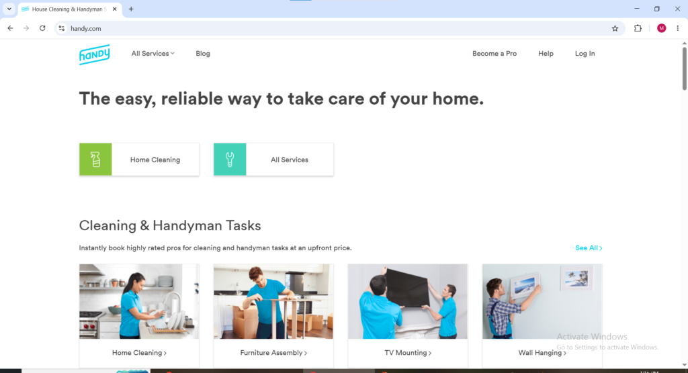
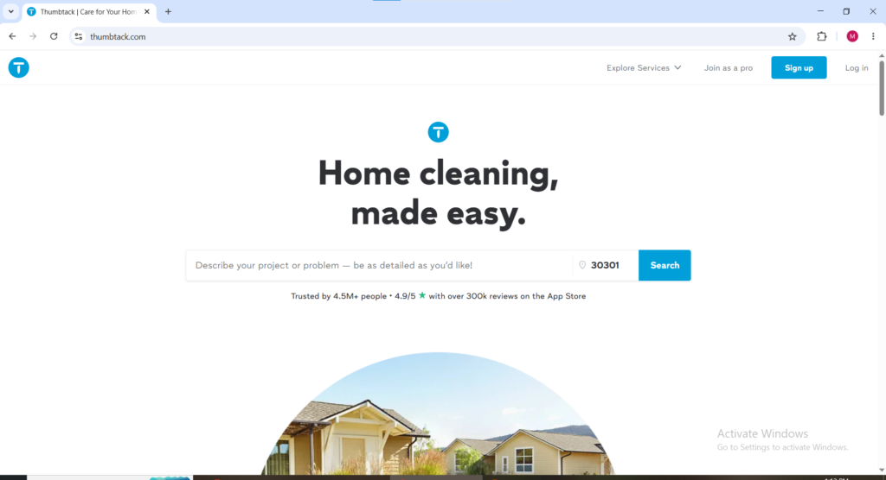

Canada's local task and gig market has grown significantly in 2026 and for Canadian workers looking to earn flexible income outside of traditional employment it has never been more accessible. From furniture assembly and home repairs in Toronto to pet care and moving help in Vancouver, the platforms connecting Canadian workers with local paying customers have matured into a genuine income ecosystem that rewards reliability and skill with meaningful hourly rates and consistent work opportunities.

The Canadian market sits in a uniquely strong position in 2026. Major global platforms operate in Canada's largest cities giving Canadian workers access to internationally trusted marketplaces alongside a growing ecosystem of Canada-specific platforms that serve the regions and task categories that global platforms do not adequately cover. Whether someone is in Toronto, Vancouver, Montreal, Calgary, Edmonton, or a smaller Canadian city, there is a platform on this list with genuine work available in their area.

This guide covers every verified platform where Canadian workers can find and get paid for local task and service work in 2026, what each one pays, and the honest practical details that determine whether a platform is worth the time investment required to build a profile and start earning, **You are encouraged to read to the end to avoid missing any vital information.**

### Best Local Gig and Task Apps in Canada in 2026

### 1\. Kijiji

Website: [kijiji.ca](http://kijiji.ca) Available as: Website and Mobile App (iOS and Android)

Kijiji is Canada's most popular classified listings platform own by the popular Ebay and while it is not a structured gig platform in the same sense as others it is one of the most effective ways for Canadian workers to advertise local services and find paying clients without any platform fees or lead costs. Canadian service providers in every category cleaning, moving, handyman work, tutoring, lawn care, painting, and more post their services on Kijiji and connect directly with interested clients through the platform's messaging system.

The advantage of Kijiji for Canadian workers is zero platform commission. Unlike every other platform on this list Kijiji takes nothing from completed jobs all payment is arranged directly between the Canadian worker and the client. The trade-off is less trust infrastructure than dedicated gig platforms since there is no built-in review system, background check requirement, or payment protection system. Canadian workers who have already built a reputation elsewhere and want to advertise their services to a massive existing Canadian audience without platform fees will find Kijiji one of the most cost-effective client acquisition channels available in 2026.

2\. **TaskRabbit**

Website: [taskrabbit.com](http://taskrabbit.com)

Available as: Website and Mobile App (iOS and Android)

TaskRabbit is the most established and widely recognized platform for local task work in Canada and operates in Toronto, Vancouver, and Montreal — the three largest Canadian cities with the highest demand for local task services. TaskRabbit charges a 15 percent service fee on all jobs and Canadian workers keep the remainder plus any tips clients choose to add after a completed task. The range of tasks available on TaskRabbit in Canada covers furniture assembly, moving help, TV mounting, home repairs, painting, yard work, cleaning, and general handyman services.

Canadian workers in Toronto will find the strongest TaskRabbit demand of any Canadian city because of the city's dense apartment population and high concentration of IKEA furniture buyers who regularly need assembly help. Vancouver and Montreal offer solid demand but slightly lower task volume than Toronto. For Canadian workers outside these three cities the platform is not available and the alternatives listed further in this guide become the primary options.

Getting started on TaskRabbit in Canada requires creating a Tasker profile, selecting task categories, setting hourly rates, passing a background check, and paying a one-time registration fee. Once approved Canadian Taskers appear in search results for customers in their city and begin receiving booking requests organically as their review count builds.

3\. **UrbanTasker**

Website: [urbantasker.com](http://urbantasker.com) Available as: Website

UrbanTasker is an emerging Canada-specific platform designed to connect home service providers with local clients across Canada. It is a one-stop destination for homeowners to find home service professionals across Canada and is appropriate for skilled tradespeople and handymen looking to supplement their income. From mounting TVs, fixing leaks, assembling IKEA furniture, and minor repairs to home renovations, UrbanTasker is quickly becoming a top choice for Canadians offering or requesting help in and around their homes.

What makes UrbanTasker particularly valuable for Canadian workers is its national coverage beyond the three cities that TaskRabbit serves. A skilled handyman in Calgary, Edmonton, Ottawa, or Halifax can build a client base on UrbanTasker in markets where TaskRabbit has no presence at all. The platform operates on a quote-based model where Canadian customers post their task and service providers respond with offers. This bidding structure gives Canadian workers more control over their pricing and the types of jobs they accept compared to platforms with fixed or standardized rates.

4\. **Jiffy**

Website: [jiffyondemand.com](http://jiffyondemand.com) Available as: Website and Mobile App (iOS and Android)

Jiffy is a Canada-focused on-demand home services app that connects Canadian homeowners with qualified local professionals for same-day and scheduled service bookings. The platform covers a wide range of home service categories including plumbing, electrical work, appliance repair, cleaning, handyman tasks, and HVAC services, Making it one of the most comprehensive home services platforms available specifically to Canadian workers with skilled trade backgrounds.

What distinguishes Jiffy in the Canadian market is the speed of its booking model. Canadian customers can book a professional through Jiffy in minutes and receive confirmed same-day service, A level of responsiveness that traditional service booking channels cannot match. For Canadian workers with professional trade qualifications Jiffy provides a meaningful alternative to TaskRabbit because the platform emphasizes verified skilled professionals over general taskers and the hourly rates for certified tradespeople reflect that premium positioning. Jiffy operates in major Canadian cities including Toronto, Vancouver, Calgary, Edmonton, and Ottawa.

* * *

5\. **Handy**

Website: [handy.com](http://handy.com) Available as: Website and Mobile App (iOS and Android)

Handy is one of the most popular TaskRabbit alternatives for home cleaning and handyman services and is available in Canada alongside the United States and United Kingdom. On the professional signup page Handy states workers can make up to $22 per hour per job as a cleaner or $45 per hour per job as a handyman with top professionals earning over $1,000 per week.

<figure>

<figcaption>

Handy.com welcome page

</figcaption>

</figure>

Unlike TaskRabbit where Canadian workers set their own rates, Handy sets standardized rates for each service category. This removes pricing flexibility but also removes the burden of competing on price against other service providers in the same city Canadian Handy professionals are matched automatically with available jobs rather than needing to maintain a profile that wins competitive bids. The automatic matching system is particularly convenient for Canadian workers who prefer a more passive job discovery experience without constant platform monitoring. Handy operates in major Canadian cities and payments are sent to professionals via direct deposit shortly after each completed and approved job.

6\. **HomeStars**

Website: [homestars.com](http://homestars.com) Available as: Website and Mobile App (iOS and Android)

HomeStars is one of Canada's largest and most trusted home improvement platforms and has been connecting Canadian homeowners with local service professionals since 2006. The platform covers a comprehensive range of home service categories including roofing, plumbing, electrical work, painting, flooring, landscaping, and general contracting. Canadian service professionals create verified profiles on HomeStars, accumulate customer reviews, and receive leads from homeowners actively seeking services in their area.

<figure>

<figcaption>

[Homestar.com](http://Homestar.com) welcome page

</figcaption>

</figure>

HomeStars operates on a subscription model for Canadian professionals rather than the per-lead or commission models used by most other platforms on this list. Canadian workers pay a monthly or annual subscription fee to maintain a verified profile on the platform and access customer leads. The subscription model works best for Canadian professionals who already run an established service business and want a reliable digital lead generation channel rather than beginners looking for occasional task income. The platform's reputation among Canadian homeowners is strong because of its rigorous review verification process and it consistently ranks among the most trusted home service sources in the Canadian market.

7\. **Thumbtack**

Website: [thumbtack.com](http://thumbtack.com) Available as: Website and Mobile App (iOS and Android)

Thumbtack operates in Canada and gives Canadian workers access to a large customer base of homeowners seeking quotes for local services across hundreds of categories. Thumbtack uses a pay-per-lead model where Canadian contractors pay to send quotes to customers rather than the platform taking a commission on completed jobs. This model means Canadian workers control their acquisition costs by targeting only the job categories and price ranges most likely to convert into bookings for their specific skills and location.

Thumbtack's strength for Canadian workers is the breadth of service categories it covers. Beyond standard handyman and home repair services, Canadian professionals offering photography, event planning, personal training, music lessons, tutoring, and business services can all find paying clients through Thumbtack. This makes it one of the most versatile platforms for Canadian workers with skills outside the traditional home services categories that dominate most local task platforms. Thumbtack operates across major Canadian markets and the platform's quote comparison system gives Canadian service providers a structured way to compete for quality clients.

8\. **Bark** bark.com Available as: Website and Mobile App (iOS and Android)

Bark is an incredibly diverse platform available in Canada covering everything from home repairs to life coaching. Bark uses AI-based matching and is one of the fastest platforms for gathering competitive quotes across a wide range of personal and business services.

<figure>

<figcaption>

BArk.com welcome page

</figcaption>

</figure>

For Canadian workers Bark's diversity is its primary advantage. A single Canadian professional offering multiple service types like graphic design, event photography, personal training, and handyman work can maintain one Bark profile and receive leads across all of those categories simultaneously rather than maintaining separate profiles on multiple specialized platforms. Bark's AI matching system actively connects Canadian service providers with customers who have posted relevant job requests in their area reducing the manual effort required to find new clients. The platform charges Canadian workers per lead credit rather than taking a commission on completed work.

* * *

* * *

9\. **Rover**

Website: [rover.com](http://rover.com) Available as: Website and Mobile App (iOS and Android)

Rover is the leading pet care platform in Canada for workers who love animals and want to earn through dog walking, pet sitting, boarding, and drop-in visits. Canadian pet owners spent billions on their pets in 2024 and the demand for reliable local pet care providers in Canadian cities continues to grow as urban apartment-dwelling populations increase. Canadian Rover workers set their own rates for each service type and keep approximately 80 percent of what they charge with Rover taking a 20 percent service fee.

Canadian Rover workers in cities like Toronto, Vancouver, Calgary, and Ottawa find particularly strong demand for midday dog walking services from working professionals who cannot return home during business hours. A Canadian Rover worker who builds a base of three to five regular weekly dog walking clients in a major Canadian urban area can generate between $300 and $700 in predictable weekly income that recurs automatically without constant searching for new clients. The combination of regular repeat bookings and flexible scheduling makes Rover one of the most genuinely lifestyle-friendly earning platforms available to Canadian workers in 2026.

10\. **Jobble**

Website: [jobble.com](http://jobble.com) Available as: Website and Mobile App (iOS and Android)

Jobble connects Canadian workers with local shift-based gig work across retail, events, warehousing, and general labor categories. The platform is particularly useful for Canadian workers who want flexible day-to-day shift work without committing to a single employer or fixed schedule. Canadian workers browse available shifts in their area through the app, select the ones that fit their availability, and show up to work when confirmed. For Canadian residents who prefer structured hourly shift work over task-based self-managed jobs Jobble provides a consistent and reliable alternative to the home service platforms while maintaining the scheduling flexibility that makes gig work attractive compared to traditional employment.

<figure>

<figcaption>

**Jobble.com, for getting local tasks in canada**

</figcaption>

</figure>

* * *

11\. **Wonolo**

Website: [wonolo.com](http://wonolo.com) Available as: Mobile App (iOS and Android)

Wonolo connects Canadian workers with same-day and short-notice shift-based work at warehouses, distribution centers, retail stores, events, and food production facilities across major Canadian markets. Unlike the home service platforms on this list Wonolo focuses on business-to-worker matching in industrial and commercial settings. Canadian workers use Wonolo to pick up available shifts in their city whenever they want to work without any long-term commitment or fixed schedule requirement. Pay is reliable, shifts are clearly defined, and the work is consistent in Canadian cities with strong Wonolo partner presence particularly in the Greater Toronto Area and Metro Vancouver where industrial and logistics demand is highest.

* * *

12\. **Care.com** [care.com](http://care.com) Available as: Website and Mobile App (iOS and Android)

Care.com is available to Canadian workers and serves as the primary platform connecting Canadian families with babysitters, nannies, senior care providers, and pet care professionals across the country. Canadian workers with any background in childcare, eldercare, or special needs support will find Care.com one of the most consistently in-demand platforms available in the Canadian market. The recurring care model is where Canadian Care.com workers build the most stable income because families who find a reliable caregiver they trust book consistently over months or years rather than searching for someone new each time a care need arises.

13\. **GigSmart**

Website: [gigsmart.com](http://gigsmart.com) Available as: Mobile App (iOS and Android)

GigSmart connects Canadian workers to local work opportunities across a broad range of categories including general labor, specialized work, service industry roles, and healthcare shifts in major Canadian markets. The platform gives Canadian workers access to both short-term single shifts and longer-term staffing arrangements with businesses that need reliable flexible workers consistently. GigSmart's breadth of industries covered makes it one of the more versatile Canadian gig platforms for workers with backgrounds outside the traditional home services categories that dominate most local task apps.

**How to Maximize Earnings from Local Gig Work in Canada**

Canadian workers earning the most from local task and gig platforms share several consistent habits that separate meaningful income from sporadic low-volume earnings.

Signing up for multiple platforms simultaneously rather than testing one before moving to the next is the single most important strategy. Task availability on any individual platform fluctuates based on season, local demand, and competition from other workers. Canadian workers active on three to five platforms simultaneously always have work available regardless of which specific platform is busy or slow on any given day.

Understanding which platforms serve your specific Canadian city is essential before investing time in profile setup. TaskRabbit is only available in Toronto, Vancouver, and Montreal for Canadian workers in other cities should prioritize UrbanTasker, Jiffy, HomeStars, and Kijiji instead. Bark and Thumbtack operate across a broader range of Canadian markets and are worth prioritizing for workers in cities without strong TaskRabbit presence.

Building genuine expertise in one or two high-demand service categories in the Canadian market increases both booking frequency and hourly rate. Furniture assembly particularly IKEA assembly is the single highest-volume task category across Toronto, Vancouver, and Montreal. Moving help, TV mounting, and home cleaning are consistently strong earners in most major Canadian urban centers. Workers who develop genuine skill and efficiency in these categories consistently out-earn those who spread across many categories at average quality.
