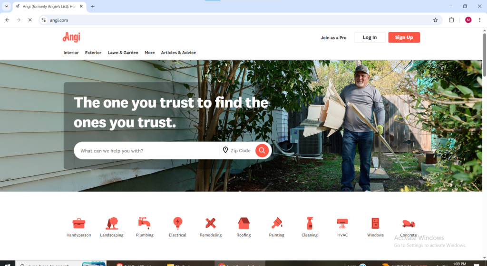
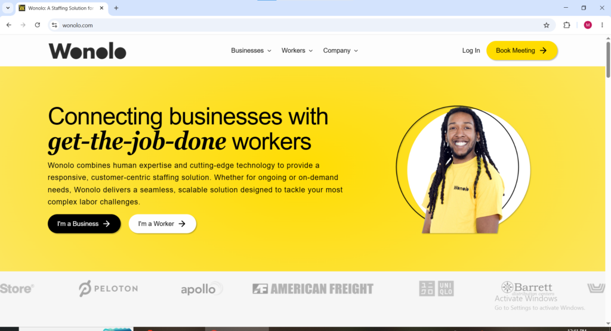
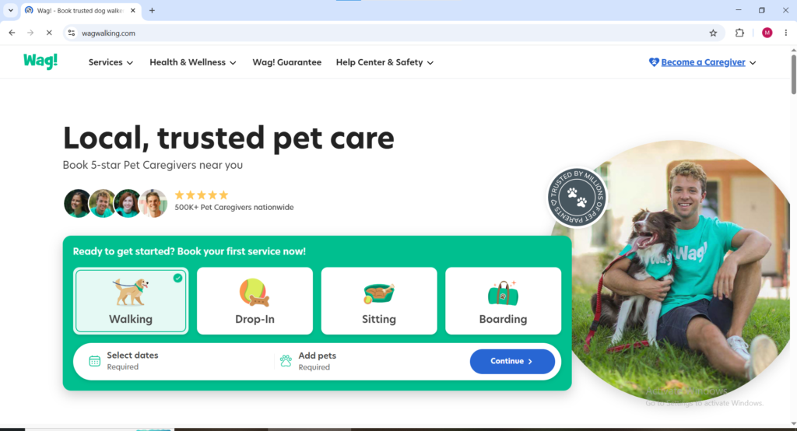
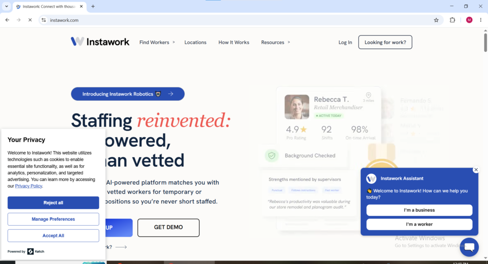
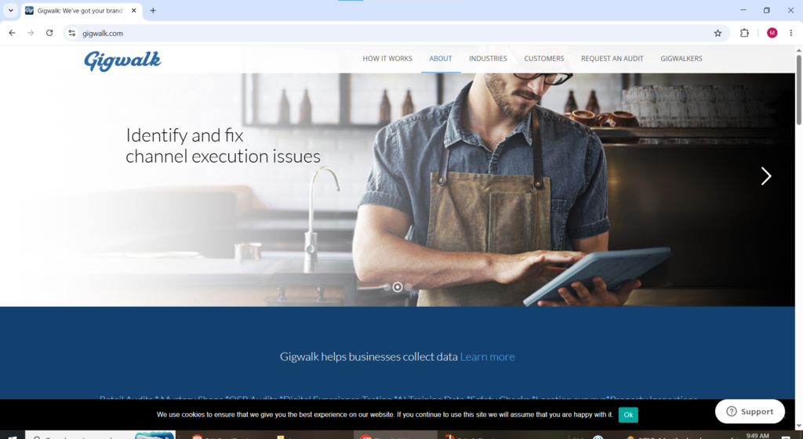
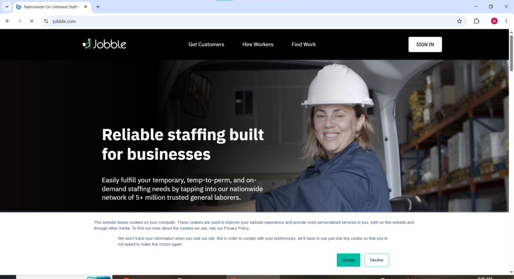
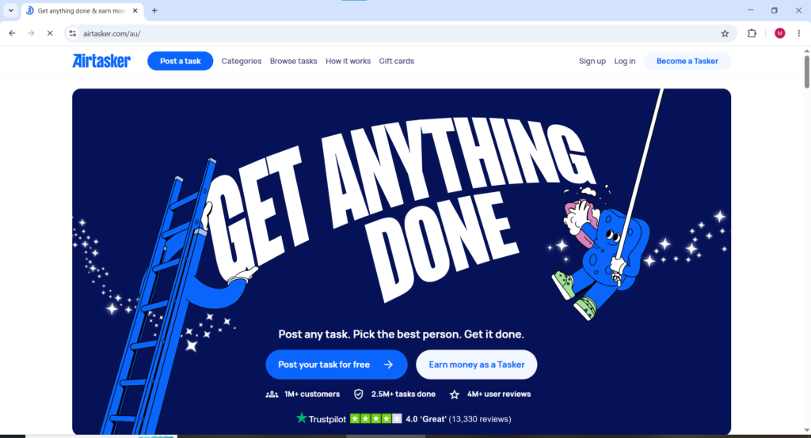
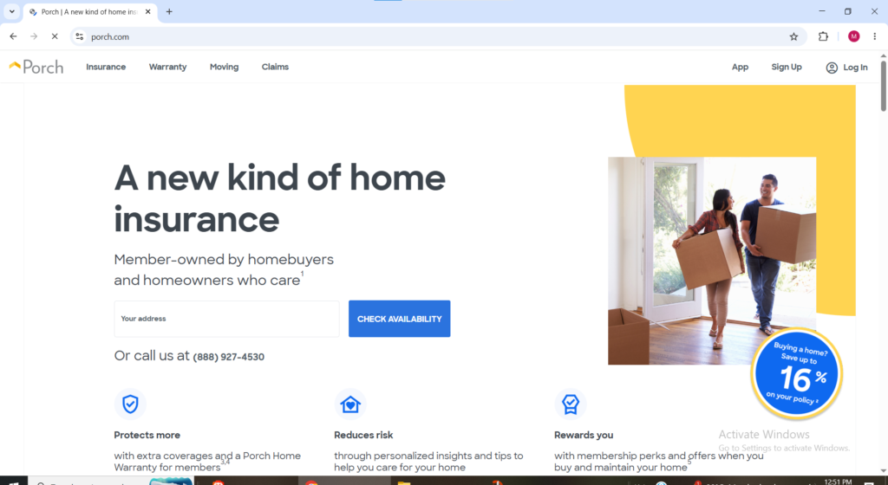
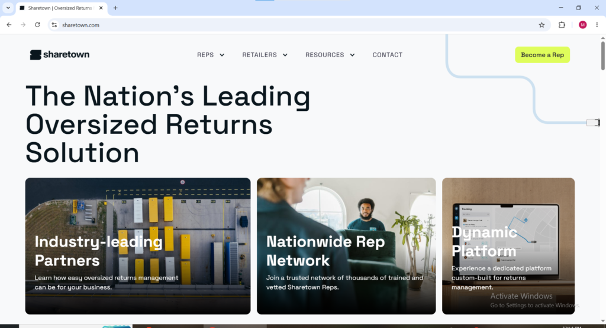

There is a category of income that most online earning guides completely ignore. Not surveys. Not AI training. Not YouTube channels. Just showing up somewhere in your city, doing something useful with your hands or your skills, and getting paid the same day. In the United States this category of work has exploded in 2026 into one of the most accessible and genuinely well-paying income streams available to anyone willing to show up consistently. The apps that power this market have collectively paid billions of dollars to American workers and the demand for reliable local help across every major United States city continues to grow faster than the supply of people willing to do it.

This guide covers every major platform where United States residents can find and get paid for local task and service work in 2026 what each platform pays, what kinds of work is available, which cities have the most demand, and the honest practical details that determine whether a platform is worth your time.

* * *

**What Local Task and Gig Work Actually Is**

Local task and gig work in the United States means getting hired by individuals and businesses in your area to complete specific physical or service-based jobs. Assembling IKEA furniture. Helping someone move apartments. Mounting a television on a wall. Cleaning a home before a family moves in. Walking a dog three times a week. Doing yard work for a neighbor. These are not remote jobs. They are in-person services that people in every city in the United States need done regularly and are willing to pay competitive rates for.

What makes 2026 meaningfully different from five years ago is the depth of the ecosystem. Early platforms were mostly ridesharing and food delivery. Today dedicated apps connect workers with pet care, skilled handyman services, moving help, legal consulting, tutoring, and more with built-in payment protection and client rating systems that make the entire experience safer and more professional than cash-in-hand informal work.

The United States is by far the largest and most developed market for this type of work globally. Task-based physical work on platforms like TaskRabbit lets workers set their own rates and often pays $30 to $80 per hour in skilled categories making it one of the highest-earning flexible income options available to United States residents in 2026.

* * *

### Best Local Gig and Task Platforms in the United States in 2026

1. **TaskRabbit** [taskrabbit.com](http://taskrabbit.com) Available as: Website and Mobile App (iOS and Android)

TaskRabbit is the most established and widely recognized platform for local task work in the United States and operates across all 50 states with particularly strong demand in major cities like New York, Los Angeles, San Francisco, Chicago, Boston, and Seattle. TaskRabbit gives workers the freedom and support to be their own boss. Workers keep 100 percent of what they charge plus tips and can invoice and get paid directly through TaskRabbit's secure payment system.

The range of tasks available on TaskRabbit in the United States is genuinely broad. Furniture assembly is the highest-demand category nationally — particularly IKEA furniture which TaskRabbit has a formal partnership with. Moving help, TV mounting, home repairs, painting, yard work, cleaning, and general handyman services are all consistently available across United States markets. Earning potential on TaskRabbit averages around $24 per hour though experienced Taskers in skilled categories in high-demand United States cities regularly earn $40 to $70 per hour or more.

Getting started on TaskRabbit in the United States requires creating a Tasker profile, selecting the task categories you want to work in, setting your own hourly rates, passing a background check, and paying a one-time registration fee of $25. Once approved your profile is visible to United States customers in your area who can book you directly. The more reviews you accumulate the higher your profile appears in search results and the more bookings you receive organically without any active promotion on your part.

<figure>

<figcaption>

**TASKRABBIT.COM FOR LOCAL GIGS**

</figcaption>

</figure>

2\. **Thumbtack** [thumbtack.com](http://thumbtack.com) Available as: Website and Mobile App (iOS and Android)

Thumbtack is the most powerful competitor to TaskRabbit in the United States market and in many categories and cities it surpasses TaskRabbit in available customer demand. Thumbtack is very popular for leads in home services and handyman work in the United States and connects skilled professionals with customers who need everything from electricians and plumbers to photographers and personal trainers.

<figure>

<figcaption>

Thumbtack.com welcome page for home task needs

</figcaption>

</figure>

The key difference between Thumbtack and TaskRabbit for United States workers is the business model. On TaskRabbit customers book you directly. On Thumbtack customers post a job and service providers pay to send quotes. This lead-based model means United States workers on Thumbtack pay for leads regardless of whether they win the job. The trade-off is that Thumbtack's customer base in the United States is enormous and the quality of leads for skilled service providers like electricians, carpenters, painters, landscapers is significantly higher than most other platforms. For United States workers with genuine skilled trade experience Thumbtack consistently delivers the highest volume of quality local job opportunities of any platform in this category.

* * *

3\. **Angi** [angi.com](http://angi.com) Available as: Website and Mobile App (iOS and Android)

Angi formerly known as Angie's List is one of the oldest and most trusted home services platforms in the United States with a reputation built over decades of connecting homeowners with verified local service professionals. Angi is good for cleaning, handyman services, and recurring service contracts in the United States making it particularly valuable for workers who want repeat clients rather than one-off jobs.

<figure>

<figcaption>

Angi.com welcome page

</figcaption>

</figure>

The recurring service model is Angi's strongest feature for United States workers. A homeowner who books a cleaning professional through Angi and has a good experience will often rebook the same person repeatedly creating a stable base of regular clients that generates predictable weekly income without constant searching for new work. United States workers in cleaning, lawn care, and general home maintenance find Angi particularly effective for building a loyal client base that grows through reviews and repeat bookings over time.

* * *

4\. **Handy** [handy.com](http://handy.com) Available as: Website and Mobile App (iOS and Android)

Handy is a United States-based platform focused specifically on home cleaning and handyman services with a streamlined booking system that makes it one of the fastest platforms to start earning on. Unlike TaskRabbit where workers set their own rates, Handy sets standardized rates for each service category which means less pricing flexibility but also less time spent negotiating with clients. United States workers are matched automatically with jobs in their area based on their selected service categories and availability.

<figure>

<figcaption>

handy.com for house helps while earning

</figcaption>

</figure>

Handy is particularly strong for cleaning and handyman recurring services in the United States and the platform has a large customer base in major United States metropolitan areas including New York, Los Angeles, Chicago, and Miami. The automatic job matching system means United States workers receive job notifications without actively searching for them which suits workers who prefer a more passive job discovery experience compared to platforms where building a profile and actively competing for bookings is required.

* * *

5\. **Wonolo** wonolo.com Available as: Mobile App (iOS and Android)

Wonolo connects United States workers with same-day and short-notice shift-based work at warehouses, distribution centers, retail stores, events, and food production facilities. Unlike the home service platforms listed above, Wonolo focuses on business-to-worker matching in industrial and commercial settings rather than consumer home services. United States workers use Wonolo to pick up available shifts in their city whenever they want to work without any long-term commitment or fixed schedule.

<figure>

<figcaption>

**Wonolo.com website welcome page for connecting businesses with get-the-job-done workers**

</figcaption>

</figure>

Wonolo is among the platforms that offer gigs in the general labor space connecting United States workers with more specialized work including service industry and healthcare shifts with the hiring company posting an hourly or per-project rate for each job. For United States workers who prefer structured shift work in a business environment over home visits and customer-facing service work, Wonolo offers a meaningful alternative to the household service platforms. Pay is reliable, shifts are clearly defined, and the work is consistent in cities with strong Wonolo partner presence.

* * *

6\. **GigSmart** [gigsmart.com](http://gigsmart.com) Available as: Mobile App (iOS and Android)

GigSmart for Work connects United States workers to local work opportunities across a broad range of categories including general labor, specialized work, service industry roles, and healthcare shifts. The platform operates across major United States markets and gives workers access to both short-term single shifts and longer-term staffing arrangements with businesses that need reliable flexible workers consistently rather than just for one-off jobs.

GigSmart distinguishes itself from most other United States gig platforms through the breadth of industries it covers. While most task platforms focus on home services GigSmart spans manufacturing, events, retail, hospitality, and logistics — giving United States workers with diverse backgrounds a wider range of work opportunities than single-category platforms provide. Workers can browse available opportunities in real time through the app, select shifts that fit their schedule and location, and get paid through the platform's secure payment system.

<figure>

<figcaption>

**Gigimart welcome page**

</figcaption>

</figure>

7\. **Nextdoor** [nextdoor.com](http://nextdoor.com) Available as: Website and Mobile App (iOS and Android)

Nextdoor is the neighborhood social network used by over 80 million United States residents and it has become a genuinely effective platform for finding local paid work without competing on a national marketplace. United States residents regularly post on Nextdoor looking for help with yard work, moving, errands, home repairs, pet sitting, and general handyman tasks and local workers who respond to these posts win jobs through community trust rather than platform algorithms.

The advantage of finding work through Nextdoor in the United States is the absence of platform fees and the power of neighborhood reputation. A United States worker who builds a strong reputation within their Nextdoor community through reliable quality work generates a steady stream of referrals from neighbors who know and trust them personally a fundamentally different dynamic from anonymous marketplace platforms where every job requires re-establishing credibility from scratch. Nextdoor does not have a formal worker payment system so payment for jobs found through the platform is typically arranged directly between the worker and the client.

* * *

8\. **Rover** rover.com Available as: Website and Mobile App (iOS and Android)

Rover is the leading pet care platform in the United States and for United States residents who love animals it represents one of the most enjoyable ways to earn local income available in 2026. Using Rover, United States workers connect with local pet owners and get paid for dog walking, boarding, or making drop-in visits. Workers set their own rates for each service type and keep approximately 80 percent of what they charge with Rover taking a 20 percent service fee.

The United States pet care market is enormous and growing. American pet owners spent over $100 billion on their pets in 2024 and a significant portion of that spending goes to services exactly like those Rover provides. United States workers in cities with large apartment-dwelling populations where dog owners cannot easily let their dogs out during work hours find Rover particularly lucrative because demand for midday dog walking services is consistently high and clients who find a reliable walker tend to rebook weekly rather than one-time. Building a loyal client base of three to five regular weekly dog walking clients on Rover in a major United States city can generate $400 to $800 in predictable weekly income.

**Wag!** wagwalking.com Available as: Mobile App (iOS and Android)

Wag! is another popular choice for animal lovers in the United States. The app connects pet owners with over 400,000 pet caregivers across the country. Using the Wag! Pet Caregiver app, United States workers can find pet training, pet walking, and pet sitting gigs throughout the United States.

<figure>

<figcaption>

Wagwalking.com welcome page

</figcaption>

</figure>

Wag! operates as a strong complement to Rover for United States pet care workers. Many professional pet care providers in the United States maintain active profiles on both platforms simultaneously, Rover for regular committed bookings and Wag! for on-demand last-minute requests from owners who need same-day coverage. The Wag! app has strong functionality for United States workers including GPS-tracked walks, automated client updates during each session, and direct in-app payment processing that protects both the worker and the client throughout every booking.

* * *

**Bellhop** getbellhops.com Available as: Website and Mobile App

Bellhop is an app for booking movers and finding moving-related gigs across the United States. As a Bellhop Mover United States workers can get paid for a straightforward service helping move other people's belongings from one location to another. Moving is consistently one of the highest-paying task categories available to United States gig workers because it is physically demanding work that most people are willing to pay well to outsource.

Bellhop operates across a growing number of United States cities and matches available movers with customers who need help on specific dates. The work is physically demanding and typically involves loading and unloading boxes, furniture, and household items requiring reasonable physical fitness but no specialist skills or tools beyond a willingness to work hard. United States Bellhop movers set their own availability through the app and receive job notifications for available moves in their area. Pay per move is competitive and same-day or next-day payment is available.

* * *

**Instawork** instawork.com Available as: Mobile App (iOS and Android)

Instawork offers flexible local shifts for United States workers across hospitality, events, warehousing, and food service industries. The platform works similarly to Wonolo in connecting United States workers with businesses that need reliable short-notice or regularly scheduled staff but Instawork has a particularly strong presence in hospitality and events which means opportunities at restaurants, hotels, catering companies, and event venues across major United States markets.

United States workers who have any background in food service, bartending, event staffing, or hospitality will find Instawork one of the highest-earning platforms available to them because hospitality skill premiums push hourly rates significantly above general labor rates on most other platforms. The Instawork app shows available shifts in real time with pay rates clearly displayed before any commitment is made allowing United States workers to choose only the highest-paying opportunities in their available windows rather than accepting whatever comes first.

<figure>

<figcaption>

Instaworker.com welcome page

</figcaption>

</figure>

* * *

**Care.com** [care.com](http://care.com) Available as: Website and Mobile App (iOS and Android)

Care.com is the world's largest online destination for care services and in the United States it serves as the primary platform connecting families with babysitters, nannies, senior care providers, special needs caregivers, and pet care professionals. The platform covers a wide range of care categories making it uniquely valuable for United States workers with any background in childcare, eldercare, or special needs support.

Care.com United States workers can offer their services on a one-time or recurring basis. A babysitter covering a date night is a one-off booking while a nanny working three days per week is a recurring arrangement. The recurring care model is where United States Care.com workers build the most stable income because families who find a reliable caregiver they trust book consistently over months or years rather than searching for someone new each time. Care.com charges workers a subscription fee to access client contact information but that cost is recovered quickly once the first regular client is secured.

* * *

**Gigwalk** [gigwalk.com](http://gigwalk.com) Available as: Mobile App (iOS and Android)

Gigwalk is a mobile app that allows United States workers to find quick gigs in their area whenever they want. The platform specializes in a category of work that most people do not immediately think of when considering local gig opportunities field data collection, retail auditing, mystery shopping, and product inspection tasks on behalf of brands and research companies. United States workers use the Gigwalk app to find available short tasks in their immediate vicinity, complete them using their phone's camera and GPS, and submit results directly through the app for fast payment.

Gigwalk tasks in the United States typically take between 15 minutes and an hour and pay between $3 and $100 depending on complexity and location. The variety of task types available through Gigwalk is genuinely broad verifying that a product is properly displayed in a retail store, photographing a storefront for a mapping company, confirming that a menu item is accurately priced at a restaurant making it one of the more interesting ways for United States workers to earn locally without committing to physically demanding labor.

* * *

**Jobble** [jobble.com](http://jobble.com) Available as: Website and Mobile App (iOS and Android)

Jobble connects United States workers with local shift-based gig work across retail, events, warehousing, and general labor categories. The platform is particularly useful for United States workers who want flexible day-to-day shift work without committing to a single employer or fixed schedule. Workers browse available shifts in their area through the app, select the ones that fit their availability, and show up to work when confirmed. Jobble has a strong presence in major United States metropolitan areas and pays workers through direct deposit after each completed shift. For United States residents who prefer structured hourly shift work over task-based self-managed jobs, Jobble provides a consistent and reliable alternative to the home service platforms.

**Airtasker** [airtasker.com](http://airtasker.com) Available as: Website and Mobile App (iOS and Android)

Airtasker is a general task platform that operates in select United States cities and allows workers to bid on a wide variety of tasks posted by local customers. Unlike TaskRabbit where customers browse worker profiles and book directly, Airtasker works by customers posting what they need done and setting their budget while workers submit offers. This bidding model means United States workers have more control over which jobs they pursue and at what price point they are willing to work. Tasks on Airtasker in the United States range from furniture assembly and cleaning to photography, graphic design, and event help making it one of the more versatile platforms on this list in terms of the variety of skills that can be monetized locally.

**Porch** porch.com Available as: Website and Mobile App (iOS and Android)

Porch is a United States home services platform that connects homeowners with local professionals across a broad range of home improvement and repair categories. United States workers offering services like plumbing, electrical work, painting, flooring installation, roofing, and general contracting use Porch to access a stream of customer leads from homeowners actively looking for help with improvement projects. Porch partners with major United States home improvement retailers including Lowe's which gives the platform access to a large existing customer base of homeowners already in a buying and improvement mindset. Workers on Porch pay for leads similar to the Thumbtack model so reviewing the lead cost structure before committing to the platform is important for ensuring the economics work at your pricing level.

**Sharetown** sharetown.com Available as: Website

Sharetown is one of the most unique platforms on this entire United States list because the earning model is completely different from every other option here. United States Sharetown workers earn by picking up returned mattresses, furniture, and large items from customers who bought them from partner brands, inspecting them for quality, and reselling them locally. The partner brands include direct-to-consumer mattress and furniture companies that need a cost-effective way to handle returns without shipping large items back to warehouses. United States Sharetown workers keep a percentage of whatever the resold item sells for which means the earning potential per item is directly tied to how effectively the worker prices and sells the retrieved products. This model suits United States workers who are comfortable with physical pickup work, basic product assessment, and local resale through platforms like Facebook Marketplace or Craigslist.

**TaskEasy** [taskeasy.com](http://taskeasy.com) Available as: Website and Mobile App

TaskEasy focuses exclusively on lawn care and outdoor property maintenance in the United States mowing, edging, leaf removal, snow removal, and general yard work. United States workers with their own lawn care equipment can sign up as TaskEasy contractors and receive job bookings from homeowners and property managers in their area who want reliable recurring outdoor maintenance without the hassle of hiring a landscaping company. The recurring nature of lawn care work is TaskEasy's strongest feature for United States workers, A client who books weekly mowing becomes a predictable weekly income source that requires no ongoing marketing or bidding to maintain. TaskEasy handles all customer billing and payment processing and pays contractors directly after each completed job.

**How to Maximize Earnings from Local Gig Work in the United States**

Top-earning US gig workers succeed through consistent habits that turn sporadic work into steady income.

The most important strategy is signing up for **3 to 5 platforms** at once. Task availability fluctuates daily, so multi-platform workers always have opportunities regardless of which app is slow.

Complete your profiles thoroughly and honestly on every platform. Verified credentials and the first five positive reviews are critical, They unlock visibility and drive consistent inbound bookings.

Focus on high-demand categories instead of offering everything. Furniture assembly (especially IKEA), moving help, TV mounting, and cleaning deliver the highest volume and rates in most US cities. Specializing in one or two categories helps you earn more.

**Finally,** respond to booking requests **within minutes**. Fast, professional replies dramatically increase conversion rates, as most customers book the first qualified worker who responds promptly.
