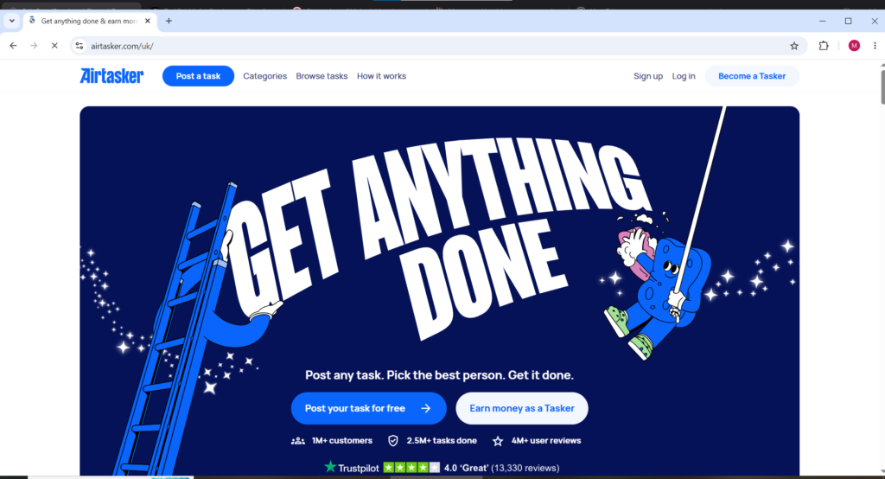
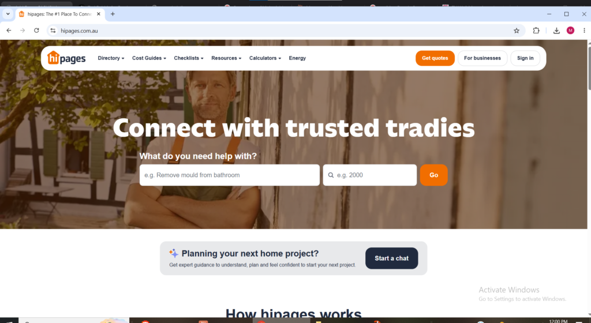
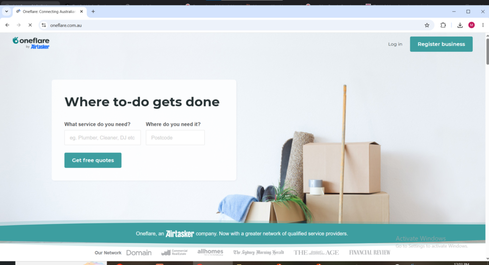
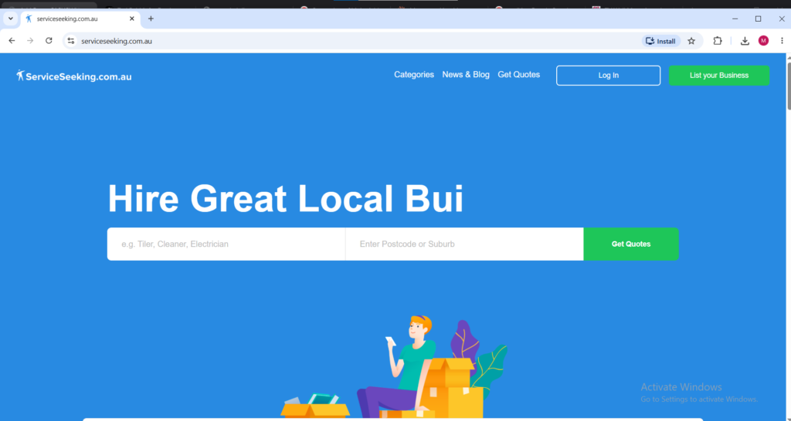
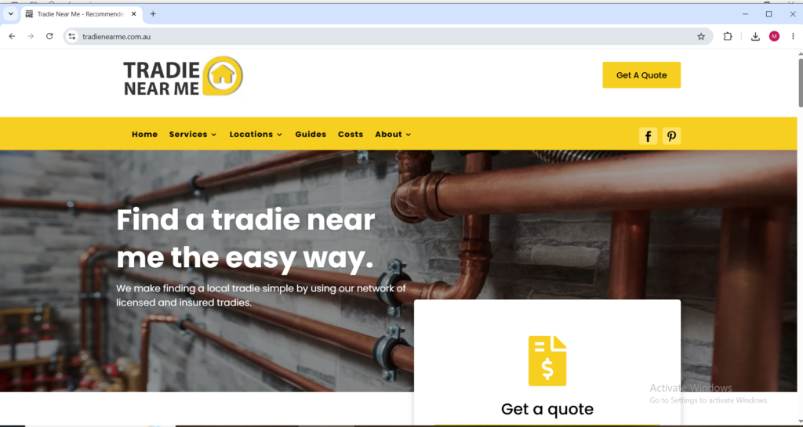
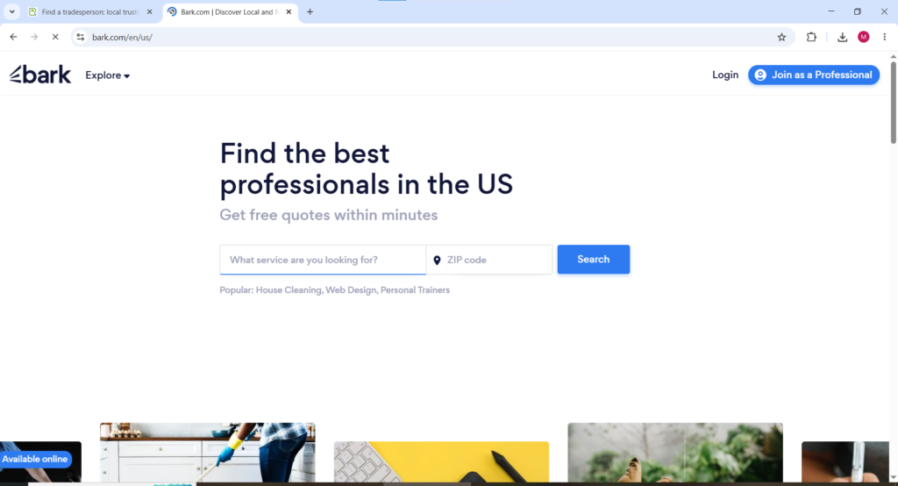
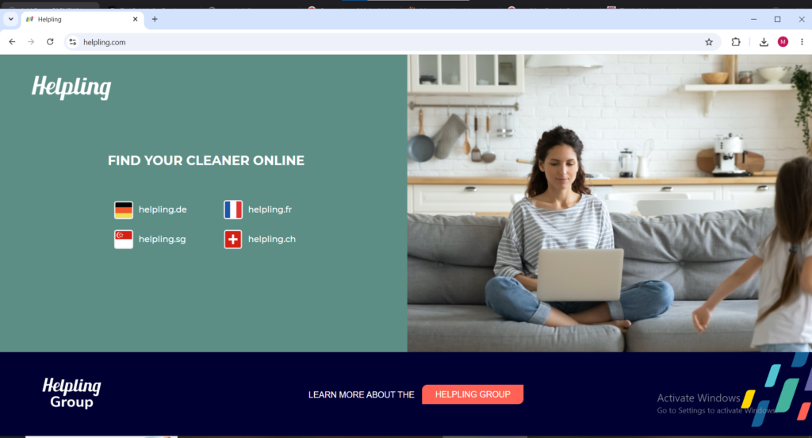

Australia has one of the most developed and highest-paying local task and gig markets in the entire world. Australian hourly rates for skilled local work consistently rank among the highest globally and the combination of a tech-forward population, high smartphone penetration, and a strong culture of outsourcing home services creates an environment where local task workers can earn meaningful income with genuine consistency. For Australian workers looking to earn flexibly outside traditional employment in 2026 the platforms available domestically are genuinely world-class and in some cases more developed than their North American equivalents.

The standout fact about the Australian local task market is that the country produced Airtasker which is one of the most successful local task platforms anywhere in the world, built specifically for the Australian market before expanding internationally. That local origin gives Australian Airtasker workers access to the deepest and most mature version of the platform anywhere globally with more tasks, more reviews, and more established trust infrastructure than any other country where Airtasker operates.

This guide covers over **10 verified platform** where Australian workers can find and get paid for local task and service work in 2026, what each pays, which Australian cities have the strongest demand, and the practical details that determine whether each platform is worth the time investment.

* * *

## **Best Local Gig and Task Apps in Australia in 2026**

### **Airtasker**

Website: [airtasker.com](http://airtasker.com) Available as: Website and Mobile App (iOS and Android)

Airtasker is Australia's most dominant local task platform and one of the most successful platforms of its kind anywhere in the world. Airtasker serves a user base of over 1 million Australian customers, has completed 2.5 million tasks, and has accumulated 4 million user reviews making it the deepest and most established marketplace for local task work available to Australian workers in 2026. The platform covers an enormous range of task categories including furniture assembly, moving help, cleaning, gardening, handyman work, painting, computer help, photography, graphic design, and virtual tasks giving Australian workers across every skill level genuine earning opportunities.

The bidding model on Airtasker gives Australian workers meaningful control over their income. Australian customers post a task with a description and budget and interested workers submit offers. Workers can set their own price and conditions for each task rather than accepting platform-dictated rates. Australian Airtasker workers are charged a service fee of 10 to 30 percent of the money made on each task which is the platform's primary revenue mechanism. The fee percentage decreases as a worker's profile strength and review count increases creating a genuine incentive for Australian Airtasker workers to build their reputation consistently over time.

For Australian workers new to local task platforms Airtasker is the recommended starting point because it is affordable, flexible, and helps build reviews quickly — once a solid rating is established the same worker can expand into other Australian platforms for higher-value projects. The strongest Australian cities for Airtasker task volume are Sydney, Melbourne, Brisbane, Perth, and Adelaide in roughly that order.

* * *

### **Hipages**

Website: [hipages.com.au](http://hipages.com.au) Available as: Website and Mobile App (iOS and Android)

Hipages is an online service directory that connects Australian users looking for home improvement services with local businesses and trade professionals across the country. Once a user posts a job onto the hipages website or app the listing is forwarded to registered tradespeople in the local area as a lead and those businesses provide competitive quotes sent to the job poster for comparison.

Hipages is one of the most popular Australian platforms for steady local leads particularly for plumbing, electrical work, carpentry, tiling, roofing, landscaping, and other skilled trade categories where clients are willing to pay professional rates for licensed and verified work. The platform has a formal partnership with the NSW Department of Education connecting registered trade businesses with school maintenance contracts across New South Wales, a meaningful supplementary income stream for Australian tradies who maintain a strong hipages profile alongside their regular residential client base.

The lead purchase model on hipages means Australian trade professionals pay a fee to access customer contact details for relevant job postings rather than paying a commission on completed work. Tracking the cost per converted lead and adjusting which job types are actively pursued is the key to making the hipages economics work profitably for Australian tradespeople investing in the platform.

* * *

### **Oneflare**

Website: [oneflare.com.au](http://oneflare.com.au) Available as: Website and Mobile App (iOS and Android)

Oneflare is a marketplace platform which matches Australian service seekers with service providers across home improvement, events, personal services, and professional categories. Oneflare is well suited for Australian tradespeople and service professionals chasing regular higher-value jobs rather than the smaller quick-turnaround tasks that dominate Airtasker. The platform covers a broader range of service categories than hipages including event photography, personal training, tutoring, cleaning, and professional consulting alongside the trade categories that define the hipages market.

Australian workers on Oneflare create profiles specifying their service categories and geographic coverage area and receive notifications when customers post relevant job requests within their area. The platform operates on a lead purchase model similar to hipages where Australian service providers pay to access customer contact details for job requests they want to pursue. Oneflare's combination of trade services and broader personal and professional service categories makes it the most versatile of the three major Australian lead generation platforms for workers with skills across multiple service types.

* * *

## **ServiceSeeking**

Website: [serviceseeking.com.au](http://serviceseeking.com.au) Available as: Website Countries: Australia

ServiceSeeking is one of Australia's most established service marketplaces and has been connecting Australian homeowners with local service professionals since 2007. The platform covers home improvement, repairs, cleaning, gardening, removals, and personal services and is particularly well-regarded among Australian workers who are building their local client base because the platform's lead costs are generally more accessible than hipages for beginners with limited initial budgets.

For new Australian tradies and service providers ServiceSeeking is a strong starting platform because it is affordable, accessible for beginners, and helps build reviews and a visible profile quickly in the Australian market. Australian workers who build a strong ServiceSeeking profile with consistent positive reviews create a searchable reputation that generates inbound inquiries from Australian homeowners without continuous active bidding effort.

* * *

## **TradieNearMe**

Website: [tradienearme.com.au](http://tradienearme.com.au) Available as: Website Countries: Australia

TradieNearMe is an Australian platform with a specific focus on connecting regional and suburban Australian homeowners with local tradespeople who are genuinely nearby rather than sending leads to the closest large city professional regardless of actual distance. For Australian workers in regional areas TradieNearMe helps stand out locally in markets where the larger platforms like hipages and Airtasker have lower task volume and less competition from established high-review profiles.

For Australian tradespeople and service workers operating outside major metropolitan areas TradieNearMe fills a genuine gap. A plumber in Cairns, an electrician in Ballarat, or a gardener in Toowoomba faces less competition for TradieNearMe leads in their local market than they would on the major national platforms where metropolitan-based professionals with hundreds of reviews tend to dominate search results. The platform is particularly valuable for Australian workers who want to build a strong local reputation in their specific town or region rather than competing nationally.

<figure>

<figcaption>

Tradienearme.com,au for remote tasks

</figcaption>

</figure>

* * *

### Bark

Website: [bark.com](http://bark.com) Available as: Website and Mobile App (iOS and Android)

Bark operates in Australia and connects Australian service providers with customers across an unusually broad range of categories including home services, events, photography, personal training, tutoring, beauty, legal consulting, and more. The AI-based matching system sends Australian service providers notifications when customers in their area post relevant job requests making the lead discovery process more passive than platforms where workers must actively search and bid for every opportunity.

The breadth of Bark's service categories makes it particularly valuable for Australian workers with diverse skills because a single Australian Bark profile generates leads across multiple service types simultaneously without maintaining separate presences on multiple specialized platforms. For Australian workers whose skills span multiple categories — a photographer who also does videography and event work, for example — Bark provides a single platform that captures leads across all of those services in the Australian market.

## **Helpling**

Website: [helpling.com](http://helpling.com) Available as: Website and Mobile App (iOS and Android)

Helpling is available in Australia and focuses specifically on home cleaning and domestic services connecting verified Australian cleaners with households needing regular or one-time cleaning help. The platform operates a transparent pricing model where Australian workers set their own hourly rates within suggested ranges and clients book directly through the platform for either recurring weekly visits or one-time cleans.

The recurring booking model is Helpling's strongest feature for Australian workers. An Australian homeowner who books a Helpling cleaner and has a positive experience typically rebooks the same cleaner on a weekly or fortnightly basis creating stable and predictable income that removes the need to continuously search for new clients. Australian workers in major cities like Sydney and Melbourne where dual-income professional households regularly outsource cleaning find Helpling one of the most consistent platforms for building a loyal recurring client base.

## **Rover**

Website: [rover.com](http://rover.com) Available as: Website and Mobile App (iOS and Android)

Rover is available in Australia and gives Australian pet care workers access to the globally trusted platform for dog walking, pet sitting, boarding, and drop-in visits. Australian Rover workers set their own rates for each service type and keep approximately 80 percent of what they charge with Rover taking a 20 percent service fee. In Australian cities with dense apartment populations like Sydney, Melbourne, Brisbane where demand for daily dog walking from working professionals who cannot return home during business hours creates consistent and recurring income opportunities for Australian Rover workers who build a reliable client base.

An Australian Rover worker who builds three to five regular weekly dog walking clients in a major Australian city generates between $300 and $700 AUD in predictable weekly income that recurs automatically without ongoing marketing effort. The combination of regular repeat bookings and completely flexible scheduling makes Rover one of the most genuinely lifestyle-friendly earning platforms available to Australian workers in 2026.

* * *

## **Wag!**

Website: [wagwalking.com](http://wagwalking.com) Available as: Mobile App (iOS and Android)

Wag! operates in Australia alongside Rover and functions as a strong complementary platform for Australian pet care workers who want to maximize their daily earning potential from pet services. Many professional Australian pet care workers maintain active profiles on both Rover and Wag! simultaneously — Rover for committed regular weekly bookings and Wag! for on-demand same-day requests from Australian pet owners who need last-minute coverage. The Wag! app features GPS-tracked walks, automated client updates during each session, and direct in-app payment processing that protects both the Australian worker and the client throughout every booking.

* * *

### **Care.com**

Website: [care.com](http://care.com) Available as: Website and Mobile App (iOS and Android)

Care.com is available to Australian workers and serves as a primary platform connecting Australian families with babysitters, nannies, senior care providers, and pet care professionals across the country. Australian workers with backgrounds in childcare, eldercare, or special needs support will find Care.com one of the most consistently in-demand platforms in the Australian market. The recurring care model is where Australian Care.com workers build the most stable income because Australian families who find a reliable caregiver they trust rebook consistently over months and years rather than searching for someone new each time a care need arises.

* * *

**How to Maximize Earnings from Local Gig Work in Australia**

Australian workers earning the most from local task and gig platforms consistently do several things that separate meaningful income from sporadic low-volume earnings.

Signing up for multiple platforms simultaneously rather than testing one before moving to the next is the single most important strategy. Many Australian tradies get consistent work from lead sites by focusing on quick responses, verified reviews, and competitive pricing — the key is to monitor cost per job and stick with the platforms that bring the best return. Having active profiles on Airtasker, hipages, and Oneflare simultaneously gives access to three different customer pools with different job types and different price points.

Building a strong review profile quickly on each Australian platform is the most valuable early investment. Australian customers on every major platform consistently choose workers with strong verified reviews over workers with lower prices and no review history. Completing the first five to ten jobs on each platform at competitive rates to accumulate initial reviews accelerates the path to consistent organic bookings faster than any other strategy.

Australian workers who want to get picked more often on local task platforms should fill out their profiles completely, upload before-and-after photos of completed work, and reply to job enquiries as fast as possible. Clients often choose the first worker who looks professional and ready to go.

Understanding which Australian cities offer the strongest task volume for specific service categories helps Australian workers position their profiles most effectively. Sydney and Melbourne consistently offer the highest task volumes across all categories. Brisbane and Perth are strong secondary markets with growing demand. Regional and suburban areas are best served through TradieNearMe and ServiceSeeking which specifically focus on connecting regional Australian customers with genuinely local workers.
