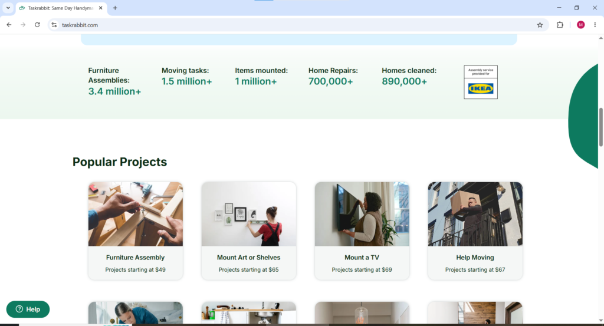
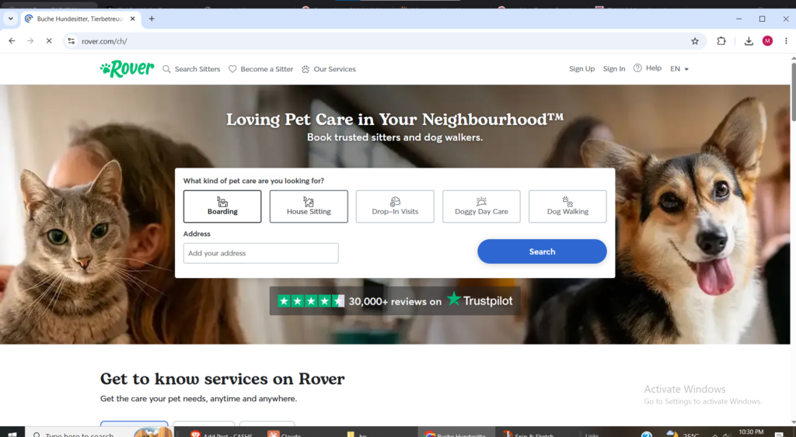
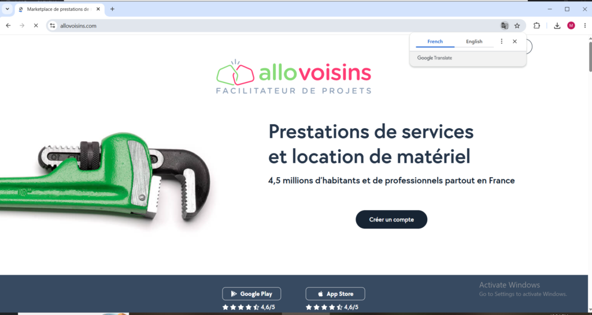
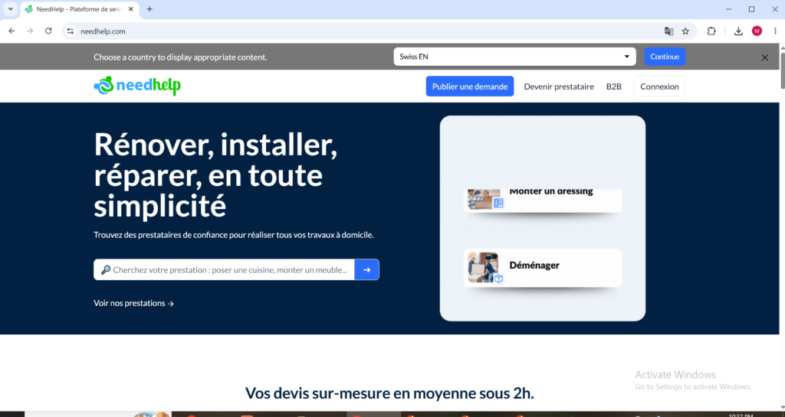
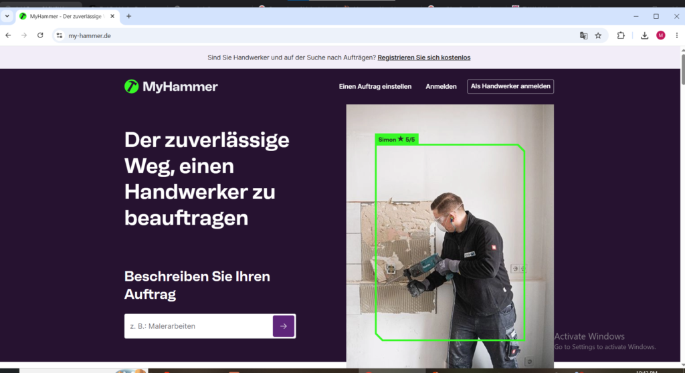
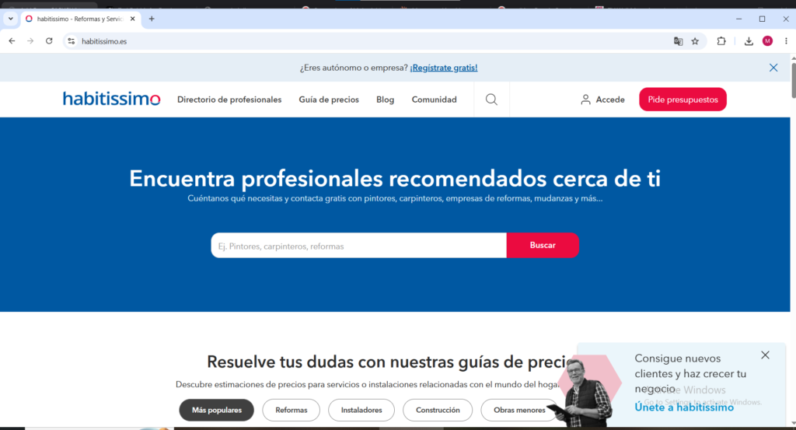

The European local task and gig market in 2026 is more developed and more fragmented than most people expect. Fragmented because unlike North America where a handful of dominant platforms serve the entire continent, Europe has produced a rich ecosystem of country-specific platforms that serve local markets in local languages alongside global platforms that operate across multiple European countries simultaneously. That fragmentation is actually good news for European workers because it means competition between platforms for worker supply has pushed payment rates and conditions in a favorable direction across most major European markets.

This guide covers every verified platform where workers in France, Germany, Italy, Spain, and Portugal can find and get paid for local task and service work in 2026. Each platform is clearly identified with the specific European countries it serves so readers can immediately identify which options are relevant to their location without wading through platforms that do not operate in their market.

* * *

#### Platforms Available Across Multiple European Countries

**TaskRabbit**

Website: [taskrabbit.com](http://taskrabbit.com) Available as: Website and Mobile App (iOS and Android) Countries: France, Germany, Italy, Spain, Portugal

TaskRabbit operates in all five European countries covered in this guide making it the only platform with that level of pan-European coverage in the local task space. In Europe TaskRabbit workers set their own rates, keep their earnings plus tips, and pay a 15 percent service fee to the platform on each completed job. The strongest European markets for TaskRabbit in 2026 are Paris, Berlin, Madrid, Milan, and Lisbon where urban population density and high concentrations of IKEA shoppers create consistent demand for furniture assembly, moving help, and home repair services.

European TaskRabbit workers should be aware that demand levels and task volumes in European cities are generally lower than in major North American cities on the same platform. This makes TaskRabbit a supplementary income source in most European markets rather than the primary platform it can be for workers in New York, Toronto, or London. The best European TaskRabbit strategy is maintaining an active profile there while also registering on the country-specific platforms listed below which often have higher local task volume in their home markets.

* * *

**Helpling**

Website: [Helpling.com](http://Helpling.com) Available as: Website and Mobile App (iOS and Android) Countries: Germany, France, Italy, Spain, Netherlands, Australia

Helpling is a European-founded cleaning and home services platform that has grown from its German origins into one of the most established home services marketplaces across Europe. The platform focuses specifically on home cleaning and domestic services connecting verified cleaners with households that need regular or one-time cleaning help. Helpling operates a transparent pricing model where European workers set their own hourly rates within suggested ranges and clients book directly through the platform.

<figure>

<figcaption>

Helpling.com for remote jobs welcome page

</figcaption>

</figure>

What makes Helpling particularly valuable for European workers is its focus on recurring bookings. A German homeowner who books a Helpling cleaner and has a positive experience will typically rebook the same cleaner on a weekly or bi-weekly basis creating a stable and predictable income stream that removes the need to constantly search for new clients. German workers on Helpling in cities like Berlin, Munich, Hamburg, and Frankfurt find particularly strong demand because of the high concentration of working professionals and dual-income households who outsource home cleaning regularly. The platform processes payments digitally and handles all booking management automatically.

**Bark**

Website: [bark.com](http://bark.com) Available as: Website and Mobile App (iOS and Android) Countries: France, Germany, Italy, Spain, Portugal and broader Europe

Bark operates across Europe and connects workers with customers who need local services across a very broad range of categories including home repairs, cleaning, photography, event planning, personal training, tutoring, legal consulting, and much more. The AI-based matching system connects European service providers with customers who have posted relevant job requests in their area. Bark charges workers per lead credit rather than taking a commission on completed work which means European workers only pay when they actively pursue a specific job opportunity rather than paying a percentage of everything they earn.

The breadth of service categories on Bark is its strongest feature for European workers because it accommodates skills and services far beyond the standard home services categories that dominate most local task platforms. A French worker offering photography, personal training, and graphic design can maintain one Bark profile and receive leads across all three service types simultaneously without managing separate platform presences for each skill.

**StarOfService**

Website: [starofservice.com](http://starofservice.com) Available as: Website Countries: France, Germany, Italy, Spain, Portugal and broader Europe

StarOfService is a European service marketplace that operates across multiple European countries and connects local professionals with customers seeking quotes for a wide range of services. The platform covers home improvement, events, personal services, beauty, fitness, and professional consulting categories. European workers create profiles on StarOfService, specify their service areas and categories, and receive notifications when customers in their area post relevant job requests. The platform operates on a lead purchase model similar to Bark and Thumbtack where workers pay for access to customer contact details rather than paying commission on completed jobs.

StarOfService has a particularly strong presence in Spain and Italy where it has built meaningful user bases among both service providers and homeowners seeking local help. For European workers in those two markets StarOfService represents one of the more established local lead generation channels available alongside the country-specific platforms described later in this guide.

**Malt**

Website: [malt.com](http://malt.com) Available as: Website Countries: France, Germany, Spain, Belgium, Netherlands

Malt is one of Europe's largest freelance platforms and while it sits at the more skilled end of the service spectrum compared to task-based platforms it belongs on this list because European workers with professional backgrounds in technology, design, marketing, consulting, or digital services can access some of the highest-paying client relationships available on any European platform in 2026. Malt connects independent professionals with companies seeking project-based expertise and the rates command on the platform are meaningfully higher than most task-based alternatives because clients are paying for specialist expertise rather than general task completion.

French workers will find Malt's strongest market because the platform originated in France and has its deepest client base there. German and Spanish markets have also grown significantly on Malt in recent years. European professionals with technology backgrounds in particular find Malt a consistently strong source of high-value project work at rates that reflect the genuine scarcity of their skills.

* * *

**Superprof**

Website: [superprof.com](http://superprof.com) Available as: Website and Mobile App Countries: France, Germany, Italy, Spain, Portugal and 40 other countries

Superprof connects tutors and instructors with students across Europe and beyond in an enormous range of subjects including academic subjects, music, languages, sports, arts, and professional skills. European workers who have genuine expertise in any teachable subject can create a free Superprof profile and set their own hourly rate for private lessons delivered either in-person locally or online. The platform has 13 million tutors across more than 1,000 subjects and operates across all five European countries covered in this guide.

For European workers who have teaching or coaching ability in any area, Superprof provides one of the most straightforward paths to earning from local in-person services because the platform is extremely well-known among European families seeking private tuition. French workers find particularly strong demand because Superprof originated in France and its user base there is the most mature and deepest of any European market on the platform.

* * *

**PetBacker**

Website: [petbacker.com](http://petbacker.com) Available as: Website and Mobile App (iOS and Android) Countries: France, Germany, Italy, Spain, Portugal and 50 countries globally

PetBacker is one of the fastest-growing pet care platforms in the world and operates across all five European countries covered in this guide providing European animal lovers with a legitimate income stream through dog walking, pet sitting, boarding, grooming, and drop-in visits. The distance and route of each pet walk can be tracked in the app and all cost estimates on the platform are free for pet owners to obtain before booking.

European PetBacker workers set their own rates for each service type and the platform provides GPS tracking, automated client updates, and secure payment processing for every booking. For European workers in major cities where apartment-dwelling professionals need reliable daily dog walking during working hours, PetBacker provides consistent recurring income from a loyal client base that renews automatically without constant searching for new customers.

* * *

**Rover** rover.com Available as: Website and Mobile App (iOS and Android) Countries: Germany, France, Italy, Spain, Portugal and broader Europe

Rover is available across major European markets and gives European pet care workers access to the same globally trusted platform that powers the North American pet care market. European Rover workers set their own rates for dog walking, boarding, pet sitting, and drop-in visits and keep approximately 80 percent of what they charge with Rover taking a 20 percent service fee. In European cities with dense apartment populations and high concentrations of working professionals; Paris, Berlin, Barcelona, Milan, Lisbon demand for daily dog walking services is particularly strong and European Rover workers who build a loyal client base of regular weekly bookings generate stable predictable income that compounds over time.

* * *

**France-Specific Platforms**

**AlloVoisins** [allovoisins.com](http://allovoisins.com) Available as: Website and Mobile App (iOS and Android) Countries: France

AlloVoisins is France's leading marketplace dedicated to services and equipment rentals between neighbors with a community of 4.5 million members across France including 300,000 professional service providers and over 1.2 million service requests published annually. The platform covers an enormous range of service categories from home repairs and gardening to childcare, cooking, photography, and equipment rental making it one of the most versatile local earning platforms available to French workers.

<figure>

<figcaption>

allovoisins.com welcome page

</figcaption>

</figure>

Active handymen and service providers on AlloVoisins can generate between 400 and 700 euros monthly according to platform data with the most active providers reaching 1,000 euros per month. The platform operates on a neighbor-to-neighbor model that builds genuine trust between service providers and local clients French workers who establish strong reviews and a reliable reputation within their local AlloVoisins community generate repeat bookings and referrals that compound steadily over time. AlloVoisins and NeedHelp together process between 32 and 35 million euros in transactions monthly making the French local services market one of the most financially active in Europe.

* * *

**NeedHelp**

Website: [needhelp.com](http://needhelp.com) Available as: Website Countries: France, Belgium

NeedHelp is one of France's most active local services platforms where active service providers can generate between 400 and 700 euros in monthly revenues according to the platform's own data with the most active users reaching up to 1,000 euros per month. The platform covers home services, handyman work, moving, cleaning, gardening, and personal services and connects French workers with local customers who post task requests in their area.

NeedHelp operates on a transparent request-and-response model where French customers post their task with a description and budget and available workers respond with their offer. This structure gives French workers visibility into what clients are willing to pay before committing to submit a proposal — a meaningful advantage for calibrating pricing strategy compared to platforms where pricing is only revealed after initial contact.

* * *

**Yoojo**

Website: [yoojo.fr](http://yoojo.fr) Available as: Website and Mobile App Countries: France

Yoojo is a France-specific local services platform that connects French workers with customers needing help with household tasks, moving, cleaning, DIY work, childcare, and more. The platform has been growing its user base steadily among French workers and homeowners and operates on a similar model to AlloVoisins where service providers create profiles and receive booking requests from customers in their area. Yoojo processes payments securely through the platform giving French workers payment protection that informal cash arrangements cannot provide.

* * *

**Germany-Specific Platforms**

**MyHammer**

Website: [my-hammer.de](http://my-hammer.de) Available as: Website and Mobile App Countries: Germany, Austria

MyHammer is Germany's most established home services and trade platform connecting German homeowners with craftsmen, handymen, and skilled trade professionals for home improvement and repair projects. The platform covers the full range of skilled trade categories including plumbing, electrical work, painting, flooring, roofing, window installation, and general renovation work. German workers with genuine trade qualifications or demonstrable home improvement skills find MyHammer one of the most consistent lead generation channels available in the German market.

<figure>

<figcaption>

http://my-hammer.de for remote jobs in germany and austria

</figcaption>

</figure>

MyHammer operates on a bidding model where German customers post their project with a description and budget and trade professionals submit competitive quotes. The platform has an established reputation among German homeowners and its association with trusted trade quality means clients on MyHammer are typically willing to pay fair market rates for genuine skilled work rather than seeking the lowest possible price. Austrian workers can also access the platform as it operates across both German-speaking markets.

* * *

**Spain-Specific Platforms**

**Habitissimo**

Website: [habitissimo.es](http://habitissimo.es) Available as: Website and Mobile App Countries: Spain, Italy, Portugal, Brazil

Habitissimo is one of the most established home improvement and repair platforms in Spain connecting Spanish homeowners with local professionals across renovation, plumbing, electrical work, painting, cleaning, and carpentry categories. Spanish workers create profiles on Habitissimo specifying their trade specialty and service area and receive leads from homeowners in their region who are actively seeking quotes for specific projects. The platform operates on a lead purchase model and has a large established customer base in Spain that gives Spanish trade professionals access to meaningful volumes of project inquiries.

Habitissimo also operates in Italy and Portugal making it one of the few platforms with genuine multi-country coverage across southern European markets. For Spanish, Italian, and Portuguese workers with skilled trade backgrounds Habitissimo represents one of the most consistently active lead sources available in those three markets.

* * *

**Wallapop**

Website: [wallapop.com](http://wallapop.com) Available as: Mobile App (iOS and Android) Countries: Spain

Wallapop is Spain's most popular classified and local marketplace app and while primarily known for second-hand goods sales, it has a substantial services section where Spanish workers can advertise local skills and connect with paying clients without any platform commission on completed work. Spanish service providers post their skills, availability, and rates directly on Wallapop and connect with interested clients through the app's messaging system. Because Wallapop is used by millions of Spanish residents for everyday buying and selling, the services section benefits from that massive existing user base without requiring any separate platform-specific audience building.

* * *

**Italy-Specific Platforms**

**ProntoPro**

Website: [prontopro.it](http://prontopro.it) Available as: Website and Mobile App Countries: Italy

ProntoPro is Italy's leading local services marketplace connecting Italian homeowners, businesses, and individuals with professionals across hundreds of service categories including home repairs, legal consulting, photography, event planning, personal training, tutoring, and beauty services. Italian workers create profiles on ProntoPro specifying their expertise areas and receive quote requests from customers in their area. The platform operates across all major Italian cities including Milan, Rome, Naples, Turin, and Florence with strong demand particularly in northern Italian urban markets.

<figure>

<figcaption>

Get remote jobs and tasks in Italy o**n http://prontopro.it**

</figcaption>

</figure>

ProntoPro's breadth of service categories makes it uniquely valuable for Italian workers with diverse skills because a single profile can generate leads across multiple service types simultaneously. Italian workers who maintain complete profiles with strong reviews on ProntoPro consistently report it as one of their most reliable local client acquisition channels available in the Italian market in 2026.

* * *

**Portugal-Specific Platforms**

**Fixando**

Website: [fixando.pt](http://fixando.pt) Available as: Website Countries: Portugal, Spain

Fixando is Portugal's most established local services platform connecting Portuguese homeowners and businesses with local professionals across home improvement, repair, cleaning, event services, fitness, photography, tutoring, and more. Portuguese workers create profiles on Fixando and receive requests from customers in their area who need help across a wide range of tasks. The platform operates on a credit-based lead system similar to Bark and Thumbtack where workers purchase credits to access customer contact information for relevant job requests.

Fixando also operates in Spain giving Portuguese and Spanish workers a cross-border patform presence that is particularly valuable for workers in border regions like the Alentejo, Algarve, and Extremadura areas where customers on both sides of the border seek local service providers. For Portuguese workers building a local services client base Fixando remains the most established and most recognized platform specifically built for the Portuguese market.

* * *

**How to Maximize Earnings from Local Gig Work in Europe**

European workers earning the most from local task and gig platforms share several consistent habits that separate meaningful income from sporadic low-volume earnings.

Understanding which platforms actually operate in a specific European country before investing time in profile creation is the essential first step. The European market is significantly more fragmented than North America and a platform with strong presence in France may have zero users in Germany or Italy. Using the correct combination of pan-European platforms alongside the country-specific platforms listed in this guide for your specific location gives access to the broadest possible pool of available work.

Language matters significantly in European markets in a way it does not in English-speaking markets. Completing profiles in the local language rather than English on country-specific platforms dramatically increases visibility and trust with local clients. A German customer browsing MyHammer or a French customer browsing AlloVoisins expects profiles written in their language and will consistently prefer local-language providers over those with English-only profiles regardless of skill level.

The European platforms with the strongest recurring income potential are the cleaning and pet care platforms like Helpling, PetBacker, and Rover. Recurring weekly bookings from a loyal client base create predictable monthly income that compounds as the client list grows without constant platform activity to maintain it. Prioritizing these platforms for building a stable core income and supplementing with task platforms for additional variable earnings is the most financially sustainable approach for European gig workers in 2026.
