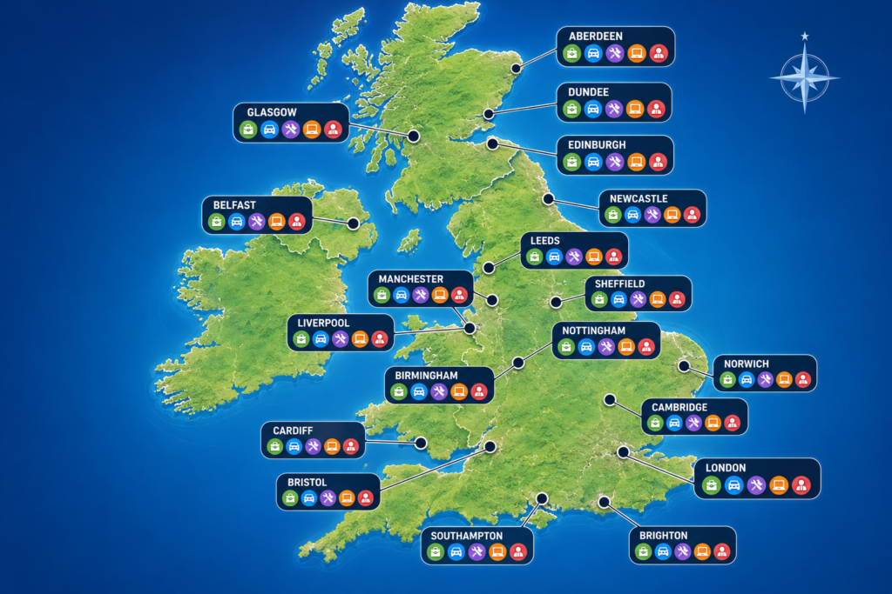
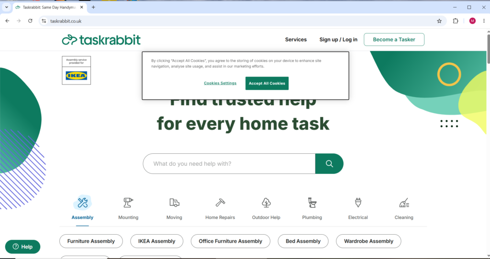
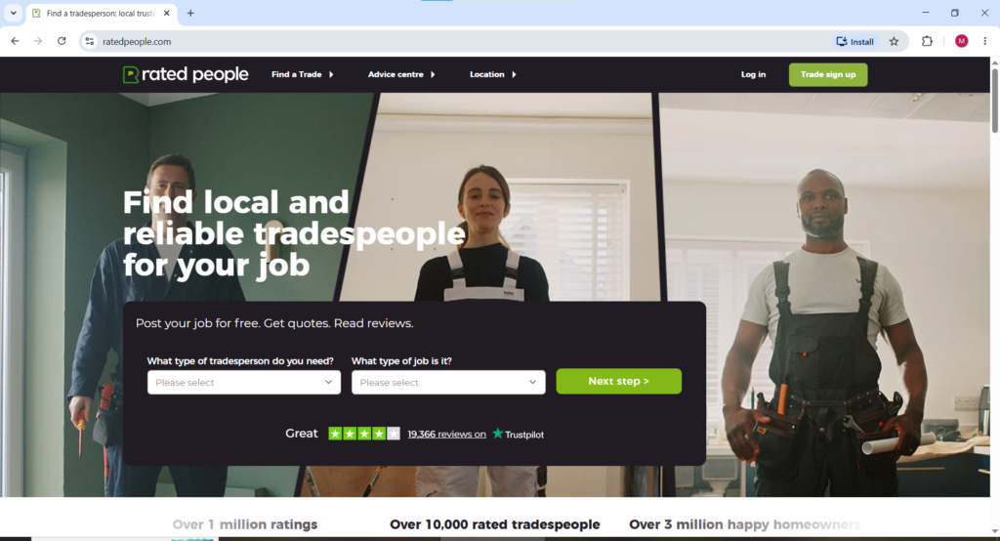
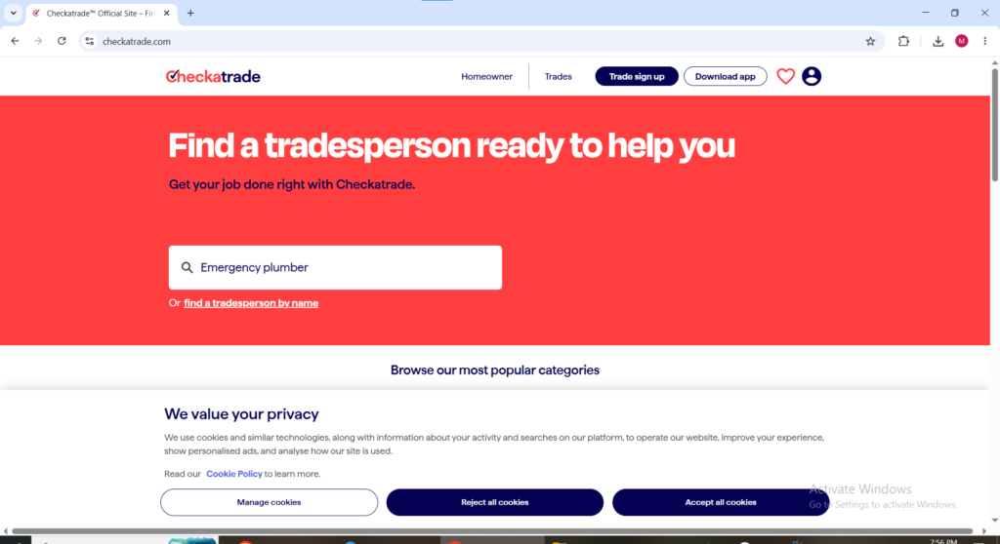

### Introduction

The gig economy in the UK is still going strong in 2026. More and more people are looking for flexible ways to earn money that fit around their jobs, studies, family life, or other commitments.

Local gig and task platforms make it easy to connect with customers who need practical help with everyday jobs like furniture assembly (especially IKEA), TV mounting, moving help, handyman repairs, cleaning, errands, gardening, painting, and other home tasks.

This guide breaks down the best legitimate platforms available right now. You’ll learn how each one works, how you get paid, realistic earnings, pros and cons, and useful tips to succeed. Whether you’re a complete beginner or already experienced, you’ll find practical advice to help you make the most of these opportunities and **we have more than 10 listed here I personally advice you** to be patient and pay good attention to find what's best for you.

### Why Local Gig Work Continues to Grow in the UK in 2026

Several key factors are driving strong demand for local gig services across the UK. In big cities like London, Manchester, Birmingham, Edinburgh, Bristol, and Leeds, busy professionals often don’t have time for household chores. An ageing population also needs reliable help with errands, minor repairs, and moving. On top of that, the rise in online shopping has created more demand for furniture assembly and delivery-related tasks. Many households now prefer hiring affordable local help instead of expensive traditional companies.

Workers love the freedom these platforms offer. You can choose your own hours, pick jobs that match your skills and location, and gradually build a base of regular customers. A lot of people combine these gigs with remote work or other side hustles to create more stable income.

Demand also changes with the seasons, Moving and assembly jobs peak in summer and at the end of rental periods, while gardening work picks up in spring and autumn.

Success comes down to a few simple things: being reliable, creating a strong profile, delivering excellent service, and using the platforms smartly. Start by making a professional profile with friendly photos (ideally in work clothes), highlighting any relevant experience. Invest in basic tools and good transport, respond to jobs quickly, and focus on earning great reviews early. Don’t forget to track your income and expenses for taxes, consider getting public liability insurance, and always prioritize safety.

### Getting Started with Local Gig Work in the UK

Anyone aged 18 and above with the right to work in the UK can usually join these platforms. Most require identity verification, background checks, and sometimes references. Prepare necessary documents in advance such as proof of address and right to work.

Basic equipment that helps you stand out includes a good toolkit with screwdrivers, hammers, drills, Allen keys, measuring tape, and safety gear. A van or large car gives advantage for moving and assembly jobs. Smartphone with reliable data is essential since most work happens through apps.

Many beginners start with simpler tasks like errands, shopping, or basic assembly to build reviews before moving to higher paying handyman or electrical work. Treat this like a real business. Consistent availability, professional communication, and going the extra mile for customers lead to repeat business and higher earnings over time.

### Top Local Gig and Task Platforms in the UK for 2026

Here is a detailed breakdown of the leading legitimate platforms. Each section explains the platform, its operations, payment process, earnings potential, and tips.

#### 1\. TaskRabbit

**TaskRabbit** is one of the most popular on-demand task platforms in the UK, with strong coverage in London and growing presence in other major cities. Visit: [https://www.taskrabbit.co.uk/](https://www.taskrabbit.co.uk/)

It connects Taskers (service providers) with clients across many categories. Popular tasks include IKEA furniture assembly, TV/shelf mounting, moving & heavy lifting, deep cleaning, errands, minor repairs, organisation, and yard work.

**How it works:** Create a detailed profile, list skills, set your hourly rates, and manage availability. Clients post tasks or invite you directly. You review details and accept/decline jobs. The platform builds trust via background checks and reviews.

**Payment:** Clients pay through the app (your rate + tips). TaskRabbit adds fees on the customer side, so you receive your full rate after platform fees. Payouts are fast (1-3 business days) via bank transfer or Stripe.

**Earnings:** Experienced Taskers in London often make £25–60+ per hour. Quick jobs pay £50–150, while full-day moves earn more. Part-time workers commonly make £300–800 weekly.

**Success tips:** Use high-quality photos and detailed descriptions. Start with competitive rates to build reviews, then increase them. Be punctual, communicate well, and add small extras. Focus on repeat clients and specialise in 1-2 high-demand categories for a flexible, scalable side business.

#### 2\. Airtasker

Airtasker is a major player with roots in Australia but very active across the United Kingdom. Access it at [https://www.airtasker.com/uk/](https://www.airtasker.com/uk/)

The platform operates on a bidding or offer system. Clients post tasks with descriptions and preferred budgets. Service providers browse available jobs and submit competitive offers including price and availability. Categories cover almost anything legal from moving help, cleaning, gardening, handyman repairs, deliveries, event assistance, virtual tasks, and creative services.

Once a client selects your offer the job locks in with payment held in escrow for protection. After completion and client approval funds release to you. Airtasker charges a service fee typically between 10 and 20 percent depending on your total earnings volume on the platform. Higher activity often means lower percentage fees.

Earnings vary significantly. Small errands might pay 20 to 50 pounds while larger moving or handyman jobs reach several hundred pounds per task. Active users in big cities report good part time income.

<figure>

<figcaption>

**Moving packages task**

</figcaption>

</figure>

**Tips:** Build a strong profile with examples of past work. Respond very quickly to new postings because competition is real. Write personalised offers that address the client needs specifically. Maintain outstanding communication and always ask for reviews. Specialise in areas where you have genuine expertise to reduce negative feedback risk. Many users combine Airtasker with other platforms to fill their schedule.

#### 3\. Rated People

Rated People stands as one of the largest UK focused lead generation platforms for home services. Find it at [https://www.ratedpeople.com/](https://www.ratedpeople.com/)

<figure>

<figcaption>

www.ratedpeople.com welcome page

</figcaption>

</figure>

It primarily serves homeowners posting jobs in trades and practical services. Popular categories include plumbing, electrical work, painting and decorating, kitchen and bathroom installations, general handyman jobs, gardening, and home improvements.

You pay for leads through subscription packages or individual credits. When a matching job appears you purchase the lead to receive customer contact details. You then quote directly and manage the job mostly off platform. This model gives greater control over pricing and client relationships.

There are no commissions on your final earnings but you invest upfront in leads. Successful users convert a good percentage of leads into paid work making it highly profitable especially for skilled trades where single jobs can be worth hundreds or thousands of pounds.

**Tips for Rated People:** Complete your profile thoroughly with qualifications, insurance details, and portfolio photos. Be selective with leads to manage costs effectively. Follow up promptly and professionally. Excellent customer service turns one off jobs into long term clients. Track your conversion rate and adjust spending accordingly. This platform suits those with existing skills and tools more than complete beginners.

#### 4\. MyBuilder

MyBuilder is a respected UK platform specialising in building, renovation, and home improvement work. Visit [https://www.mybuilder.com/](https://www.mybuilder.com/)

Similar to Rated People it uses a lead generation approach. Homeowners post projects and interested professionals pay a small shortlist fee to get put forward to the customer. Categories focus heavily on construction related tasks, extensions, roofing, plumbing, electrical, landscaping, and general building.

You handle quoting and payment directly with the client. MyBuilder earns through shortlist fees rather than taking a percentage of your job value. Larger projects offer substantial earning potential.

**Tips:** Maintain high response rates and strong reviews. Use the platform reputation system to your advantage. Price jobs realistically while highlighting your value. Aim for ongoing client relationships.

**Media suggestion:** Before and after home improvement images.

#### 5\. Bark

Bark operates as a broad lead generation service with strong UK coverage. Check [https://www.bark.com/](https://www.bark.com/)

<figure>

<figcaption>

Bark.com welcome page

</figcaption>

</figure>

Customers request quotes across hundreds of categories. You buy credits to respond to suitable leads and receive contact information. It covers handyman work, cleaning, gardening, pet services, and many more.

You pay only for leads you pursue with no commission on completed jobs. This flexibility allows direct negotiation with customers.

<figure>

<figcaption>

**Sample of before and after task execution**

</figcaption>

</figure>

**Tips:** Respond fast with tailored proposals. A professional profile improves lead quality. Use Bark alongside marketplace style platforms.

#### 6\. Handy

[www.handy.com](https://www.handy.com)

Handy is a platform mainly focused on cleaning services, furniture assembly, and handyman work. It connects workers with people who need home services quickly.

Workers earn money per completed task, and earnings depend on location, ratings, and job type. Furniture assembly and deep-cleaning jobs often pay more than simple tasks.

**Tips:**

Focus on high-demand services like IKEA furniture assembly or move-out cleaning.

Reliability is extremely important because cancellations hurt ratings.

Bring your own basic tools for handyman jobs.

Try to collect repeat clients outside one-time gigs.

#### 7\. HomeRun ([homerun.co.uk](http://homerun.co.uk))

HomeRun matches local service providers with relevant jobs across various home service categories. It operates in the UK and provides job opportunities based on your profile and location. Visit [http://homerun.co.uk](http://homerun.co.uk) to engage

<figure>

<figcaption>

**Homerun.co.uk welcome page**

</figcaption>

</figure>

**Tips:** Keep availability current and respond promptly to matches.

#### 8\. Checkatrade

Visit: [https://www.checkatrade.com/](https://www.checkatrade.com/)

Checkatrade is a trusted vetted directory for tradespeople in the United Kingdom. It requires a strict approval process including background and qualification checks. You pay a monthly membership fee for visibility and leads.

Highly regarded for plumbing, electrical, building, and handyman work. You keep 100% of what you charge clients.

**Tips:** Complete your profile fully and maintain excellent reviews. Best for skilled tradespeople.

### 9\. Bidvine

Its website= [bidvine.com](https://www.bidvine.com)

Bidvine is a UK platform where customers request local services and professionals send quotes for the work. It is popular for tutoring, photography, home repairs, fitness coaching, cleaning, and event services.

Workers make money by responding to job requests and winning clients. Your earnings depend on your skill, reviews, and pricing. Some jobs can become long-term repeat clients.

**Tips:**

- Reply to leads quickly because customers often choose the first few responses.

- Build a strong profile with photos and reviews.

- Start with competitive pricing to gain ratings.

- Focus on one niche at first instead of offering too many services.

* * *

## 10\. Tailster

[Tailster Official Website](https://www.tailster.com?)

Tailster is a pet care platform focused on dog walking, pet sitting, boarding, and house visits. It is one of the better-known UK alternatives to Rover for animal lovers looking for flexible side income.

You make money by setting your own prices for pet services. Some sitters earn extra income during holidays when demand increases. Repeat customers are common if owners trust you with their pets.

**Tips:**

- Upload clear photos with pets to build trust.

- Offer flexible availability for weekends and holidays.

- Keep communication professional and friendly.

- Reviews matter heavily, so early customer service is important.

* * *

## 11\. Temper

Temper is an application

Temper is a gig-work app mainly used for hospitality, retail, warehouse, and event shifts in the UK. Instead of long-term employment, workers can pick shifts that fit their schedule.

Pay is usually hourly, and workers get paid after completing shifts. Popular gigs include bar work, catering, event staffing, and hotel support jobs.

**Tips:**

- Be reliable because no-shows can reduce future opportunities.

- High ratings help unlock better-paying shifts.

- Keep notifications on since good shifts can disappear quickly.

- Weekend and evening jobs often pay more.

* * *

## 12\. PeoplePerHour

[PeoplePerHour Official Website](https://www.peopleperhour.com)

PeoplePerHour is a freelance marketplace for online work such as graphic design, writing, programming, SEO, video editing, and digital marketing. It is widely used by freelancers in the UK and Europe.

Freelancers make money either through hourly contracts or fixed-price projects. Experienced sellers can build recurring clients and charge premium rates over time.

**Tips:**

- Create a professional portfolio before applying for jobs.

- Specialize in one high-demand skill initially.

- Write personalized proposals instead of copying templates.

- Fast communication improves client trust and repeat work.

* * *

### Detailed Comparison of All Major UK Platforms

**TaskRabbit and Airtasker** suit beginners and those wanting flexible hourly or task based work with you controlling much of the process.

**Rated People, MyBuilder, Bark, and Checkatrade** work better for skilled trades seeking higher value jobs even though they require lead investment.

**Helpling** excels for cleaning specialists wanting regularity.

Many top earners use a combination of three or more platforms. For example use TaskRabbit and Airtasker for quick cash flow while using Rated People for bigger projects. Test different ones in your local area because performance varies by city and skill set.

### Advanced Strategies to Maximise Earnings in 2026

Specialise in one or two high demand niches such as IKEA assembly plus TV mounting or moving services. This builds expertise and faster completion times.

Create packages like full home setup after moving or deep clean plus organisation. Upsell add ons during jobs. Build an email or WhatsApp list of satisfied clients for direct bookings where allowed.

Invest in marketing. Professional branded clothing or vehicle signage helps. Take clear before and after photos with permission for your profiles.

Use scheduling tools to block time efficiently and minimise travel between jobs. Analyse your data regularly to see which platforms and task types give the best return on your time.

Seasonal planning boosts income. Prepare for peak periods by increasing availability. Offer weather related services like gutter cleaning or snow removal where relevant.

### Legal Tax and Safety Considerations

Operate as self employed or through a limited company. Register with HMRC and file Self Assessment taxes annually. Deduct legitimate business expenses including tools, vehicle costs, insurance, phone, internet, and home office elements. Keep detailed records.

Platforms usually provide earnings summaries to assist reporting. Monitor VAT thresholds. Public liability insurance is highly recommended for physical work.

For safety verify clients through the platform, share job details with a trusted contact, and meet in public spaces initially if concerned. Trust your instincts and decline uncomfortable jobs.

**Suggested media here:** Insert comparison table image, tool checklist, or tax tips infographic.

### Real World Examples and Case Studies

Many gig workers in the UK earn meaningful income. Some make 500 to 1500 pounds weekly part time by combining platforms and specialising. Others transition to full time businesses with vans, teams, and direct clients. Common challenges include slow periods and competition in popular cities. Solutions involve diversification, skill building, and exceptional service.

### Final Thoughts and Next Steps

Local gig and task platforms in the United Kingdom offer realistic opportunities to earn money on your own schedule throughout 2026. The market supports different working styles from quick flexible tasks to skilled trade projects.

Start small. Choose one or two platforms that match your skills and location. Complete your profiles thoroughly and secure your first few jobs to build momentum and reviews. Consistency and professionalism separate those who earn occasionally from those who build sustainable income.

The flexibility and independence these platforms provide make them attractive in the modern economy. Take action today by visiting the websites listed, signing up, and exploring available opportunities in your area. With the right approach you can turn available time into reliable earnings while enjoying the freedom of self directed work.
