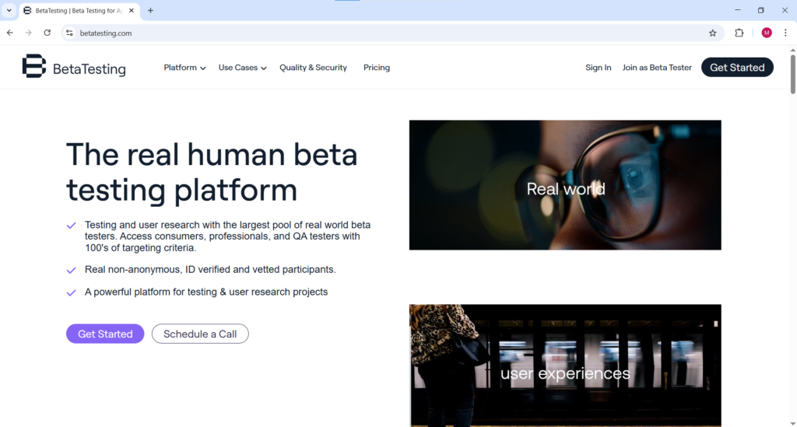
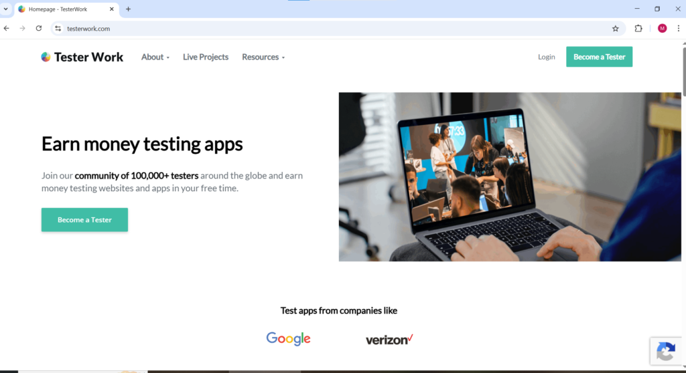
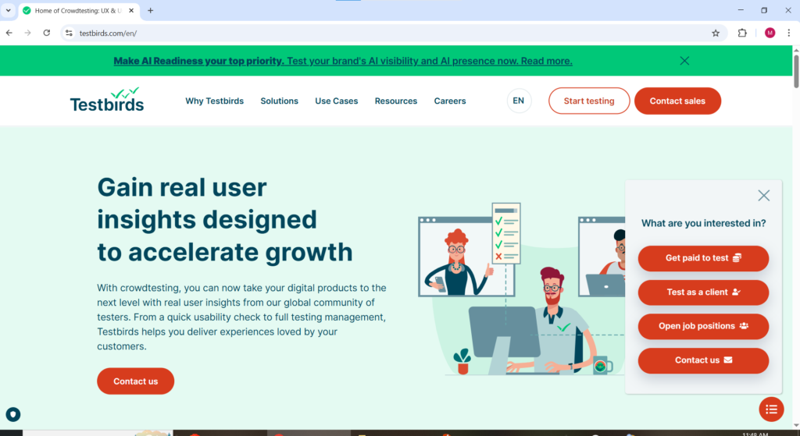
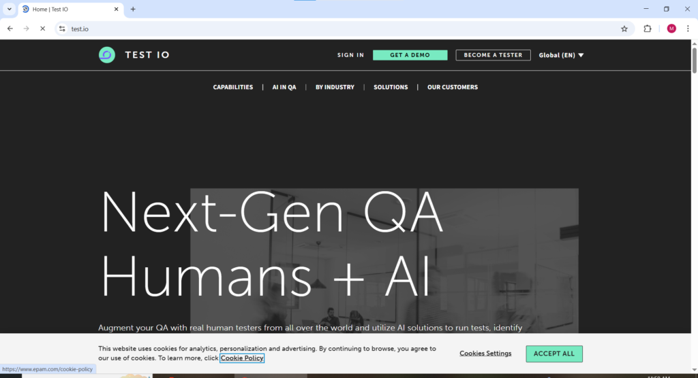
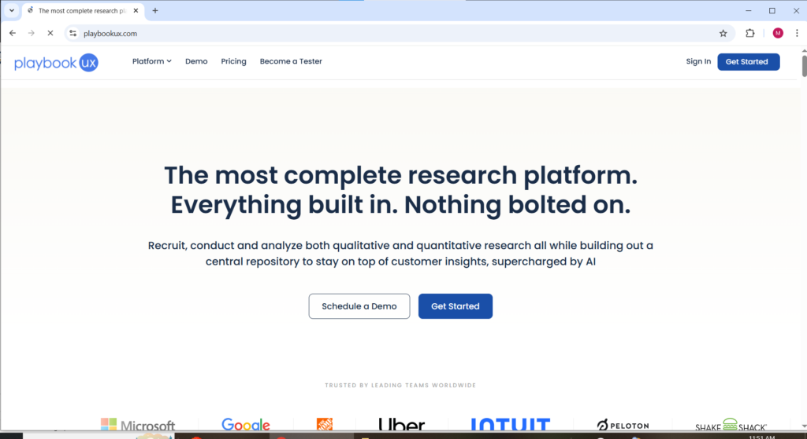
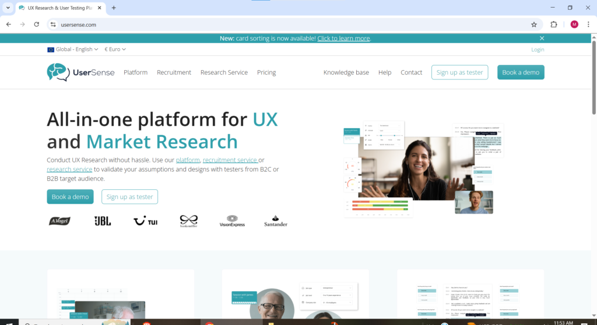

Every app you have ever downloaded went through rounds of real world testing before it landed on your phone. Someone was paid to open it, navigate through it, find what was broken, report what was confusing, and explain what made no sense to a first-time user. In 2026 that person can be you and the platforms that connect everyday users with companies who need genuine feedback are paying between $10 and $120 per session for the privilege of your honest reaction.

Getting paid to test apps requires no technical background, no coding knowledge, and no prior experience in software development. What companies are paying for when they hire app testers is something far simpler and far more valuable than technical expertise. They are paying for your genuine first impression as a normal user because that is what their millions of customers will also experience and they need to catch every problem before those customers do.

This guide covers every verified platform where you can get paid to test apps in 2026, what each one pays, what the work actually involves, and the practical strategies that separate testers earning $200 to $500 per month from those earning nothing because they signed up once and never heard back. The difference between those two outcomes is almost entirely down to how many platforms you join and how thoroughly you complete your profiles on each one.

* * *

**What Getting Paid to Test Apps Actually Involves**

When a company hires app testers through these platforms they are paying for one specific thing, Your real-time honest reaction as someone who has never seen their app before. You are not being hired as a technical expert. You are being hired as a normal human being who can clearly articulate what they are experiencing while they experience it.

A typical app testing session works like this. You receive an invitation from the platform matching you to an available test. You accept the test, download the app or access the platform being tested, and receive a set of specific tasks to complete. As you work through those tasks you speak your thoughts out loud continuously what you notice, what confuses you, where you get stuck, what you expected to happen versus what actually happened, and what you would do differently if the choice were yours. Your screen and audio are recorded simultaneously throughout the session. Once you submit the completed recording the company reviews it and releases payment after approval.

There are two distinct categories under the umbrella of getting paid to test apps that are important to understand. The first is UX testing where you provide usability feedback on how intuitive and user-friendly an app feels to a genuine first-time user. The second is QA testing where you specifically look for bugs, errors, crashes, and technical problems that need to be fixed before the app reaches the public. UX testing platforms are more beginner friendly and require no technical knowledge. QA testing platforms pay higher rates but expect more structured and technically detailed bug reports.

* * *

**What You Need to Get Started**

Getting paid to test apps requires minimal setup. You need a smartphone for mobile app testing or a computer for desktop app and website testing. You need a stable internet connection. You need a working microphone — most modern phones and laptops have built-in microphones adequate for testing sessions. You need a quiet environment where background noise will not interfere with your audio recording. Most platforms pay via PayPal so having an active PayPal account set up before you apply saves time. Some platforms additionally require a webcam for certain moderated session types.

* * *

1. **uTest** [utest.com](http://utest.com)

uTest operates at a fundamentally different level from most platforms where you can get paid to test apps. The platform serves major clients including Uber, Starbucks, and McDonald's and the work primarily involves finding bugs in apps and software rather than providing general usability feedback. Testers on uTest earn an average of $5 per verified bug they find and experienced testers in the community report earning $3,000 or more per month. That earning level makes uTest the highest potential income platform of any option for getting paid to test apps in 2026 by a significant margin.

The path to those earnings is not immediate and requires genuine investment in building your tester rating systematically over time. uTest has a tiered rating system where new testers start at the lowest level and progress by consistently submitting high quality detailed bug reports that meet the platform's standards. The platform has its own courses, forums, and community resources specifically designed to help testers improve their skills. If you are willing to learn the structured approach to bug reporting and build your rating over several months, uTest offers earning potential that no other app testing platform comes close to matching.

2.**Respondent** [respondent.io](http://respondent.io)

Respondent sits at the premium end of the market for getting paid to test apps and focuses on paid research studies and interviews that pay between $100 and $700 per hour. Respondent specifically seeks participants with professional backgrounds and specialist expertise because companies conducting research on professional tools and enterprise software need testers who actually use those products in real work contexts.

Getting paid to test apps through Respondent requires applying to individual studies that match your professional background and demographic profile. Not every application results in selection but the sessions you do qualify for pay at rates that make every other app testing platform look modest by comparison. Payment is processed via PayPal or bank transfer after session completion. If you have any kind of professional background in technology, finance, medicine, law, marketing, or education, Respondent is the platform most likely to reward that expertise with premium rates that genuinely reflect its value.

3\. **UserTesting** usertesting.com

UserTesting is the most established and widely recognized platform for getting paid to test apps and has been operating since 2007. UserTesting concentrates on Fortune 500 companies like Lowe's and Samsung as well as fast-growing companies like Grammarly making it one of the most credible platforms for getting paid to test apps at a genuinely professional level.

To get started on UserTesting you create a profile and complete a sample test which the platform reviews before deciding whether to approve you as a tester. The sample test is essentially your audition speak clearly, narrate your thoughts continuously, and treat it exactly as you would a paid session. Tests on UserTesting typically take 10 to 20 minutes and pay around $10 per completed session with longer and more complex tests paying proportionally more. Payment is processed via PayPal after each approved test.

The honest reality about UserTesting that new testers need to know upfront is that the initial dashboard shows a large pool of available tests but after approval the actual volume of tests you qualify for daily is significantly lower. Some testers receive a couple of tests per day while others go several days without a new invitation. Treat UserTesting as one platform in a portfolio of getting paid to test apps rather than a standalone income source.

* * *

4\. **Userlytics** userlytics.com

Userlytics is one of the most globally accessible platforms for getting paid to test apps accepting testers from countries around the world rather than limiting participation to a handful of Western markets. Tests on Userlytics typically take 10 to 20 minutes and pay $10 per completed session via PayPal seven days after the test is approved. The platform records your screen and audio simultaneously as you complete app testing tasks and speak your thoughts continuously throughout.

For anyone looking to get paid to test apps from outside the United States, United Kingdom, or Canada, Userlytics is one of the most important platforms to prioritize because of its broad international tester acceptance. The quality of your verbal feedback during testing sessions directly determines your rating on the platform and your rating determines how frequently you receive future test invitations.

* * *

* * *

5\. **BetaTesting** betatesting.com

BetaTesting focuses specifically on beta testing which means getting paid to test apps that are not yet publicly released. Companies preparing to launch new apps need testers to use them in real-world conditions over an extended period rather than in a single 20-minute session. BetaTesting connects those companies with testers willing to use an app regularly over days or weeks and provide detailed feedback on their experience throughout that period.

The extended testing format means getting paid to test apps through BetaTesting works differently from other platforms. You are not completing a single session and moving on you are becoming a genuine beta tester for a product still in development and your ongoing feedback directly shapes what the final version looks like. Pay varies by project and scope. Some projects offer flat compensation for completing the testing period while others pay per piece of feedback submitted. For testers who are genuinely interested in being part of the app development process rather than just completing sessions for payment, BetaTesting offers a more engaging and immersive version of getting paid to test apps.

6\. **TesterWork** testerwork.com

TesterWork has built a community of over 100,000 testers around the globe and offers the opportunity to earn money testing websites and apps in your free time. The platform accepts testers from a wide range of countries making it one of the more globally inclusive options for getting paid to test apps regardless of where you are located. Companies using TesterWork include well-known brands across technology, retail, and finance sectors whose apps you are likely already familiar with as a consumer

Getting paid to test apps on TesterWork involves both functional testing where you check whether specific features work correctly and usability testing where you evaluate the overall user experience of the app from a first-time user perspective. The platform pays in credits that convert to cash withdrawable via PayPal. TesterWork is particularly well suited for beginners entering the app testing space because the onboarding process is clear and each test comes with well-explained guidelines before the session begins.

* * *

7\. **Testbirds** testbirds.com

Testbirds is a European app testing platform that has been connecting testers with companies needing real-world app feedback since 2011. The platform operates across multiple countries and covers a broad range of testing types including functional testing, usability testing, compatibility testing across different devices, and localization testing for companies releasing apps in new language markets. Getting paid to test apps through Testbirds involves registering as a tester, completing your device and demographic profile thoroughly, and then receiving invitations to testing projects that match your specific device setup and background.

One meaningful advantage of getting paid to test apps through Testbirds is the device-based matching system. Companies testing apps for specific operating systems, screen sizes, or hardware configurations need testers with those exact devices. If you own multiple devices an Android phone, an iPhone, a tablet, a laptop listing all of them in your Testbirds profile significantly increases the number of projects you qualify for.

* * *

8\. **Test IO** test.io

Test IO is a QA platform for getting paid to test apps that pays higher rates than UX testing platforms because the work is more technically structured and involves identifying specific bugs rather than providing general impressions. Companies using Test IO include fast-growing technology businesses and established software companies who need systematic bug finding before major releases. Testers on Test IO earn per verified bug they find and the platform has a reputation for fast payment processing once bugs are approved by the client. [Quora](https://www.quora.com/What-survey-sites-can-I-earn-from-in-Nigeria)

Getting paid to test apps on Test IO requires more attention to detail and more structured reporting than conversational UX testing platforms. Each bug report must include clear steps to reproduce the problem, the device and operating system on which it occurred, a description of what happened versus what should have happened, and ideally a screenshot or screen recording showing the issue. That extra effort is what commands the higher pay rates compared to platforms where you simply talk through your experience.

9\. **PlaybookUX** playbookux.com

PlaybookUX is a flexible app testing platform that offers multiple session formats to suit different tester preferences and schedules. Unmoderated studies involve recording your screen and voice while answering questions without a researcher present and typically take 10 to 20 minutes. Moderated live conversations involve speaking to a researcher one-on-one at a scheduled time and run for 30, 60, or 90 minute sessions. Card sort and tree test studies require no additional software and can be completed entirely in the browser in as little as two to ten minutes. [Prime Opinion](https://www.primeopinion.com/en-ng/)

The variety of session formats on PlaybookUX means getting paid to test apps through the platform can fit around almost any schedule. Shorter card sort and tree test sessions are ideal for testers with limited time. Longer moderated sessions pay significantly more and suit testers who are comfortable with live researcher conversations. PaybookUX accepts testers from various countries and pays via PayPal upon session approval.

* * *

10\. **UserSense** [usersense.io](http://usersense.io)

UserSense is a European platform paying between 15 and 70 EUR per test making it one of the highest-paying options for getting paid to test apps on a per-session basis. Tests include app usability evaluation, prototype testing, and design feedback sessions. The platform is newer and smaller than the major players so test frequency is limited but individual payouts are excellent. Payment is processed via bank transfer which makes it particularly accessible for European testers who may prefer bank payments over PayPal.

For testers based in Europe looking to get paid to test apps at premium per-session rates, UserSense belongs in your portfolio alongside the larger platforms. The lower test frequency is easily offset by the significantly higher payment per session compared to most other options where you can get paid to test apps.

* * *

11\. **Trymata** trymata.com

Trymata combines getting paid to test apps with additional survey and feedback opportunities in one platform making it a useful all-in-one addition to your testing portfolio. The platform is built around providing genuine honest feedback on apps and digital products and is particularly beginner friendly because the test instructions are clearly communicated and the expectations for each session are well defined before you begin.

Trymata processes payments via PayPal and has built a consistent reputation for reliability among testers who use it regularly as part of a broader strategy for getting paid to test apps across multiple platforms simultaneously. Adding Trymata to your active platforms gives you an additional source of test invitations to fill gaps on days when availability on higher-volume platforms is slow.

* * *

**How to Maximize Your Earnings from App Testing in 2026**

Active testers who spread their effort across five or more platforms consistently report earning between $200 and $500 per month with power testers exceeding $1,000 in strong months. The difference between those outcomes comes down almost entirely to how many platforms you are registered on, how quickly you respond to test invitations, and how thoroughly you have completed your profile on each one. [PaidFromSurveys.com](https://paidfromsurveys.com/best-paid-surveys-for-nigeria)

Sign up for every platform on this list rather than testing one at a time before moving to the next. Each platform has different clients, different demographics they need, and different test availability patterns. Being registered across all of them simultaneously means you are pulling from the widest possible pool of available tests daily.

Complete your profile thoroughly and honestly on every platform. Your demographic information including your age, location, occupation, devices you own, apps you use regularly, and technology experience level determines which tests you get matched to. The more complete and accurate your profile the more frequently you receive relevant test invitations. Testers with incomplete profiles consistently receive fewer invitations than those who have filled in every available profile field.

Narrate everything during your testing sessions even if it feels awkward at first. Saying "it looks fine" or going quiet for 30 seconds significantly lowers your tester rating. A strong narration sounds like this "I see a blue button here. I am going to click it because I think it takes me to the checkout screen. Okay it took me to a different page. That is confusing because I expected the cart to appear." That level of continuous detail is exactly what companies are paying for when they hire testers to get paid to test apps.

Respond to test invitations quickly. Popular testing sessions fill within minutes of being posted on most platforms. Checking your email and app testing dashboards regularly throughout the day particularly between late morning and early afternoon gives you the best chance of securing sessions before other testers claim them.

Answer screener questions honestly rather than trying to match what you think the test is looking for. Platforms track screener consistency and testers who give inconsistent answers across screeners get flagged and eventually receive fewer invitations over time. Your long-term income from getting paid to test apps depends on your standing on each platform which is built through consistent honest quality performance not through gaming the system.
