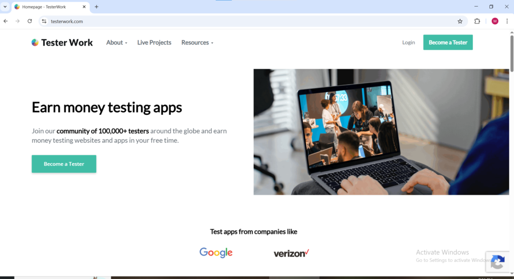
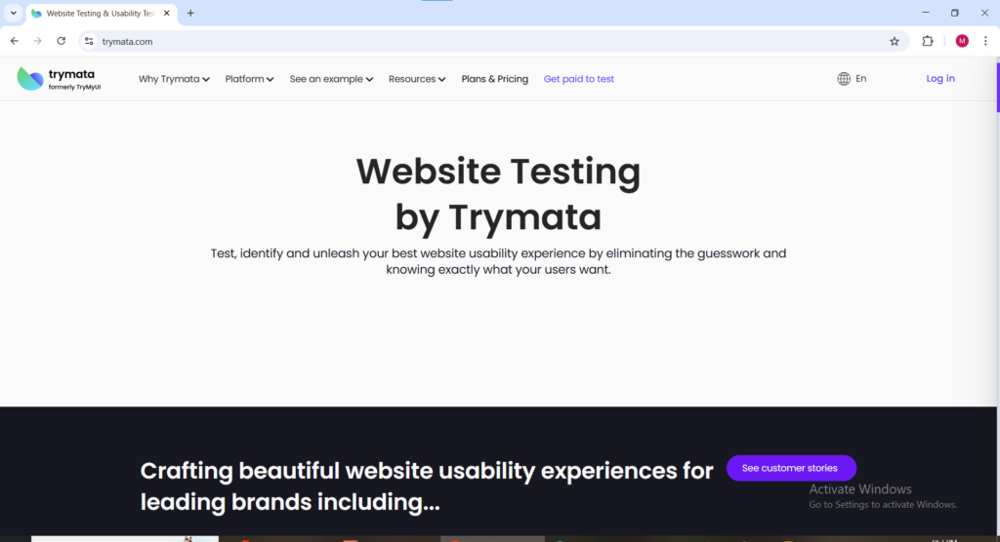
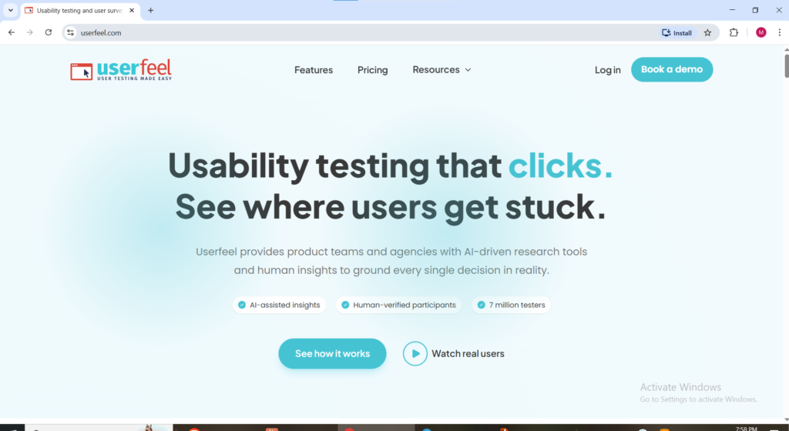

Have you ever visited a website and immediately thought this is confusing, this button is in the wrong place, or why is this so slow? Companies need to know exactly that. They need real people with real reactions telling them what is working and what is not before millions of customers experience the same frustration. That feedback is worth real money to them and getting paid to test websites is how you collect it.

Getting paid to test websites is one of the most straightforward online earning opportunities available in 2026. No special qualifications required. No inventory to manage. No content to create. You visit a website, complete a set of tasks, share your honest thoughts out loud, and get paid for being a normal human being with genuine reactions. Tests typically take between 15 and 30 minutes and pay between $10 and $60 per session depending on the platform and the complexity of the test.

The honest reality upfront getting paid to test websites is not a full-time income replacement. Test availability on most platforms is inconsistent and some weeks are busier than others. The strategy that works is signing up for multiple platforms simultaneously so you are never dependent on one source. This guide covers every verified platform where you can get paid to test websites in 2026, what each one pays, and exactly what the work involves so you know what to expect before you sign up.

* * *

**What Does Website Testing Actually Involve**

When companies hire testers they are paying for one specific thing your real-time honest reactions as a genuine user. You are not being paid to be an expert. You are being paid to be a normal person who can articulate what they are thinking and feeling as they use a website or digital product for the first time.

A typical website testing session works like this. You receive a test invitation from the platform. You accept it and open the website or app you are being asked to test. You are given a set of tasks to complete such as finding a specific product, completing a checkout process, or navigating to a particular page. As you complete these tasks you speak your thoughts out loud what you notice, what confuses you, what you expected to happen versus what actually happened. Your screen and audio are recorded simultaneously. Once you submit the completed recording you receive payment after the session is reviewed and approved.

The reason companies pay for this is simple. A single confusing step in a checkout process can cost a business thousands of lost sales daily. Your 20 minutes of honest feedback identifying that problem is worth far more to them than what they pay you for it. That value gap is why getting paid to test websites is a legitimate and sustainable earning opportunity in 2026.

* * *

**What You Need to Get Started**

Getting paid to test websites requires minimal setup compared to most online earning methods. You need a computer or smartphone depending on the platform. You need a stable internet connection. You need a working microphone for audio recording most modern laptops have built-in microphones that are adequate. You need a quiet workspace where background noise will not interfere with your recording. Most platforms also require a PayPal account for receiving payment. Some platforms additionally require a webcam for certain test types though this is not universal.

**BELOW ARE TEN WEBSITES THAT PAY YOU TO TEST APPS AND WEBSITES**,

* * *

1. **UserTesting** [usertesting.com](http://usertesting.com)

UserTesting is the most established and widely recognized platform for getting paid to test websites and has been operating since 2007. The client list includes Fortune 500 companies like Samsung and Lowe's as well as fast-growing companies like Grammarly meaning the tests you complete are feeding feedback directly into products used by millions of people globally. To get started on UserTesting you create a profile and complete a sample test which the platform reviews to decide whether to approve you. If approved you gain access to paid tests in your dashboard. Tests on UserTesting typically take 10 to 20 minutes and pay around $10 per completed session. Longer and more complex tests pay proportionally more. Payment is processed via PayPal after each approved test.

The honest caveat worth knowing before you sign up, The sample test dashboard initially shows many available tests but after approval the actual available test volume is significantly lower. Some testers report getting a couple of tests per day while others go days without a new invitation. Treat UserTesting as one platform in a diversified portfolio of getting paid to test websites rather than your sole income source.

<figure>

<figcaption>

**USERTESTING WELCOME PAGE**

</figcaption>

</figure>

* * *

2\. **User Interviews** [userinterviews.com](http://userinterviews.com)

User Interviews operates at a higher pay bracket than most platforms where you can get paid to test websites. Rather than quick 15-minute usability clips User Interviews focuses on longer research sessions including in-depth interviews, diary studies, prototype tests, and product feedback sessions that frequently pay between $75 and $150 per hour. The higher pay reflects the higher investment of time and depth of feedback required from participants.

Getting paid to test websites through User Interviews works differently from other platforms. You apply to specific studies that match your demographic and background rather than accepting tests from a general pool. Many studies involve a live session with a moderator or researcher which is why payouts are significantly higher than automated testing platforms. Incentives are typically issued within one to two days of completing a session though some studies can take up to ten business days. If you are comfortable being interviewed and giving detailed structured opinions in real-time, User Interviews consistently offers the best hourly rate of any platform in the getting paid to test websites space.

* * *

3\. **Userlytics** [userlytics.com](http://userlytics.com)

Userlytics is one of the most globally accessible platforms for getting paid to test websites accepting testers from countries around the world rather than limiting participation to a handful of English-speaking markets. Tests on Userlytics typically take between 10 and 20 minutes and pay $10 per completed session via PayPal seven days after the test is approved. The platform records your screen and audio simultaneously as you complete website testing tasks and speak your thoughts.

What stands out about Userlytics for anyone looking to get paid to test websites globally is the international acceptance policy. Most premium website testing platforms limit their tester base to US, UK, and a handful of Western markets. Userlytics actively recruits testers from a much broader range of countries making it one of the most accessible platforms for getting paid to test websites regardless of where you are located in the world.

* * *

4\. **TesterWork** testerwork.com

TesterWork has built a community of over 100,000 testers globally and positions itself as one of the most inclusive platforms for getting paid to test websites regardless of geographic location or technical background. Companies using TesterWork include well-known brands across technology, retail, and finance sectors. Tests cover websites, mobile apps, and digital products across desktop and mobile devices.

Getting paid to test websites on TesterWork involves completing functional tests where you check whether specific features work correctly as well as usability tests where you evaluate the overall user experience. The platform pays in credits that convert to cash withdrawable via PayPal. TesterWork is particularly well suited for beginners getting started with website testing because the onboarding process is straightforward and the test guidelines are clearly explained before each session begins.

* * *

5\. **uTest** utest.com

uTest is in a different league from most platforms where you can get paid to test websites because the earning potential is genuinely significant for experienced testers. The platform serves major clients including Uber, Starbucks, and McDonald's and the work primarily involves finding bugs in websites, apps, and software rather than providing general usability feedback. Testers on uTest earn an average of $5 per verified bug they find and experienced testers in the community report earning $3,000 or more per month an income level no other website testing platform comes close to matching.

The path to those earnings is not immediate. uTest has a rating system where new testers start at the lowest tier and progress by consistently submitting high-quality detailed bug reports. The platform has its own courses, forums, and community resources to help testers improve their bug-finding skills over time. If you are willing to invest time learning the technical side of website testing and build your rating systematically, uTest offers by far the highest long-term earning potential of any platform in the getting paid to test websites space.

6\. **Respondent** [respondent.io](http://respondent.io)

Respondent sits alongside User Interviews at the premium end of the getting paid to test websites market. The platform focuses on paid research studies, interviews, and feedback sessions that pay between $100 and $700 per hour numbers that reflect the high value companies place on expert and professional participant feedback. Respondent specifically seeks out participants with professional backgrounds and specialist expertise in fields like medicine, law, finance, technology, and marketing because companies conducting research on professional tools and enterprise software need testers who actually use those products in real work contexts.

Getting paid to test websites through Respondent requires you to apply to individual studies that match your professional background and demographic profile. Not every application results in selection but the sessions you do qualify for pay at rates that make the occasional rejection worthwhile. Payment is processed via PayPal or bank transfer after session completion. If you have professional experience in any field Respondent is the platform most likely to pay you premium rates that reflect the genuine value of your specific expertise.

* * *

7\. **Trymata** trymata.com

Trymata is a usability testing and survey platform that combines getting paid to test websites with additional survey earning opportunities in one place. The platform is built around providing feedback on websites and digital products and rewards testers for sharing genuine honest reactions rather than trying to give answers they think the company wants to hear. Trymata is straightforward to join and the test guidelines are clearly communicated before each session begins making it one of the more beginner-friendly options for anyone new to getting paid to test websites.

The platform processes payments via PayPal and has built a reputation for reliability and transparency in how it communicates test requirements and compensation to participants. Adding Trymata to your portfolio of website testing platforms gives you an additional source of test invitations that supplements the income from larger platforms on days when availability on other platforms is slow.

* * *

8\. **UserFeel** [userfeel.com](http://userfeel.com)

UserFeel is a straightforward platform for getting paid to test websites that accepts testers globally and pays $10 per completed test via PayPal as soon as the test is approved. Tests take approximately 10 to 15 minutes and follow the standard website testing format complete tasks on a website while speaking your thoughts out loud with screen and audio recording running. To get started on UserFeel you create a profile and complete a sample test to demonstrate your testing quality. If approved you receive paid test invitations when sessions matching your demographic profile become available.

UserFeel stands out for its global acceptance policy and fast payment processing. The combination of immediate PayPal payment upon approval and worldwide tester eligibility makes it one of the most accessible entry points for getting paid to test websites regardless of where you are based. Test frequency varies depending on your location and demographic profile but the platform is a reliable supplementary income source when added alongside higher-volume platforms.

9\. **Enroll** [enrollapp.com](http://enrollapp.com)

Enroll differentiates itself from other platforms where you can get paid to test websites in one meaningful way it does not require a microphone or webcam to participate. This makes it one of the most accessible website testing platforms available to people who do not have recording equipment or who prefer not to record audio during testing sessions. Tests on Enroll are typically shorter and more task-focused than audio-based testing platforms and pay proportionally for the reduced time investment.

For testers who are uncomfortable speaking their thoughts out loud during recorded sessions or who do not have access to a microphone, Enroll provides a genuine alternative path to getting paid to test websites without that requirement. The platform is straightforward to join and test instructions are clearly provided before each session.

* * *

10\. **Prolific** [prolific.com](http://prolific.com)

Prolific is primarily known as a research and survey platform but it belongs on this list because it regularly features website and digital product testing studies among its available tasks and it pays significantly better than most dedicated website testing platforms. Studies on Prolific targeting specific demographics for website feedback sessions regularly pay the equivalent of $8 to $15 per hour with some specialist studies paying considerably more.

What makes Prolific particularly valuable for getting paid to test websites is the consistency of available studies and the platform's exceptional reputation for always paying promptly and treating participants fairly. Unlike dedicated website testing platforms where test availability can be sporadic, Prolific maintains a steady flow of research studies across a wide range of topics including digital product testing. For anyone already using Prolific for survey work who wants to expand into website testing, the platform provides both in one place.

* * *

**How to Maximize Your Earnings from Website Testing**

Getting paid to test websites rewards consistency, quality, and diversification above everything else. Here is what the most successful website testers consistently do differently from those who earn sporadically.

Sign up for every platform on this list simultaneously rather than testing one at a time before moving to the next. Each platform has different test availability and different client bases. Being registered on all of them means you receive invitations from the widest possible pool of available tests every day rather than depending on one platform's availability.

Complete your profile thoroughly and honestly on every platform. Your demographic information e.g age, location, occupation, income bracket, technology usage habits determines which tests you get invited to. Accurate profiles match you to tests you are genuinely qualified for and increase your invitation frequency over time. Inaccurate profiles result in screener rejections that lower your standing on the platform and reduce future invitations.

Treat every test like a professional assignment. Speak clearly and continuously throughout the session explaining your thought process even during moments when you are not sure what to do. The companies reviewing your recordings are specifically looking for natural honest reactions where you hesitate, what confuses you, what you expected versus what happened. Testers who provide rich detailed verbal feedback consistently receive higher ratings and more frequent invitations than those who complete tasks silently.

Respond to test invitations quickly. Popular studies fill up within minutes of being posted on most platforms. Checking your email and platform dashboards regularly particularly in the morning and early afternoon when most new tests are posted gives you the best chance of securing tests before they are claimed by other testers.
