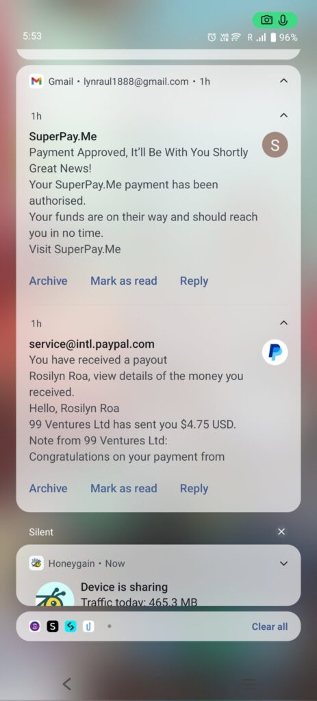
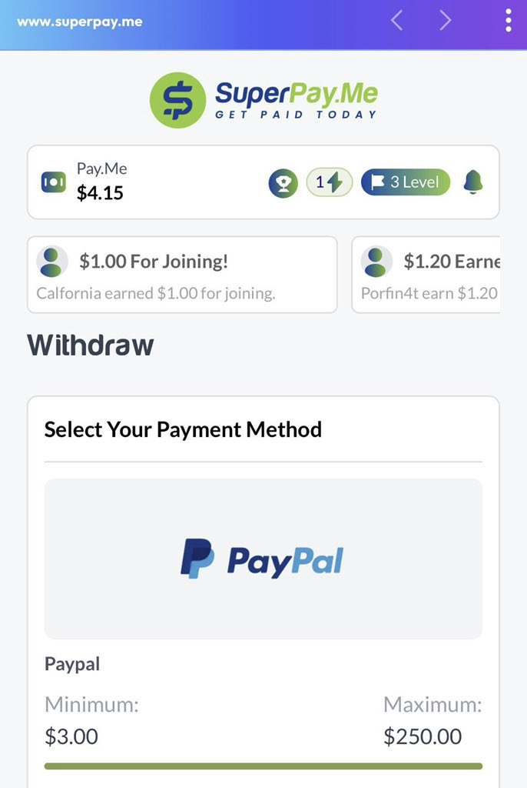
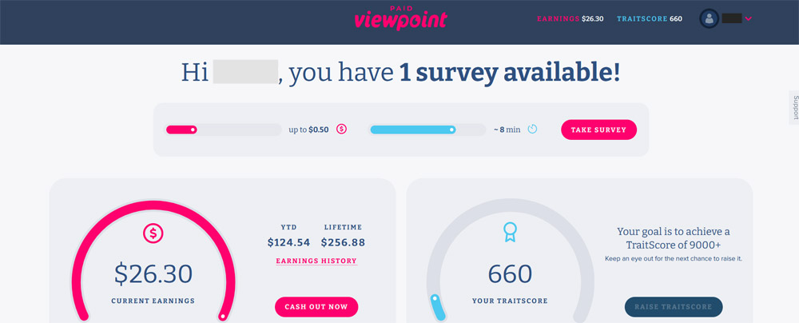
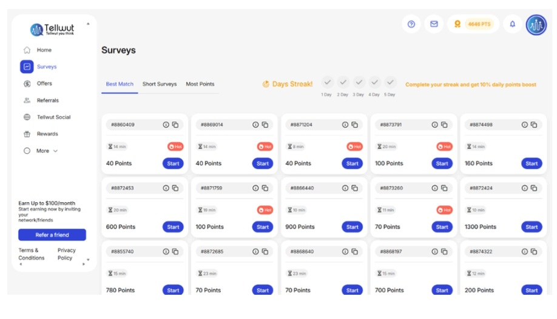
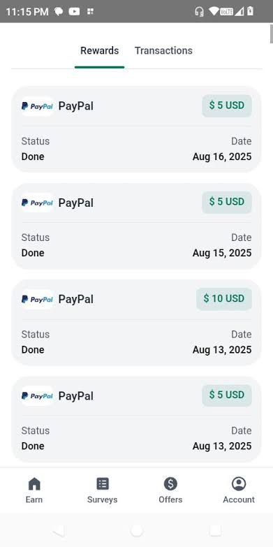
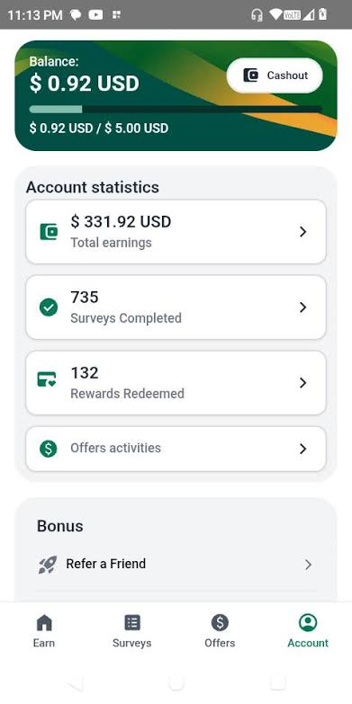
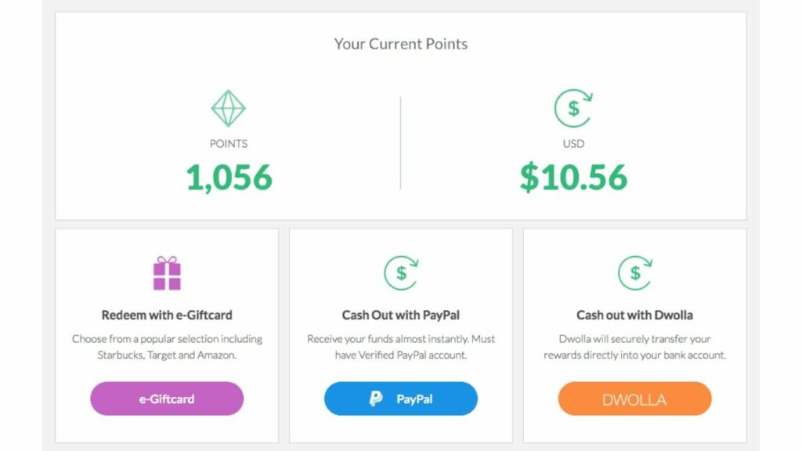
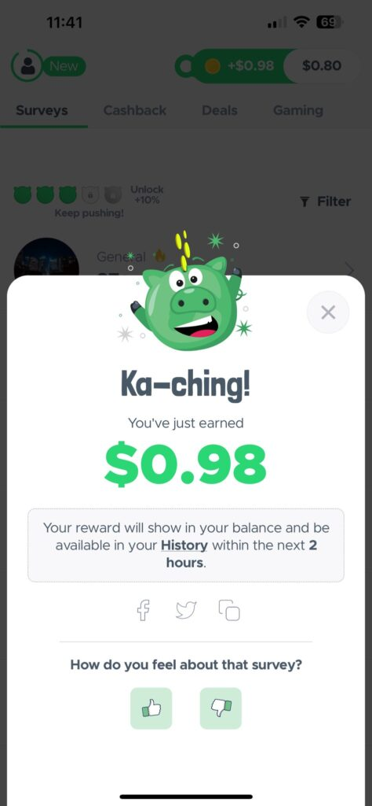
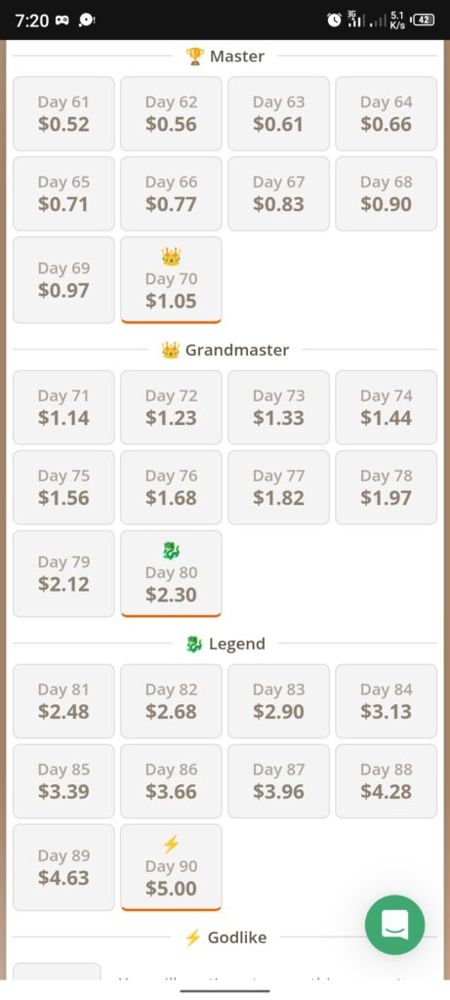
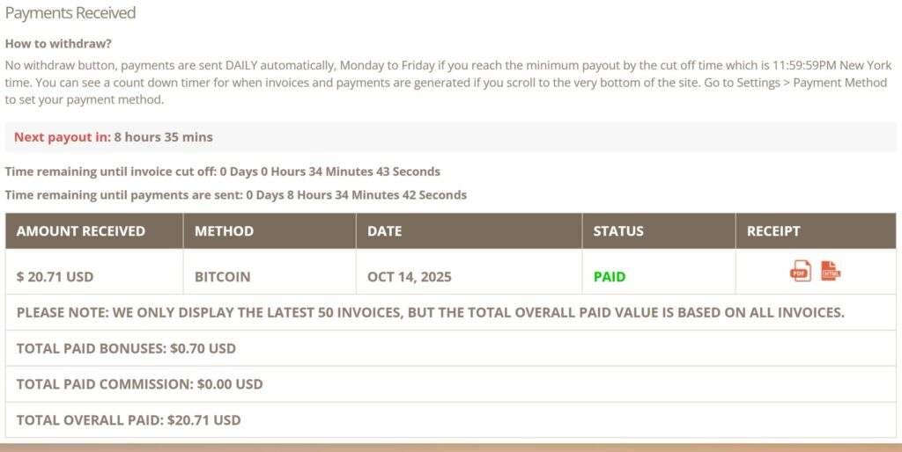

1. **LEO (Leger Opinion)** [leo.leger.com](http://leo.leger.com)

LEO is Canada's largest market research firm, providing exclusively Canadian-focused surveys covering politics, consumer trends, and social issues — meaning the surveys Canadian members receive are more engaging and locally relevant than generic global platforms. When you see "New Poll Shows 60% of Canadians..." on CBC News, the data often comes from LEO users — so your opinions are genuinely shaping national conversations. LEO offers up to $35 CAD per survey, has over 400,000 Canada-based members, and has paid over $20 million to Canadian panelists. Payout options include PayPal, Aeroplan points, Uber, Tim Hortons, Starbucks, Walmart Canada, and Amazon Canada gift cards. Minimum cashout is $20.

* * *

2\. **Survey Junkie** [surveyjunkie.com](http://surveyjunkie.com)

Survey Junkie is one of the most popular survey platforms available to Canadians, with over 20 million members globally and a payout of $1,000,000 every month to its members. The minimum payout threshold for Canadian members is just $5 via PayPal making it one of the lowest barriers to getting paid on the entire Canada list. The platform excels at pre-qualifying Canadian users before starting surveys, reducing the frustrating experience of getting screened out halfway through a questionnaire. Canadian members aged 16 and older are welcome to join. Fill in your profile completely when you sign up — it is the single biggest factor determining how many surveys you receive daily in Canada.

* * *

3\. **Google Opinion Rewards** [surveys.google.com/google-opinion-rewards](http://surveys.google.com/google-opinion-rewards)

Google Opinion Rewards is the most trusted survey app on this Canada list because it is made by Google. Canadian users simply download the free app, complete a short profile, and start receiving surveys directly on their phone.

Surveys are very short, usually under one minute, and cover topics like opinions, hotels, and shopping. They pay between $0.10 and $0.30 each with a low $2 minimum cashout via PayPal, often arriving within 30 minutes.

However, survey frequency is low and inconsistent for most Canadian users. Some get surveys a few times a week while others receive almost none.

Think of it as a background app that quietly adds small amounts to your PayPal. It works best when combined with higher volume platforms rather than as your main earning source. Its simplicity and reliability still make it worth installing.

* * *

4\. **Branded Surveys** [brandedsurveys.com](http://brandedsurveys.com)

Branded Surveys is one of the top survey panels available to Canadian residents, has paid out over $70 million globally, and has over 3 million users making it one of the most financially proven platforms Canadians can join. The loyalty tier system rewards consistent Canadian users with Bronze, Silver, and Gold levels that unlock bonus points and access to higher-paying surveys over time. Canadian users are paid in USD but when withdrawing through PayPal the amount is automatically converted to CAD based on current exchange rates. Minimum cashout is $5 making it easy for Canadians to see real money early without a long wait.

* * *

5\. **SuperPay.Me** [superpay.me](http://superpay.me)

SuperPay.Me has a payout threshold of just $1 making it one of the fastest-paying survey sites available to Canadian members — you can request a withdrawal almost immediately after starting on the platform. Surveys pay an average of $1 to $1.50 each but some Canada surveys pay up to $10, and Canadian members can also earn by watching videos, playing games, and referring friends. Payment options include PayPal, Skrill, Bitcoin, and Amazon gift cards. The $1 cashout threshold alone makes SuperPay.Me worth signing up for as a Canadian — it completely removes the frustration of watching a balance sit untouched for weeks before hitting a high minimum.

* * *

6\. **PaidViewpoint** [paidviewpoint.com](http://paidviewpoint.com)

PaidViewpoint is one of the few globally top-rated survey platforms that has genuine survey opportunities specifically for Canadian members. It pays in real cash rather than confusing points, uses a TraitScore system to personalise survey matches for Canadian users over time, and has a low minimum cashout via PayPal. Canadian members who stick with the platform long term consistently report improvements in both survey quality and frequency as their TraitScore builds — meaning the longer you use it in Canada the more valuable it becomes. If you want one simple, honest, no-gimmick survey platform in Canada, this is it.

* * *

7\. **Ipsos iSay** [i.say.com](http://i.say.com)

Ipsos iSay has conducted more than 25 million studies worldwide and gives Canadian members a direct say on global brands that operate in the Canadian market. What makes it stand out for Canadians specifically is the charity donation option — Canadian members can convert their points into cash donations to the Canadian Red Cross, Doctors Without Borders, Habitat For Humanity, Heart and Stroke Foundation, UNICEF, Ronald McDonald House, or The Nature Conservancy Canada. Rewards also include gift cards from Amazon Canada, iTunes, Starbucks, and Cineplex, or direct PayPal cashout. A trusted and socially conscious option for Canadian survey takers who want their earnings to do more than just sit in a PayPal account.

* * *

8\. **Tellwut** [tellwut.com](http://tellwut.com)

Tellwut is a community-driven survey platform primarily available to residents of Canada and the USA, and has been one of the top-rated Canadian survey platforms for nine consecutive years. What makes it genuinely different for Canadian members is the ability to create your own surveys and receive responses from other members — something almost no other Canada-based platform offers. Canadian members receive a joining bonus after signing up and can earn extra points for each survey they create themselves. Minimum cashout is $10 via a wide selection of gift cards or $5 via PayPal. A great choice for Canadians who want a more interactive survey experience beyond just answering questions.

* * *

9\. **TopSurveys** [topsurveys.app](https://cashsuccess.online/sample-page/)

TopSurveys is one of the newer players in the survey space but has quickly built a large following thanks to one bold marketing claim — fewer disqualifications than any other platform. The reality is slightly more nuanced than the advertising suggests, but the core experience is genuinely better than most survey sites when it comes to getting through surveys without being screened out halfway.

Surveys on TopSurveys display their payout in actual dollar values rather than confusing points, so you always know exactly what you are earning before you start. Payouts range from $0.30 to around $1.90 per survey depending on length and topic, and the first survey is a short two-minute introduction that pays $1 immediately. Beyond surveys the platform also offers game-based earning tasks, though the game offers have attracted more complaints than the surveys themselves so stick to the survey side for more reliable credits.

The minimum for your first cashout is $5 and drops to $1 after that, with payment processed almost instantly via PayPal, Revolut, or a wide range of gift cards. The platform is available in over 40 countries making it accessible to a global audience regardless of where you are reading this.

One thing to be aware of — while TopSurveys has significantly fewer screenouts than traditional survey platforms, disqualifications do still happen occasionally despite what the marketing says. When they do, the platform typically gives you a small consolation reward for your time which is more than most platforms offer. Stick to the surveys, cash out regularly, and set realistic expectations and TopSurveys is a genuinely solid addition to your survey rotation.

* * *

* * *

10\. **MyPoints** [mypoints.com](https://cashsuccess.online/sample-page/)

MyPoints has been around since 1996 making it one of the oldest earning platforms available to Canadians, and members can get up to 40 percent cashback on purchases at more than 2,000 big name retailers including Walmart Canada, Best Buy, Home Depot, and Amazon Canada. The shopping cashback angle is what separates MyPoints from pure survey platforms for Canadian users — you are earning on purchases you would make anyway without doing anything extra. Canadian members can get an Amazon gift card when they have earned just $3, while PayPal cashout requires a $25 minimum. A great passive earning companion for Canadians who already shop online regularly.

* * *

11\. **ySense** [ysense.com](http://ysense.com)

ySense, formerly known as ClixSense, offers Canadian members several ways to earn with surveys being the most straightforward, supplemented by an offer wall and Figure Eight tasks that come with strong bonuses for regular Canadian participants. The daily activity bonus rewards Canadian members simply for logging in and staying consistent — something many platforms in Canada do not offer. In Canada you can choose between PayPal, Skrill, and Amazon gift cards as payout methods, and the platform regularly introduces new payment options for Canadian users. A reliable multi-earning platform with strong payout flexibility for Canadian members.

* * *

12\. **Toluna** [ca.toluna.com](http://ca.toluna.com)

Toluna has a dedicated Canadian survey panel and markets itself to younger Canadian earners, encouraging community growth beyond just answering surveys. Canadian members can earn points by voting on sponsored polls, playing games, creating content, and referring friends — making it one of the more socially engaging platforms on this Canada list. The surveys Toluna sends Canadian members tend to involve larger and more well-known brands, which makes the experience more interesting than answering generic consumer questions. Points redeem as e-vouchers or PayPal cash, though processing can be slower than some other Canada platforms.

* * *

13\. **InboxDollars** [inboxdollars.com](http://inboxdollars.com)

InboxDollars pays cash not points which psychologically feels more rewarding for Canadian members — what you see on your Canada dashboard is exactly what you will receive when you withdraw, with no confusing conversion math involved. Canadian members can earn through surveys, watching videos, reading emails, and completing other small tasks. The $5 welcome bonus for new Canadian sign-ups helps offset the higher minimum withdrawal threshold, and multiple earning streams keep income flowing even on slow survey days in Canada. Payout is via PayPal, gift cards, or cheque.

* * *

14\. **Prime Opinion** [primeopinion.com](http://primeopinion.com)

Prime Opinion is one of the highest-paying survey sites available in Canada, offers a joining bonus of up to $6.70 CAD after signing up, and once you request a payout you will be paid within 30 minutes. That 30-minute payment window is genuinely rare in the Canadian survey space and makes Prime Opinion one of the fastest-paying platforms Canadian members can access anywhere. Canadian payout options include PayPal, virtual Visa card, Walmart Canada, Uber, Lyft, WestJet, lululemon, and Home Depot gift cards — a locally thoughtful Canadian selection that most global platforms do not offer. A top recommendation for Canadians who prioritise speed of payment above everything else.

* * *

* * *

16\. **Pinecone Research** [pineconeresearch.com](https://cashsuccess.online/sample-page/)

Pinecone Research Canada is a legitimate and high-paying survey option that stands out for one simple reason — every survey pays a guaranteed flat rate of $3 CAD regardless of length, making it the most predictable earning platform on this entire Canada list. At $3 per 15-minute survey it offers the best hourly rate equivalent among all survey platforms available to Canadian members. Payments are processed within three to five business days and the minimum payout is just $3 via PayPal or cheque. Surveys arrive via email so Canadian members can complete them on their own schedule without constantly logging into a dashboard.

* * *

17\. **Qmee** [qmee.com](http://qmee.com)

Qmee has no minimum withdrawal for Canadian members meaning you can complete a five-minute survey and cash out to PayPal immediately — the money hits your account within seconds of requesting it. That instant payout with zero threshold is genuinely unmatched among survey platforms available in Canada. Canadian users consistently praise it as the only app that pays partial rewards even if you get disqualified late in a survey — a small but deeply appreciated feature that sets it apart from every other platform on this Canada list. Beyond surveys, Canadian members can also earn by answering trivia and browsing the web with the Qmee browser extension.

* * *

18\. **Timebucks** [timebucks.com](http://timebucks.com)

Timebucks automatically pays Canadian members once per week when they have earned just $3, with payment options including crypto, PayPal, Skrill, AirTM, and bank transfer — one of the broadest payout selections of any platform available in Canada. Beyond surveys, Canadian members can earn by viewing online content, completing offers, watching videos, and clicking ads — meaning there is always something available regardless of how many surveys arrive on any given day in Canada. The weekly automatic payout is a genuinely convenient feature that removes the need to manually request withdrawals. A strong choice for Canadians who want consistent weekly income from multiple earning methods.

* * *

19\. **Opinion Outpost** [opinionoutpost.com](http://opinionoutpost.com)

Opinion Outpost has a dedicated Canadian variant of its platform and averages over $520,000 CAD in monthly payouts with more than 3 million survey starts every month — numbers that speak directly to how active and legitimate the Canadian panel is. Each survey takes anywhere from 5 to 25 minutes with longer surveys offering higher incentives, and Canadian members can redeem points for gift cards or cash paid directly through PayPal. One Opinion Outpost point equals 10 cents CAD. Keeping your Canadian profile up to date is essential — it directly determines the relevance and frequency of surveys you receive from the platform every week.

20\. **Swagbucks** [swagbucks.com](http://swagbucks.com)

Swagbucks members in Canada have collectively cashed out over $660 million in rewards globally, and new Canadian sign-ups receive a $10 bonus instantly upon joining. Beyond surveys, Canadian members can earn by watching videos, playing games, searching the web, and shopping online — meaning there is always a way to earn even on days when surveys are slow. The referral program gives Canadians a $5 bonus for every friend they refer plus 10% of that friend's earnings for life. Minimum cashout for Canadian members is $25 via PayPal or a wide range of Canadian-friendly gift cards including Walmart Canada and Amazon Canada.

If this helped you, share it with a friend who's looking to make money online, one link could change their financial situation.
