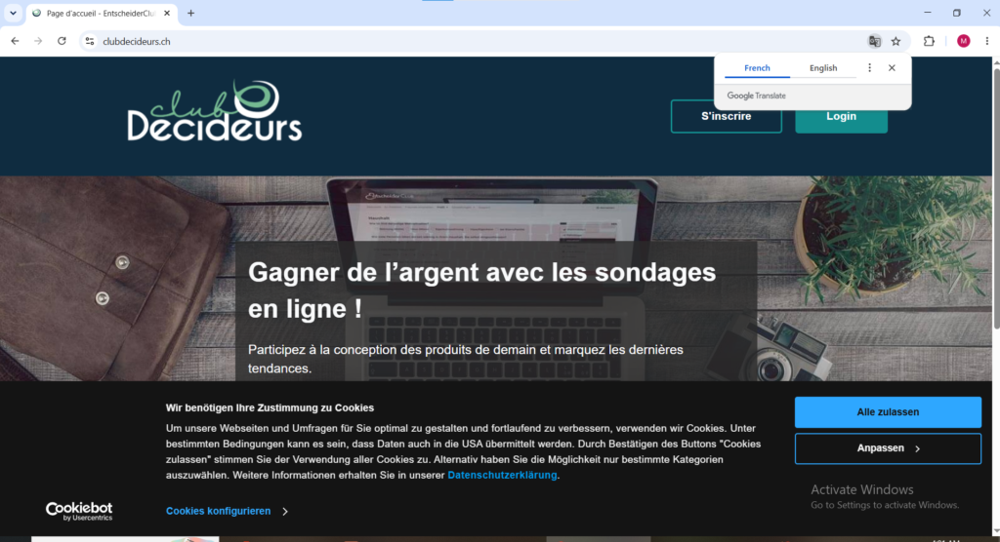
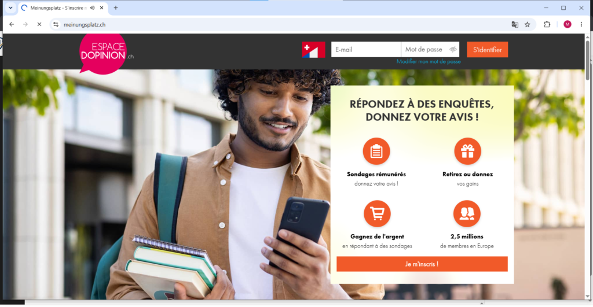
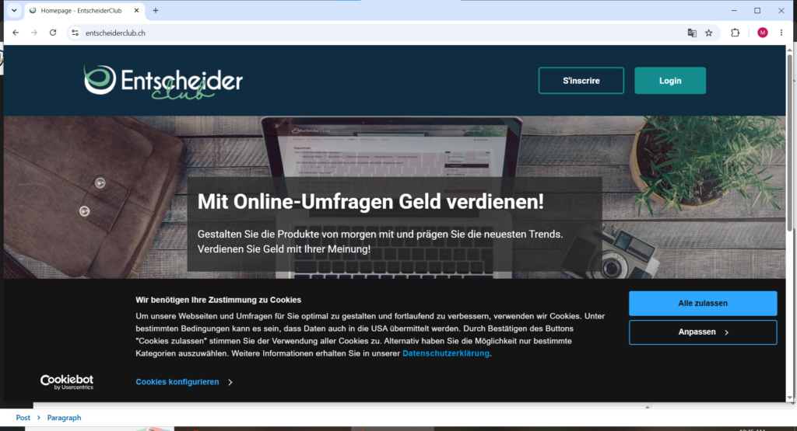
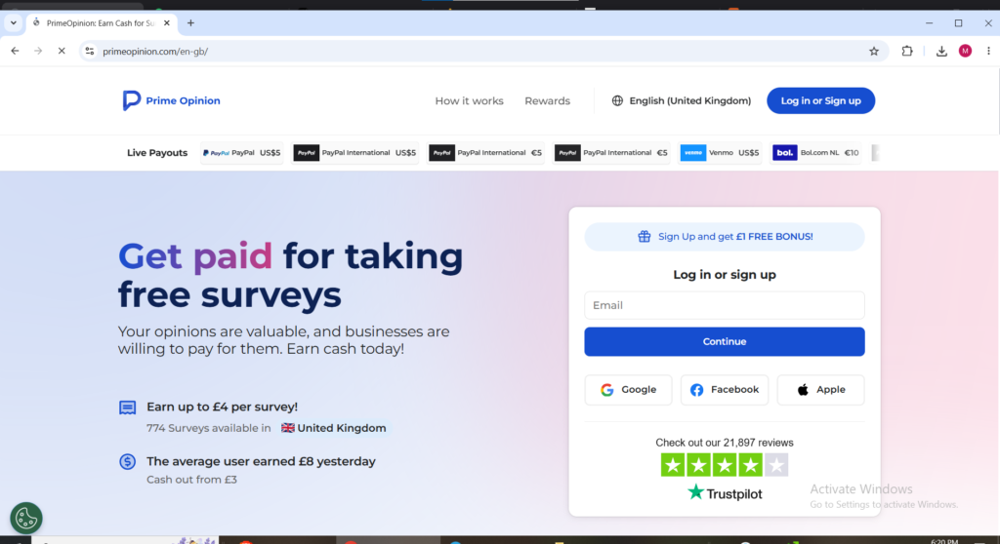
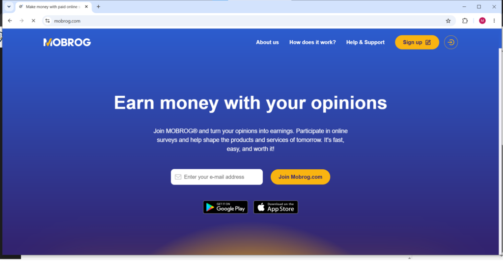
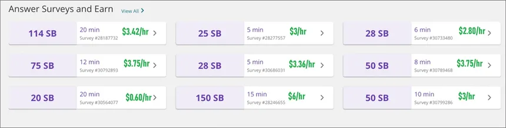
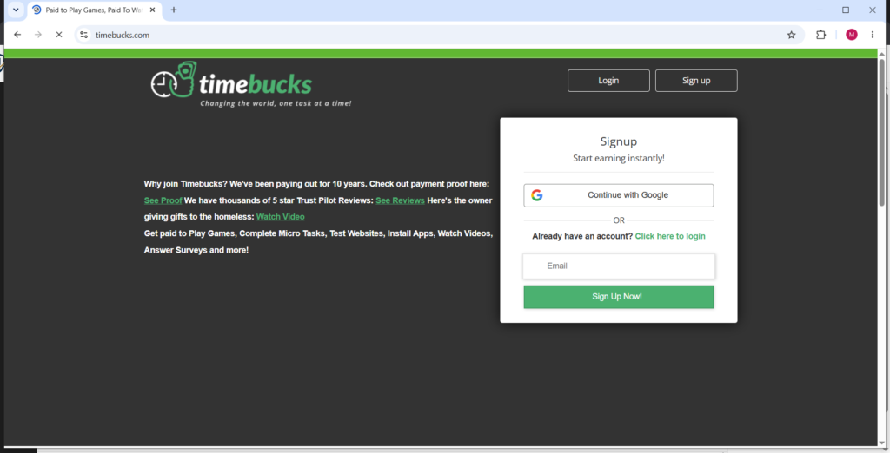

Switzerland consistently ranks among the highest income countries in the world with a median salary of CHF 7,024 per month and yet a growing number of Swiss residents are turning to survey Switzerland platforms to build meaningful supplementary income on top of their regular earnings. The cost of living in Switzerland is among the highest in Europe which means every additional CHF earned through legitimate survey Switzerland opportunities has real purchasing power. Whether you are a student in Zurich, a professional in Geneva, or a resident in Basel looking to earn something extra in your spare time, paid surveys in Switzerland offer one of the most accessible side income options available in 2026 with no investment, no technical skills, and no fixed schedule required.

### This guide covers every verified survey Switzerland platform available to Swiss residents in 2026

- 11 Online survey platforms in Switzerland

- What each one pays in CHF, how payment reaches your Swiss bank account or PayPal

- The practical details that separate the survey Switzerland platforms worth your time from those that waste it.

- How to Maximize Survey Switzerland Earnings in 2026

- My Personal Advice to make you stand out.

* * *

## An Important Note for Swiss Survey Takers

Before signing up for any survey Switzerland platform it is important to understand one practical reality that affects every Swiss resident entering this space. The majority of dedicated survey Switzerland platforms that specifically target the Swiss market conduct their surveys in French, German, or Italian the three official languages of Switzerland. Residents who speak at least one of these languages have access to the full range of Switzerland-specific survey opportunities available. English-only speakers are limited to international survey Switzerland platforms that operate globally without requiring local language proficiency. Both groups are well served by this guide, Swiss-specific platforms are listed first followed by international survey platforms that fully accept Switzerland residents regardless of language background.

* * *

## Best Survey Sites in Switzerland in 2026

**Ampuls**

Website: [ampuls.ch](https://ampuls.ch)

Ampuls is the most established and recommended survey platform for Swiss residents. With over 20 years in operation, it is the one Swiss users consistently return to for reliable earnings.

Surveys on Ampuls pay between 1 CHF and 5 CHF each and typically take 5 to 15 minutes. Once you reach 10 CHF, the platform automatically transfers the full amount to your Swiss bank account without any manual withdrawal request.

Surveys are available in German and French. The platform also occasionally offers higher paying special studies including webcam sessions. For anyone in Switzerland starting with paid surveys, Ampuls is the best starting point.

<figure>

<figcaption>

Ampuls welcome page

</figcaption>

</figure>

* * *

**Clubdecideurs.ch**

Website: [clubdecideurs.ch](https://clubdecideurs.ch)

Clubdecideurs.ch stands alongside Ampuls as one of the two most recommended Switzerland-specific survey platforms. It is managed by GapFish GmbH, a reputable Berlin-based market research company, which gives it strong credibility.

The platform is specifically designed for French-speaking Swiss residents in cantons such as Geneva, Vaud, Neuchâtel, Fribourg, Valais, and Jura. Surveys are culturally relevant rather than generic.

Completed surveys pay cash directly or allow users to donate earnings to charity. For French-speaking Swiss residents, it is the most relevant survey platform available in 2026.

* * *

**Espace d'Opinion (Meinungsplatz)**

Website: [meinungsplatz.ch](https://meinungsplatz.ch)

Espace d'Opinion known as Meinungsplatz in German is one of the largest dedicated survey Switzerland platforms with approximately 45,000 Swiss members making it one of the most active local survey communities in the country. The platform has been operating in Switzerland since 2008 and has built a consistent reputation among Swiss survey takers for straightforward survey experiences and reliable payments directly to Swiss bank accounts.

Each survey Switzerland session on Espace d'Opinion pays between 1 CHF and 2.50 CHF and the minimum cashout threshold of 15 CHF is reached within a few weeks of regular participation. Payment goes directly to a Swiss bank account or can alternatively be donated to a partner charity of the participant's choice. The platform is available in both French and German making it accessible to the majority of Switzerland residents regardless of which language region they live in. The clean interface and transparent payment structure make Espace d'Opinion a reliable addition to any Switzerland survey earning portfolio.

* * *

**EntscheiderClub**

Website: [entscheiderclub.ch](https://entscheiderclub.ch)

EntscheiderClub is a survey Switzerland platform operating across Switzerland, Germany, and Austria that has built a solid reputation among Swiss survey takers for consistently paying out earnings without delays or complications. The platform focuses on consumer opinion surveys covering products, services, and brands relevant to the Swiss and broader German-speaking European market. Surveys on EntscheiderClub are conducted in German making it most suitable for German-speaking Switzerland residents in cantons like Zurich, Bern, Basel, and Lucerne.

Payment for Switzerland survey completions on EntscheiderClub is processed directly to a PayPal account linked to the participant's registered email address. The payment model has been updated in recent years to use PayPal rather than IBAN bank transfer which makes it faster and more accessible for Swiss residents who already have PayPal accounts set up for other online earning activities. EntscheiderClub is a straightforward and legitimate survey Switzerland option that works best as a supplementary platform alongside Ampuls and Espace d'Opinion for German-speaking Swiss residents.

* * *

**Prime Opinion**

Website: [primeopinion.com](https://primeopinion.com) Available as: Website and Mobile App (iOS and Android)

Prime Opinion is one of the newest survey Switzerland platforms available to Swiss residents and has quickly built a strong reputation for paying more per survey than most comparable platforms. The survey Switzerland experience on Prime Opinion is available in both German and French and the platform has specific Swiss panels in both languages allowing residents to choose their preferred language when signing up.

The minimum payout threshold on Prime Opinion for Switzerland is just CHF 4 — one of the lowest of any survey Switzerland platform on this list — making it one of the fastest platforms to see real earnings reach a withdrawal point. Payment is processed via PayPal or a wide range of gift cards and arrives quickly after each withdrawal request. New Switzerland residents joining Prime Opinion receive a joining bonus immediately upon signup which means the first CHF can be earned before completing a single survey. For Swiss residents who want a modern well-designed survey Switzerland platform that pays competitive rates and cashes out quickly Prime Opinion is one of the strongest options available in 2026.

* * *

**YouGov Switzerland**

Website: [ch.yougov.com](https://ch.yougov.com) Available as: Website and Mobile App (iOS and Android)

YouGov is one of the most respected research organizations globally and operates a strong survey panel in Switzerland. Participants answer questions on politics, current affairs, consumer brands, and social issues, making the surveys more engaging than typical product-focused ones. The data collected often appears in Swiss national media.

Surveys usually take 5 to 7 minutes and pay between CHF 1 and CHF 2.50 each. The minimum cashout is CHF 10 via PayPal or gift cards. YouGov is available in both German and French and actively recruits across all Swiss language regions.

* * *

**Toluna Switzerland**

Website: [ch.toluna.com](https://ch.toluna.com) Available as: Website and Mobile App (iOS and Android)

Toluna has a specific Switzerland survey panel that tailors its surveys to Swiss consumer culture and market trends rather than sending generic global surveys to Swiss participants. The survey Switzerland experience on Toluna goes beyond standard question and answer sessions — Swiss participants can also vote on polls, play interactive survey games, and engage with a community of fellow survey takers which makes the platform more engaging than purely transactional survey Switzerland alternatives.

Surveys on Toluna Switzerland pay in points that redeem for PayPal cash or gift cards. The platform is available in German and French and Swiss residents consistently report a good volume of available surveys compared to some smaller Switzerland-specific platforms. For Swiss residents who want a survey Switzerland platform with a social community element and consistent survey availability Toluna is a solid choice.

* * *

**MOBROG Switzerland**

Website: [mobrog.com](https://mobrog.com) Available as: Website and Mobile App (iOS and Android)

MOBROG offers a specific Switzerland survey panel that sends Swiss residents surveys tailored to the local market. The survey Switzerland experience on MOBROG is straightforward complete available surveys, earn points, and withdraw when the balance reaches the minimum threshold of $6.25 via PayPal or Skrill. The qualifying rate for MOBROG surveys can be lower than on some other survey Switzerland platforms meaning patience is occasionally required when not every survey invitation results in a qualifying session but the pay rate when surveys are successfully completed is above average compared to many competing survey Switzerland platforms.

<figure>

<figcaption>

Mobrog welcome page

</figcaption>

</figure>

MOBROG operates in multiple languages and Swiss residents can participate in German, French, or English depending on their preference and which survey Switzerland opportunities are currently available. The mobile app makes completing surveys on a Swiss commute or during spare moments throughout the day genuinely convenient.

* * *

**Swagbucks Switzerland**

Website: [swagbucks.com](https://swagbucks.com) Available as: Website and Mobile App (iOS and Android)

Swagbucks has been a trusted name in online earning since 2007 and fully accepts Switzerland residents. Beyond surveys, Swiss users can earn by watching videos, shopping online, playing games, and completing daily tasks. Points can be redeemed for PayPal cash or gift cards in CHF equivalent, and new users receive a joining bonus.

Although it is an international platform, its strong reputation, reliable payments, and multiple earning methods make it a valuable addition to any Switzerland survey portfolio. Surveys are available in English, making it especially useful for English-speaking Swiss residents.

<figure>

<figcaption>

Available surveys on swagbucks

</figcaption>

</figure>

* * *

**Timebucks Switzerland**

Website: [timebucks.com](https://timebucks.com) Available as: Website and Mobile App (iOS and Android)

Timebucks accepts Swiss residents and offers one of the most diverse earning options among survey platforms in 2026. In addition to surveys, users can earn by watching videos, completing social media tasks, signing up for offers, playing games, and referring friends. It has a very low $3 minimum payout threshold via crypto, PayPal, Skrill, or bank transfer.

Timebucks also features a weekly automatic payment system, so earnings are sent automatically once the minimum is reached without manual requests.

It works well as a background income platform for Swiss users who want multiple earning methods combined with reliable automatic payouts.

* * *

**LifePoints Switzerland**

Website: [https://www.lifepointspanel.com/de-ch](https://www.lifepointspanel.com/de-ch)

Available as: Website and Mobile App (iOS and Android)

LifePoints has a dedicated survey panel for Switzerland and supports both German and French. It was created from the merger of GlobalTestMarket and MySurveys, two well-known market research platforms.

Swiss residents receive survey invitations by email and can also browse available surveys on the dashboard.

The platform pays in points that can be redeemed for PayPal cash or gift cards. Thanks to its long history and strong reputation across Europe, LifePoints is considered reliable and makes a solid anchor platform for any Switzerland survey portfolio.

* * *

**How to Maximize Survey Switzerland Earnings in 2026**

Swiss residents who earn the most from paid surveys follow a few key strategies that turn small earnings into meaningful monthly income.

The most important step is signing up for multiple survey platforms at once. Availability fluctuates, so being registered on six or more platforms ensures you always have opportunities.

Completing your profile thoroughly and honestly on every platform is essential. Detailed profiles lead to more frequent and relevant survey invitations.

Swiss residents who speak French, German, or Italian should join both local platforms like Ampuls, Clubdecideurs.ch, and Espace d'Opinion as well as international ones like Swagbucks and Timebucks. This multilingual advantage significantly increases earning potential.

Active users registered on five or more platforms can realistically earn between CHF 50 and CHF 300 per month depending on time invested and profile match. While it won't replace a full salary, it provides a steady, low-effort boost to household income.

**Personal Advice:** Ensure that at least once a day u log into your accounts and refresh the page to send a notification to the providers that you are active and ready to receive surveys
