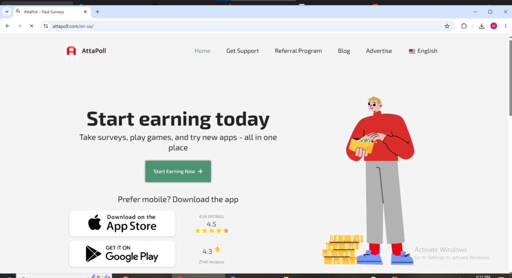
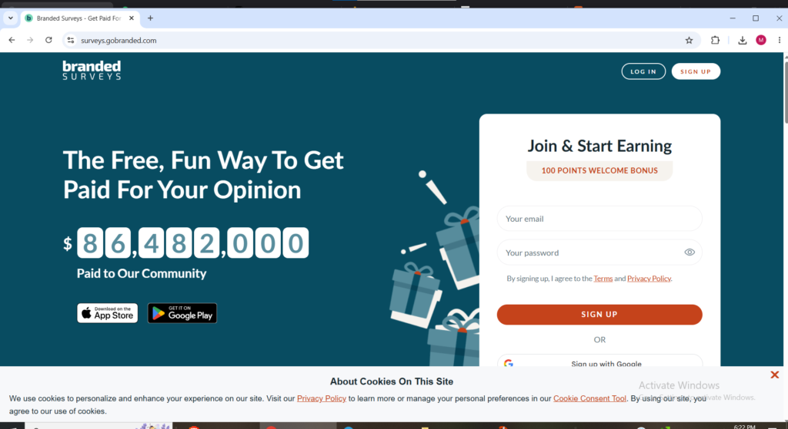

In 2026, earning extra money from the comfort of your home has never been easier or more popular in the UK. Whether you're a busy student, a parent juggling responsibilities, a retiree looking for supplementary income, or a full-time worker wanting to boost your savings, **paid survey sites and apps** offer a legitimate and flexible way to get paid for your opinions.

**When you read this complete guide**, you’ll discover over **18 proven** and legitimate survey sites and apps available to UK users. With smart strategies and consistent effort, **many dedicated participants are earning £500 to £5,000+ per month in extra income** depending on how much time you invest and how effectively you use multiple platforms. This isn’t hype. This is your practical roadmap to turning opinions into PayPal cash, gift cards, and bank transfers.

We've included **detailed reviews of 18 top platforms**, with sign-up links (URLs), how to engage, realistic earnings, withdrawal options, pros/cons, and proven strategies to maximise your income. By the end, you'll have everything needed to start earning today.

### Why Paid Surveys Remain a Top Side Hustle in the UK in 2026

The UK market stays robust due to demand for localised data. AI matching reduces disqualifications on many platforms, and mobile apps make it convenient to earn on the go.

**Realistic earnings**: £50–£400+ per month for consistent users (5–15 hours/week). High-earners on Prolific or active app users (AttaPoll, Prime Opinion) often do better.

**Key benefits**:

- Zero commute and full flexibility

- No special skills required just honesty and spare time

- Payouts mainly via PayPal for quick access to your UK bank account

### 1\. AttaPoll – One of the Best Mobile Survey Apps for UK Users

**Website / App**: [https://attapoll.com/](https://attapoll.com/) or download "AttaPoll – Paid Surveys" on Google Play / App Store.

AttaPoll is a mobile-first app loved by many UK users for its survey volume, low payout threshold, and fast cashouts. It matches you intelligently and shows star ratings to predict qualification chances.

**How to engage**: Download the app, sign up, complete your profile fully, and check for surveys throughout the day. Focus on higher-star surveys to minimise disqualifications. Many users combine it with daily streaks or offers.

**Earnings**: Typically £3–£20+ per hour. Surveys range from quick polls to longer ones paying better.

**Withdrawal**: Low minimum (~£3 / $3 equivalent). Instant or very fast PayPal, Revolut and gift cards (Amazon etc.).

**Best for**: Beginners and mobile users who want quick, hassle-free payouts. Many in the UK call it one of the strongest daily options.

### 2\. Prolific – Still the Highest-Paying for Quality Studies

**Website**: [https://www.prolific.com/participants](https://www.prolific.com/participants) or app.prolific.com

Prolific connects UK users with academic and market research studies that usually pay better than standard survey sites. Users earn by completing detailed studies from universities and researchers, while the platform is trusted for fair pay rates and transparent screening.Primarily academic/research studies with excellent pay rates.

<figure>

<figcaption>

**Prolific.com for online surveys in the uk**

</figcaption>

</figure>

**How to engage**: Build a detailed profile and check regularly (or enable notifications) . Answer attentively.

**Earnings**: £6–£25+ per hour. Studies last 5–40 minutes.

**Withdrawal**: PayPal or bank transfer, low minimum (~£5–£6).

**Best for**: Serious earners seeking better-paying, interesting tasks.

### 3\. Prime Opinion – High-Paying Newer Contender

**Website**: [https://www.primeopinion.com/en-gb/](https://www.primeopinion.com/en-gb/)

Prime Opinion rewards UK users for completing surveys, testing opinions, and sharing consumer feedback. It attracts users with fast payouts, frequent survey availability, achievement bonuses, and multiple withdrawal options.

<figure>

<figcaption>

**Primeopinion.com welcome page for online surveys in uk**

</figcaption>

</figure>

**How to engage**: Sign up, complete profile, and tackle available surveys. Daily streaks and leaderboards add bonuses.

**Earnings**: Up to £4+ per survey; good volume for many UK users.

**Withdrawal**: Low minimum (£3+), PayPal and many options.

**Best for**: Users wanting decent pay and instant rewards.

### 4\. Branded Surveys – Excellent Loyalty Rewards

**Website**: [https://surveys.gobranded.com/](https://surveys.gobranded.com/) (UK version)

Branded Surveys allows UK users to earn by completing consumer surveys and sharing shopping habits, brand opinions, and lifestyle preferences. It is known for regular survey opportunities, loyalty bonuses, and a simple points system that rewards consistent participation.

**How to engage**: Build profile, take every survey, and climb tiers for bonuses.

**Earnings**: £0.50–£3+ per survey + streaks.

**Withdrawal**: PayPal from ~£5–£8. Fast.

### 5\. Ipsos iSay – Consistent & Reliable

**Website**: [https://www.ipsosisay.com/en-gb](https://www.ipsosisay.com/en-gb)

Ipsos iSay gives UK users opportunities to earn rewards by answering surveys on products, politics, entertainment, and everyday habits. Backed by the global research company Ipsos, it is trusted for reliable studies and consistent survey availability.

**How to engage**: Use the app for daily polls and longer surveys also when u get paid do not be in a hurry to withdraw and you will get more surveys intrusted into you .

**Earnings**: £0.50–£5+ per survey.

**Withdrawal**: PayPal or vouchers.

### 6\. Swagbucks – Best All-Rounder

**Website**: [https://www.swagbucks.com/](https://www.swagbucks.com/) (select UK)

Swagbucks helps UK users earn rewards through surveys, watching videos, online shopping, web searches, and small daily tasks. It is popular because it offers multiple earning methods in one platform, making it useful for users wanting flexible side income opportunities.Surveys plus videos, searches, games, and cashback.

**How to engage**: Hit daily goals and mix activities.

**Earnings**: Solid when combining methods.

**Withdrawal**: Low thresholds for PayPal/gift cards.

### 7\. SurveyLama – Strong Global Option with UK Support

**Website**: [https://surveylama.com/](https://surveylama.com/) or UK-specific landing.

SurveyLama connects UK users with paid surveys from different market research providers. Users earn by sharing opinions on products, services, and consumer trends, while the platform is valued for its simple interface and access to multiple survey opportunities in one place.

**How to engage**: Daily surveys and bonuses.

**Earnings**: Competitive, with some higher-paying options.

**Withdrawal**: PayPal and Amazon.

**Best for**: Users seeking variety and fast accumulation.

### 8\. YouGov – Opinion-Focused Polls

**Website**: [https://account.yougov.com/gb-en/join/main](https://account.yougov.com/gb-en/join/main)

Short polls on news, politics, and brands.

**How to engage**: Answer regularly for more invites.

**Earnings**: Lower per task but very consistent.

### 9\. Toluna – Community + Product Testing

**Website**: [https://uk.toluna.com/](https://uk.toluna.com/)

Surveys, polls, discussions, and product tests.

**How to engage**: Participate in the community for extra points.

### 10\. Qmee – Instant No-Minimum Cashouts

**Website**: [https://www.qmee.com/](https://www.qmee.com/)

Qmee allows UK users to earn rewards through surveys, cashback offers, and sponsored search results. It is widely used because surveys are easy to access, tasks are beginner-friendly, and users can earn small amounts consistently during spare time online.

**How to engage**: Surveys pop up naturally.

**Withdrawal**: **No minimum** — instant PayPal.

### 11\. Panelbase

Panelbase is one of the better UK-focused survey platforms because most opportunities are targeted specifically at British users. Surveys usually relate to UK shopping habits, politics, media, and consumer trends. Users earn cash rewards for completed surveys and can withdraw directly to their bank account or through PayPal once they reach the minimum payout threshold.

## 12\. Opinion Outpost

[Opinion Outpost](https://www.opinionoutpost.co.uk?utm_source=chatgpt.com) is popular in the UK for its simple interface and steady stream of short brand surveys. Members earn points by sharing opinions on products and services used by UK consumers. Rewards can usually be redeemed through PayPal cash, Amazon gift cards, and other vouchers, making withdrawals straightforward for beginners.

## 13\. Pinecone Research

[Pinecone Research](https://www.pineconeresearch.co.uk?utm_source=chatgpt.com) is known for higher-paying surveys and occasional product testing opportunities in the UK. It is invite-only at times, which makes it more exclusive than many survey sites. Users are rewarded with cash or points for surveys and product feedback, with withdrawals commonly available through PayPal, bank transfer, or gift cards.

## 14\. LifePoints

[LifePoints](https://www.lifepointspanel.com/en-gb?utm_source=chatgpt.com) is a reliable global survey platform with strong availability for UK users. Surveys cover entertainment, technology, shopping, and lifestyle topics. Members earn points that can be converted into PayPal cash, retail vouchers, or gift cards. The mobile app also makes it easier to complete surveys consistently throughout the day.

## 15\. Survey Junkie

[Survey Junkie](https://www.surveyjunkie.com?utm_source=chatgpt.com) offers a clean and beginner-friendly survey experience for users in supported regions including the UK. The platform focuses heavily on market research and consumer feedback. Users earn points for completed surveys and can redeem rewards through PayPal or digital gift cards once the minimum withdrawal amount is reached.

## 16\. Y Live (PopulusLive)

[Y Live](https://www.ylive-community.com?utm_source=chatgpt.com) is a respected UK survey community focused on politics, public opinion, culture, and national issues. Surveys are usually longer but often pay more than average survey sites. Rewards are provided in cash, and users can withdraw directly to their bank account after reaching the required payout threshold.

## 17\. OnePoll

OnePoll is well known in the UK for short, fun, and topical surveys that are easy to complete from a phone or laptop. Many surveys focus on current trends, celebrity news, shopping habits, and everyday opinions. Members earn cash for each completed survey and can withdraw directly to PayPal once they hit the payout limit.

## 18\. Valued Opinions

[Valued Opinions](https://www.valuedopinions.co.uk?utm_source=chatgpt.com) rewards UK users for sharing opinions on brands, products, and services. Surveys often pay higher than average compared to smaller survey sites. Instead of direct cash payments, users typically redeem rewards as gift cards for major UK retailers like Amazon, John Lewis, and Tesco after earning enough credits.

### Advanced Strategies to Maximise Earnings in 2026

1. **Join 8–12 platforms** — Especially mix apps like AttaPoll/Prime Opinion with Prolific for steady flow.

3. **Profile optimisation** — Update demographics regularly.

5. **Daily routine** — Check mornings/evenings; use notifications.

7. **Focus on quality** — Choose higher-rated surveys on AttaPoll to reduce screen-outs.

9. **Combine methods** — Add cashback (TopCashback), user testing, or microtasks.

11. **Track progress** — Spreadsheet for time vs. earnings.

13. **Honesty is key** — Rushed or inconsistent answers lead to bans.

**Pro Tip**: Demographics (parents, certain professions, age groups) unlock higher-paying targeted surveys.

### Withdrawal Tips for UK Users

- **PayPal** dominates — fastest and easiest to transfer to UK banks.

- Minimums range from £0 (Qmee) to £50. AttaPoll and Prime Opinion are among the lowest.

- Gift cards (Amazon, Tesco) are popular alternatives.

- Track for HMRC if earnings become substantial.

### Common Pitfalls to Avoid

- Scam sites asking for money upfront (all listed here are free).

- Over-relying on one low-volume site.

- Using VPNs or rushing answers.

- Ignoring mobile apps — many best opportunities are app-based now.

### Frequently Asked Questions (FAQ)

**Is AttaPoll better for UK users?** Many UK users in 2026 praise its volume, low £3 threshold, and instant payouts, making it a top daily app alongside Prolific for higher studies.

**How much time for decent earnings?** 30–60 minutes daily to start. Scale as you learn matching.

**Are these sites legit?** Yes — all have strong reputations, proven payouts, and positive reviews (check Trustpilot/Reddit r/beermoneyuk).

**Tax on earnings?** Usually not for small side income, but monitor.

**Best starter combo in 2026?** AttaPoll + Prolific + Branded Surveys + Prime Opinion + Swagbucks + Qmee.

### Final Thoughts: Start Earning Today

The **best survey sites in the UK for 2026** include strong performers like **AttaPoll** (excellent mobile experience and fast cash), **Prolific** (top pay), **Prime Opinion**, **Branded Surveys**, and classics like Swagbucks and iSay. Your opinions have real value — get paid for them without leaving home.

**Action steps**:

1. Download AttaPoll and sign up for Prolific/Branded Surveys today.

3. Complete profiles 100%.

5. Dedicate consistent time and track results.

Survey income won't replace a full salary but adds reliable pocket money for bills, fun, or savings.

Which platform will you try first? Share your 2026 experiences, earnings tips, or questions in the comments! This guide is updated for current UK opportunities.

_Disclaimer: Earnings vary by demographics, time invested, and availability. Always check latest terms on each site._
