The United States is the single biggest market for paid online surveys in the world. American consumer opinions are worth serious money to global brands, which is why US-based members consistently earn more per survey than almost any other country. The opportunities here are not just plentiful they actually pay well.

We have tested and verified **20 survey platforms that work for USA residents** in 2026. Some pay instantly, some pay the highest rates, some give you a sign-up bonus the moment you join, and some go beyond surveys entirely to give you multiple ways to earn. Each one on this list is completely free to join and has a proven track record of paying its members.

**Read through all 20** because the ones near the bottom are often the ones most people overlook, and those hidden gems could end up becoming your highest earners.

Let's get into it.

1. **PaidViewpoint** [paidviewpoint.com](http://paidviewpoint.com)

PaidViewpoint has been rated the number one survey site of the year for six consecutive years, and it continues to stand out in the crowded survey landscape for its straightforward approach, reliable payments, and user-friendly system. What makes it different from most platforms is that it pays in real cash rather than confusing points no conversion math needed. The platform uses a TraitScore system that personalizes the surveys you receive, and the more you use the platform the better and more frequent your survey matches become. Cashout is via PayPal with a low minimum threshold, and Amazon and Walmart gift cards are also available after your first cashout. If you only sign up for one survey site in the USA, make it this one. Discover more about the Best Survey Sites in the USA: Get Paid for Your Opinion in 2026.

* * *

2\. **Survey Junkie** [surveyjunkie.com](http://surveyjunkie.com)

Survey Junkie is one of the most recognized names in the survey world and connects you with surveys that match your profile, making you more likely to qualify and finish each one without wasting time getting screened out halfway through. The signup is free, the interface is clean, and cashout starts at just $5 via PayPal, bank transfer, or gift cards. The one thing to watch is disqualifications are more common if your profile isn't fully completed, so take the time to fill everything in thoroughly when you first sign up. A fully completed profile is the difference between getting three surveys a week and getting three surveys a day.

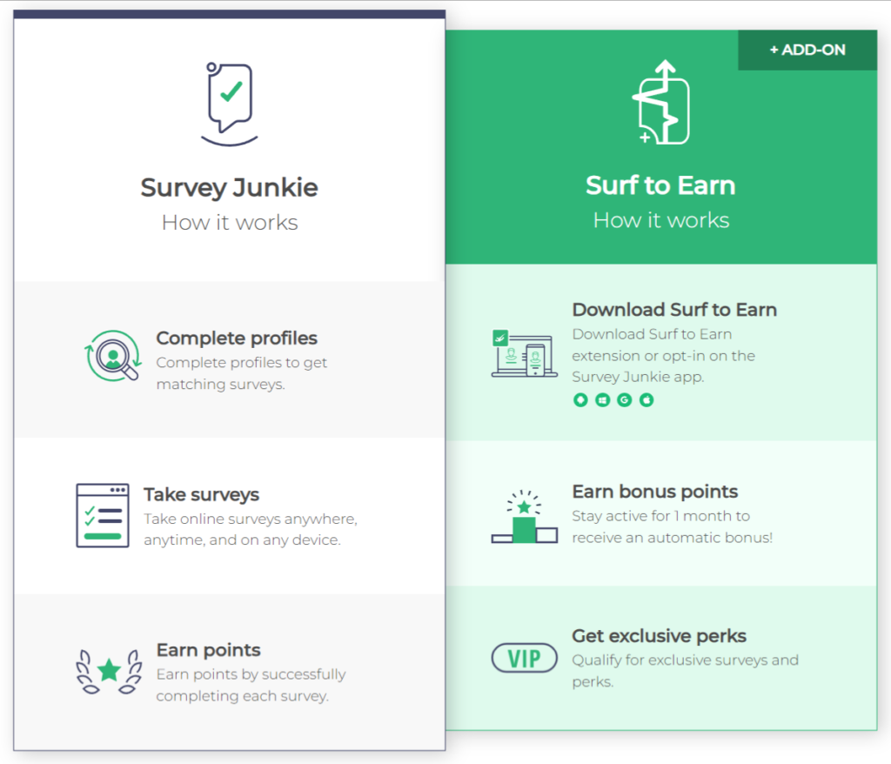

* * *

3\. **Swagbucks** [swagbucks.com](http://swagbucks.com)

Swagbucks has been serving the public in USA since 2007 and has one of the strongest global reputations of any earning platform in existence. Beyond surveys you can also watch videos, read emails, and complete other small tasks giving you multiple ways to earn so there is almost always something available regardless of whether you qualify for surveys. Points are called SB and every 100 SB equals $1. New members get a $5 bonus just for signing up, and most active users receive their first payout within a week. If you want one all-round earning platform that never runs dry on opportunities, Swagbucks consistently delivers.

* * *

4\. **Branded Surveys** [brandedsurveys.com](http://brandedsurveys.com)

Branded Surveys rewards consistent participation with badge levels like Bronze, Silver, and Gold that unlock bonus points and access to higher-paying survey opportunities over time. New users start slow but after building up their profile and badge level over a few weeks, the quality and quantity of available surveys improves noticeably. The platform offers an extensive rewards catalogue including PayPal cash, direct bank deposit for US members, digital gift cards from popular retailers and restaurants, and even charity donation options. Minimum cashout is just $5 making it easy to see real money quickly without waiting for a big balance to accumulate.

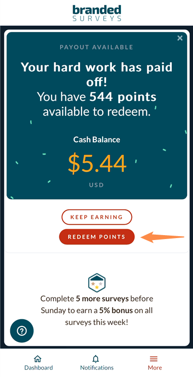

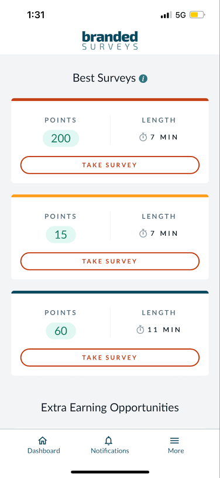

* * *

5\. **InboxDollars** [inboxdollars.com](http://inboxdollars.com)

InboxDollars pays in actual dollars rather than points which eliminates the mental math of conversion rates entirely what you see on your dashboard is exactly what you will receive when you cash out. Surveys pay between $0.50 and $3.00 each and you can supplement your earnings by watching videos and reading emails, giving you extra ways to earn on days when surveys are slow. New members get a $5 bonus just for joining, and signing up for a free account means you could realistically earn up to $225 a month with consistent daily activity. Minimum payout is $15 via PayPal, gift cards, or check.

* * *

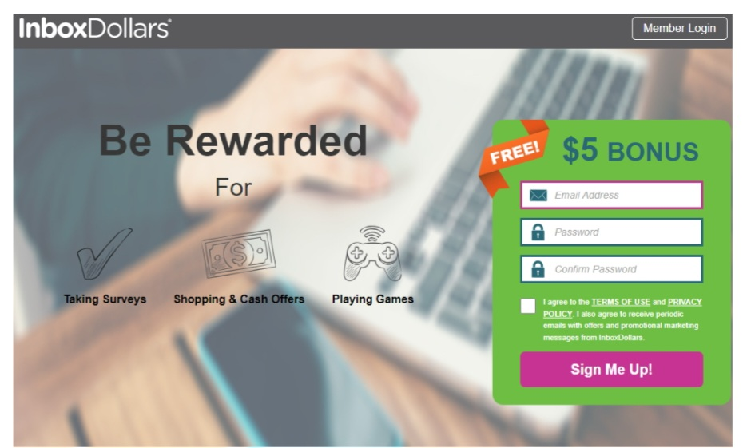

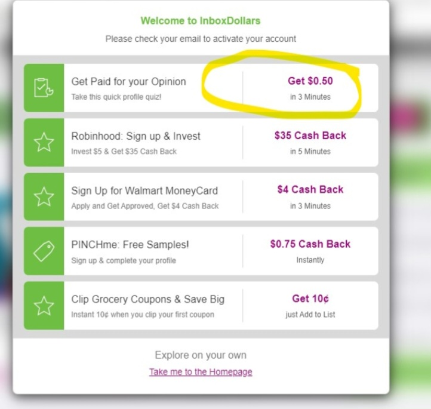

6\. **Prolific** [prolific.com](http://prolific.com)

Prolific is not your typical survey site and that distinction matters. It specialises in academic and scientific research studies, meaning the surveys you complete are being used by universities and research institutions to advance real knowledge which is also why the hourly rates are significantly higher than most general survey platforms. Studies range from quick five to ten minute surveys to more in-depth questionnaires taking around thirty minutes, and some users report earning between $10 and $30 on a good day when matching studies are available. The sign-up process may involve a waitlist but it is worth the wait, Prolific is widely considered the gold standard for survey quality and pay rate in the USA.

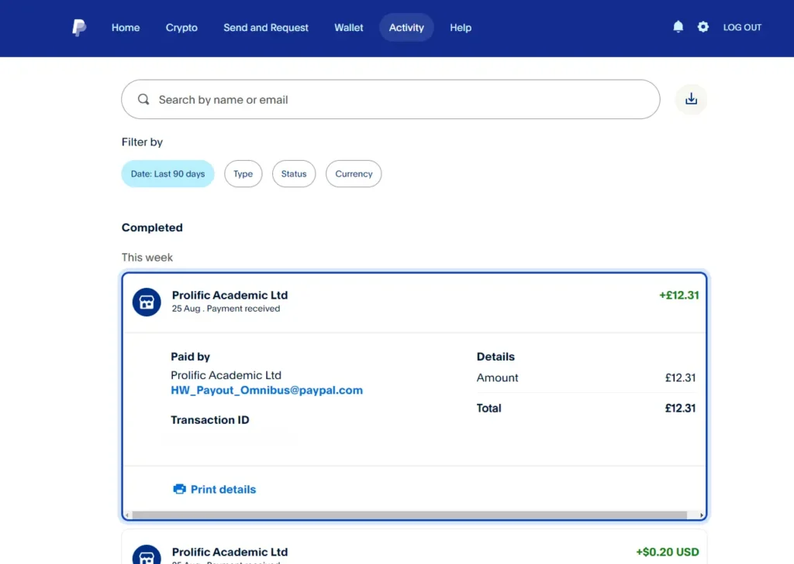

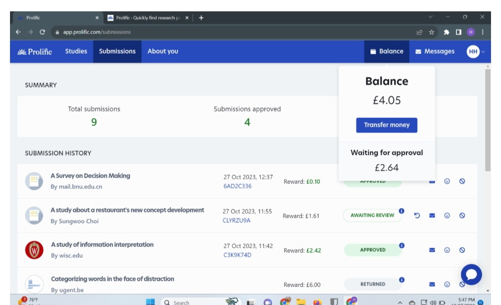

* * *

7\. **Pinecone Research** [pineconeresearch.com](http://pineconeresearch.com)

Pinecone Research is a reputable market research company based in the United States known for focusing on product testing and consumer feedback, with a minimum age requirement of 18 years and surveys that typically take between 25 and 40 minutes to complete. With no minimum cashout threshold and a fast processing time of just two to three days, it is a great option for anyone who wants to get paid quickly without watching a balance sit untouched. You can expect around four to eight survey invitations per month, each paying $3 to $5, and because the platform only sends surveys you are likely to qualify for, you waste very little time on screener questions that lead nowhere.

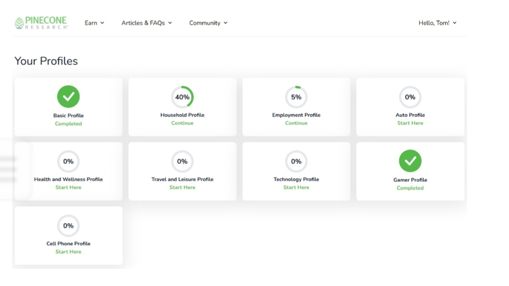

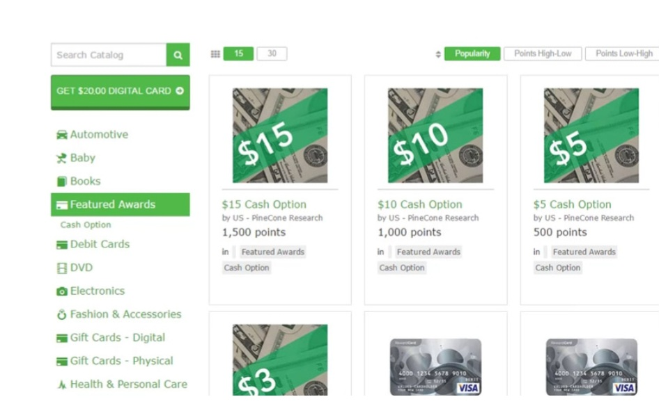

* * *

8\. **Tellwut** [tellwut.com](http://tellwut.com)

Tellwut has been one of the top-rated survey platforms in the USA for nine consecutive years and membership is limited to residents of the USA and Canada which means less competition for available surveys and a more targeted earning experience. What makes it genuinely different from standard survey platforms is its community-driven approach in addition to regular market surveys, members can take part in or even create their own polls, interact with other users, and explore discussion topics making the experience far more engaging than simply answering question after question in isolation. Rewards include gift cards to Amazon, Walmart, Target, Starbucks, and more, plus PayPal cash and prepaid credit cards. New members currently receive a generous joining bonus worth 400 points.

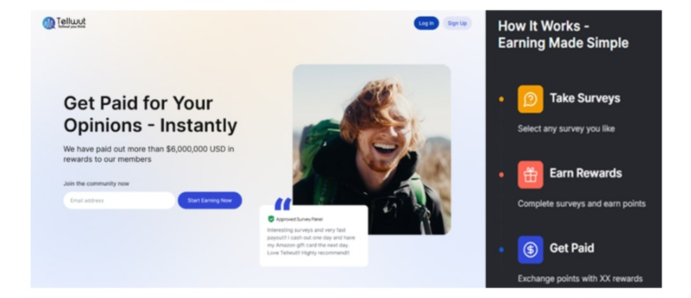

* * *

9\. **PrizeRebel** prizerebel.com

PrizeRebel has been around since 2007 and is known for its user-friendly layout and fast redemptions, offering surveys, microtasks, and video watching for points that can be redeemed quickly without long waiting periods. The platform has a unique membership tier system starting at Bronze and going through Silver, Gold, and beyond with each tier unlocking perks like bonus points and faster payouts that reward consistent users over time. PrizeRebel also runs regular contests and raffles which adds an element of excitement beyond standard survey earning. Redemption options include PayPal cash and a wide selection of gift cards that process quickly after you request them.

* * *

10\. **Freecash** [freecash.com](http://freecash.com)

Freecash is one of the highest-paying survey and GPT sites available in the USA and beyond surveys it also features paid offers that can significantly boost your earnings above what surveys alone would provide. What stands out immediately is the cashout threshold you can withdraw with as little as $0.50 in your account, which is the lowest barrier of any platform on this entire list. Payout options are unusually broad including PayPal, Bitcoin, Litecoin, Ethereum, bank transfer, AirTM, and even CS:GO skins for gamers. If you want maximum flexibility in how you receive your money alongside genuinely competitive earning rates, Freecash belongs near the top of your signup list.

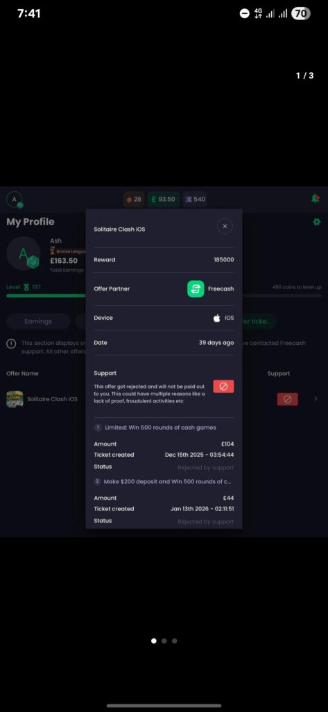

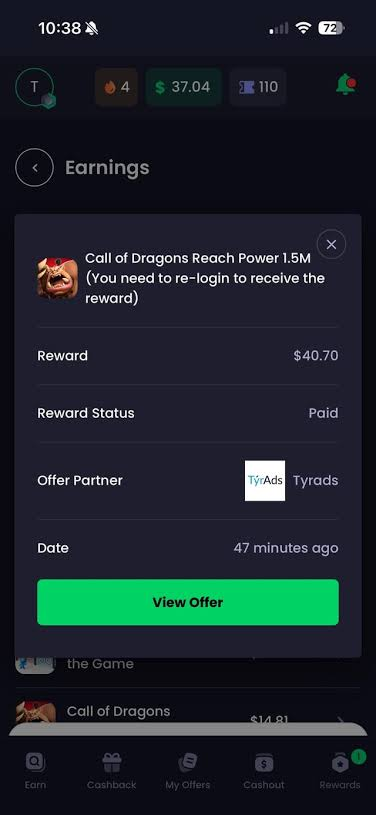

* * *

11\. **Prime Opinion** [primeopinion.com](http://primeopinion.com)

Prime Opinion offers a wide range of surveys covering topics like gaming, shopping, and sports with no daily limit on the number of surveys you can complete meaning on a good day you can stack earnings far beyond what capped platforms allow. New users receive a $5 sign-up bonus immediately upon joining, and earnings are paid instantly via PayPal or gift cards with over 100 gift card choices available. Average earnings sit between $2 and $5 per hour which translates to $50 to $150 monthly for consistent users. The no-cap policy on daily surveys is the real differentiator here because most platforms slow down after a few completions, Prime Opinion keeps the opportunities coming.

* * *

12\. **Qmee** [qmee.com](http://qmee.com)

Qmee is a versatile survey platform that rewards users with cash and gift cards for providing feedback on products, services, brands, and trending topics. Beyond surveys it also lets you earn by answering trivia questions and browsing the web using the Qmee browser extension. The standout feature is the cashout policy there is no minimum cashout threshold meaning you can withdraw earnings instantly via PayPal the moment you have any balance at all. Average daily earnings sit between $2 and $5 which adds up to $50 to $150 monthly for regular users. Available on both desktop and mobile, Qmee is one of the smoothest and most friction-free platforms on this entire list.

* * *

13\. **MyPoints** [mypoints.com](http://mypoints.com)

MyPoints has been operating since 1996 making it one of the oldest earning platforms in the USA and that longevity tells you everything about its reliability. Beyond surveys it offers multiple earning methods including cashback on online shopping, promo codes, goal bonuses, and more making it especially valuable if you already shop online regularly. The shopping cashback angle is what separates MyPoints from pure survey platforms because you are essentially earning on purchases you would make anyway. Points redeem for PayPal cash, Amazon gift cards, and a broad selection of other retail gift cards. For anyone who wants a platform that quietly earns in the background of their normal spending habits, MyPoints fits that role perfectly.

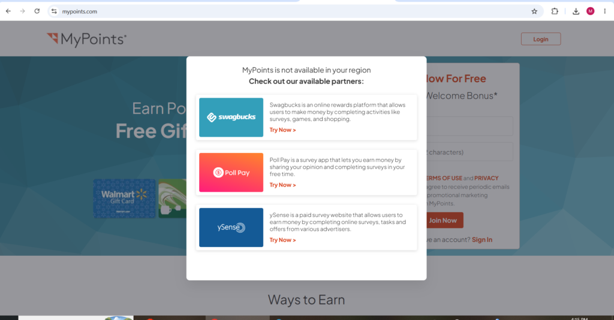

* * *

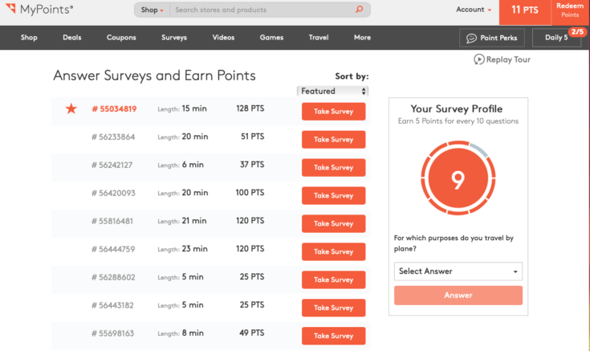

14\. **Valued Opinions** [valuedopinions.com](http://valuedopinions.com)

Valued Opinions offers solid rewards focused primarily on gift cards including options like Amazon, Target, and restaurant vouchers, with surveys that are straightforward and typically take between 15 and 20 minutes paying between $1 and $7 each. The platform occasionally offers focus groups and diary studies that pay considerably more than standard surveys, and active members earn virtual badges at levels like Bronze, Silver, and Diamond that signal high participation and can boost your profile for better survey opportunities. One genuinely unique touch is Valued Opinions donates monthly to the American Red Cross on behalf of its users, adding a sense of community impact to your survey activity.

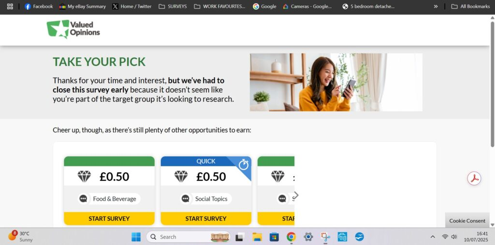

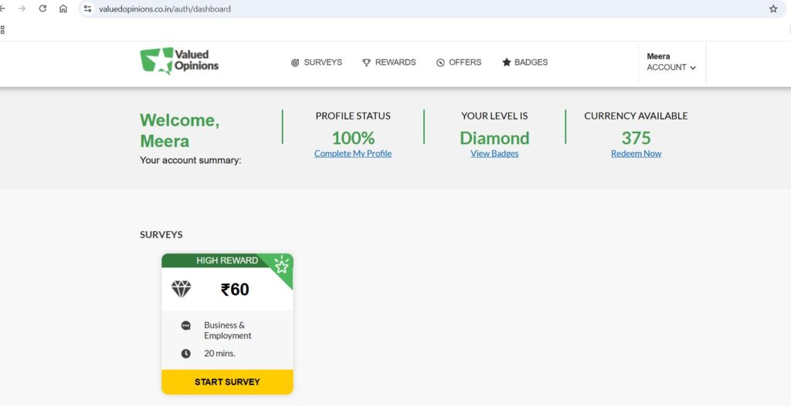

* * *

15\. **User Interviews** [userinterviews.com](http://userinterviews.com)

User Interviews is the VIP tier of this entire list and operates completely differently from standard survey platforms. Rather than short questionnaires for small payouts, it focuses on higher-paying research studies, focus groups, and in-depth interviews where the pay rate frequently reaches $75 to $150 per hour. These are serious research opportunities run by companies and academic institutions that need detailed consumer insights not a quick three-minute poll. The qualification process is more rigorous than regular survey sites, but the payout when you do qualify makes the effort worthwhile. If your time is valuable and you want to earn meaningfully from a single session rather than grinding dozens of small surveys, User Interviews is in a different league entirely.

* * *

16\. **American Consumer Opinion** [acop.com](http://acop.com)

American Consumer Opinion is one of the longer-standing market research panels in the USA, backed by a professional research company that has been collecting consumer data for decades. Surveys arrive a limited number of times per year which makes this a supplementary platform rather than a primary earner, but to compensate for lower-paying screener surveys the platform enters your name into a monthly $50 drawing giving you a chance at bonus earnings on top of your regular survey completions. The surveys themselves tend to focus on product feedback and consumer preferences, and payments are straightforward once you accumulate enough points to request a reward.

* * *

17\. **Toluna** [toluna.com](http://toluna.com)

Toluna Influencers has a specific survey panel built for the USA along with an American blog where they post special offers, opportunities, and occasionally run contests that give members chances to earn beyond standard survey completions. The main earning method is surveys and the US panel has a decent volume of them available regularly. Toluna can be a bit slow at processing rewards compared to other platforms, but it always pays out eventually and offers PayPal and gift cards as redemption options. The community element interacting with other members, participating in discussions, and entering contests adds a social layer that makes the experience less transactional than most survey platforms.

* * *

18\. **LifePoints** [lifepointspanel.com](http://lifepointspanel.com)

LifePoints launched after the merger of GlobalTestMarket and MySurveys two of the most established names in market research thereby bringing together a massive combined member base and a wide variety of survey topics under one platform. Once you sign up you receive email invitations for available surveys and can also log in to check what is currently open. The payout threshold starts around $10 for some rewards and $15 for most, redeemable via PayPal or a large catalogue of gift cards. A reliable and established choice for American users who want a platform with serious industry credibility behind it.

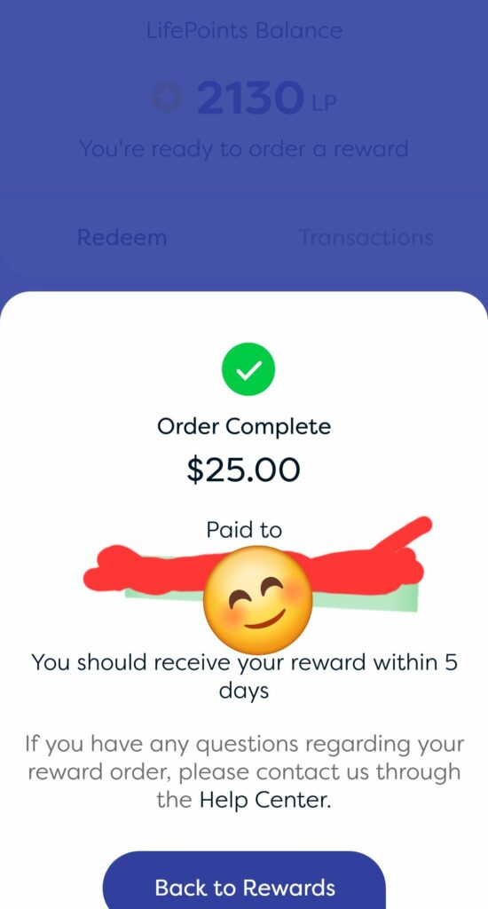

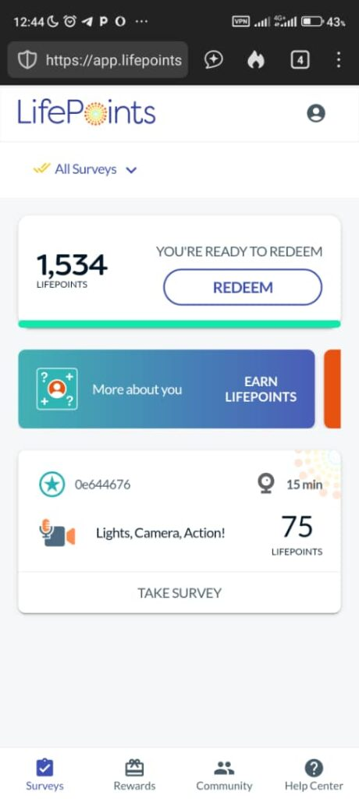

* * *

19\. **Attapoll** [attapoll.com](http://attapoll.com)

Attapoll is a mobile-first survey app that compensates users for sharing their opinions on various products and services, and with just one to two hours of daily activity users can realistically earn between $2 and $4 per day. The app is clean, intuitive, and built specifically for completing surveys on the go rather than sitting at a desktop. It also features a referral program where you earn an additional 10% of your referred friend's survey earnings whenever they complete a survey a passive income layer on top of your own active earnings. Cashout is via PayPal or gift cards with a low minimum threshold. If your preference is earning from your phone during commutes, breaks, or downtime, Attapoll is built exactly for that use case.

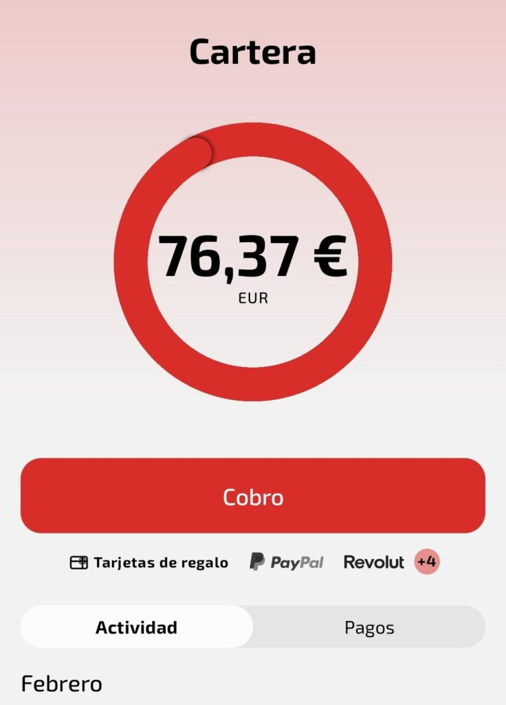

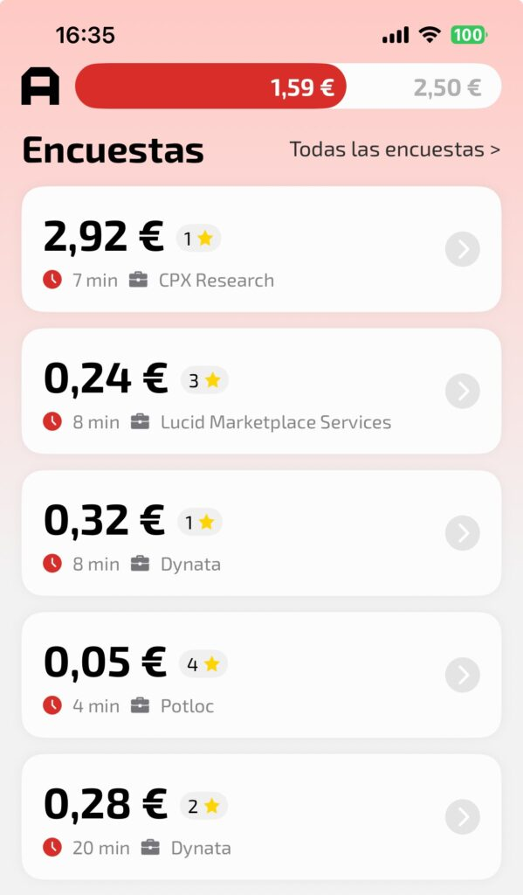

* * *

20\. **Five Surveys** [fivesurveys.com](http://fivesurveys.com)

Five Surveys operates on a simple and satisfying model for every five surveys you complete you earn $5, with each survey taking between 30 and 45 minutes. The math is clean and predictable which removes the frustration of unpredictable point values and confusing conversion rates that plague many other platforms. There is no minimum payout threshold and withdrawals are instant via PayPal or a selection of over 100 gift cards including Amazon, iTunes, Nike, Starbucks, Target, and Walmart. Available in the US, UK, Canada, Germany, and Australia. If you prefer knowing exactly what you will earn before you start rather than chasing variable point values, Five Surveys gives you that clarity upfront.

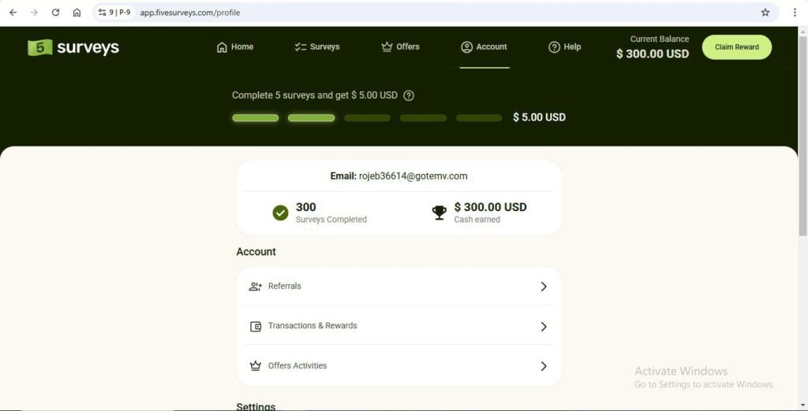

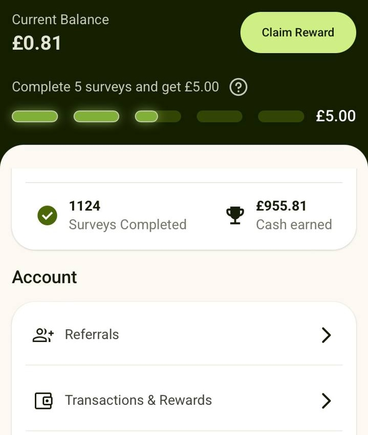

## Note:

Ensure not to rely on just one platform for online surveys so you will have multiple streams of surveys And also to login Every day so the survey providers will know you are available for survey Job, When given Jobs Ensure you are dedicated and read properly to give proper and correct answers that will be consistent of you in all surveys because consistently and honesty is highly rewarded.

#### If you found this helpful, feel free to share it with someone who might need it too.
