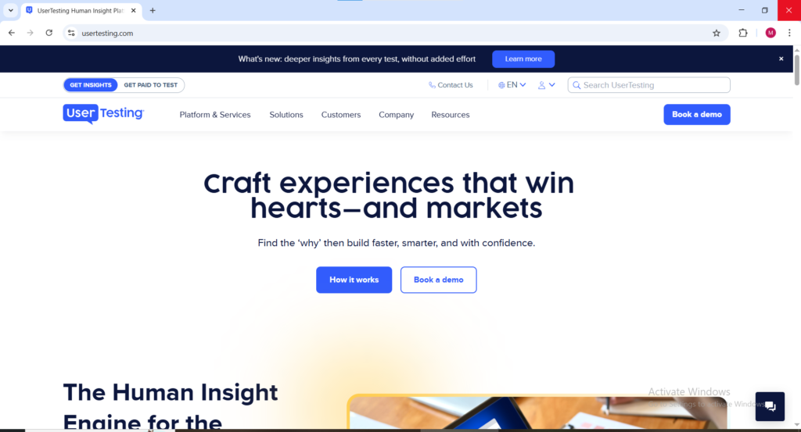

Most online earning guides written for Nigerians recycle the same tired list of survey sites that barely pay and rarely work. Website testing is different. Global companies building apps and websites for international audiences need real users from Nigeria and across Africa to test their products because Nigerian users interact with technology differently, have different connection speeds, use different devices, and bring perspectives that American or European test panels simply cannot provide. That geographic reality is not a barrier instead it is an advantage. Companies specifically want Nigerian testers and they pay in US dollars for the feedback.

With dedication many Nigerian testers report earning between $100 and $500 per month as a side hustle from website and app testing alone. That income arrives in dollars which at current exchange rates represents meaningful naira earnings from work that requires no degree, no special technical skill, and no upfront investment beyond a smartphone or laptop and a stable internet connection.

This guide covers every verified platform where Nigerians can get paid to test websites in 2026, what each platform pays, how payment reaches Nigerian bank accounts, and the honest practical details that determine whether each platform is worth signing up for.

* * *

**The Payment Reality for Nigerian Website Testers**

Before diving into the platforms it is important to address the payment question directly because it is the most common concern Nigerian testers raise and the most important practical issue to resolve before signing up for anything.

Some platforms use PayPal which can be tricky in Nigeria. The most reliable ways for Nigerian testers to receive website testing payments are through Payoneer which links to testing accounts as an alternative to PayPal and allows withdrawal to Nigerian bank accounts, through domiciliary accounts where PayPal funds are transferred to a dollar account in a Nigerian bank, and through local platforms like OpinionPadi that pay directly in naira with no international payment friction whatsoever.

Nigerian PayPal accounts are receive-limited in many cases as of 2026. Check the current status before relying solely on PayPal for testing income and prioritize platforms that support Payoneer or direct bank transfer to avoid payment complications that could delay or block earnings.

The practical recommendation is to set up a Payoneer account before signing up for any international website testing platform. Payoneer is widely accepted across almost every major testing platform and withdraws directly to Nigerian bank accounts cleanly without the restrictions that affect PayPal in Nigeria.

* * *

**Best Website Testing Sites for Nigerians in 2026**

**UserTesting**

Website: [usertesting.com](http://usertesting.com) Available as: Website and Mobile App (iOS and Android)

UserTesting is one of the most popular platforms for website testing in Nigeria. After signing up and passing a sample test Nigerian testers can receive tasks almost immediately. Pay rate is $10 for a 20-minute test with payment processed via PayPal.

UserTesting accepts Nigerian testers and has been consistently verified as paying Nigerian users who have successfully passed the qualification process. The platform works with Fortune 500 companies and fast-growing global brands meaning the websites and apps Nigerian testers evaluate on UserTesting are used by millions of people worldwide, Giving the feedback genuine weight and justifying the $10 per session pay rate. Nigerian testers who pass the sample test and maintain strong ratings receive regular test invitations and build consistent dollar income over time.

<figure>

<figcaption>

UserTesting welcome page

</figcaption>

</figure>

The key for Nigerian UserTesting applicants is treating the sample test as seriously as a paid session because the quality of that initial recording determines approval. Speak clearly and continuously throughout the entire recording, narrate every thought and reaction, and complete every task exactly as instructed before submitting.

* * *

**Userlytics**

Website: [userlytics.com](http://userlytics.com) Available as: Website and Mobile App (iOS and Android)

Userlytics is a global user testing platform where Nigerians can test websites, apps, prototypes, and even advertisements. It offers various types of tests including usability tests and surveys and is a flexible platform where Nigerian testers can choose the types of tests they want to participate in.

Userlytics is one of the most globally accessible website testing platforms available to Nigerian testers because of its broad international acceptance policy. Tests pay $10 per completed session via PayPal seven days after approval. Nigerian testers who have set up Payoneer accounts can use that as their payment method on platforms that do not directly support Nigerian PayPal accounts. The variety of test types on Userlytics website testing, mobile app testing, prototype evaluation, and advertisement feedback means Nigerian testers have more qualifying opportunities than on platforms limited to a single test format.

<figure>

<figcaption>

userlytics.com welcome page

</figcaption>

</figure>

* * *

**TryMyUI**

Website: [trymata.com](http://trymata.com) Available as: Website

TryMyUI is an excellent site for Nigerians interested in website testing. Nigerian testers record their screen and voice while completing tasks on the platform. Pay rate is $10 per test with payment processed via PayPal every Friday.

TryMyUI rebranded to Trymata but the platform operates identically to its original form and Nigerian testers continue to access paid tests through it. The Friday weekly payment schedule is one of the more predictable payment timelines in the website testing space Nigerian testers know exactly when their earnings will be processed rather than waiting indefinitely for individual test approvals. The platform provides clear task instructions before each session begins making it particularly beginner-friendly for Nigerian testers completing their first website tests.

**uTest**

Available as: Website at [utest.com](http://utest.com)

uTest owned by Applause is one of the most reputable and well-paying platforms for serious Nigerian testers. It offers functional testing, payment testing, localisation testing, and live event testing. uTest has a structured rating system where the better the bug reports submitted the higher the rating and the more a Nigerian tester earns. Pay ranges from $5 to $25 per accepted bug with significantly more available for project-based work.

uTest is not a beginner platform and Nigerian testers who approach it expecting easy immediate income will be frustrated. It rewards Nigerian testers who invest time in learning how to write detailed structured bug reports, build their platform rating systematically, and access progressively higher-paying projects over time. The ceiling of earning on uTest for Nigerian testers who put in that work is genuinely the highest of any website testing platform on this list experienced Nigerian uTest contributors with strong ratings report earnings that far exceed what general usability testing platforms provide.

<figure>

<figcaption>

uTest welcome page for website testing

</figcaption>

</figure>

Nigerian testers on uTest should invest time in writing detailed well-formatted bug reports because the uTest rating directly determines the volume and quality of projects received.

* * *

**Testbirds**

Website: [testbirds.com](http://testbirds.com) Available as: Website and Mobile App

Testbirds has an active global community called the Nest and Nigerians can join and start earning immediately. Pay is between €0.10 and €2.00 per accepted bug report with bonus payments available for completing full test cycles.

<figure>

<figcaption>

testbirds.com welcome page

</figcaption>

</figure>

Testbirds accepts Nigerian testers globally and the community-based approach called "the Nest" gives Nigerian participants a support network of experienced testers who share tips, strategies, and platform updates. The bug report payment model means Nigerian testers on Testbirds earn based on the quality and quantity of valid bugs they identify rather than a flat per-session rate. Nigerian testers who develop genuine attention to detail and learn to identify and document real functional issues consistently out-earn those who submit superficial reports hoping for quick approval.

* * *

**Enroll**

Website: [enrollapp.com](http://enrollapp.com) Available as: Website

Enroll is a straightforward testing platform that offers quick and simple tests that Nigerian testers can complete from any device including smartphones. The platform does not always require screen or voice recording which is an advantage for Nigerian testers who prefer text-based feedback. Payments are made via PayPal and the rates vary depending on test length and complexity.

<figure>

<figcaption>

Enrollapp.com welcome page

</figcaption>

</figure>

Enroll is particularly valuable for Nigerian testers who do not have access to a laptop or desktop computer because the platform is specifically designed for completion on mobile devices without requiring the screen recording setup that most other website testing platforms demand. For Nigerian testers starting from zero with nothing but a smartphone and wanting to build initial testing experience before progressing to higher-paying platforms, Enroll provides a genuinely accessible entry point that removes the equipment barrier entirely.

* * *

**OpinionPadi**

Website: [opinionpadi.com](http://opinionpadi.com) Available as: Website and Mobile App

OpinionPadi is a Nigerian-built platform that combines survey earning with usability-style feedback tasks and is the only platform on this list that pays directly to Nigerian bank accounts in naira with zero international payment friction. Unlike international platforms that require PayPal or Payoneer setup, OpinionPadi was designed specifically with Nigerian users in mind and pays directly in naira bank transfer removing every payment complication that makes international platforms frustrating for Nigerian testers.

For Nigerian testers who are new to website testing and want to start earning immediately without setting up international payment accounts, OpinionPadi is the right first platform. The naira payment removes the exchange rate uncertainty and payment delay issues that affect every international platform. Once initial testing experience is built on OpinionPadi Nigerian testers can progress to international platforms like UserTesting and Userlytics with a clearer understanding of what quality testing feedback looks like and how to pass qualification assessments.

📸 Attach: Screenshot of OpinionPadi homepage at opinionpadi.com

* * *

**Prolific**

Website: [prolific.com](http://prolific.com) Available as: Website and Mobile App

Prolific accepts Nigerian participants for academic and research studies including website and digital product testing sessions. The platform has an exceptional reputation globally for always paying promptly and treating participants fairly and Nigerian testers who are accepted onto the platform report a consistently positive payment experience compared to some international platforms where Nigerian PayPal restrictions create complications.

Prolific pays via PayPal or Circles and Nigerian testers should confirm their payment setup before completing studies to avoid payment complications after the work is done. Study availability for Nigerian participants on Prolific varies depending on what research studies are actively recruiting and which demographic profiles they require, Nigerian testers who complete their profiles thoroughly qualify for more studies than those with incomplete demographic information.

* * *

**Respondent** respondent.io Available as: Website

Respondent sits at the premium end of the website testing market and accepts Nigerian participants for research studies and interviews that pay between $100 and $700 per hour. The higher pay reflects the depth of feedback required — Nigerian testers on Respondent participate in structured research sessions with company researchers rather than completing automated unmoderated tests. Nigerian professionals with backgrounds in technology, finance, medicine, education, or any specialist field are specifically valuable to Respondent's client companies who need feedback from people who actually use professional tools and enterprise software in real work contexts.

Payment on Respondent is via PayPal or bank transfer and Nigerian testers should confirm their payment method setup before applying to studies. For Nigerian professionals who qualify for specialist studies on Respondent the earning potential per session significantly exceeds what any other website testing platform provides.

📸 Attach: Screenshot of Respondent homepage at respondent.io

* * *

**What Nigerian Website Testers Need to Know**

Nigerian website testers should not limit themselves to a single platform because test availability on any one platform is inconsistent. Signing up for at least three to five platforms simultaneously ensures there are always testing opportunities available regardless of which specific platform is busy or slow on any given day.

Every testing platform matches Nigerian testers to projects based on demographic information and the more complete the profile the more tests qualify for. Nigerian testers who fill in every available profile field thoroughly and honestly receive significantly more relevant test invitations than those with incomplete profiles.

Most platforms require Nigerian testers to complete a practice test before receiving paid assignments. This test evaluates voice quality to confirm the tester is speaking clearly and audibly throughout the recording. Nigerian testers who speak with a clear consistent voice and narrate their thoughts continuously throughout the practice test pass at significantly higher rates than those who go quiet during task completion or speak too softly for the audio to capture properly.

For Nigerian testers worried about payment the clearest practical advice is to set up a Payoneer account before applying to any international platform and use it as the primary payment method across every platform that supports it. Payoneer withdraws reliably to Nigerian bank accounts and is accepted by the majority of major website testing platforms making it the single most important payment setup step for Nigerian testers entering this earning category in 2026.
