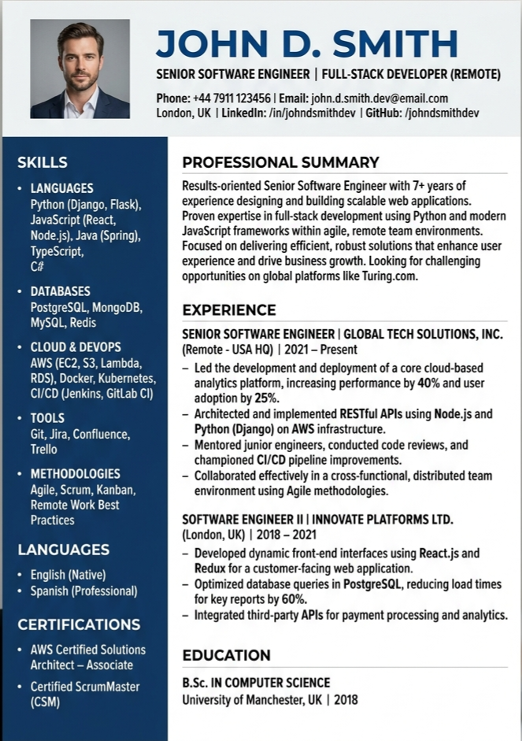
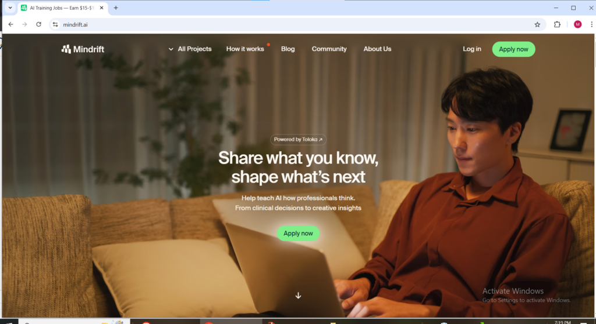
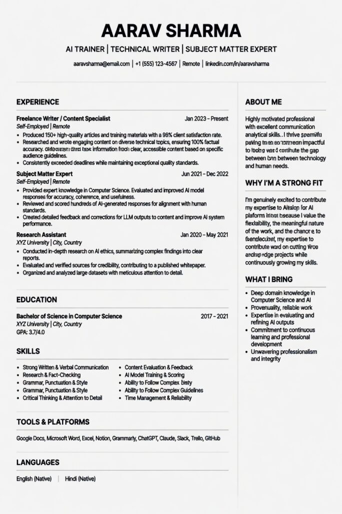
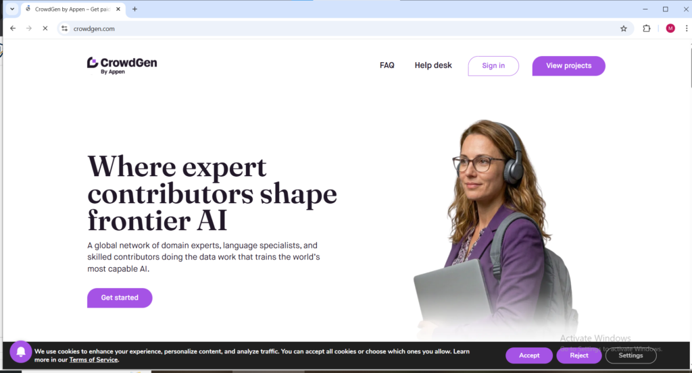

Most articles about getting paid to train AI are written by people who have never done it. They copy rates from websites and present them as facts. This is different. Here is what actually happens, what people really earn, and what platforms do not tell you.

Getting paid to train AI is one of the most accessible remote income options today. Demand is growing fast, and the companies paying for this work are large and well funded. That mix of demand, money, and stability is rare online.

The work itself is simple to understand. You are not coding or building software. You act as a human judge. An AI gives answers and you evaluate them for accuracy, usefulness, safety, and clarity. You may compare two answers and choose the better one, rate responses, or write prompts to guide the model.

This process is called Reinforcement Learning from Human Feedback. In simple terms, AI improves because people tell it what is right and what is wrong. That is the role you are being paid for in 2026.

Now let's get into the platforms. **HERE ARE 10 WEBSITES FOR YOU AND HOW TO GET STARTED**

* * *

1. **Outlier** [outlier.ai](http://outlier.ai)

Outlier is the name that comes up first in almost every conversation about getting paid to train AI and the reputation is earned. The platform connects workers with AI training projects from major technology companies and consistently offers some of the highest pay rates in the industry particularly for workers with backgrounds in STEM, coding, writing, and its also best for people that have no skill but are learned enough to read and understand questions they can easily go for the generalist role or other specialist fields.

What makes Outlier different from entry-level annotation platforms is that the work is genuinely interesting. You are not clicking through image labels for hours instead you are evaluating complex AI responses, writing challenging prompts, and providing the kind of nuanced human judgment that actually shapes how major AI models behave. The work feels meaningful in a way that most online earning platforms simply do not.

Pay rates on Outlier range from around $15 to $65 per hour depending on the project and your skill level. Coding and STEM projects sit at the higher end of that range. The recommendation is to treat this as a strong primary earner during active periods while keeping other platforms running in the background during slow ones.

Outlier is available primarily in the USA, Canada, UK, Ireland, Australia, and New Zealand for its highest-paying projects, though some opportunities are open more broadly and in general outlier.ai is available to over 50 countries.

**How To Get Started With **Outlier****

**Step 1** — Go to **[outlier.ai](http://outlier.ai)** and click the "View Opportunities" button. This is their version of a sign up button, Do not look for a traditional sign up link.

**Step 2** — Create your account using your Google account or your email address. Using Google is faster and recommended.

**Step 3** — Fill in your personal information — legal first name, last name, date of birth, country of residence, and phone number.

**Step 4** — Verify your email address and phone number. You will receive a confirmation email and an SMS code. Enter both to confirm your contact details.

**Step 5** — Upload your resume. The system automatically scans it for relevant skills and cross-references with LinkedIn if you have one. Have your resume ready before you start this step.

<figure>

<figcaption>

**OUTLIER RESUME REQUIREMENT SAMPLE**

</figcaption>

</figure>

**Step 6** — Select your areas of expertise. Be honest and thorough here — this determines which projects you get matched to and directly affects your pay rate.

**Step 7** — Complete the identity verification process. Outlier uses a third-party service called Persona. You will need a valid government-issued photo ID such as a passport, driver's license, or national ID card. Have it ready and take clear photos in good lighting.

**Step 8** — Complete the skill screening assessments. These are short tests designed to match you to the right projects. Read every instruction carefully before answering — rushing is the most common reason people fail here.

**Step 9** — Wait for approval. If everything goes smoothly this takes between 30 minutes and two days depending on how quickly identity verification processes.

**Step 10** — Once approved, log into your dashboard and browse the Open Opportunities section. Select a project that matches your skills, read the project-specific guidelines thoroughly, and start working.

**Step 11** — Set up your payment method in account settings. Options include PayPal, AirTM, and bank transfer depending on your location. Payments are processed weekly.

**Pro tip** — Take the skill screening in a quiet environment without distractions and treat it like a job interview. Your score on this assessment determines which pay bracket of projects you access.

* * *

2\. **DataAnnotation.tech** [dataannotation.tech](http://dataannotation.tech)

DataAnnotation.tech has built a reputation as one of the most consistent paid to AI training platforms available and the community of workers who use it regularly is vocal about one thing it actually pays, on time, every time. For a category where payment reliability complaints are common, that track record matters enormously.

The platform focuses primarily on coding and writing tasks, with coding projects paying the highest rates up to $65 per hour for experienced developers. Writing and general AI feedback tasks start around $20 per hour, which is still competitive compared to most online earning opportunities. You will need to pass a qualification assessment before accessing projects, and the assessment is genuinely challenging, but passing it unlocks access to a consistent pipeline of well-paying work.

Like Outlier, DataAnnotation.tech primarily serves workers in the USA, Canada, UK, Ireland, Australia, and New Zealand. If you are a developer looking to earn remotely from AI training specifically, this platform alongside Outlier is the combination most experienced workers recommend above everything else.

**How To Get Started With **DataAnnotation.tech****

**Step 1** — Go to [dataannotation.tech](http://dataannotation.tech) and click the "Apply" button on the homepage.

**Step 2** — Fill out the brief application form with your background, areas of expertise, and availability. Keep it accurate and detailed.

**Step 3** — Complete the Starter Assessment. This tests your critical thinking, writing ability, reading comprehension, and attention to detail. The platform recommends setting aside one hour but take longer if you need to..... successful applicants consistently report that thoroughness matters far more than speed here.

**Step 4** — Check your email inbox for the approval decision. This typically arrives within a few days. If you pass you move to the next stage. If you do not pass, the platform may allow you to reapply after a waiting period.

**Step 5** — Complete identity verification when prompted after logging in. You will need to submit clear photos of the front and back of a government-issued photo ID, take a front-facing selfie, and turn your head from side to side as instructed. This process is handled by Persona, the same service used by Airbnb and OpenAI. Turn off any VPNs before starting this step.

**Step 6** — Once verified, log into your dashboard and browse available projects. Projects are organized by skill type writing, coding, domain expertise, and more.

**Step 7** — Select a project and read the guidelines completely before starting your first task. Do not skip this step. The guidelines contain critical information about exactly what quality looks like on that specific project.

**Step 8** — Add your PayPal account in payment settings. DataAnnotation pays weekly via PayPal and the payments are consistently reported as reliable and on time.

**Pro tip** — Coding projects pay the highest rates on this platform starting at $40 per hour and going higher. If you have programming skills make sure you highlight them clearly in your application form.

* * *

3\. **Mindrift** [mindrift.ai](http://mindrift.ai)

Mindrift is backed by Toloka, a global data generation company that has been operating since 2014 and works with some of the largest AI companies in the world. That institutional backing gives Mindrift a stability and legitimacy that newer platforms in this space simply cannot match.

The platform advertises pay rates between $15 and $100 per hour depending on the project complexity and your domain expertise. Specialists in fields like medicine, law, finance, and engineering consistently access the higher end of that range. The application process involves submitting your background, completing assessments, and verifying your identity — it is more thorough than most platforms but that thoroughness is also why the work tends to be better quality and better paid once you are in.

Mindrift accepts international applicants from a wide range of countries, which makes it one of the more accessible options for workers outside the traditional six-country bracket. Pay rates may vary by location but opportunities exist globally. If you have professional expertise in any field, Mindrift is the platform most likely to reward that expertise at a meaningful rate.

**How to Get Started With **Mindrift****

**Step 1** — Go to [mindrift.ai](http://mindrift.ai) and click "Apply Now" or "Get Started."

**Step 2** — Submit your CV or resume. Be specific about your professional background, academic qualifications, and any areas of specialist expertise. Mindrift places heavy weight on your domain background when matching you to projects.

<figure>

<figcaption>

**CV / RESUME SAMPLE CAN USE THIS OR THE ONE UNDER THE OUTLIER SUB-TOPIC**

</figcaption>

</figure>

**Step 3** — Complete the profile assessment. This involves questions about your expertise areas, language skills, and the types of tasks you are interested in.

**Step 4** — Complete the skills assessment for your chosen domain. The difficulty level varies depending on the expertise area you selected — specialist fields like medicine, law, and engineering have more rigorous assessments.

**Step 5** — Verify your identity. You will need a valid government-issued ID and may be asked to complete additional verification steps depending on your location.

**Step 6** — Wait for onboarding confirmation. Mindrift will notify you via email when you have been added to the talent pool or assigned to an active project.

**Step 7** — Once onboarded, log into your dashboard to see available AI training projects. Projects vary in type, length, and pay rate. Read the task guidelines for each project before starting.

**Step 8** — Set up your payment details. Mindrift processes payments biweekly through trusted online payment platforms. Check your dashboard for the specific options available in your country.

**Pro tip** — Mindrift accepts contributors from a wide range of countries internationally. If you have professional expertise in any specialist field your earning potential here is significantly higher than on general platforms.

* * *

4\. **Appen — CrowdGen** [crowdgen.com](http://crowdgen.com)

Appen has been present at every major inflection point in AI development since 1996 from early speech recognition systems to the frontier reasoning models being built today. That history gives it a depth of project variety and institutional credibility that newer platforms are still working to establish.

Operating through its CrowdGen contributor platform, Appen matches workers to projects based on their specific expertise rather than sending random tasks to everyone. This means the work you receive is actually relevant to your background, your quality scores reflect genuine performance, and your contributions are traceable to the real AI models being shaped by your input. Payment is available via bank transfer, PayPal, Payoneer, and AirTM among other options, with rates stated clearly before you begin any project.

The platform is particularly valuable for multilingual speakers. Appen runs projects across 70 or more dialects in 30 or more languages, and workers with fluency in less commonly spoken languages often access premium rates significantly above the standard pay. If you speak a language that is not English as your primary or secondary language, Appen is worth prioritizing.

**How To Get Started With **Appen — CrowdGen****

**Step 1** — Go to **[crowdgen.com](http://crowdgen.com)** and click "Apply" or "Browse Open Roles."

<figure>

<figcaption>

**Crowdgen.com welcome page sample**

</figcaption>

</figure>

**Step 2** — Create your account with your email address and fill in your profile completely. Include your language skills, location, educational background, and any professional expertise.

**Step 3** — Browse the available projects and apply to the ones that match your background. Appen matches workers to specific projects based on expertise so applying to relevant roles rather than everything available improves your chances of being selected quickly.

**Step 4** — Complete the qualification process for your selected project. Each project has its own qualification tasks which serve as the entry assessment. Read all provided guidelines before attempting these tasks.

**Step 5** — Complete identity verification. You will need a government-issued photo ID. Appen accepts multiple verification documents so have at least two forms of ID available in case your first choice is not accepted.

**Step 6** — Once qualified and verified, you will receive access to your assigned project and can begin working immediately. Most projects become accessible within days of passing qualification.

**Step 7** — Set up your payment details. Appen supports bank transfer, PayPal, Payoneer, and AirTM among other options. Most earnings are stated in US dollars and paid in your local currency.

**Pro tip** — Multilingual speakers have a significant advantage on Appen. If you speak any language other than English fluently, make sure it is prominently listed in your profile as multilingual projects often pay premium rates.

* * *

5\. **Alignerr** [alignerr.com](http://alignerr.com)

Alignerr sits at the premium end of the AI training market and makes no apologies about it. The platform advertises average pay of $80 per hour with rates reaching $150 per hour for PhD holders and top specialists, and while real-world earnings for most workers land in the $15 to $40 range for generalist roles, those numbers are still genuinely competitive.

The onboarding experience on Alignerr is unlike anything else in this category — the AI interviewer used during signup has impressed even cynical workers who have been through dozens of platform onboarding processes. The Slack community is active and the pay transparency before starting any project is a genuine differentiator. You know exactly what a task pays before you commit to it.

The honest warning is that work availability on Alignerr is genuinely inconsistent. Some workers report high-volume active periods followed by weeks of silence. Payment withholding complaints also appear with enough frequency to take seriously, particularly from workers who report completing tasks in good faith and receiving above-average quality scores but still experiencing payment delays. Go in with realistic expectations, document your work thoroughly, and treat it as one platform in a diversified portfolio rather than a standalone income source.

**How To Get Started With Alignerr**

**Step 1** — Go to [alignerr.com](https://cashsuccess.online/sample-page/) and click "Apply" or "Get Started."

**Step 2** — Complete the AI-powered interview with Zara, Alignerr's onboarding interviewer. This is a conversational assessment rather than a traditional form — answer naturally and in detail. Many applicants describe this experience as surprisingly engaging.

**Step 3** — Submit your professional background, academic qualifications, and areas of expertise. PhD holders and professionals in specialist fields are prioritized for higher-paying projects so be thorough about your credentials.

**Tip**: The resume samples in the other above topics can serve

**Step 4** — Complete the skills assessment for your selected domain area. Note that Alignerr's assessments are strict — a score below 95 percent in some areas will lock you out of that specific role permanently so take your time and read every guideline thoroughly before starting.

**Step 5** — Complete identity verification with a valid government-issued photo ID.

**Step 6** — Join the Alignerr Slack community. This is an important step — the community is active, helpful, and is where project updates and task notifications are frequently communicated.

**Step 7** — Once approved, log into your dashboard to see available projects. Pay rates are displayed transparently before you commit to any task — you always know what you will earn before you start.

**Step 8** — Set up payment through Deel, Alignerr's payroll platform. Payments are processed biweekly.

**Pro tip** — Work availability on Alignerr can be inconsistent. During quiet periods stay active in the Slack community as new project announcements often appear there first before being listed on the dashboard.

* * *

6\. **Remotasks — Scale AI** [remotasks.com](http://remotasks.com)

Scale AI is one of the most well-funded and highest-profile companies in the AI data space, with clients including Google, OpenAI, Meta, and the US Department of Defense. Remotasks is the contributor-facing platform through which Scale AI accesses its global workforce for AI training tasks.

The range of work available on Remotasks is broader than most platforms — image annotation, audio transcription, data labeling, AI response evaluation, and more. Entry-level tasks are accessible to beginners with no prior experience, while more complex projects open up as your quality scores improve over time. Pay rates start modestly for simple tasks but increase meaningfully for workers who establish strong track records and progress to higher-level projects.

Remotasks operates across over 90 countries which makes it one of the most globally accessible platforms on this list. Workers in countries where Outlier and [DataAnnotation.tech](https://cashsuccess.online/sample-page/) are not available will often find Remotasks to be their most consistent source of AI training income.

**HOW TO GET STARTED WITH Remotasks**

**Step 1** — Go to [remotasks.com](http://remotasks.com) and click "Sign Up."

**Step 2** — Create your account using your email address or Google account.

**Step 3** — Complete your profile with your location, language skills, and areas of interest.

**Step 4** — Browse the available task categories. Remotasks offers a wide range image annotation, audio transcription, data labeling, AI response evaluation, and more. Choose a category that suits your skills.

**Step 5** — Complete the onboarding training for your chosen task type. These are guided tutorials that explain exactly what the work involves and what quality looks like. Do not skip any training module your performance on practice tasks during this phase affects which projects you get access to.

**Step 6** — Pass the qualification quiz for your chosen task category. These quizzes test whether you understood the training materials. If you do not pass you can retake them after reviewing the training again.

**Step 7** — Once qualified, tasks appear in your dashboard automatically. Accept tasks, complete them according to the guidelines, and submit for review.

**Step 8** — Set up your payment method. Remotasks supports multiple payment options depending on your country including PayPal and Payoneer. Payments are processed regularly on a set schedule.

**Pro tip** — Remotasks is available in over 90 countries making it one of the most globally accessible platforms on this list. If you are in a country where Outlier or DataAnnotation.tech have limited availability, start here first.

* * *

7\. **RemoExperts** [rex.zone](http://rex.zone)

RemoExperts operates at the specialist end of the AI training market and the minimum pay rate of $25 per hour reflects that positioning. This is not a platform for beginners looking to start with simple tasks it is built for experienced professionals whose domain expertise commands premium rates from AI companies that need high-quality specialist input.

What makes RemoExperts genuinely different is that the onboarding process is paid. Reading instructions, attending office hours, and completing trial tasks are all compensated from day one a policy that puts it in a small minority of platforms that actually respect the time investment required to get started. Writing, evaluation, and annotation tasks pay between $25 and $45 per hour while generalist and creative tasks pay between $35 and $65 per hour.

The assessment and identity verification requirements are thorough and the entry bar is intentionally high. If you clear it, the quality of available projects and the reliability of payment put RemoExperts among the most respected platforms in the category.

**HOW TO GET STARTED** **WITH RemoExperts**

**Step 1** — Go to [rex.zone](http://rex.zone) and click "Apply" or "Join."

**Step 2** — Create your account and fill in your professional profile. RemoExperts is a specialist platform so be detailed and specific about your domain expertise, qualifications, and professional experience. Vague profiles are not competitive here.

**Step 3** — Complete the entry examination. This is more rigorous than entry tests on other platforms because the minimum pay rate starts at $25 per hour — the bar is set high intentionally.

**Step 4** — Complete identity verification with a valid government-issued photo ID.

**Step 5** — Attend onboarding. Unlike most platforms, RemoExperts pays you for this onboarding phase — reading instructions, attending office hours, and completing trial tasks are all compensated from day one.

**Step 6** — Once fully onboarded, access your project dashboard to see available tasks matched to your expertise level.

**Step 7** — Set up payment details. RemoExperts pays at competitive rates for writing, evaluation, annotation, and creative tasks.

**Pro tip** — This platform is genuinely not for beginners. If you are new to AI training work, build experience on Remotasks or Hive first, then return to RemoExperts once you have a track record and understand what quality AI training work looks like.

8\. **Mercor** [mercor.com](http://mercor.com)

Mercor takes a different approach to the AI training market. Rather than a traditional task-based platform, it operates as an AI-powered talent marketplace that connects specialists with companies seeking remote expertise across AI training, model evaluation, expert review contracts, and more technical roles.

The apply-once model is a genuine time-saver for workers who have grown frustrated with repeating lengthy application processes across multiple platforms. You build one profile on Mercor and get matched to opportunities across its client network. Pay rates vary considerably by role and expertise level but the platform tends toward higher-end compensation for verified specialists, making it particularly valuable for workers with demonstrable professional backgrounds in technical or academic fields.

**HOW TO GET STARTED WITH **Mercor****

**Step 1** — Go to [mercor.com](http://mercor.com) and click "Apply" or "Find Work."

**Step 2** — Build your profile. Mercor uses AI to match your profile to available opportunities so be thorough about your skills, experience, education, and the type of work you are looking for.

**Step 3** — Complete the AI-powered interview. Mercor's interview process is automated and evaluates your communication, reasoning, and domain expertise. Answer in detail and treat it as seriously as a real job interview.

**Step 4** — Your profile is then matched to available contracts across Mercor's client network. You do not need to apply to individual opportunities separately the platform handles matching automatically.

**Step 5** — Review any matched opportunities that appear in your dashboard and accept the ones that suit your skills and schedule.

**Step 6** — Complete any project-specific onboarding required by the client company you are matched to. Requirements vary by contract.

**Step 7** — Set up payment. Mercor handles payments through its platform and rates and payment terms are specified per contract.

**Pro tip** — The quality and completeness of your initial profile determines the quality of matches you receive. Spend significant time on your Mercor profile it is the most important step in the entire process on this platform.

* * *

9\. **Hive Microtasks** [hivemicrotasks.com](http://hivemicrotasks.com)

Hive sits at the accessible end of the AI training market and that accessibility is exactly the point. If you are in a country where the higher-paying platforms are not yet available, Hive provides a genuine entry point into AI training work with a low barrier that requires no formal qualifications or specialist expertise.

Tasks on Hive include image tagging, content moderation, data validation, and basic AI feedback work. Pay rates are lower than the specialist platforms on this list but the global availability and consistent task supply make it a solid option for building initial AI training experience while working toward the qualification assessments required by higher-paying platforms. Think of it as the starting block rather than the finish line.

**HOW TO GET STARTED WITH **HIVE MICROTASKS****

**Step 1** — Go to hivemicrotasks.com and click "Join Now" or "Sign Up."

**Step 2** — Create your account with your email address.

**Step 3** — Complete your profile with your language, location, and basic background information.

**Step 4** — Browse the available task types on your dashboard. Hive offers image tagging, content moderation, data validation, and basic AI feedback tasks. No specialist expertise is required to start.

**Step 5** — Select a task type and read the task guidelines carefully before starting. Each task type has specific instructions that explain exactly what is expected.

**Step 6** — Complete a small batch of practice tasks. Your accuracy on these initial tasks affects which task types you get access to and at what volume.

**Step 7** — Once your accuracy is established, tasks become available regularly in your dashboard. Work at your own pace — there are no minimum hour requirements.

**Step 8** — Set up your payment details and request withdrawals when your balance reaches the minimum threshold.

**Pro tip** — Hive is the ideal starting point if you are completely new to AI training work and do not yet have the experience to pass the tougher assessments on higher-paying platforms. Build your understanding of what quality AI feedback looks like here, then use that foundation to apply to Outlier, DataAnnotation, or Mindrift.

10\. **Handshake Ai** [Handshake.ai](http://Handshake.ai)

  
Handshake AI is a higher-level AI training platform that focuses on skilled contributors rather than beginners. It operates more like a fellowship than a typical task site, selecting users based on their academic or professional background. The work involves evaluating AI responses, writing prompts, and improving model outputs, similar to other training platforms but with stricter quality standards. While it can pay significantly more than entry-level platforms, access is limited and acceptance is not guaranteed, especially for users outside the US and other supported regions.

**HOW TO GET STARTED WITH Handshake AI**

**Step 1 —** Go to the official Handshake AI website and look for the AI fellowship or contributor application page.

**Step 2 —** Sign up using your email or an academic account if required. Some applications are tied to university or professional credentials.

**Step 3 —** Complete your profile with accurate details about your education, skills, and areas of expertise. This platform places strong emphasis on your background.

**Step 4 —** Submit your application. Unlike beginner platforms, you may not get instant access. Your profile is reviewed before acceptance.

**Step 5 —** If accepted, you may be required to complete qualification tasks or assessments. These test your ability to evaluate AI responses, follow instructions, and provide high-quality feedback.

**Step 6 —** Once approved, you’ll gain access to available projects. Tasks typically involve evaluating responses, writing prompts, and improving AI outputs.

**Step 7 —** Follow all guidelines strictly. This platform has higher quality standards than most, and mistakes can reduce your access to projects.

**Step 8 —** Set up your payment method and track your earnings. Payments are usually processed after task approval.

* * *

### Pro tip

Handshake AI is **not a beginner platform**. It is best suited for people with strong academic or professional backgrounds. If you are new to AI training, start with platforms like Remotasks or Appen to build experience first, then apply here for higher-paying opportunities.  
  

* * *

**What Nobody Tells You Before You Start**

Before signing up to everything at once, there are a few realities you need to understand.

Work on these platforms is project based and can disappear without warning. Something you rely on today might pause next month with no explanation. The most stable earners spread their time across three or four platforms instead of depending on just one.

Location matters more than people admit. Workers in the US, Canada, UK, Ireland, Australia, and New Zealand consistently get the highest paying projects on companies like DataAnnotation.tech and Outlier. If you are outside those countries, your best options are usually Mindrift, Appen, and Remotasks because they accept more international workers.

Assessments are more important than most people think. Your score determines which projects you see and how much you earn. Treat them like real job interviews. Rushing through them is one of the most common mistakes and it directly affects your income.

Demand for human input in AI training is not slowing down. It is increasing. The companies funding this work are some of the most well resourced in the world, and they rely on people to guide models through systems like Reinforcement Learning from Human Feedback. Starting early, building strong quality scores, and spreading your effort across multiple platforms is a smart move going into 2026 and beyond.
