Australia offers one of the highest earning potentials for online surveys worldwide. Strong currency, high demand from global brands, and a tech-savvy population make survey sites compete hard for Australian users. This is why we have listed four of the best survey sites for Australians.

Surveys are one of the easiest ways to earn money online. Students, stay-at-home parents, and anyone with spare time can participate. No skills or investment needed and no boss.

The honest truth is that surveys will not replace a full time income. Most Australians earn between $50 and $1000 per month depending on how many platforms they use and how much time they invest. To earn more, sign up for multiple platforms at once. This gives you more survey invitations and more daily earning opportunities.

**Every platform on this list** **works well** in Australia And by reading this article you will discover **13 platforms**, pays real money, and has a proven track record of reliable payouts. We have done the research so you dont waste time on unreliable sites.

1.**Octopus Group** [octopusgroup.com.au](https://my.octopusgroup.com.au/register/90be456d-de71-4932-b4d9-1d1dde2af0c1)

Octopus Group pays a set rate of $0.28 per minute which works out to the highest pay rate of any Australian survey site where u can easily make about $5-60 per day which is rare among other survey sites. What makes it even more fair is that they pay you 10 cents even if you get screened out of a survey something most platforms won't do. the payment increases on your dashboard until it gets to the 20$ threshold, The referral program is also one of the best around, You earn $1 for every friend you refer and continue earning $1 for every survey that friend completes, up to $25 per friend.

**N.B:** Ensure to remember every details u filled in when registering or else filling in wrong details during surveys makes u cancelled out, so be careful and truthful

2\. **Pureprofile** -- [pureprofile.com](http://pureprofile.com)

Pureprofile is one of the longest-running Australian survey platforms, based in Sydney, and has been positively reviewed by major media outlets for its transparency, consistency and user-friendliness. You can earn both cash and vouchers, with the minimum cash redemption sitting at $25. What sets it apart is the dashboard experience it's clean, easy to navigate, and also includes fun tasks beyond just surveys. If you want a platform with a proven track record and a strong Australian presence, Pureprofile belongs in your rotation

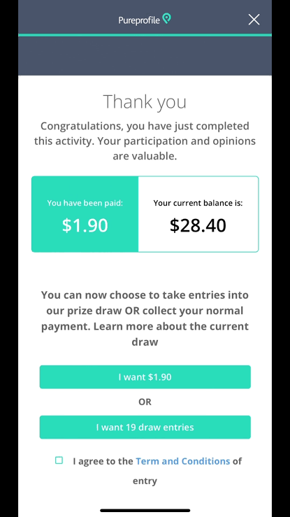

3\. **Opinion World** [opinionworld.com.au](http://opinionworld.com.au)

Opinion World is backed by Survey Sampling International, a global market research firm that has been operating since 1977 so you're dealing with serious industry credibility here, not a fly-by-night platform. It is one of the top survey sites in Australia with a huge user base and a wide range of surveys and excellent rewards. Surveys arrive via email invitation and you can also log into the platform to find available ones. Cashout is available via PayPal or a broad selection of gift cards once you hit the minimum points threshold.

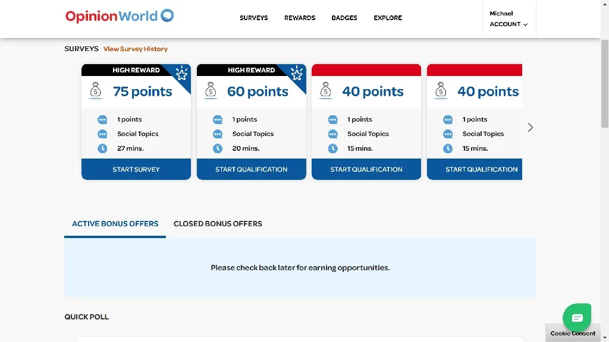

4\. **Toluna** au.toluna.com

Toluna has a specific survey site built for Australia meaning it only offers surveys relevant to Australian consumers so you know the questions you're answering actually matter to brands operating in your market. It has a user-friendly mobile app, a good volume of surveys, 3000 points=$1 , and pays reasonably well for the time invested. Payouts are available through PayPal or a large selection of gift cards. If you want a platform that feels locally relevant rather than generic, Toluna delivers that experience consistently.

5\. **LifePoints Panel** [lifepointspanel.com](http://lifepointspanel.com)

LifePoints Panel has a specific Australian panel and was launched after the merger of GlobalTestMarket and MySurveys — two of the most established names in market research. That merger brought together a massive member base and a wide range of survey topics. The platform is simple to use — sign up, wait for survey invitations via email, and log in regularly to check for available surveys. Once you hit around $10 you can request a payout through PayPal or choose from several gift card options.

6\. **YouGov** [au.yougov.com](http://au.yougov.com)

YouGov is different from typical survey sites in one important way — it focuses specifically on surveys about news, politics and current events, with companies, governments and institutions using the data to make real decisions. If you're someone who follows current affairs and has strong opinions, you'll actually enjoy these surveys rather than finding them tedious. Typical surveys last just five to seven minutes and pay between $2 and $2.50 for 10-minute surveys and up to $10 for 30-minute ones. Minimum cashout is $10 via PayPal or gift cards.

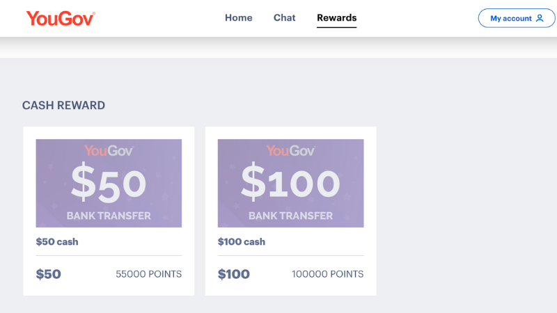

7\. **Valued Opinions** valuedopinions.com.au

Valued Opinions has long been rated as one of the best Australian survey sites on Trustpilot and uses a simple dollar system so you know exactly how much you'll earn before starting each survey typically between $2 and $5 per survey. There's no confusing points conversion to figure out. The one thing to know upfront is that Valued Opinions pays exclusively in gift vouchers rather than cash but with options across a wide range of Australian retailers, most people find something useful. Perfect for building up a gift card balance over time.

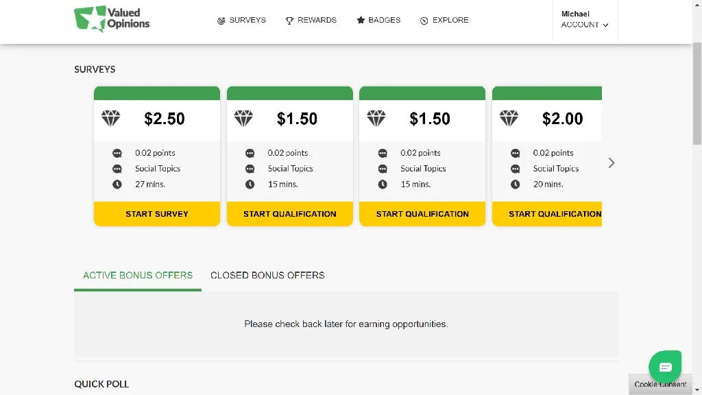

8\. **Survey Junkie** [surveyjunkie.com](http://surveyjunkie.com)

Although Survey Junkie is a US-based platform it is open to Australian members and is well known among Australians for high-paying surveys of up to $50. The interface is clean and focused purely on surveys without distracting extra earning methods. The payout threshold is a low $10 via PayPal, meaning you're cashing out regularly without watching a balance sit untouched for months. If you want a no-frills platform that simply pays well for survey completion, Survey Junkie is worth signing up for.

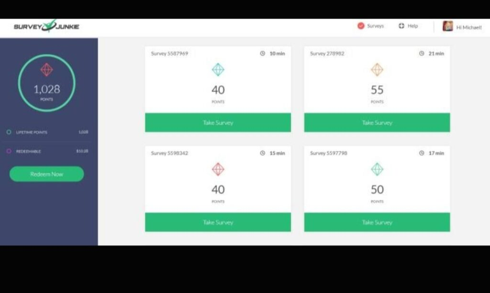

9\. **Swagbucks** swagbucks.com

Swagbucks has been paying members since 2007 and has one of the strongest reputations of any earning platform globally. What makes it stand out for Australians is that you're never limited to just surveys — you can earn points by watching videos, playing games, shopping online and completing offers, so there's almost always a way to earn regardless of whether you qualify for available surveys. Points are called SB and every 100 SB equals $1 Australian. Cashout starts at $5 via PayPal. A solid all-rounder that works well alongside more survey-focused platforms.

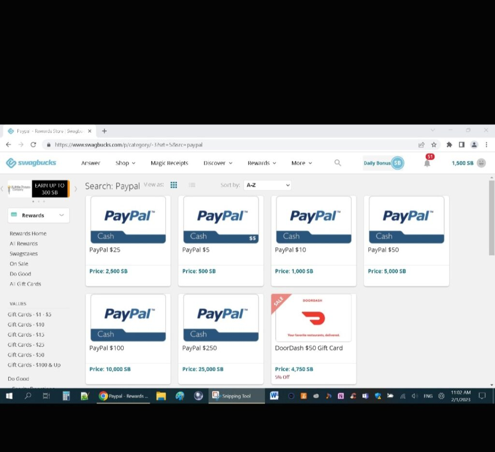

10\. **Ipsos iSay** [i.say.com](http://i.say.com)

Ipsos is one of the world's largest and most respected market research companies, and iSay is their consumer survey panel. That corporate backing means the platform is stable, legitimate, and consistently pays what it promises. Australian members regularly receive survey invitations and the ones that do come through tend to be well-paid given the Ipsos reputation for quality research. It has a clean mobile-friendly interface and pays via PayPal. A trustworthy option if you want to earn from surveys run by a genuine research giant.

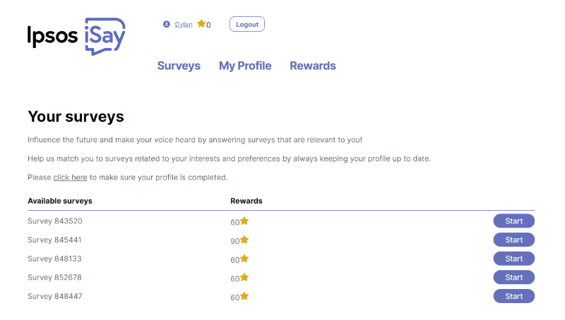

11\. **Timebucks** [timebucks.com](http://timebucks.com)

Timebucks earns its place on the Australian list because surveys are just one of many ways to earn on the platform. Beyond surveys you can earn by watching videos, completing social media tasks, signing up for offers, playing games, and referring friends. The payout threshold is just $3 via crypto, Skrill, PayPal, or bank transfer through Wise — one of the lowest cashout points of any platform on this list. For Australians who get bored or regularly screened out of surveys, Timebucks always has an alternative earning method ready

12\. **Surveoo** [surveoo.com](http://surveoo.com)

Surveoo is known among Australians and for other parts of the world for offering some of the highest-paying surveys available, with some surveys paying as much as $11 each. While not every survey reaches that ceiling, the average payout is fair for the time spent and the questions are generally engaging rather than repetitive. Even if you get disqualified midway through a survey, Surveoo compensates you a small amount for your time; A small but appreciated gesture. Minimum cashout is $10 via bank transfer or gift cards.

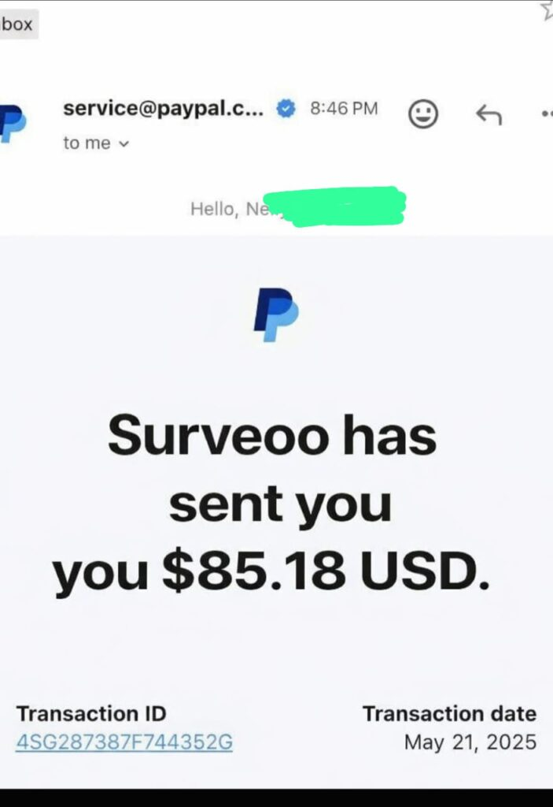

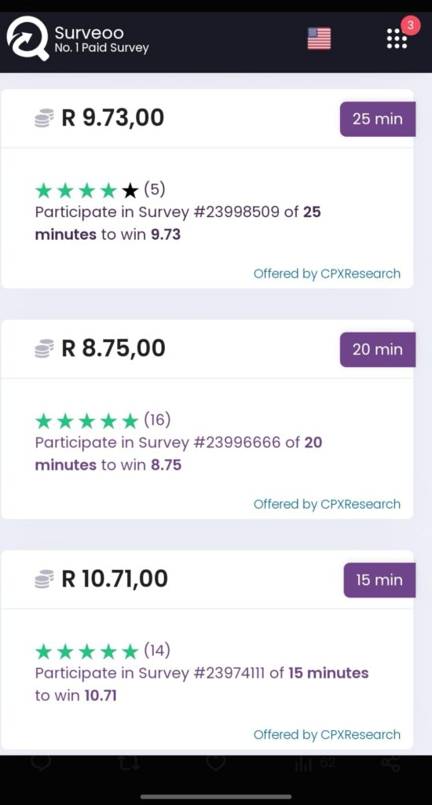

13\. **Earnably** earnably.com

Earnably is a GPT site with a lot of different ways to earn in Australia including paid surveys, watching videos, and completing paid offers. What makes it especially beginner-friendly is the payout threshold you only need to earn $1 before you can cash out via PayPal or choose from a wide range of gift cards. That means even if you only have a few minutes a day, you're seeing real money hit your account regularly rather than watching a balance slowly crawl toward a high threshold. A great starter platform for anyone new to survey earning.

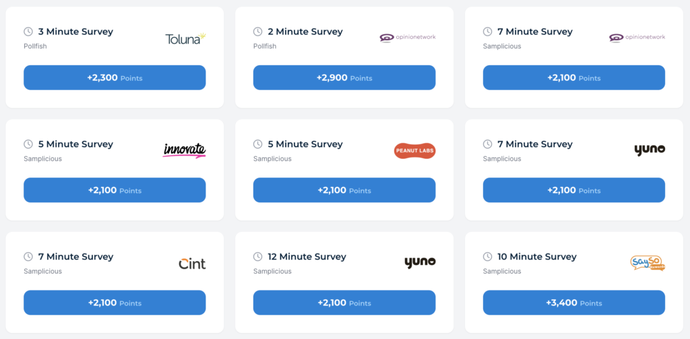

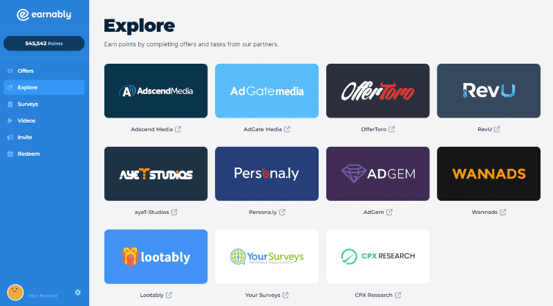

14\. **Flybuys** [flybuys.com.au](http://flybuys.com.au)

Flybuys is Australia's most popular loyalty rewards program with over 10 million members, primarily known for earning points when shopping at Coles, Kmart and Target. What many Australians don't realise is that Flybuys has teamed up with Pureprofile Perks to give members an additional way to earn points by completing surveys directly through the Flybuys app. It's not a standalone survey site points earned go into your Flybuys balance which you redeem for discounts and rewards rather than direct cash. But if you're already a Flybuys member, completing the occasional survey is an easy way to boost your points balance without signing up for anything new.

Know someone who needs extra income? Send this to them it could make a difference.
