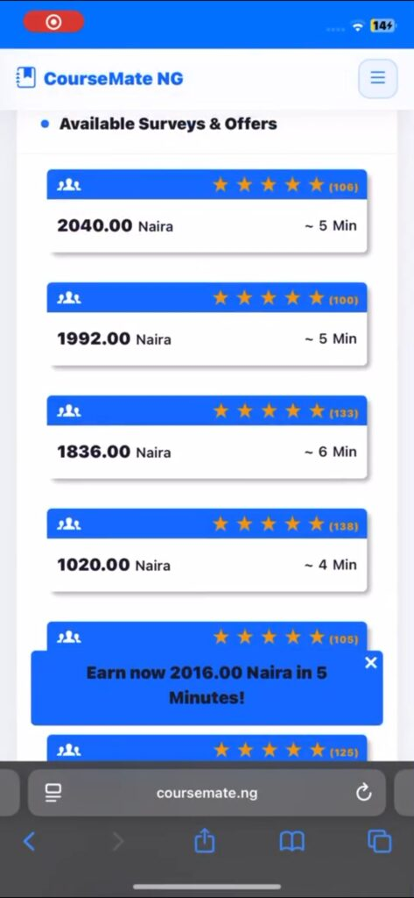
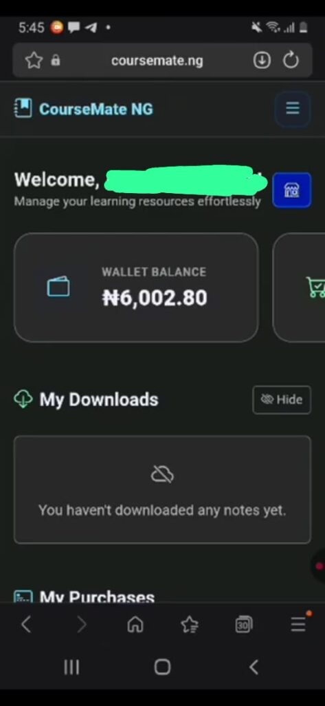
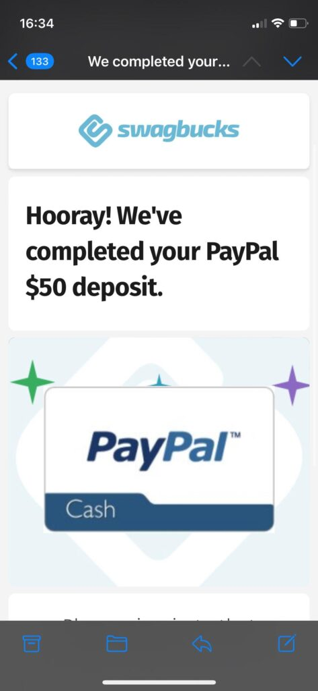
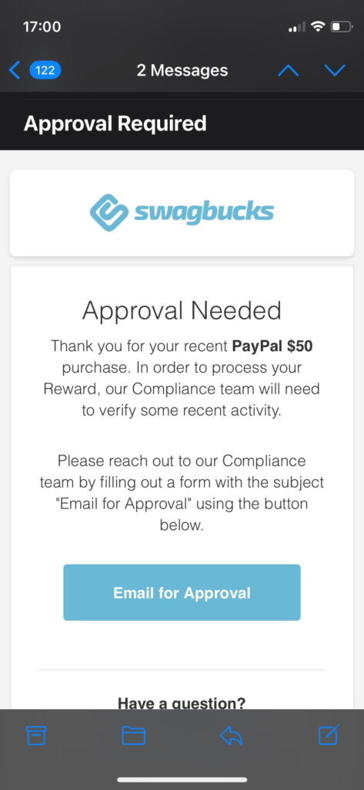
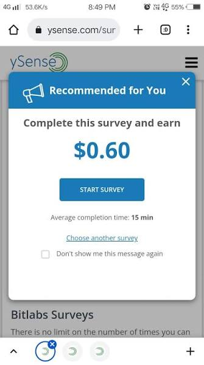
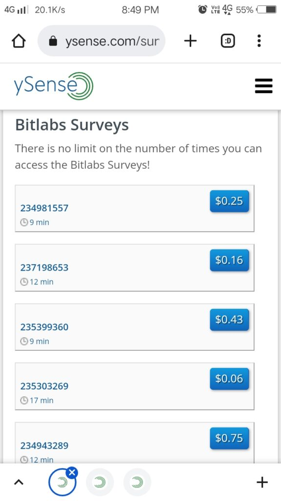
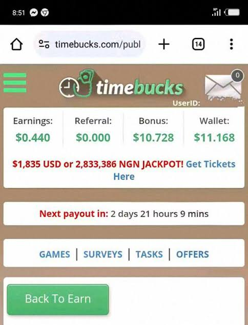
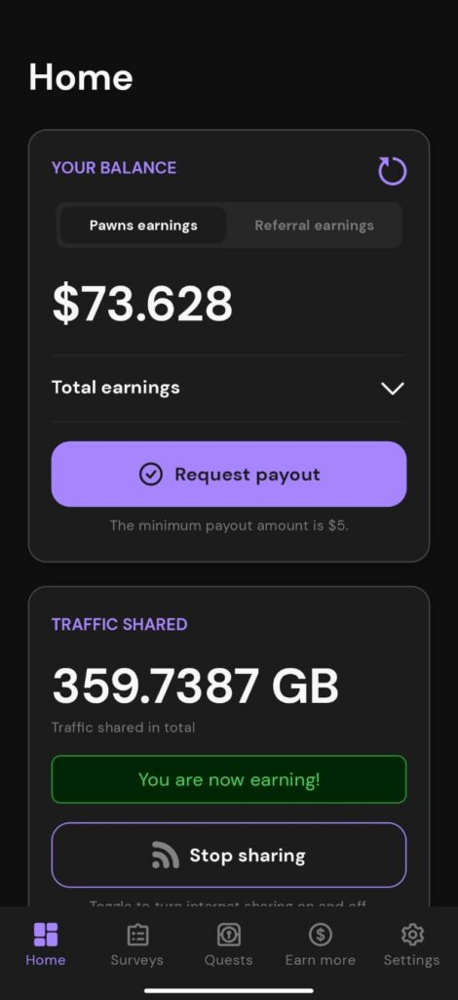
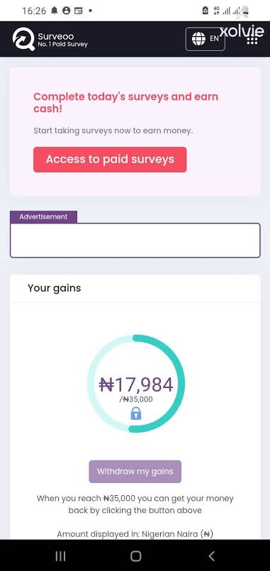

Most survey sites were built for Americans, Canadians etc. This list is different because these are platforms verified to work in Nigeria in 2026, pay without drama, and won't waste your time. They are among the best survey sites in Nigeria.

1. CourseMate NG was built _for_ Nigerians from the ground up by IG Technology, and that difference shows immediately when you see the payout method straight to your Nigerian bank account, powered by Paystack. No PayPal drama, no conversion stress. The platform lets you earn in multiple ways like completing daily surveys, playing games, promoting products as an affiliate, or selling your own digital content like books and courses. [CourseMate NG](https://coursemate.ng/) For creators the deal is especially good you keep 100% of your content sales with zero platform commission, and receive 90% of every gift your fans send you visit coursemate.ng to be part.

Some users have Testified its a good platform

2\. OpinionPadi -- **Best for Direct Naira Payout**

Many people have found success with these survey sites in Nigeria, making it a reliable option for extra income.

If you've ever been frustrated watching your survey earnings sit in a PayPal account you can't access in Nigeria, OpinionPadi was built specifically to fix that problem. It's a Nigerian-owned platform that pays directly to your local bank account in Naira, making it the most friction-free payout experience on this entire list. The minimum withdrawal is just ₦1,000 which means you don't have to wait long before seeing real money. Surveys are straightforward, the interface is clean, and there's no foreign payment headache involved whatsoever. For any Nigerian who wants to start earning from surveys without dealing with dollar conversions or blocked PayPal accounts, this is your starting point. visit opinionpadi.com

3\. **Swagbucks** —

Swagbucks has been around since 2007 and has paid out hundreds of millions of dollars to its members globally that track record alone sets it apart from newer platforms. What makes it special is that you're not limited to surveys — you can also earn by watching videos, shopping online, and playing games, so there's almost always something available regardless of whether you qualify for a survey. Points are called SB and every 100 SB equals $1. Cashout starts as low as $5 via PayPal or gift cards. Nigerian users are accepted and the platform consistently delivers on payments.

you can make more research about this from other media sources and visit their website to start swagbucks.com

3\. **ySense — Best for Multiple Payout Options**

ySense has built a reputation as one of the most reliable international survey platforms that actually works for Nigerians. Beyond surveys, it includes paid offers, sign-in bonuses, and a referral program — plus it pays out via PayPal, Payoneer, and Skrill giving you real flexibility on how you receive your money. Payoneer in particular is a strong option for Nigerians who want to receive dollars cleanly. The platform has been around for years and has a large community of Nigerian users who regularly share payment proof online, which tells you everything you need to know about its legitimacy their url is ysense.com

4\. **Timebucks** — timebucks.com

Timebucks stands out because surveys are just one of many ways to earn on the platform. You can also earn by watching online content, completing social media tasks, signing up for offers, playing games, and referring friends — and the payout threshold is just $3 via crypto, Skrill, PayPal, or bank transfer through Wise. That low threshold means you're cashing out regularly rather than watching a balance build slowly. For anyone who gets bored or disqualified from surveys often, Timebucks always has an alternative earning method waiting.

5\. **Triaba — Best Survey Pay Rate**

Triaba is a Norwegian company operating survey panels across 86 countries including Nigeria. It works with major global brands who specifically want to know what Nigerian consumers think about their products, which means the surveys are targeted and the pay rate is above average compared to most platforms. You don't even need to log in constantly — surveys come directly to your email inbox and you complete them at your own pace. Minimum cashout is $10 via PayPal or gift cards including Jumia which is a thoughtful local touch. Patience is required since surveys don't flood in daily, but when they do arrive they pay well.

6\. **Pawns.app — Best for Crypto Payout**

Pawns.app is a legitimate platform developed by IPRoyal and it works differently from most survey sites in one interesting way — beyond surveys you can also earn passively just by sharing your unused internet bandwidth in the background while your phone or computer is online, meaning money comes in even when you're not actively doing anything. Surveys pay around $1 each and you can cash out once you hit $5 in Bitcoin or Visa gift cards. No skills needed, no complex setup. If you're comfortable with crypto payouts this is one of the cleaner options available to Nigerian users

7\. **SurveyLama — Best Clean Interface**

SurveyLama is a newer platform that has quietly built a solid reputation among Nigerian users for one simple reason — it does exactly what it promises without confusion. The interface is clean, surveys arrive by email so you complete them on your own schedule, and the payout options are genuinely wide including PayPal, bank transfer via Wise, crypto, Skrill, and Visa payout. The threshold is low enough that you're not waiting months to cash out. Complete your profile thoroughly when you sign up because that directly determines the quality and frequency of surveys you receive.

8\. **Surveoo — Best Survey Volume**

Surveoo is one of the newer survey platforms available in Nigeria and gives access to more paid surveys than most other sites, making it a good choice if your main frustration with survey sites is not having enough surveys to complete. Surveys typically take between ten and twenty minutes and pay anywhere from a few cents to several dollars depending on length. One small but genuinely appreciated feature — even if you get disqualified from a survey midway, Surveoo still compensates you a few cents for your time. Minimum cashout is $20 via bank transfer or gift cards.

9\. **TGM Panel — Best for Nigerian Consumer Surveys**

TGM Panel Nigeria was built specifically around collecting Nigerian consumer opinions for major African and global brands, meaning the surveys you receive are actually relevant to your daily life as a Nigerian rather than generic Western consumer questions. You earn up to $2.50 per completed survey which is decent for the time investment. Minimum cashout is $10 via PayPal or gift cards. Registration is straightforward — fill in your basic details, verify your email, and surveys start coming in. A solid addition to your survey portfolio especially for the locally relevant content.

10\. **Mobrog — Best Entry Level Option**

Mobrog is a simple, no-frills survey platform that works reliably for Nigerian users. Surveys are focused on consumer and lifestyle topics, the interface is mobile-friendly, and the regular survey flow means you're always finding something to complete. What makes it a solid entry-level choice is the regular surveys and straightforward PayPal payouts without unnecessary complications. It won't overwhelm you with too many options or confusing reward systems — sign up, answer surveys, get paid. Sometimes simple is exactly what you need especially when you're just starting out with survey earning
