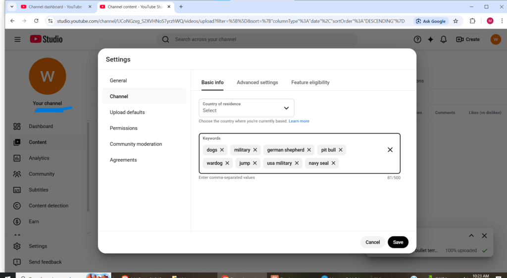
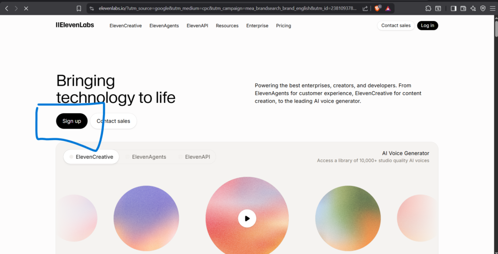
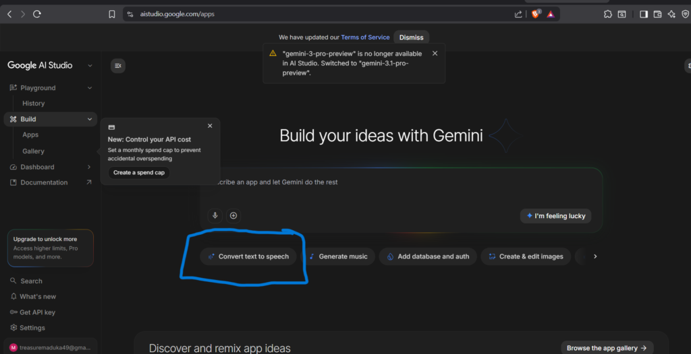
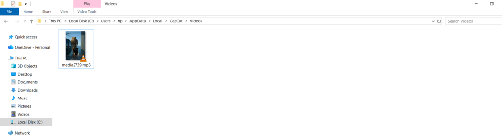
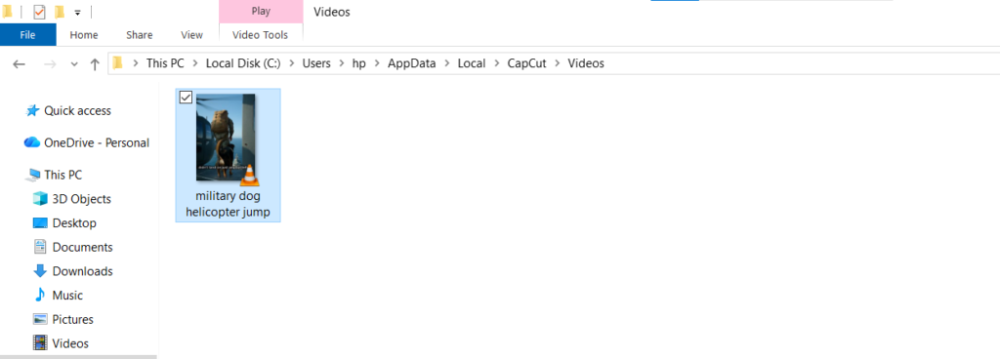
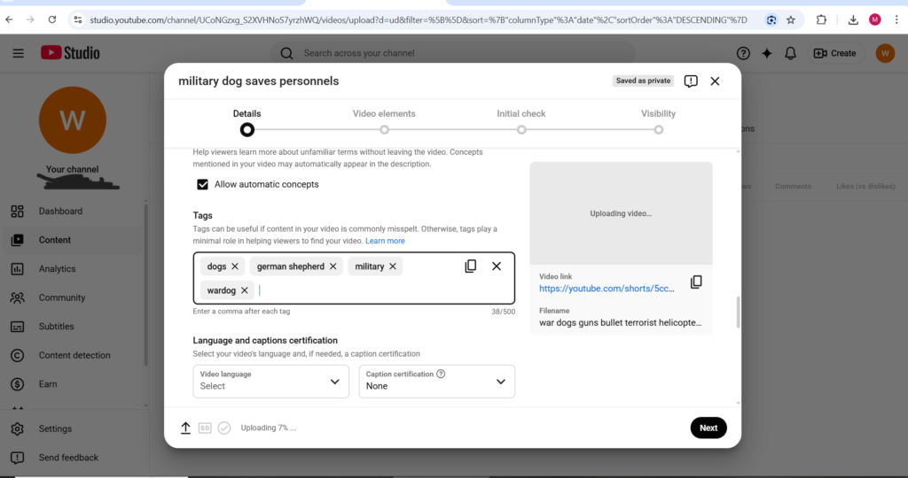

Welcome to the only free YouTube automation course you need in 2026. This course is structured like a premium program, step by step, from beginner level to building a profitable faceless YouTube channel. No fluff, no upsells, and no hidden tricks. Just a complete system designed to help you build a channel that generates income consistently.

Before we begin, understand this clearly. YouTube automation is not a shortcut to instant wealth. It is a real business model that rewards strategy, consistency, and patience. The creators making serious money with faceless channels in 2026 are not lucky people who found a hack. They are people who built systems, stayed disciplined, and allowed those systems to grow over time. This course gives you that framework.

YouTube automation is simply the process of running a channel without showing your face. Instead of creating every part of the content yourself, you use systems, tools, or outsourced help for scripting, voiceovers, editing, thumbnails, and uploads. You do not need expensive equipment or a studio setup. What you need is a scalable system, and this course will show you exactly how to build one from scratch.

**KEY THINGS YOU WILL LEARN**

i. Why u may not be getting views

ii. Best time to upload videos for best results (From personal experience)

iii. Some of the best niches

iv. How to set your channel

And many more... **Lock in now!**

**Module 1: What Is YouTube Automation and How Does It Work**

YouTube automation is built on one principle: separating channel ownership from doing every task yourself. Traditional creators handle scripting, recording, editing, thumbnails, and uploads manually. Automation creators build systems where those tasks are managed through AI tools, simple software, or freelancers, allowing the owner to focus on strategy, growth, and scaling.

It is also important to understand that YouTube automation is not entirely dependent on AI. Many successful faceless channels operate without advanced AI tools at all. Movie recap channels rely on editing and copyright-safe sourcing. Tutorial channels use screen recordings and narration. Compilation channels depend on strong curation and simple editing tools like CapCut. AI simply makes production faster and easier for creators who want to scale efficiently.

The earning potential is significant when the channel is built correctly. Faceless channels in high-CPM niches generate revenue through AdSense, affiliate marketing, sponsorships, and digital products. A well-optimized channel can realistically scale into thousands of dollars per month, but those results come from consistent uploads, strong niche selection, and a repeatable content system not overnight success.

YouTube automation is fully legal when done properly. Outsourcing editing, using AI voiceovers, and hiring freelancers are standard practices used across the media industry. The key is creating original content. Avoid re-uploading copyrighted videos, using unlicensed music, or publishing misleading content.

One major update for 2026 is that YouTube now requires creators to disclose realistic AI-generated content, including synthetic faces or voices. This course will show you exactly how to handle those disclosures correctly while staying compliant with platform policies.

**Module 2: Choosing Your Niche**

Niche selection is the single most important decision you will make in your entire YouTube automation journey. The wrong niche means low earnings per thousand views, slow growth, and an uphill battle for every subscriber. The right niche means higher ad revenue, easier sponsorship deals, faster monetization, and a channel that grows on momentum that builds itself over time.

The metric that determines how much your YouTube automation channel earns from ads is called CPM (cost per mille) which is how much advertisers pay per thousand views of their ads on your videos. The highest paying YouTube automation niches in 2026 are Finance, SaaS software reviews, Real Estate, and AI Tutorials with CPMs of $20 or more per thousand views. Compare that to entertainment or gaming channels which commonly earn between $1 and $4 CPM and the financial difference at scale becomes enormous.

Here are the top verified YouTube automation niches in 2026:

Personal Finance and Investing covers budgeting, debt payoff, passive income ideas, stock market basics, and retirement planning. This niche has one of the highest CPMs on the entire platform because financial services advertisers pay premium rates to reach this audience. Every country in the world has people who need help managing money making this a genuinely global YouTube automation opportunity regardless of where you are based.

Artificial Intelligence and Technology covers AI tools, software reviews, tech tutorials, and automation guides. This niche is exploding in 2026 because the audience is large, engaged, and growing daily as more people try to understand and use AI in their lives and businesses. Advertisers in this space pay extremely well and the content stays relevant long after it is published.

Health and Wellness covers mental health topics, sleep improvement, fitness for beginners, and nutrition basics. This niche has broad appeal, strong advertiser demand, and content that ages well without requiring constant updates to remain relevant.

True Crime and Mystery is one of the highest viewed YouTube automation niches globally because human psychology is naturally drawn to these stories. Stock footage and AI narration work particularly well in this niche and videos regularly accumulate millions of views organically without paid promotion.

History and Biography covers historical events and notable figures in educational formats. Long watch times, strong audience retention, and content that remains relevant indefinitely without needing updates make this one of the most sustainable YouTube automation niches available.

Motivation and Self Improvement covers stoicism, productivity, success mindset, and morning routines. Extremely high watch times because viewers return repeatedly. Strong affiliate marketing potential alongside AdSense earnings.

Business and Entrepreneurship covers how to start a business, side hustles, and online income strategies. This niche directly overlaps with the audience reading financial and online earning content making it particularly powerful for cross-promotion and affiliate commission earnings.

Movie Clips and Compilations requires only basic editing skills and copyright-safe sourcing. This is one of the most beginner friendly YouTube automation niches because no scripting, voiceover, or AI tools are needed just good curation and clean editing.

Software and Tool Tutorials requires only a screen recorder and clear narration. If you know how to use any software tool that other people are trying to learn, screen recording tutorials are one of the fastest YouTube automation channels to build and monetize.

If you talk about everything YouTube will not know who to show your videos to. A specific niche helps the algorithm find your perfect audience quickly and distribute your content to exactly the people most likely to watch, subscribe, and return.

* * *

**Module 3: Setting Up Your YouTube Automation Channel**

Setting up your YouTube automation channel correctly from the beginning saves you significant time and trouble later. Here is the exact setup process:

Go to youtube.com and sign in with a Google account. Click your profile picture and select Create a Channel. Choose a channel name that reflects your niche without being too specific you want room to grow within the niche without the name becoming limiting. A finance YouTube automation channel called MoneyMind or WealthWise has more flexibility than one called StockTipsDaily which locks you into a narrow sub-topic.

Complete your channel description thoroughly using keywords your target audience searches for. YouTube uses your channel description to understand what your content covers and who to recommend it to. Write between three and five sentences explaining what your channel is about, who it helps, and what kind of content subscribers can expect.

Upload a professional channel banner and profile picture. For a faceless YouTube automation channel your banner should clearly communicate your niche visually without requiring your face. Canva has free YouTube banner templates specifically designed for faceless channels. The banner dimensions YouTube recommends are 2560 by 1440 pixels.

Set up your channel trailer, A short video of between 60 and 90 seconds that plays automatically when new visitors land on your channel page. It should explain who the channel is for, what kind of content you post, and why they should subscribe. This trailer converts casual visitors into subscribers more effectively than any other single element on your channel page.

* * *

**Module 4: Adding Keywords to Your Channel via YouTube Studio**

This step is one of the most overlooked optimization moves in YouTube automation and it directly impacts how YouTube categorizes and distributes your channel to new viewers. Channel keywords tell YouTube's algorithm exactly what your channel is about at a global level so it knows which audiences to recommend your videos to.

Here is how to add channel keywords in YouTube Studio:

Go to studio.youtube.com and log in. Click Settings in the left sidebar. Click Channel in the settings menu that appears. Click the Basic Info tab. You will see a field labeled Keywords. Type in the keywords that best describe your channel separated by commas. For a finance YouTube automation channel you might add keywords like personal finance, passive income, money tips, investing for beginners, financial freedom, and side hustles. For a technology channel you might add AI tools, tech tutorials, software reviews, and productivity tips. Click Save when done.

<figure>

<figcaption>

**KEYWORDS SAMPLE (WRITE BASED ON NICHE YOU'RE DOING)**

</figcaption>

</figure>

These channel keywords do not appear publicly anywhere on your channel. They work invisibly in the background telling YouTube's algorithm how to classify your content and which viewer segments to show your videos to. Setting them correctly from the beginning gives your YouTube automation channel a meaningful head start on distribution compared to channels that skip this step entirely. **How to get there** https://studio.youtube.com/> login into your acct> click settings> click channel> keywords> after each word put comma (,) then write the next

* * *

**Module 5: The Tools That Power Your YouTube Automation Channel**

The tools you use determine both the quality of your content and the speed at which you can produce it consistently. Here is the complete tool stack for a YouTube automation faceless channel in 2026 broken down by what each tool handles:

For script writing, ChatGPT at chat.openai.com is the most widely used AI writing tool for YouTube automation scripts. Use it to generate full video scripts, hooks, titles, and descriptions. The free version is capable enough to get started immediately. Claude at claude.ai is particularly strong for long-form story-driven scripts that feel natural and human, Many YouTube automation creators use Claude specifically because the output reads less robotically than other AI writing tools.

For voiceover generation, ElevenLabs at elevenlabs.io is the industry standard for AI voiceover in YouTube automation

But i also think google ai studio is really good and underrated the url is [aistudio.google.com](http://aistudio.google.com) .

It produces realistic human-sounding voices in multiple languages and accents. The free tier gives you enough characters monthly to produce several videos. Paid plans unlock voice cloning which lets you create a consistent branded narrator voice for your channel that sounds identical across every single video you publish.

For video creation and editing, InVideo AI at invideo.io is one of the most complete YouTube automation video creation platforms available. Input your script and InVideo AI generates a full video with stock footage, voiceover, captions, and music automatically. CapCut at capcut.com is a free video editing tool with strong AI features including automatic captions, background removal, and template-based editing. It is the most popular editing tool among YouTube automation creators working on a budget.

For thumbnail creation, Canva at canva.com is the standard tool for creating YouTube thumbnails for faceless automation channels. It has specific YouTube thumbnail templates at the correct 1280 by 720 pixel dimensions.

For keyword and SEO research, VidIQ at vidiq.com is a YouTube-specific keyword research and analytics tool that shows search volume, competition level, and trending topics in your niche. TubeBuddy at tubebuddy.com offers similar features with strong A/B testing capabilities for titles and thumbnails. Many successful YouTube automation creators use both tools simultaneously.

Starting a faceless YouTube automation channel in 2026 can cost as little as $1 to $3 per video using AI tools with no camera, studio, or freelancers required. The ultra budget stack for a new YouTube automation channel is ChatGPT free for scripts, ElevenLabs starter at $5 per month for voiceover, and CapCut free for editing — a complete production pipeline for under $10 per month.

* * *

**Module 6: Creating and Uploading Your Video — Full Optimization Guide**

This module covers the complete upload process including every optimization step that most YouTube automation guides skip entirely. Getting these details right from your very first video gives your channel a significant advantage over the majority of creators who upload without optimizing properly.

**Naming Your Video File Before Uploading**

This is a small but meaningful optimization step that almost nobody talks about. Before you upload your video file to YouTube rename it using your target keywords separated by spaces. For example if your video is about how to save money on a tight budget rename the file to something like how to save money tight budget tips 2026 before uploading it. YouTube's system reads the filename when you upload and uses it as an additional signal to understand what your video is about. It takes ten seconds to do and gives your video an extra keyword signal that most creators completely overlook.

You can see a real example of this in the screenshot below — notice the filename field showing keyword-rich descriptive text rather than a generic name like video001 or untitled.

<figure>

<figcaption>

**BEFORE**

</figcaption>

</figure>

<figure>

<figcaption>

**AFTER**

</figcaption>

</figure>

The video is about a military dog jumping off an helicopter so i name the file that way also, This is said to help in easy location of the video in that niche.

**Writing Your Title**

Your video title is the single most important text element on your entire video. It determines your search ranking and your click-through rate simultaneously. Your target keyword should appear in the first few words of the title naturally. Titles between 60 and 70 characters perform best because they display fully in YouTube search results without being cut off. Numbers and specific details in titles consistently outperform vague titles — "7 Ways to Save Money This Month" outperforms "How to Save Money" every time.

**Writing Your Description**

Your video description should be between 200 and 500 words for long form videos. Include your target keyword in the first two sentences naturally. Write the description as genuinely useful supplementary content that adds value beyond what the video covers — timestamps, additional resources, related links, and a brief summary of what the video covers. YouTube indexes your description text for search so every keyword that appears naturally in your description is an additional ranking signal working in your favor.

**How to Add the AI Disclosure to Your Description**

YouTube requires creators to disclose when a video contains realistic AI-generated content including AI voices, AI-generated faces, or AI-altered footage that could be mistaken for real events or real people. Failing to disclose when required can result in YouTube adding its own label to your video or in serious cases restricting your content.

The disclosure is simple and takes three seconds to add. At the very end of your video description after all your other content add this line:

This video was created with the assistance of AI tools.

That single sentence covers your disclosure requirement cleanly and professionally without making it the focus of your description. You can also tick the AI-generated content disclosure checkbox that YouTube provides during the upload process in the Details section — doing both the description disclosure and ticking the checkbox is the safest approach for YouTube automation creators using AI voices or AI-generated visuals.

**Adding Tags**

Tags on YouTube in 2026 play a smaller role in discovery than they did in earlier years YouTube's own guidance acknowledges that tags are most useful when your content topic is commonly misspelled or has multiple name variations. However tags still provide a useful secondary keyword signal and take less than a minute to add so there is no reason to skip them.

Add between five and eight relevant tags per video. Your first tag should always be your exact target keyword phrase. Subsequent tags should be closely related variations and broader category terms. For a video about how to save money your tags might be save money, money saving tips, personal finance, budgeting tips, financial freedom, and how to budget. Do not add irrelevant tags trying to hijack traffic from unrelated popular videos YouTube's algorithm detects this and it can actually suppress your video's distribution.

You have 500 characters available for tags. You do not need to use all 500 — five to eight well chosen tags is more effective than twenty loosely related ones.

Where to find it: https://studio.youtube.com/>create> upload videos> select file> scroll down, click show more > tags > after each word put a comma, then next

**Selecting Your Thumbnail**

Upload a custom thumbnail rather than using YouTube's auto-generated options. Custom thumbnails consistently generate higher click-through rates than auto-generated ones because you can design them specifically to be visually striking and contextually relevant to your target audience. YouTube recommends 1280 by 720 pixels in JPG or PNG format under 2MB file size.

**Adding to a Playlist**

Add every video you publish to at least one relevant playlist on your channel. Playlists increase session watch time because YouTube automatically plays the next video in the playlist after the current one ends — meaning a viewer who finishes your video continues watching your channel rather than leaving. This extended session time signals strong audience satisfaction to YouTube's algorithm and improves your overall channel distribution.

**Setting Your Language and Caption Certification**

Select your video language in the Language and Captions Certification section during upload. This helps YouTube surface your content to the right geographic audience. If your content is in English select English. If you have added closed captions or subtitles select the appropriate certification level.

* * *

**Module 7: The Best Time to Post on YouTube for Maximum Views**

Posting time matters more than most YouTube guides admit and the insight behind it is not complicated once you understand the logic.

Through direct personal experience posting at different times of day, videos posted between 12pm and 2pm UTC consistently outperform videos posted at night by a significant margin. Here is exactly why this happens.

When you post a video YouTube immediately begins distributing it to a sample audience to measure initial engagement click-through rate, watch time, likes, and comments in the first one to three hours after publishing. This initial engagement data is what determines whether YouTube pushes the video to a wider audience or pulls back its distribution. If your video gets strong early engagement signals YouTube treats it as content worth recommending broadly. If early engagement is weak YouTube limits its reach.

Posting between 12pm and 2pm UTC puts your video in front of viewers across multiple active time zones simultaneously during that critical early distribution window. At 12pm UTC it is 1pm in Nigeria and West Africa, 12pm in the UK, 1pm to 3pm across Europe, 7am on the US East Coast, and 4am on the US West Coast. That means your video immediately reaches a combined audience of hundreds of millions of potential viewers who are actively browsing YouTube during their lunch breaks, commutes, and morning routines all at the same time.

Posting at night in your local time zone means your video launches into a much smaller active audience. The early engagement signals are weaker because fewer people are browsing at that hour globally. YouTube interprets the weaker signals as lower quality content and reduces distribution before your primary audience even wakes up.

The practical takeaway is straightforward. Finish and schedule your videos to go live between 12pm and 2pm UTC regardless of what time it is where you are located. Most YouTube automation creators upload whenever the video is ready without thinking about timing. That small scheduling habit consistently generates meaningfully more views from the same quality video simply by hitting the platform when the most people are actively watching.

For day of the week, Tuesday through Thursday consistently outperform Monday and the weekend for most niches because viewer intent is higher during midweek. Weekend posting can work well for entertainment and lifestyle niches where viewers browse more casually but finance, education, and business content performs strongest on weekdays when viewers are in a learning and productivity mindset.

* * *

**Module 8: Growing Your YouTube Automation Channel**

Publishing videos is only half the work of building a successful YouTube automation faceless channel. Growing requires understanding how YouTube's algorithm distributes content and optimizing every element of your videos to work with that algorithm rather than against it.

YouTube's algorithm prioritizes two metrics above almost everything else — click-through rate and watch time. Click-through rate is the percentage of people who see your thumbnail in their feed and actually click it. Watch time is how much of your video people watch before leaving. A video with a high click-through rate but poor watch time tells YouTube that viewers were curious enough to click but disappointed enough to leave — and YouTube stops recommending it. A video with strong watch time signals genuine value and causes YouTube to distribute it to progressively more people organically.

Your title and thumbnail drive click-through rate. Your script quality and pacing drive watch time. Both need to be strong for YouTube automation to work at scale and neither can compensate for a serious weakness in the other.

YouTube Shorts is a powerful growth accelerator for YouTube automation faceless channels in 2026. Shorts monetization has matured and you can repurpose long form content into Shorts using tools like OpusClip or Vidyo.ai which automatically find the most engaging clips and reformat them vertically. A single long form video can generate three to five Shorts that each independently drive views and subscribers back to your main channel creating a compounding growth loop from a single piece of content.

Consistency is more important than perfection in the growth phase of a YouTube automation channel. A channel that publishes two videos per week every week for six months will outperform a channel that publishes ten videos in one month and then goes quiet. YouTube rewards consistency with consistent distribution and notices when channels slow down by proportionally reducing their reach.

* * *

**Module 9: Monetizing Your YouTube Automation Channel**

Monetization is the reason most people start a YouTube automation channel and in 2026 there are more ways to earn from a faceless channel than at any point in YouTube's history.

YouTube Partner Program AdSense is the foundation of most YouTube automation channel income. You need 1,000 subscribers and 4,000 watch hours or 10 million Shorts views in 90 days to qualify for monetization. Once approved ads play on your videos and you earn a percentage of the revenue generated. The amount varies significantly by niche, finance and technology YouTube automation channels commonly earn $15 to $40 per thousand views while entertainment channels earn $1 to $5 per thousand views.

Affiliate Marketing is frequently the highest earning monetization stream for YouTube automation channels, often exceeding AdSense revenue even on smaller channels. You include affiliate links in your video descriptions to products and services relevant to your content and earn a commission every time a viewer clicks and purchases. Every niche has relevant affiliate programs available and the income from a single well-placed affiliate link in a high-performing video can exceed an entire month of AdSense earnings from the same video.

Sponsorships become available as your YouTube automation faceless channel grows. Once your channel reaches 10,000 or more subscribers brands will approach you to feature their products. Even completely faceless channels land lucrative sponsorship deals regularly and some YouTube automation creators earn more from sponsorships than from all other monetization methods combined.

Channel Memberships allow your most loyal viewers to pay a monthly fee in exchange for exclusive perks including early access to videos, members-only posts, and exclusive content. This creates a recurring income stream on top of all your other monetization sources.

Digital Products including your own ebooks, courses, templates, and guides sold directly to your audience represent the highest margin monetization method available to YouTube automation channels. Your viewers already trust your content. Converting that trust into digital product sales requires no middlemen and keeps the maximum possible revenue from every transaction.

* * *

**Module 10: The Honest Reality of YouTube Automation in 2026**

Most YouTube automation courses skip the parts that are genuinely difficult. Understanding the real challenges before you start is what separates creators who build lasting faceless channels from those who quit after two months of slow results.

Most channels hit the YouTube monetization threshold in six to twelve months with consistent uploading. That timeline requires patience that most beginners dramatically underestimate when they start. The first sixty to ninety days of a new YouTube automation channel are almost always quiet low views, slow subscriber growth, and no revenue. This is completely normal and does not mean the channel is failing. It means YouTube's algorithm is still learning what your content is about and who to show it to.

The market is more crowded in 2026 but most people are producing low quality content. YouTube's algorithm now rewards videos that feel unique and genuinely valuable. You can consistently beat the competition by adding original perspective, better storytelling, and higher quality editing regardless of whether your content is AI-assisted or manually produced. AI-generated content that adds no unique value is being actively suppressed by YouTube's algorithm in 2026. Quality and genuine usefulness are what win every time.

Tax obligations are something most YouTube automation guides never mention. Income from YouTube automation channels is self-employment income in most countries and must be declared to the relevant tax authority. Set aside between 20 and 30 percent of every payment you receive to cover tax obligations. Starting this habit from your first payment prevents a painful and expensive surprise when your channel starts earning consistently.

The YouTube automation creators building real sustainable income in 2026 are those who treat the channel as a business from day one selecting niches strategically, investing in quality tools progressively, staying consistent through the slow early months, and continuously improving their content based on real analytics data rather than guesswork or gut feeling.

* * *

**Your YouTube Automation Action Plan**

Week one: choose your niche, create your channel, set up your tools, add your channel keywords in YouTube Studio

Week two: research your first five video topics using VidIQ, write your first three scripts, generate your voiceovers

Week three: create your videos, design your thumbnails, name your files correctly, schedule your first two uploads for 12pm to 2pm UTC

Week four: analyze early performance data, publish two more videos, optimize titles and thumbnails based on what the analytics actually show

Month two onward: publish consistently two to three times per week, build your content library steadily, track what performs best and produce more of it, apply for monetization when you hit the threshold

The system works. The timeline is real. The results are achievable for anyone willing to stay consistent through the early months when the numbers are small. Start with Module 1 and work through each module in order. Your YouTube automation faceless channel starts the moment you take the first action.
