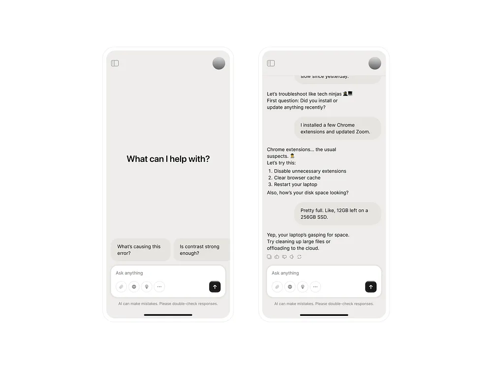
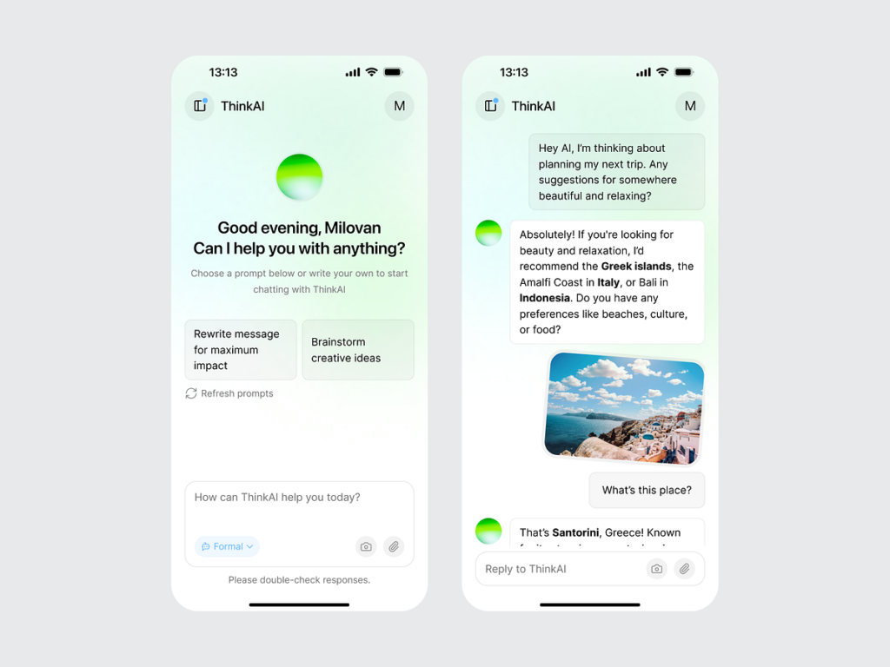
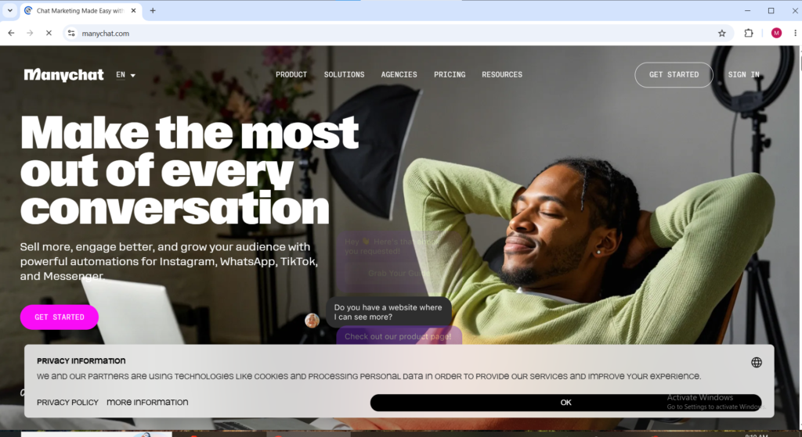
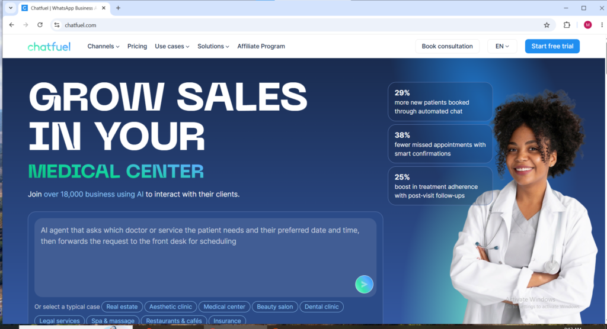
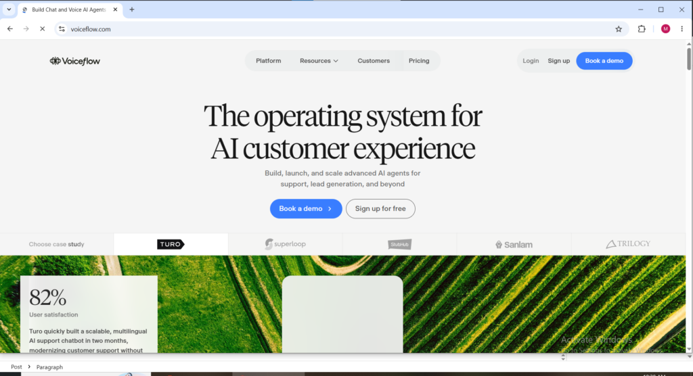
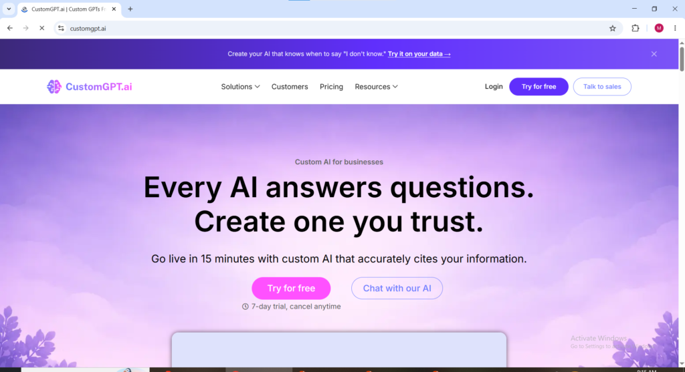
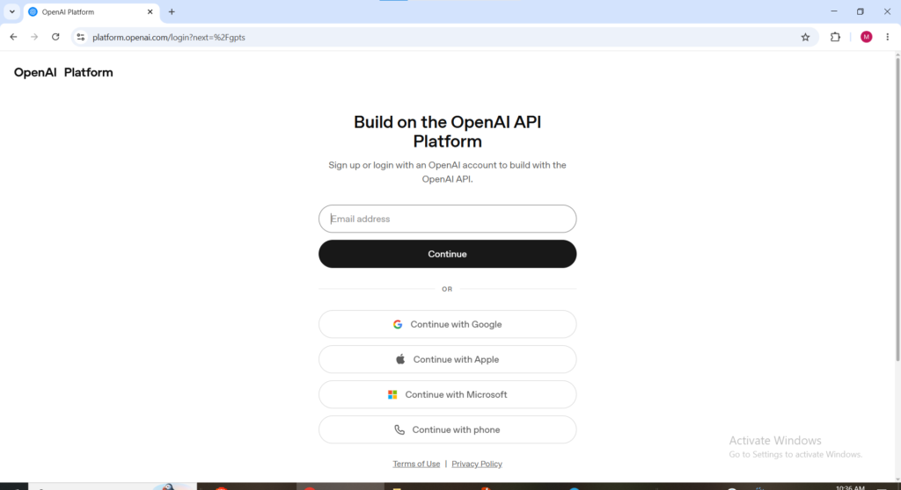
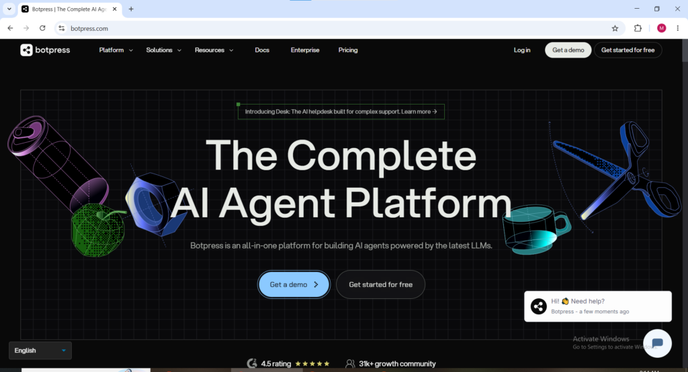

**What this post will Covers if you pay attention**

1. How to Build and Sell AI Chatbots and Make Money Online in 2026

3. What Is an AI Chatbot in Plain Language

5. Why This Is a Real Money-Making Opportunity in 2026

7. The No-Code Tools That Make This Possible Without Coding

9. Which Businesses Need AI Chatbots Most

11. How to Build an AI Chatbot for a Client Step by Step

13. Where to Find Paying Clients

15. How to Scale from One Client to a Real Income

17. What to Realistically Expect

1. **How to Build and Sell AI Chatbots and Make Money Online in 2026**

Picture this. It is 11pm on a Wednesday night. Someone is browsing a dentist's website looking for information about teeth whitening prices. They have a question. They look for a contact form, send a message, and go to bed. By the time the dentist's receptionist arrives at work the next morning and sees the message, that person has already booked with a different clinic that responded to them faster.

That dentist just lost a patient worth hundreds of dollars to a competitor who simply responded faster. And the frustrating part is that the question that cost them that patient was completely predictable. Whitening prices. Opening hours. Whether they accept a particular insurance. The same five questions that every new patient asks before booking.

Now imagine that same website had a small chat bubble in the bottom right corner. The visitor clicks it at 11pm. An automated response appears instantly. It answers the whitening question, shares the price range, explains the booking process, and offers to collect the visitor's phone number so the clinic can confirm an appointment in the morning. The visitor leaves their number. The clinic gets the lead. The competitor gets nothing.

That chat bubble is an AI chatbot. And building it took someone a few hours using free and low-cost tools that require absolutely zero coding knowledge. That person charged the dentist $600 for the setup and $150 per month to keep it running. That is the business model.

This post explains everything about how to build and sell AI chatbots to make money online in 2026 what they are in plain language, which tools to use, who the best clients are, how to price the work, and how to find paying clients starting from zero.

<figure>

<figcaption>

**AI CHATBOT SAMPLE**

</figcaption>

</figure>

* * *

2\. **What Is an AI Chatbot in Plain Language**

Forget the technical definition for a moment. An AI chatbot is simply a piece of software that has a conversation with a human being through text. It lives on a website, a Facebook page, an Instagram account, or a WhatsApp number. When someone sends a message or starts a chat, the chatbot reads what they wrote and sends back a relevant response automatically without any human needing to be present.

The difference between the chatbots of five years ago and the AI chatbots of 2026 is significant. Old chatbots could only respond to exact keyword matches, if a customer typed something slightly different from what the bot was programmed to recognize, it would give a useless generic response. Modern AI chatbots understand the intent behind what someone is saying even when the words are different from what was anticipated. A customer typing "how much does cleaning cost" and another customer typing "what are your prices for a clean" are asking the same question and a 2026 AI chatbot understands that and gives the same accurate answer to both.

In 2026 customers expect 24-hour responses, personalized interactions, and instant answers. Building a chatbot is not about being fancy, It is about meeting customers where they are. For a business owner this means never missing a lead because nobody was online. For the person building and selling these chatbots it means a service that every business with a website and a customer base genuinely needs.

* * *

3\. **Why This Is a Real Money-Making Opportunity in 2026**

The opportunity to build and sell AI chatbots is exploding because most small businesses desperately need automation but have no idea how to build it themselves. Restaurants, salons, gyms, real estate agents, clinics, and local stores are losing leads every single day simply because nobody replies fast enough after business hours. They know they need better customer communication, but they do not have the time or technical skills to set it up.

That is where the opportunity comes in. With modern no-code AI tools, a beginner can build a functional chatbot in just a few hours and charge anywhere from $500 to $2,000 for the setup alone. Very few online business models in 2026 offer that kind of income potential from such a small time investment.

The real power, however, is recurring income. Businesses constantly need updates, new responses, pricing changes, booking integrations, and ongoing improvements. That creates an opportunity to charge monthly maintenance fees of $100 to $500 per client. Just ten businesses paying $200 per month creates $2,000 in recurring monthly income before landing any new clients.

Demand is growing rapidly because AI chatbots are no longer viewed as a luxury feature. Businesses now see them as a necessity for staying competitive, capturing leads faster, and improving customer experience. The tools have become easier than ever to use, while the market demand continues to rise. Opportunities where the barrier to entry is low and the earning potential is high rarely stay open forever.

4\. **The No-Code Tools That Make This Possible Without Coding**

The most important thing to understand about building AI chatbots to make money online in 2026 is that coding knowledge is completely unnecessary. The platforms that power these chatbots handle all the technical work invisibly in the background. The chatbot builder works in a visual interface clicking, dragging, typing responses, and connecting conversation steps without ever touching a single line of code.

**Here are the main platforms used to build and sell AI chatbots in 2026:**

**ManyChat** [manychat.com](http://manychat.com)

ManyChat is the most widely used no-code chatbot builder for Facebook Messenger, Instagram, and WhatsApp. The visual drag-and-drop interface makes building conversation flows completely intuitive for beginners and the platform has hundreds of ready-made templates for common business scenarios that can be customized rather than built from scratch. A restaurant chatbot template, a lead generation template, an appointment booking template, The foundation is already built and just needs the specific business details added to make it functional. ManyChat's free plan demonstrates chatbot functionality clearly to potential clients and paid plans starting from $15 per month unlock the advanced features most business clients require for real deployment.

**Chatfuel** [chatfuel.com](http://chatfuel.com)

Chatfuel powers over a billion conversations every month and requires no prior knowledge of how to build a chatbot to get started. It connects natively with Facebook, Instagram, and Messenger and includes AI-powered response capabilities that allow the chatbot to understand and accurately answer questions that fall outside the predefined conversation flows the builder created. This flexibility is what makes Chatfuel particularly valuable for business clients whose customers ask unpredictable questions. A chatbot that can only respond to the exact scenarios the builder anticipated will frustrate customers quickly. A chatbot that understands the intent behind unexpected questions and responds appropriately keeps customers satisfied and reduces the number of conversations that require human intervention.

**Voiceflow** voiceflow.com

Voiceflow is designed specifically for building more sophisticated conversational experiences including website chatbots, voice assistants, and complex multi-step AI agent flows. Anyone from marketers to customer experience teams can learn how to build a chatbot using Voiceflow that delivers real value fast by designing real conversational flows using the platform's visual tools without writing a single line of code. Voiceflow is the right tool for chatbot builders who want to offer more complex and higher-value solutions to clients, The kind that command $1,500 to $3,000 in setup fees rather than the entry-level $300 to $600 range. The platform's ability to connect to external data sources and APIs makes it suitable for building chatbots that pull real-time business information and deliver dynamic personalized responses.

**CustomGPT.ai** customgpt.ai

CustomGPT.ai takes a different approach from the other tools on this list. Rather than building conversation flows manually, the platform allows users to train a chatbot specifically on a business's own knowledge base — uploading the business's website content, product documentation, FAQ pages, and service information to create a chatbot that answers questions accurately based on that specific business's actual information rather than generic responses. A dentist's chatbot trained on that specific clinic's prices, services, staff, and policies will answer patient questions far more accurately than a generic FAQ chatbot built without that specific context. That specificity is what business clients are willing to pay premium prices for because it means the chatbot genuinely represents their business in every conversation.

**OpenAI GPT Builder — Custom GPTs** [platform.openai.com/gpts](http://platform.openai.com/gpts)

If the other tools here feel overwhelming, start with this one. OpenAI’s GPT Builder is built into ChatGPT and lets anyone create a custom AI assistant in under 30 minutes using plain English instructions. No coding, drag-and-drop builders, or complicated setup required.

For beginners, it is the fastest way to go from zero to a working chatbot demo you can show clients the same day. You can build a sample GPT for a business, demonstrate how it answers customer questions, close the deal, then later rebuild it in platforms like ManyChat or Voiceflow for full deployment.

Custom GPTs can also be monetized beyond client work. Public GPTs can be listed in the GPT Store to attract users, build authority, and drive traffic to paid tools, subscriptions, or websites. Some developers reportedly earn $1,000–$5,000 monthly from GPT-powered wrapper products built on OpenAI’s infrastructure without custom coding.

**Botpress** botpress.com

Botpress is the most technically capable no-code chatbot builder on this list and is the platform of choice for builders who want to offer enterprise-grade solutions that command the highest prices. The platform provides more flexibility and customization than purely no-code tools and integrates with a wider range of business systems including CRMs, booking platforms, payment processors, and inventory management systems. Building a chatbot that connects directly to a business's existing operational tools and updates responses based on real live data is significantly more valuable to the client than a standalone conversational chatbot and Botpress is the platform that makes those integrations achievable without deep programming knowledge.

* * *

**Tidio, LiveChatAI, and Chatbase — Best for Quick Website Deployment**

[tidio.com](http://tidio.com) — [livechatai.com](http://livechatai.com) — [chatbase.co](http://chatbase.co)

Not every client needs a complex multi-platform chatbot with branching conversation flows and third party integrations. Some clients simply need something on their website that answers customer questions accurately and immediately without a human being present. For those clients Tidio, LiveChatAI, and Chatbase are the fastest and cleanest solutions available in 2026.

**_Tidio_** combines live chat and AI chatbot functionality in one platform making it particularly appealing to business clients who want the option of switching between automated responses and live human support within the same chat window. The AI component of Tidio is trained on the business's existing website content and documentation which means setup involves uploading information rather than building conversation flows manually. Clients who want a professional looking chat widget on their website that works intelligently from day one without a lengthy build process will respond well to a Tidio demonstration.

**_LiveChatAI_** works on the same principle — train the chatbot on the business's own content and deploy it to the website with a simple embed code. The platform is particularly clean and straightforward which makes it one of the easiest sells to non-technical business clients who are intimidated by software complexity. A simple demonstration showing how the chatbot accurately answers questions about their specific business using their own website content as the knowledge source consistently converts skeptical business owners into paying clients faster than any other approach.

**_Chatbase_** is the most widely discussed of the three in 2026 creator and developer communities for good reason. Uploading files, connecting sources like websites or URLs, and having a functional chatbot live takes minutes rather than hours and the platform supports multiple AI models including GPT-4o, Claude, and Gemini giving the builder genuine flexibility in which AI powers the responses. For chatbot builders who want to offer fast turnaround website chatbot deployments to clients at a lower price point, Chatbase is the tool that makes a two-hour project genuinely achievable without cutting corners on quality. [Pawns.app](https://pawns.app/surveys/paid-surveys-in-nigeria/)

All three platforms offer free tiers adequate for client demonstrations and affordable paid plans for production deployments. Sign up for all three, build demonstration chatbots trained on a fictional or real business, and have those demos ready to show prospective clients on demand. A live demonstration of a chatbot that accurately answers questions about a client's specific industry closes sales faster than any written proposal.

5\. **Which Businesses Need AI Chatbots Most**

Understanding which businesses are the most ready and willing to pay for a chatbot is the foundation of finding clients efficiently. The businesses that represent the best prospects for selling AI chatbot services are those that receive high volumes of repetitive customer questions, operate beyond normal business hours, or are visibly losing leads because their response time is too slow.

Dental and medical practices are among the highest-value chatbot clients available. Reception staff at these businesses spend enormous portions of their working day answering the same patient questions about appointment availability, pricing, insurance, and location that a chatbot could handle instantly at any hour. The time saved for clinical staff combined with the improved patient experience makes the value of a well-built chatbot immediately obvious to any practice manager who understands what their reception team actually spends time on.

Real estate agents and property agencies need chatbots that can answer property questions from potential buyers and renters around the clock, qualify interested parties based on their budget and requirements, and schedule viewings automatically without the agent being personally available. A real estate agent receiving dozens of inquiries daily from property listings cannot personally respond to every message instantly a chatbot that handles that volume consistently and immediately converts significantly more inquiries into booked viewings.

Restaurants and hospitality businesses need chatbots handling reservation questions, menu inquiries, dietary information, event booking, and operating hours through Facebook, Instagram, WhatsApp, and their websites without requiring staff to monitor every channel simultaneously.

Local service businesses including plumbers, electricians, cleaning companies, and landscaping services lose leads constantly because they are physically on jobs during the hours when new customers are trying to reach them. A chatbot that instantly responds to price inquiries, collects the caller's details, and explains the booking process keeps those leads warm rather than losing them to faster-responding competitors.

E-commerce stores of any size benefit from chatbots that handle order tracking questions, return policy inquiries, and product recommendations automatically without requiring a human customer service agent to be available around the clock.

* * *

6\. **How to Build an AI Chatbot for a Client Step by Step**

The process of building and deploying an AI chatbot for a paying client follows the same fundamental steps regardless of which platform is used. Understanding this process clearly allows the chatbot builder to confidently set expectations with clients, deliver consistent results, and manage projects efficiently.

The first step before opening any chatbot tool is understanding what the specific business actually needs. A brief call or message exchange with the client asking what questions customers most commonly ask, what actions the business wants customers to be able to complete through chat such as booking or price inquiries, what tone of voice fits the brand, and which platforms :- website, Facebook, WhatsApp, Instagram the chatbot should live on produces all the information needed to build something genuinely useful. A chatbot built without this context will be generic and miss the specific problems the business is trying to solve.

The second step is mapping the conversation before building anything. On paper or in a simple document write out the main paths the chatbot conversation will follow. What does a customer typically send first? What options or information does the chatbot offer in response? What happens if the customer asks something outside the main anticipated paths? Planning this conversation map upfront means the build phase is simply translating that plan into the chatbot platform rather than figuring out the logic in real time.

The third step is building the chatbot in the chosen platform using the conversation map as a blueprint. Start with the most common and important customer questions and build outward from there. Test each path as it is built rather than building everything first and testing at the end catching problems early saves significant time compared to debugging a completed build.

The fourth step is thorough testing before handing anything over to the client. Spend real time going through every conversation path manually trying to find responses that do not make sense, dead ends where the conversation stops without resolution, and questions that the chatbot handles poorly. Having someone completely unfamiliar with the build test it and share honest feedback about anything that confused them is one of the most valuable quality checks available before delivery.

The fifth step is deploying the chatbot to the client's chosen platforms installing the chat widget on their website using the embed code the platform provides, connecting the chatbot to their Facebook page or WhatsApp Business account through the platform's integration settings. Most platforms provide straightforward installation instructions requiring no technical expertise to follow.

* * *

7\. **How to Price AI Chatbot Services**

Most beginners significantly undervalue their chatbot building work when starting out and this is one of the most common reasons chatbot building businesses fail to generate meaningful income, The price is simply too low to build a sustainable client base from.

A practical and realistic starting price for building and selling AI chatbots is $300 to $1,000 for the initial setup plus $100 to $500 per month for ongoing management and maintenance. These are entry-level rates for simpler chatbot builds. More complex chatbots with multiple platform integrations, custom API connections, or advanced conversational flows command $1,500 to $5,000 for setup with proportionally higher monthly management fees.

The monthly retainer model is the most financially sustainable pricing structure for building a chatbot business. Rather than delivering a one-time project and moving on to find the next client, the retainer model means every delivered chatbot continues generating income month after month. The chatbot requires ongoing maintenance as the business's prices, services, and hours change. It needs monitoring to ensure it is performing correctly. It benefits from improvements as more customer conversation data reveals what works and what does not. All of that ongoing value justifies and supports a recurring monthly fee that compounds into meaningful income as the client base grows.

* * *

8\. **Where to Find Paying Clients**

Finding clients is the step that converts chatbot building from a skill into an income. The most effective approaches for finding paying clients when starting out are direct outreach to local businesses, freelance platforms, and social media positioning.

Direct outreach to local businesses in high-need categories is consistently the fastest path to a first paying client. Identifying restaurants, clinics, real estate agencies, and service businesses in any city that have websites but no visible chatbot, then reaching out by email or phone with a brief message explaining specifically how a chatbot would help their business and offering a demonstration is a straightforward and low-cost approach that converts well because the value proposition is immediately obvious to the right business owner.

Focusing freelance efforts on a niche helps build expertise and makes marketing chatbot services much more effectively — lead generation bots for real estate agents, FAQ bots for e-commerce stores, appointment booking bots for local service providers are all clearly defined packages that business owners in those niches immediately understand and recognize the value of.

Fiverr is the most accessible platform for selling AI chatbot services online without an existing reputation or client base. Creating a specific gig offering chatbot building for business websites, Facebook pages, or WhatsApp with a clear description of what the chatbot will do for the client, examples of previous builds, and competitive introductory pricing generates inquiries from businesses actively searching for this exact service. The first three to five reviews accumulated on Fiverr are the most important milestone they unlock organic visibility and significantly increase inquiry volume.

Upwork is better suited for larger contracts in the $500 to $3,000 range. Submitting well-written proposals to relevant chatbot building job postings, highlighting specific experience with the client's industry, and demonstrating understanding of their specific problem produces significantly better results than generic copy-paste proposals.

LinkedIn is the right platform for reaching decision makers at small and medium businesses. Publishing posts about specific chatbot use cases and the measurable impact they have on businesses builds credibility and generates inbound interest from business owners who recognize their own situation in the content being shared.

* * *

9\. **How to Scale from One Client to a Real Income**

The path from a first chatbot client to a meaningful monthly income from building and selling AI chatbots follows a predictable pattern for builders who approach it systematically.

Every delivered chatbot project should be documented as a case study describing the client's original problem, the chatbot solution built to address it, and any measurable improvement in the business's operations after deployment. These case studies become the most powerful sales tool available because they translate the abstract concept of a chatbot into specific real-world outcomes that prospective clients can picture for their own business.

Referrals from satisfied clients are consistently the highest quality lead source available. A dentist who is pleased with their chatbot almost certainly knows other local business owners who face similar customer communication challenges. Asking directly whether they know anyone who might benefit from a similar solution generates warm introductions that convert far faster than cold outreach.

Productizing chatbot services into clearly defined packages for specific industries allows the same build to be sold repeatedly with minor customization rather than building every client's chatbot completely from scratch. A restaurant chatbot package that covers menu inquiries, reservation booking, and operating hours questions can be delivered to ten different restaurant clients using the same core build with different restaurant-specific details filled in. That efficiency is what allows a chatbot building business to grow its client base without the time per project scaling proportionally with the client count.

* * *

10\. **What to Realistically Expect**

For a complete beginner in AI chatbot building the realistic timeline to a first small payment is between four and twelve weeks if one narrow use case is chosen and daily client outreach is maintained consistently. More consistent monthly income typically develops after three to six months of testing, improving, and refining both the chatbot building skills and the client acquisition process. [TGM Panel Nigeria](https://tgmpanel.ng/)

The most common mistake beginners make is attempting to serve every type of business with every type of chatbot before mastering any single use case. Picking one industry, building genuine expertise in that industry's specific chatbot needs, and becoming the best available option for that specific niche produces better results faster than scattered generalist positioning every single time.

Building and selling AI chatbots is not a get rich quick opportunity. It is a genuine service business that rewards skill development, consistent client outreach, and quality delivery. The builders generating $3,000 to $10,000 per month from chatbot services in 2026 are those who treated it as a real business from day one chose a niche, built expertise, found clients systematically, delivered excellent work, and asked for referrals from every satisfied client. That path is repeatable for anyone willing to follow it with genuine consistency.
