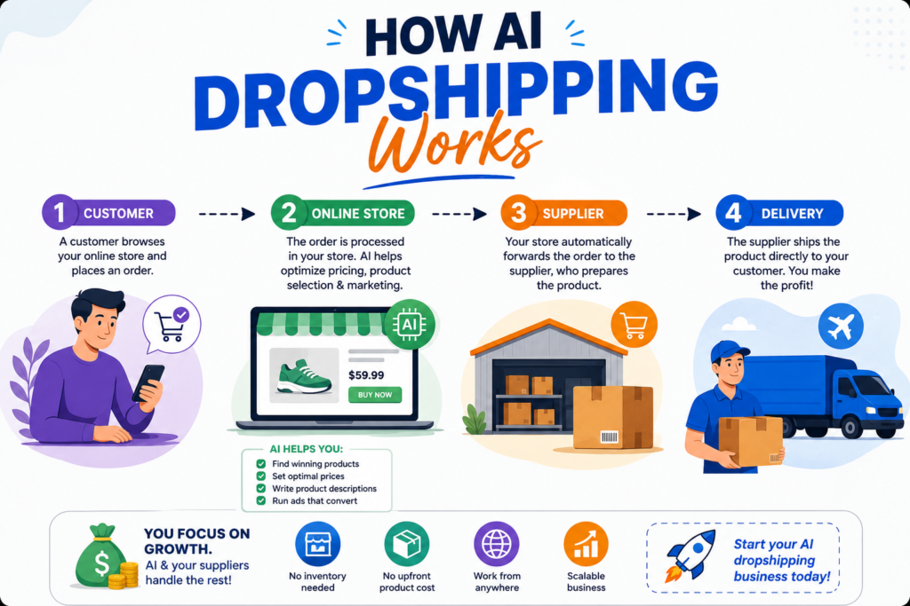
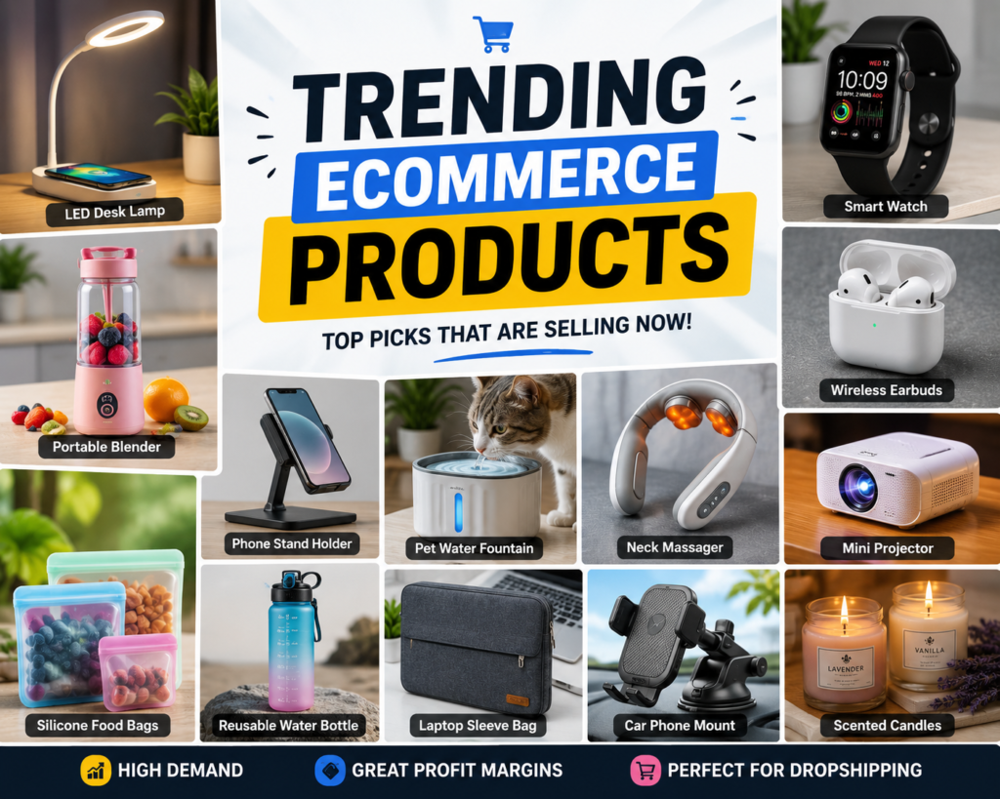
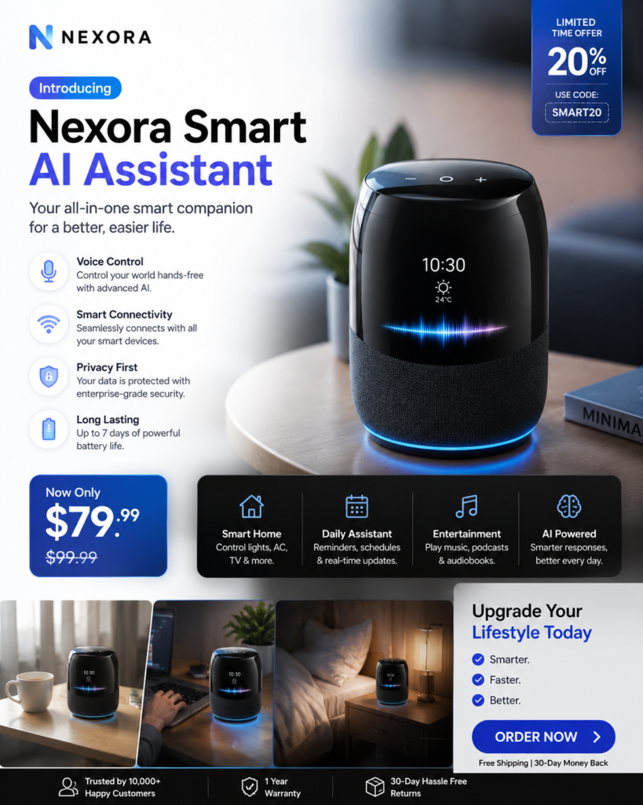
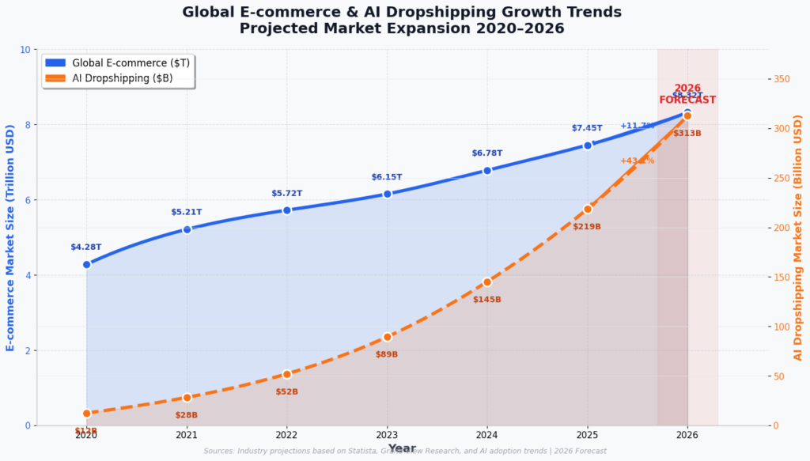

The dropshipping industry in 2026 looks completely different from what it was a few years ago. Back then, people spent hours manually searching for products, writing descriptions, editing ads, answering customers, and building online stores from scratch. Now, artificial intelligence is changing almost every part of the process.

## In this guide, you will Know:

- How AI dropshipping works

- The best AI tools to use

- How beginners can start

- How to find winning products

- How to use AI for ads and SEO

- Common mistakes to avoid

- Realistic income expectations

- The future of AI ecommerce

**Today, a single person with the right AI tools can:**

- find winning products faster

- create product descriptions instantly

- generate ad creatives

- automate customer support

- build email campaigns

- analyze trends

- improve SEO

- create social media content in minutes

This is why AI-powered dropshipping has exploded across platforms like TikTok, YouTube, Instagram, and Shopify communities. But at the same time, competition is far more intense than it used to be.

Thousands of people are entering the market every month hoping AI will make them rich automatically. The reality is more complicated.

AI can dramatically improve efficiency, but it does not replace:

- good product selection

- branding

- marketing skills

- customer trust

- consistency

The people making serious money with AI dropshipping in 2026 are not just using random automation tools. They are building systems that combine:

- AI content generation

- trend analysis

- fast product testing

- strong branding

- social media marketing

- customer psychology

If you want to build a modern ecommerce business with lower startup costs and powerful automation, this may become one of the biggest online opportunities of 2026.

* * *

# What Is AI Dropshipping?

AI dropshipping is a business model where you sell products online without keeping inventory while using artificial intelligence tools to automate and improve parts of the business.

In traditional dropshipping:

1. A customer buys from your store

3. You forward the order to a supplier

5. The supplier ships directly to the customer

You never physically hold the product yourself.

With AI dropshipping, artificial intelligence helps with:

- product research

- store creation

- ad copy

- SEO

- email marketing

- customer support

- analytics

- image generation

- social media content

This reduces workload dramatically compared to older ecommerce methods.

<figure>

<figcaption>

**Infographic showing how AI dropshipping works from customer → online store → supplier → delivery.**

</figcaption>

</figure>

* * *

# Why AI Dropshipping Is Growing So Fast

Several major trends are fueling this growth.

## 1\. AI Tools Became More Powerful

Modern AI can now:

- write marketing copy

- generate realistic product photos

- create ad scripts

- automate customer support

- improve SEO content

Tasks that once took hours now take minutes.

* * *

## 2\. Short-Form Video Commerce Is Exploding

Platforms like:

- TikTok

- Instagram Reels

- YouTube Shorts

have created massive ecommerce opportunities.

Products can go viral overnight.

AI tools help creators quickly produce:

- captions

- scripts

- thumbnails

- ad ideas

- voiceovers

* * *

## 3\. Ecommerce Entry Costs Are Lower

Years ago, starting an ecommerce business required:

- designers

- copywriters

- developers

- marketers

Now AI tools handle many of those tasks.

This lowers startup barriers significantly.

* * *

## 4\. Consumers Are Buying More Online

Global ecommerce continues growing every year.

People now comfortably buy:

- gadgets

- fashion

- home products

- fitness items

- digital products

- beauty products

directly from social media and online stores.

* * *

# Is AI Dropshipping Actually Profitable?

Yes — but profitability depends heavily on:

- product selection

- marketing

- branding

- pricing

- content quality

- customer trust

AI helps improve efficiency, but it does not guarantee success automatically.

Many beginners fail because they:

- choose bad products

- use low-quality suppliers

- spam AI content everywhere

- copy competitors blindly

- expect instant profits

Successful stores usually combine:

- smart AI usage

- strong branding

- fast testing

- social media strategy

- customer-focused design

* * *

# Best Platforms for AI Dropshipping

## Shopify

[Shopify](https://www.shopify.com)

Shopify remains the most popular ecommerce platform for dropshipping.

Why people use it:

- beginner-friendly

- large app ecosystem

- AI integrations

- mobile optimization

- easy product imports

Many AI ecommerce tools integrate directly with Shopify.

* * *

## WooCommerce

[WooCommerce](https://woocommerce.com)

WooCommerce is ideal for people already using WordPress.

Advantages:

- more customization

- lower long-term costs

- strong SEO flexibility

Disadvantages:

- steeper learning curve

- more manual setup

* * *

## TikTok Shop

TikTok Shop

TikTok has become a major ecommerce platform in 2026.

Short-form viral videos can drive massive sales quickly.

AI helps generate:

- video hooks

- captions

- product scripts

- ad ideas

* * *

# Best AI Tools for Dropshipping in 2026

# AI Writing Tools

## ChatGPT

[ChatGPT](https://chatgpt.com)

Useful for:

- product descriptions

- blog posts

- ad copy

- email marketing

- SEO articles

- customer responses

* * *

## Jasper AI

[Jasper AI](https://www.jasper.ai)

Popular for:

- marketing copy

- brand voice

- sales writing

* * *

# AI Design Tools

## Canva

[Canva](https://www.canva.com)

Great for:

- social media posts

- banners

- ad creatives

- thumbnails

- ecommerce graphics

* * *

## Midjourney

[Midjourney](https://www.midjourney.com)

Used for:

- AI product concepts

- ad visuals

- lifestyle images

* * *

# AI Video Tools

## CapCut

[CapCut](https://www.capcut.com)

Popular for:

- TikTok edits

- product ads

- captions

- short-form videos

* * *

## Synthesia

[Synthesia](https://www.synthesia.io)

Can generate AI presenter videos for products.

* * *

# AI Customer Support Tools

## Tidio

[Tidio](https://www.tidio.com)

AI chatbots can:

- answer FAQs

- track orders

- reduce support workload

* * *

# How to Find Winning Products with AI

Finding products is one of the hardest parts of dropshipping.

AI tools help analyze:

- social media trends

- search demand

- competitor ads

- customer interests

Good product characteristics:

- emotional appeal

- problem-solving

- impulse-buy potential

- visually engaging

- shareable on social media

Examples:

- smart gadgets

- beauty tools

- pet products

- fitness accessories

- organization products

* * *

<figure>

<figcaption>

**Trending AI dropshipping products in 2026**

</figcaption>

</figure>

* * *

# Using TikTok for AI Dropshipping

TikTok is dominating product discovery.

Many successful stores now rely heavily on:

- viral product videos

- influencer marketing

- user-generated content

AI can help generate:

- hooks

- captions

- scripts

- video ideas

- thumbnail text

Strong TikTok hooks include:

- “I wish I found this sooner”

- “This product solves a problem nobody talks about”

- “Amazon sellers hate this trick”

- “TikTok made me buy this”

The first 3 seconds matter heavily.

* * *

# SEO for AI Dropshipping Stores

Many beginners ignore SEO and rely only on paid ads.

That is a mistake.

SEO can bring:

- free traffic

- long-term visitors

- consistent sales

- lower customer acquisition costs

Important SEO strategies:

- write detailed product descriptions

- use blog content

- target long-tail keywords

- optimize image alt text

- improve page speed

Example blog topics:

- best smart home gadgets

- viral TikTok products

- AI productivity tools

- trending fitness gadgets

* * *

# Using AI for Product Descriptions

Bad product descriptions kill conversions.

Weak descriptions:

- feel generic

- sound spammy

- lack emotional appeal

AI can help create:

- SEO-friendly descriptions

- persuasive copy

- emotional selling points

- structured formatting

Good descriptions focus on:

- benefits

- convenience

- transformation

- customer outcomes

* * *

# How AI Helps with Advertising

Advertising is often the biggest expense in dropshipping.

AI tools help improve:

- targeting

- copywriting

- image creation

- testing

- analytics

AI can quickly generate:

- multiple ad variations

- different hooks

- audience angles

- call-to-action ideas

#### Samples Of Marketing Arts that were created using Ai

<figure>

<figcaption>

**AI-generated dropshipping ad creative example**

</figcaption>

</figure>

This speeds up product testing dramatically.

* * *

# Paid Ads vs Organic Marketing

## Paid Ads

Platforms:

- Facebook Ads

- TikTok Ads

- Google Ads

Advantages:

- faster scaling

- quick testing

Disadvantages:

- expensive

- risky for beginners

* * *

## Organic Marketing

Methods:

- TikTok videos

- Instagram Reels

- Pinterest

- SEO blogging

Advantages:

- cheaper

- long-term traffic

- better for beginners

Disadvantages:

- slower growth initially

Many beginners should focus more on organic traffic first.

* * *

# Common AI Dropshipping Mistakes

# 1\. Blindly Trusting AI

AI can make mistakes.

Always review:

- descriptions

- facts

- pricing

- ad copy

* * *

# 2\. Selling Generic Products

Competition becomes brutal.

Strong branding matters more in 2026.

* * *

# 3\. Using Poor Suppliers

Slow shipping destroys trust.

Use reliable suppliers with:

- tracking

- reviews

- faster delivery

* * *

# 4\. Ignoring Customer Experience

Many stores fail because:

- support is terrible

- delivery is slow

- websites look untrustworthy

* * *

# 5\. Overusing AI Content

If your content feels robotic, conversions may suffer.

Blend AI with human editing.

* * *

# Best Niches for AI Dropshipping in 2026

## Smart Home Products

Popular because they:

- look futuristic

- perform well in videos

* * *

## Fitness Products

Fitness content performs strongly on social media.

* * *

## Pet Products

Pet owners spend heavily online.

* * *

## Beauty and Skincare

Visual products work extremely well for TikTok and Instagram.

* * *

## Productivity Gadgets

AI and productivity culture continue growing rapidly.

* * *

# Branding Matters More Than Ever

Many beginners think dropshipping is simply:

- importing products

- running ads

- collecting profits

That approach rarely works long-term anymore.

Strong branding creates:

- trust

- repeat customers

- higher perceived value

Branding includes:

- logo

- store colors

- packaging

- social media identity

- tone of voice

* * *

# Can AI Completely Automate Dropshipping?

Not fully.

AI helps reduce workload, but humans still need to:

- make strategic decisions

- test products

- manage branding

- analyze performance

- handle problems

The people making the most money usually combine:

- automation

- creativity

- business thinking

* * *

# How Much Money Can Beginners Realistically Make?

Results vary massively.

Some beginners make:

- almost nothing

Others scale stores to:

- thousands monthly

Realistic expectations matter.

Most successful ecommerce stores require:

- testing

- patience

- learning

- marketing skills

Avoid “overnight millionaire” expectations.

* * *

# Is AI Dropshipping Saturated?

Competition is definitely increasing.

However, ecommerce itself is enormous.

The people struggling most are usually:

- copying identical stores

- using poor branding

- relying on generic AI content

Unique branding and marketing still create opportunities.

* * *

<figure>

<figcaption>

**  
Global ecommerce and AI dropshipping growth in 2026**

</figcaption>

</figure>

# Building an Audience Around Your Store

One huge advantage in 2026 is combining:

- ecommerce

- content creation

Many successful sellers build audiences through:

- TikTok

- YouTube

- Instagram

- blogging

This reduces dependence on expensive ads.

Content builds:

- trust

- repeat traffic

- brand recognition

* * *

# Email Marketing Still Works

Many beginners ignore email marketing completely.

That is a major mistake.

Email marketing helps:

- recover abandoned carts

- promote offers

- build customer relationships

- increase repeat purchases

AI tools can generate:

- subject lines

- promotional emails

- automated sequences

* * *

# The Importance of Mobile Optimization

Most ecommerce traffic now comes from mobile devices.

Your store should:

- load quickly

- look clean on phones

- have easy navigation

- use readable fonts

Slow websites kill conversions.

* * *

# Should You Start AI Dropshipping in 2026?

For many people, yes.

AI has lowered barriers dramatically.

But success still requires:

- effort

- patience

- learning

- marketing ability

The biggest advantage today is speed.

AI allows one person to perform tasks that once required entire teams.

* * *

# Future of AI Ecommerce

AI ecommerce will likely continue evolving rapidly.

Future trends may include:

- AI shopping assistants

- hyper-personalized recommendations

- AI-generated storefronts

- automated product testing

- advanced predictive analytics

Stores using AI effectively may gain major competitive advantages.

* * *

# Frequently Asked Questions

## Is AI dropshipping legal?

Yes, AI dropshipping is legal in most countries when operating within ecommerce and consumer protection laws.

* * *

## How much money do you need to start?

Some beginners start with under $500, though ad budgets and tool subscriptions can increase costs.

* * *

## Is Shopify good for AI dropshipping?

Yes, Shopify is one of the most popular platforms for AI-powered ecommerce businesses.

* * *

## Can AI build a dropshipping store automatically?

AI can help with many tasks, but human decision-making is still important.

* * *

## What is the best traffic source for beginners?

Organic TikTok content is one of the most beginner-friendly traffic sources in 2026.

* * *

## Is AI dropshipping saturated?

Competition is increasing, but strong branding and marketing still create opportunities.

* * *

# Final Verdict

AI is transforming ecommerce faster than ever before.

In 2026, dropshipping is no longer just about finding random products and launching ads. The market has become more competitive, smarter, and heavily influenced by automation and content creation.

Artificial intelligence now helps entrepreneurs:

- create stores faster

- produce marketing content

- automate customer support

- improve SEO

- analyze trends

- scale operations

But AI itself is not the business.

The real winners are people who combine:

- AI efficiency

- branding

- creativity

- marketing skills

- customer trust

For beginners willing to learn and experiment, AI dropshipping still offers real opportunities. However, long-term success usually comes from building a genuine brand instead of chasing quick viral products endlessly.

As ecommerce and artificial intelligence continue growing together, the people who adapt early may build powerful online businesses in the years ahead.
