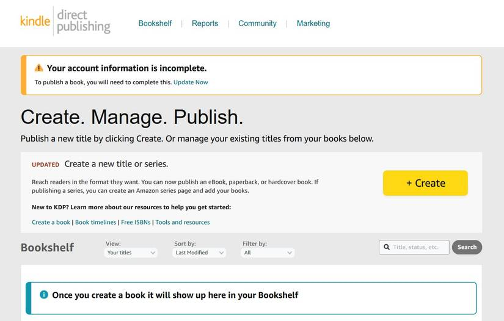
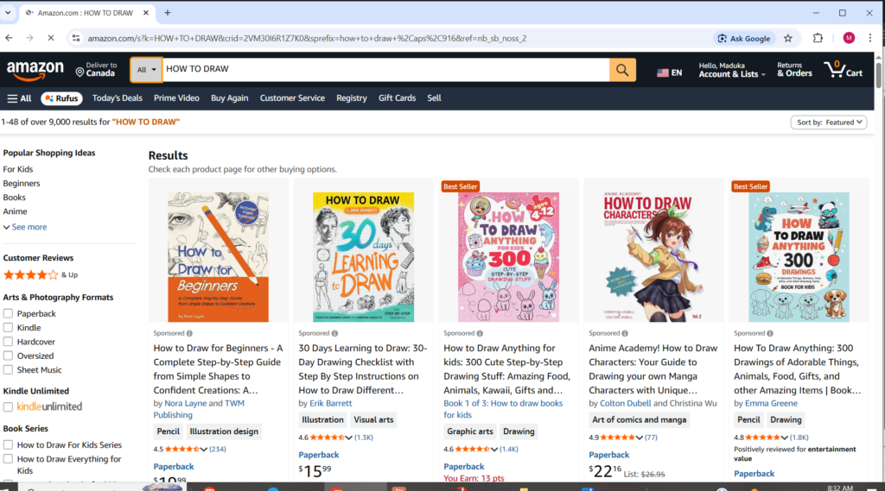
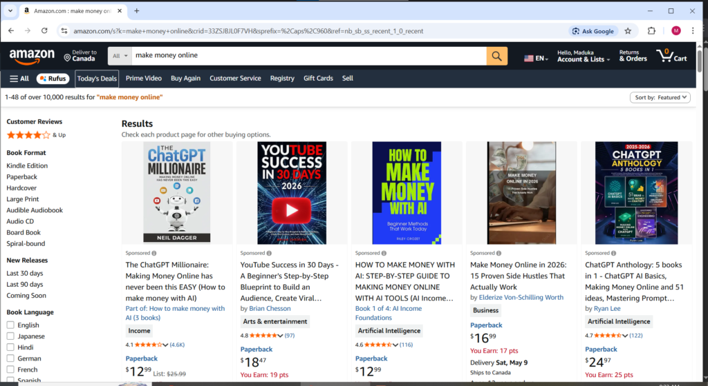
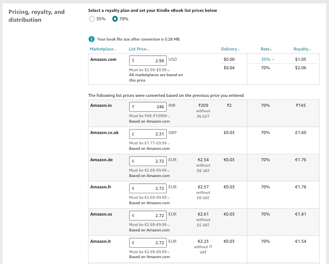
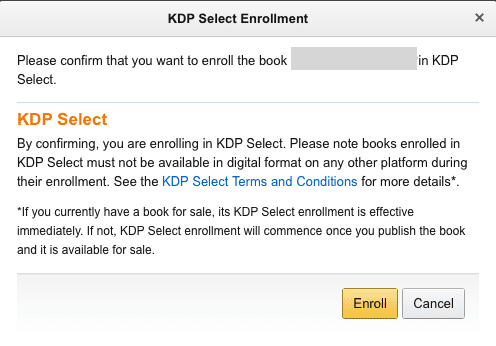

Let’s start with the truth most Amazon KDP guides skip. KDP is a real passive income opportunity, but it’s not a get-rich-quick scheme. It won’t work overnight, and publishing one book and waiting is not a strategy. The people making consistent money treat it like a business, not a lottery. Go in with the right mindset and it’s worth your time. Expect fast results and you’ll be disappointed.

That said, Amazon KDP is still one of the most accessible ways to earn online. It’s free to publish, gives you access to a global audience of millions, and offers up to 70% royalties on ebooks. Once your book is live, it can keep earning over time with no ongoing effort. That mix of zero cost, global reach, and passive income potential makes it worth taking seriously.

**This guide will walk you through everything you need** to get started, from creating your account to publishing your book, getting reviews, and building consistent income.

**What Exactly Is Amazon KDP**

Amazon KDP stands for Kindle Direct Publishing. It is Amazon's self-publishing platform that allows anyone to publish and sell ebooks and paperback books directly on Amazon without going through a traditional publisher. Before Amazon KDP existed, getting a book published required finding a literary agent, pitching to publishing houses, waiting months or years for a decision, and then accepting whatever royalty percentage the publisher offered usually between 10 and 15 percent. Amazon KDP eliminated every single one of those gatekeepers. You write the book, format it, design a cover, upload it to Amazon KDP, set your price, and your book is live and available to millions of buyers within 24 to 72 hours. You keep between 35 and 70 percent of every sale depending on your pricing. Nobody can reject your book. Nobody controls your publication timeline but you.

* * *

**How Much Can You Realistically Earn on Amazon KDP**

This is where honesty matters more than hype. Here is what the data actually shows for Amazon KDP earnings in 2026:

Casual authors who publish occasionally and do minimal marketing typically earn between $100 and $500 per month. Authors with three to five books in profitable niches with proper keyword research typically reach $1,000 to $5,000 per month. Established Amazon KDP publishers with ten or more books and a consistent publishing strategy can exceed $10,000 monthly. Realistic earnings for a beginner with a library of 20 to 40 well-researched books after six months of consistent effort sit between $200 and $800 per month.

The key insight that separates successful Amazon KDP publishers from those who give up is this, Amazon KDP is a volume and keyword game. Most authors see dramatically better results with 20 or more titles than trying to make a single book a bestseller. Each book you publish is a permanent income-generating asset. The income compounds over time as your catalog grows.

* * *

**Step 1: Create Your Amazon KDP Account**

Go to [kdp.amazon.com](http://kdp.amazon.com) and click the Join KDP button. You can sign in with an existing Amazon account or create a new one. Once inside your dashboard fill in your tax information, bank account details for royalty payments, and author information. This setup is free and straightforward. Your Amazon KDP account is your publishing headquarters, Every book you ever publish will be managed from this dashboard.

<figure>

</figure>

* * *

**Step 2: Research a Profitable Niche Before You Write a Single Word**

This is the step most beginners skip and it is the single biggest reason most Amazon KDP books never sell. The most common mistake is writing about something you enjoy without first confirming that people are actively searching for and buying books on that topic.

Niche research on Amazon KDP means finding the intersection of high search demand and low competition. You want a topic people are actively looking for with relatively few strong existing books dominating the results. The Amazon Best Sellers list is your starting point browse categories and subcategories to see what is already selling well. Then look at those bestselling books and ask yourself: is the competition beatable or is this space dominated by established authors with thousands of reviews?

High performing Amazon KDP niches in 2026 include self-help, personal finance, How to draw (ensure to include step by step pictures describing each process), productivity, health and fitness, parenting, how-to guides, online earning, AI tools, and romance fiction. These categories have proven consistent buyer demand. Drilling down into specific sub-niches within these categories rather than competing in the broad category itself is where realistic success happens for beginners.

<figure>

<figcaption>

**HOW TO DRAW NICHE ON KDP**

</figcaption>

</figure>

<figure>

<figcaption>

**MONEY MAKING NICHE ON AMAZON**

</figcaption>

</figure>

PRO TIP: Strive to bring something unique, Even title like how to sing, How to be a professional \_\_\_\_\_ in 30 days are not too saturated

* * *

**Step 3: Write or Outsource Your Book**

Once you have a validated niche, write the book. Amazon KDP ebooks do not need to be long. Short practical guides of 10,000 to 20,000 words consistently outperform long theory-heavy books on the platform because readers want actionable information they can apply immediately. Focus on solving one specific problem for one specific reader as clearly and practically as possible.

If writing is not your strength or you want to publish faster, ghostwriting is a legitimate option. Platforms like Fiverr and Upwork have writers who specialize in Amazon KDP content. Costs range from a few hundred dollars for shorter books to over $1,000 for longer more researched titles. The important thing is that the content is accurate, genuinely helpful, and well-written regardless of who writes it.

* * *

**Step 4: Format Your Book Correctly**

Amazon KDP has specific formatting requirements for both ebooks and paperbacks. For ebooks, the most straightforward approach is writing in Microsoft Word or Google Docs and then converting to the EPUB format using a free tool called Calibre, or uploading the Word document directly to Amazon KDP which handles the conversion automatically. For paperbacks, formatting is more precise margins, bleed settings, and page size must match Amazon KDP specifications exactly. The Amazon KDP Cover Calculator tool on their website gives you the exact dimensions needed based on your page count.

If formatting feels overwhelming Fiverr has affordable formatting services specifically for Amazon KDP that produce professional results for a small fee.

* * *

**Step 5: Design a Professional Cover**

Your Amazon KDP cover is the single most important factor in whether a potential buyer clicks your book or scrolls past it. A poor cover signals an amateur product and buyers judge books by their covers on Amazon more than almost anywhere else. Do not design your own cover unless you have genuine graphic design experience. The cost of a bad cover in lost sales far exceeds the cost of hiring a professional.

Affordable options for Amazon KDP covers include Fiverr designers who specialize specifically in book covers starting from around $15 to $50, the free Canva book cover templates which can produce decent results with the right customization, and Amazon KDP's own Cover Creator tool built directly into the publishing dashboard which is free and surprisingly capable for simple designs.

* * *

**Step 6: Keyword Research for Your Title and Description**

Amazon is a search engine just like Google. When someone types a phrase into the Amazon search bar looking for a book on a specific topic, Amazon's algorithm matches that search to book titles, subtitles, descriptions, and the seven backend keywords every Amazon KDP publisher can set invisibly behind their listing.

Your title and subtitle should contain the exact phrases your target readers are typing into Amazon. Tools like Publisher Rocket and KDSpy are paid tools specifically built for Amazon KDP keyword research and are worth the investment for serious publishers. Free alternatives include simply typing your topic into the Amazon search bar and noting the autocomplete suggestions those suggestions are real search terms real buyers are using right now.

Your book description on Amazon KDP is also searchable and should naturally include your target keywords multiple times while reading as a compelling sales pitch rather than a keyword list.

* * *

**Step 7: Price Your Book Strategically**

Amazon KDP's royalty structure works as follows. Ebooks priced between $2.99 and $9.99 earn a 70 percent royalty. Ebooks priced below $2.99 or above $9.99 earn only 35 percent. For paperbacks, Amazon KDP pays 60 percent of the list price minus printing costs which vary by page count and trim size.

For new Amazon KDP authors with no reviews yet, starting at $0.99 is a proven strategy for building early sales velocity. Amazon's algorithm ranks books partly based on sales volume, Selling many $0.99 copies early signals to Amazon that buyers want your book, which improves your ranking in search results and category listings. Once you have accumulated reviews and ranking momentum, raise the price to $2.99 or higher to access the full 70 percent royalty tier.

Paperbacks should generally be priced at $9.99 or above to qualify for the 60 percent royalty tier and ensure a meaningful earning per sale after printing costs are deducted.

* * *

**Step 8: Publish Your Book on Amazon KDP**

Log into your Amazon KDP dashboard and click Add New Title. You will be prompted to enter your book title, subtitle, author name, description, keywords, and categories. Upload your formatted manuscript file and your cover file. Set your pricing for each territory. Review everything carefully particularly your description and keywords since these directly determine how discoverable your book is. Submit for review. Amazon KDP typically approves and publishes new books within 24 to 72 hours.

Choose two categories when publishing but know that you can request up to ten categories by emailing Amazon KDP support directly after publishing, A little-known advantage that gives your book more opportunities to rank as a bestseller in multiple subcategories simultaneously.

* * *

**Step 9: Enroll in KDP Select and Use Free Days Strategically**

KDP Select is Amazon's exclusivity program. When you enroll, you agree to sell your ebook exclusively through Amazon for 90-day periods. In return you receive two powerful promotional tools which are Free Book Promotions and Countdown Deals.

The Free Book Promotion gives you up to five days per 90-day enrollment period to offer your book completely free. The strategy here is not to make money during the free period, It is to generate downloads which lead to reviews which lead to Amazon ranking which leads to paid sales after the free period ends. During your free days promote the book on free ebook listing sites, share it in relevant Facebook groups and Reddit communities, and email anyone in your network who might genuinely find it useful. Ask readers for honest reviews in your book's closing pages.

Reviews are the currency of Amazon KDP success. Aim for a minimum of ten honest reviews before expecting meaningful organic paid sales. Even a handful of genuine reviews dramatically improves buyer confidence and Amazon ranking compared to books with zero reviews.

**STEP BY STEP PROCESS TO LOCATE THE KPD SELECT PAGE**

Login → Dashboard → **Bookshelf**  
→ Click your book title (or **“…” / Edit**)  
→ Open **Kindle eBook Details**  
→ Scroll down  
→ Find **“KDP Select Enrollment”**  
→ Tick **“Enroll this book in KDP Select”**  
→ Scroll down  
→ Click **Save & Continue**  
→ Continue to pricing page  
→ Click **Publish**

<figure>

<figcaption>

**KDP SELECT ENROLLMENT PAGE**

</figcaption>

</figure>

* * *

**Step 10: Publish More Books and Build Your Catalog**

One book on Amazon KDP is a starting point. A catalog of ten, twenty, or thirty books in related niches is where real passive income with Amazon KDP begins to compound. Each new book you publish cross-promotes your other books through Amazon's also-bought algorithm. Readers who enjoy one of your books will find your others. Your author page on Amazon becomes a destination rather than a dead end.

The Amazon KDP authors earning $1,000 or more monthly consistently are not one-book wonders. They are systematic publishers who treat Amazon KDP like a business researching niches, publishing consistently, learning from each book's performance, and reinvesting early earnings into better covers and keyword tools. Building that catalog takes time but each book added is a permanent passive income asset that earns indefinitely with no expiry date.

* * *

**What Nobody Tells You About Amazon KDP**

Amazon KDP rewards patience and volume above almost everything else. Most books published on Amazon KDP earn very little in their first month. Some earn nothing at all initially. That is not necessarily a sign the book will fail, It is often simply a sign that the book has not yet accumulated the reviews and ranking momentum needed to surface organically in Amazon's search results.

The publishers who succeed on Amazon KDP are the ones who resist the urge to abandon a book after a slow first month, who keep publishing additional titles, and who treat the whole operation as a long-term asset building exercise rather than a quick cash source. The passive income with Amazon KDP is real but **it arrives on a timeline that rewards consistency and punishes impatience.**
