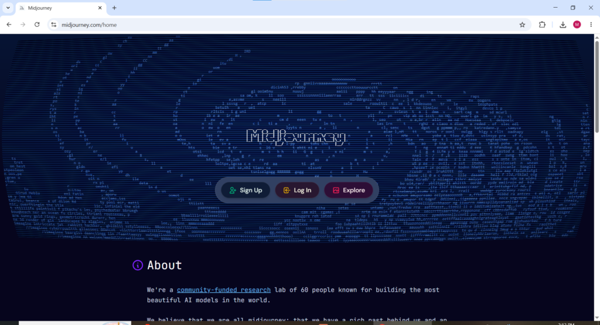
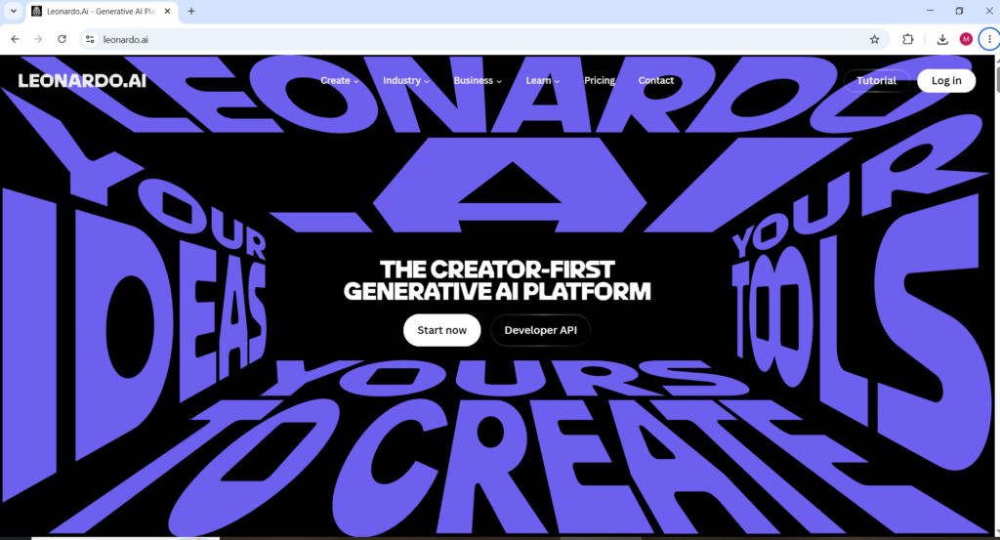
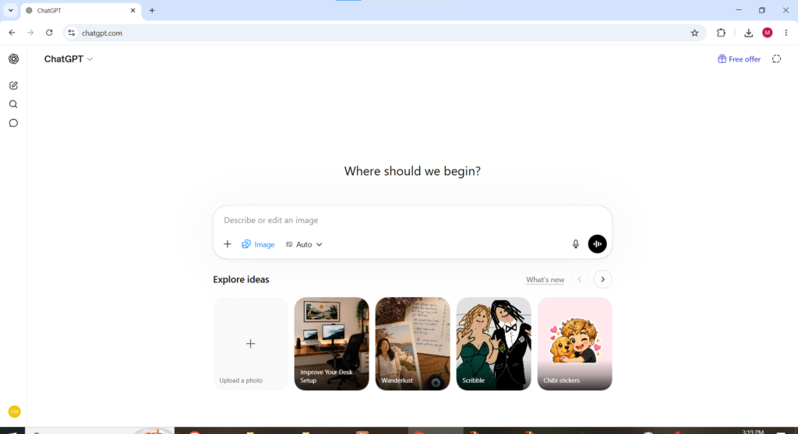
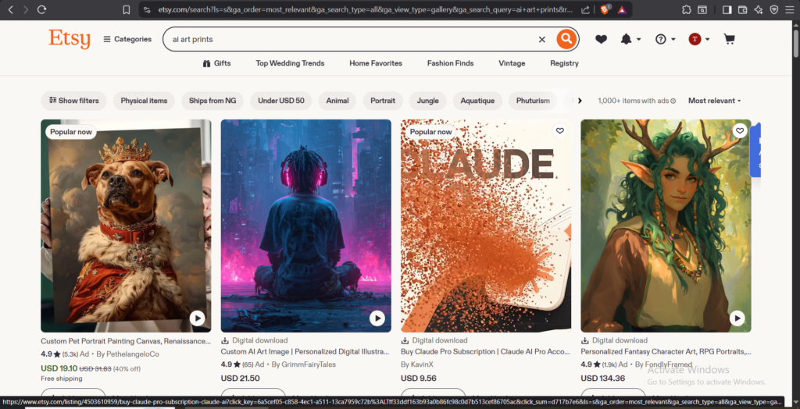
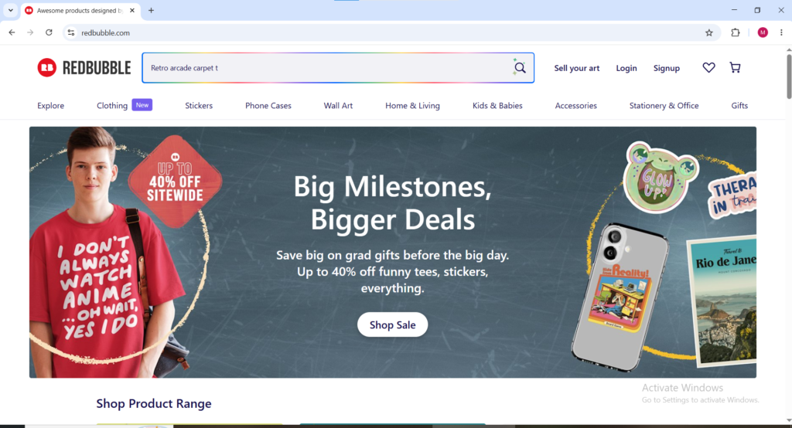
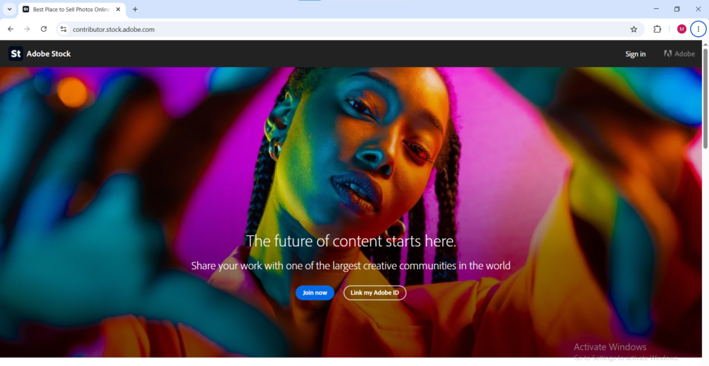
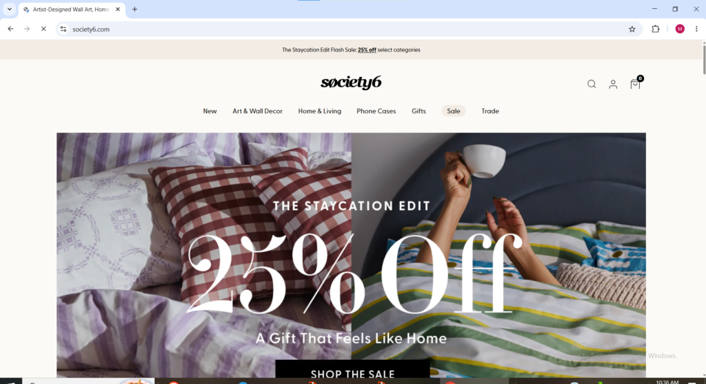
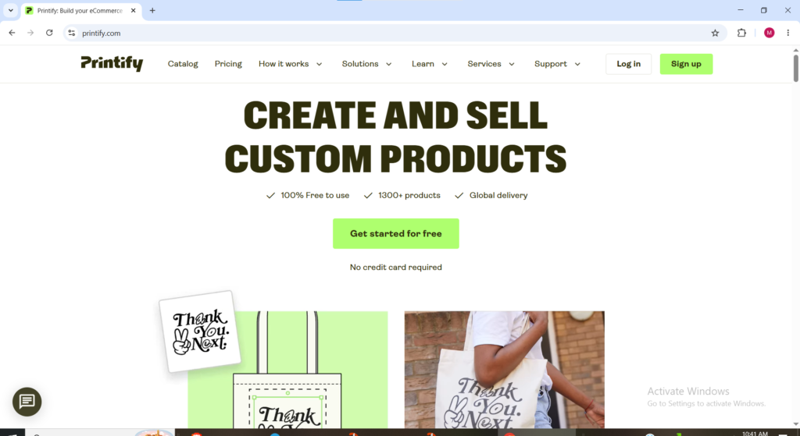

Art school took your money. Years of practice took your time. Talent gatekeepers told you that you weren't good enough. All of that is now irrelevant. In 2026, anyone with a laptop and an idea can generate professional artwork in seconds and sell it globally the same day; No degree, no skills, no studio. The only thing standing between you and your first sale is knowing which strategies actually make money. This guide shows you exactly that.

### WHAT YOU WILL LEARN BY READING THIS ARTICLE

- What Selling AI Generated Art Actually Means

- The Legal Reality of Selling AI Generated Art

- 4 Best AI Tools for Creating Sellable Art

- 5 The Business Models for Selling AI Generated Art

- 7 Places to Sell Ai generated Art

- What Actually Sells

- Promoting AI Generated Art to Drive Sales

- What to Realistically Expect

* * *

#### **What Selling AI Generated Art Actually Means in 2026**

AI generated art is artwork created by artificial intelligence tools that turn simple text prompts into high-quality images in seconds. These can look like paintings, illustrations, photorealistic photos, or unique art styles. In 2026, the quality is so good that many people cannot tell the difference from professional artwork.

The AI industry is expected to reach $3.5 trillion by 2033, creating huge demand from businesses for marketing, branding, publishing, and digital content.

Most beginners make the mistake of selling raw AI images. This market is crowded, low paying, and legally uncertain. The real money comes from using AI as a tool to create valuable products.

Successful sellers focus on print on demand products, digital bundles, book covers, wall art, branding kits, and templates. Customers pay for the complete solution, not just the image. This is the scalable business model covered in this guide.

**The Legal Reality of Selling AI Generated Art in 2026**

Understanding the legal rules is essential before building an AI art business, as they vary by tool and platform.

Key rules to follow: Never generate or sell copyrighted characters like Mickey Mouse or Iron Man. Create original work and avoid imitating specific living artists too closely. Always disclose that the art is AI-generated, especially on platforms like Etsy.

Before selling, always check two things: the terms of the AI tool you used and the rules of the marketplace where you plan to sell. Breaking either can lead to account suspension.

In 2026, the safest tools for commercial use are: Midjourney paid plans, DALL-E 3 (OpenAI), and Adobe Firefly. Stable Diffusion generally allows commercial use but varies by model. Most free tiers do not grant commercial rights, so a paid subscription is recommended if you plan to sell.

* * *

**The AI Tools for Creating Sellable Art**

**Midjourney** midjourney.com

Midjourney delivers the strongest artistic and stylized results for wall art, posters, and prints and is the tool most professional AI art sellers use as their primary image generation platform. The Basic plan at $10 per month provides enough generation credits to build a meaningful product catalog and the quality of output at that price point is genuinely impressive. Midjourney operates through Discord which has a slight learning curve for new users but mastering the prompt structure unlocks a level of creative control over the output that other tools currently cannot match. For wall art, art prints, poster designs, and any product where visual quality and artistic style are the primary selling points, Midjourney is the right starting tool.

**Leonardo AI** [leonardo.ai](http://leonardo.ai)

Leonardo AI is one of the common tools used for creating sellable AI art with unique strengths in realism, abstraction, and creative control over the generation process. The free tier of Leonardo AI provides a meaningful number of daily image generations making it one of the most accessible entry points for testing AI art creation before committing to a paid subscription. The platform has a clean web-based interface that does not require Discord or any external application making it more beginner-friendly than Midjourney for first-time AI art sellers.

**Adobe Firefly** [firefly.adobe.com](http://firefly.adobe.com)

Adobe Firefly is the AI image generation tool built by Adobe and trained specifically on licensed content from Adobe Stock and other properly licensed sources. That training foundation makes Firefly one of the legally cleanest AI art generation tools available for commercial selling purposes in 2026 because the underlying training data does not carry the copyright concerns that some other AI tools face. For sellers who want complete confidence in the commercial legality of their generated images, Adobe Firefly is the most defensible choice available.

**DALL-E 3 via ChatGPT** [chat.openai.com](http://chat.openai.com)

DALL-E 3 is accessible directly through ChatGPT and produces high quality versatile images across a wide range of styles. OpenAI grants users full commercial rights to images generated through their paid plans making DALL-E 3 a reliable option for selling AI generated art without legal uncertainty. The integration with ChatGPT makes it uniquely powerful for iterating on image concepts conversationally describing what needs to change and having the model adjust accordingly rather than rewriting prompts from scratch each time.

* * *

**5 The Business Models for Selling AI Generated Art**

**Business Model 1: Print on Demand: The Most Sustainable Model**

The sustainable business model successful AI art sellers use is print-on-demand (POD). AI creates unique designs that are sold on physical products like posters, t-shirts, mugs, or stickers. When a customer orders, a third-party company prints and ships the item directly. The seller focuses on creativity while the POD service handles production and fulfillment.

The real money isn’t in selling plain AI images. It’s in using AI to design high-quality physical products people want to own. Customers are far more likely to buy a tangible art print on quality paper than a digital file. Physical products support higher prices, reduce price sensitivity, and deliver a better buying experience.

**POD workflow:** Generate designs with an AI tool, upload them to a platform like Printful or Printify, and connect it to an Etsy store. The platform manages printing, packaging, and shipping. You earn the difference between your retail price and their base cost.

The entire system can be set up in under 15 minutes: sign up for Midjourney, create free accounts on Printful and Etsy, connect them, generate art, list a product (e.g., a poster), and publish to Etsy. You get a real product on a major marketplace with zero inventory and minimal upfront costs.

**Business Model 2: Digital Downloads**

Selling digital downloads of AI generated art is one of the easiest ways to make money. Platforms like Etsy, Gumroad, and Creative Fabrica let you upload artwork so customers can buy and download it instantly. There is no shipping, no inventory, and no product management required.

Individual digital downloads typically sell for $2 to $10, while bundles sell for $10 to $50. Smart sellers create bundles such as sets of botanical prints, motivational quote backgrounds, or seasonal wall art because they offer higher perceived value and justify better prices.

The best performing categories in 2026 are: printable minimalist wall art, adult and children coloring pages, planner and journal pages, social media graphics and templates, and pattern designs for fabric and surfaces.

**Business Model 3: Stock Image Sales**

One of the easiest ways to start monetizing AI generated art is by generating high-quality stock images that can be sold on platforms like Shutterstock, Adobe Stock, Depositphotos, or Envato. Stock platforms have established buyer bases of millions of designers, marketers, publishers, and content creators who are actively searching for images to license for commercial use. A single stock image accepted by Adobe Stock or Shutterstock can generate licensing revenue repeatedly every time a new buyer downloads it genuinely passive income that compounds as the image library grows.

The key to stock image success with AI generated art is producing images that fill genuine commercial gaps rather than images the seller personally finds attractive. Successful sellers research demand before creating supply. Using platform search tools, trend reports, and keyword research to identify what buyers are actually looking for and then using AI to create art that fills those specific needs is the approach that generates sales consistently.

**Business Model 4: Custom AI Art Commissions**

Offering custom AI generated artwork is an excellent way to make money. You take a client’s request and create original artwork based on their specific needs. Popular types include portraits, book covers, wedding art, pet portraits, and marketing visuals. AI tools make it fast and easy to deliver high-quality, one-of-a-kind pieces.

Custom commissions sell for higher prices than ready-made designs because clients pay for personalized work. For example, a custom pet portrait based on a customer’s photo typically sells for $15 to $75 depending on complexity.

The best platforms for custom AI art are Fiverr and Etsy, where buyers actively search for affordable personalized artwork.

**Business Model 5: AI Art NFTs**

In non-fungible tokens the buying and selling of digital art has changed entirely. Turning AI art into NFTs and selling on blockchain platforms such as OpenSea or Rarible provides verified ownership of digital creations. The NFT market has matured significantly since its 2021 peak and the speculative frenzy has settled into a more sustainable collector and enthusiast market. AI generated art with a strong unique visual identity and a coherent collection concept continues to find buyers in the NFT space for sellers willing to invest time in building a presence within NFT communities.

* * *

**Where to etsy.com**

**Etsy** [etsy.com](https://etsy.com)

Etsy leads for digital downloads with the largest buyer audience of any marketplace in this category. For maximum visibility on Etsy the listing title, tags, and description must include the exact search terms buyers use when looking for artwork in a specific style or subject. Etsy requires disclosure when listings contain AI generated art add a clear note in the listing description stating the artwork was created using AI tools. Competition on Etsy is growing but sellers who identify specific niches and produce cohesive collections consistently outperform those selling random unrelated designs.

**Redbubble** [redbubble.com](http://redbubble.com)

If selling AI art on customer products or merchandise Redbubble is a strong option. Simply upload art and Redbubble prints it and ships it to the customer handling all production and fulfilment automatically. Redbubble has a large existing buyer base and the platform handles customer service, returns, and payments entirely. The trade-off is lower margins per sale compared to running an independent print on demand store because Redbubble's base prices are built into the platform. For sellers who want zero operational complexity Redbubble is the most hands-off option available.

**Adobe Stock** [stock.adobe.com/contributor](http://stock.adobe.com/contributor)

Adobe Stock is the premium marketplace for selling AI generated art as stock images. Adobe specifically accepts AI generated images in certain categories and has a large established commercial buyer base of designers, marketers, and publishers actively licensing images for professional use. Images accepted by Adobe Stock earn a royalty every time they are downloaded genuinely passive income that grows as the accepted image library expands. Adobe's contributor portal is the starting point for uploading images and the acceptance review process ensures quality standards that justify the higher royalty rates Adobe Stock commands compared to lower-tier stock platforms.

**Society6** [society6.com](http://society6.com)

Society6 operates similarly to Redbubble as a print on demand marketplace handling all production and fulfilment automatically. The platform has a design-forward buyer community that skews toward premium home decor purchases including art prints, framed prints, canvas prints, tapestries, and home accessories. AI generated art with a strong aesthetic identity and cohesive visual style performs particularly well on Society6 because the buyer base actively seeks distinctive artwork for home decoration rather than generic designs.

**Gumroad** [gumroad.com](http://gumroad.com)

Gumroad is the right platform for selling AI generated art digital downloads with maximum margin control. Unlike Etsy and Redbubble which take significant platform fees, Gumroad charges a flat 10 percent on sales with no monthly subscription required. Digital bundles of AI generated art sell well on Gumroad particularly to buyers who found the seller through social media or a blog rather than through marketplace search is making Gumroad the natural complement to an audience-building strategy on Pinterest, Instagram, or YouTube.

<figure>

<figcaption>

**GUMROAD.COM WELCOME PAGE (can sell arts, books here** **etc)**

</figcaption>

</figure>

**Printful and Printify** [printful.com](http://printful.com) and [printify.com](http://printify.com)

Printful and Printify are the two most widely used print on demand fulfilment platforms for AI art sellers who run their own storefront on Etsy, Shopify, or a personal website. Rather than being direct marketplaces with their own buyer traffic, Printful and Printify connect to existing storefronts and handle production and shipping when orders come in. Using Midjourney, DALL-E 3, Stable Diffusion, or Adobe Firefly to create art and then selling it through print on demand platforms like Printful, Printify, or Gelato requires no upfront inventory investment and no physical product management beyond uploading the design files. Printful has a reputation for higher quality product output. Printify has a larger network of print partners which generally results in lower base costs and better margins per sale.

<figure>

<figcaption>

**PRINTIFY.COM WELCOME PAGE**

</figcaption>

</figure>

* * *

**What Actually Sells; Niche Research Before Creating**

The biggest mistake new AI art sellers make is creating art they personally like and hoping people will buy it. Successful sellers research demand first, then use AI to create exactly what buyers are searching for.

High demand categories in 2026 include minimalist neutral wall art, nursery and children’s room collections, abstract art matching trending interior styles, seasonal and holiday designs, and niche-themed artwork.

Before creating any collection, search your marketplace for similar keywords and study top-selling listings; Their style, colors, format, pricing, and keywords. Base your designs on proven demand rather than personal taste.

Consistency matters. A cohesive set of 20 botanical prints in the same style will sell much better than 20 random unrelated images. A focused, consistent shop builds buyer trust and encourages repeat purchases.

* * *

**Promoting AI Generated Art to Drive Sales**

Creating and listing art is only half of the work. Without promotion a new AI art shop on any platform will generate little to no organic traffic in its early weeks. The most effective and lowest-cost promotional strategies for AI art sellers in 2026 are:

Pinterest is the single most powerful free traffic source for AI art businesses because it is a visual discovery platform where millions of users actively search for home decor inspiration, art ideas, and design products. Marketing strategies such as sharing products on Pinterest to drive organic traffic can boost visibility without any ad spend. Every product listing should have a corresponding Pinterest pin created at the correct vertical format that links directly to the listing. Pins can generate consistent referral traffic for months or years after they are first published making Pinterest one of the most genuinely passive promotional channels available.

Instagram and TikTok are effective for building an audience around the AI art creation process itself showing the prompt, the generation process, and the final product in short-form video content attracts followers who are interested in both the art and the methodology and converts at higher rates than cold marketplace traffic because they have formed a connection with the creator before ever seeing a product for sale.

DeviantArt is the largest art platform for digital artists including those working with AI. Creating a profile and sharing AI art with the community builds visibility within an audience of art buyers and fellow creators simultaneously. Behance is another portfolio platform popular among creatives where showcasing AI art builds professional credibility and drives buyer inquiries for custom commission work.

* * *

**What to Realistically Expect**

**Time to First Income** from selling AI-generated art is typically **1 to 3 weeks** for digital downloads and print-on-demand products if you choose the right platform and niche and promote consistently.

The biggest mistake most beginners make is jumping between different niches and platforms before any gain traction. Give any strategy **60 to 90 days** to show results before switching.

Once you have a working model, then diversify across 3–5 platforms. As revenue grows, reinvest first in better AI tools, then into Etsy and Pinterest ads, and eventually build your own website to cut platform fees and maximize profits.

The opportunity in AI art is real and still growing fast in 2026. The main barriers have been removed success now depends on smart niche selection, consistent output, and learning how the market actually works.
