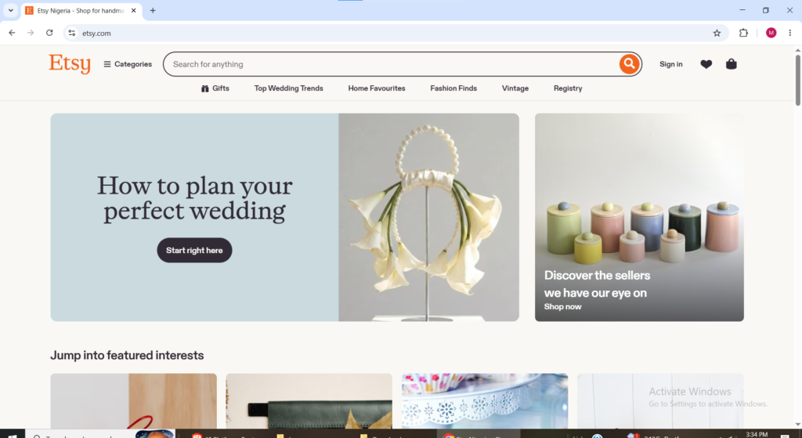
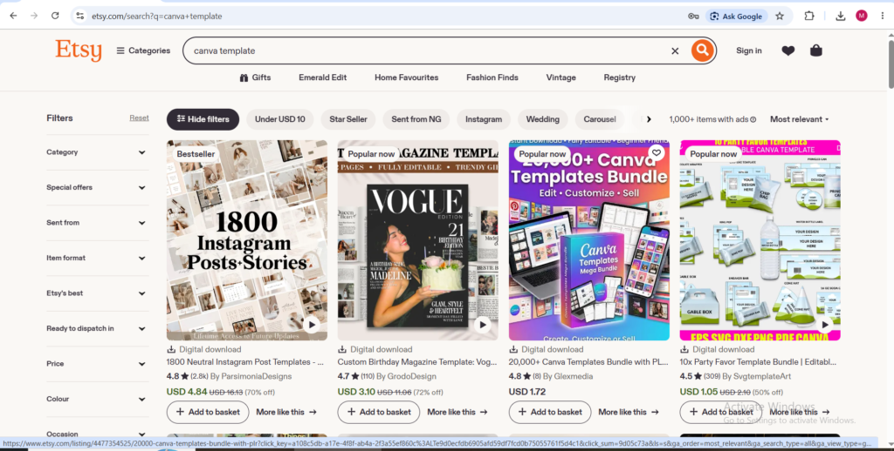
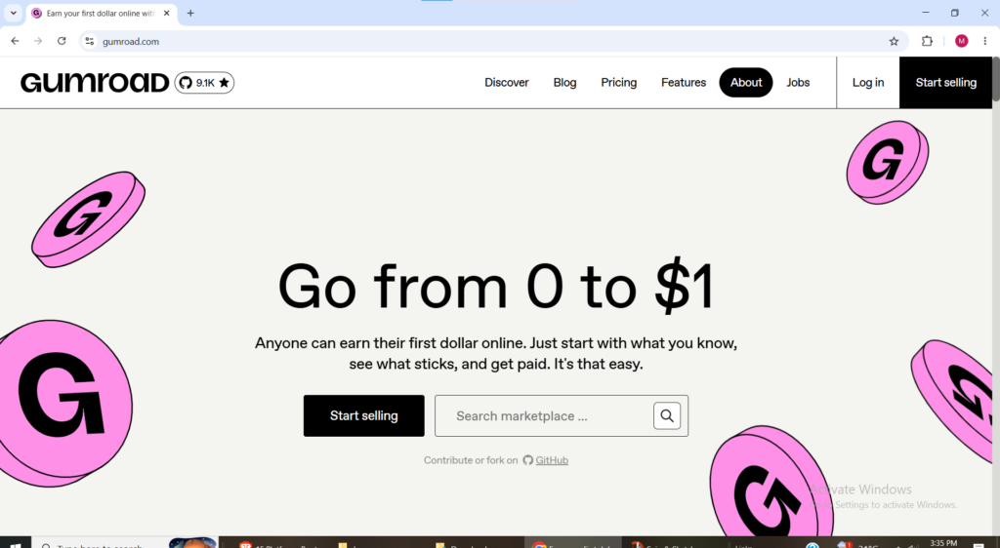
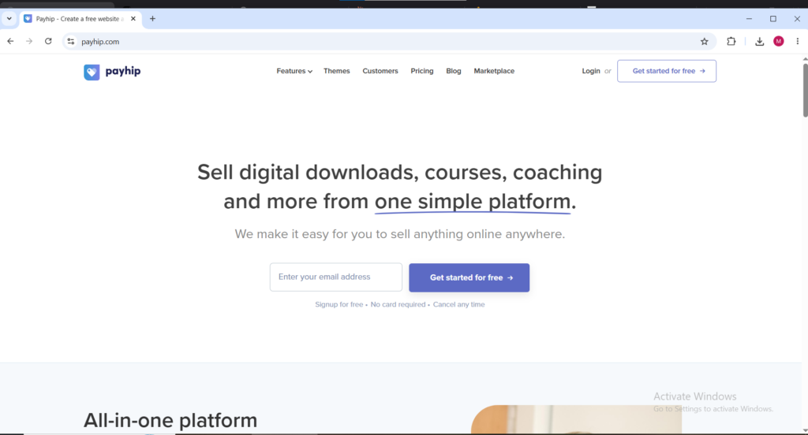
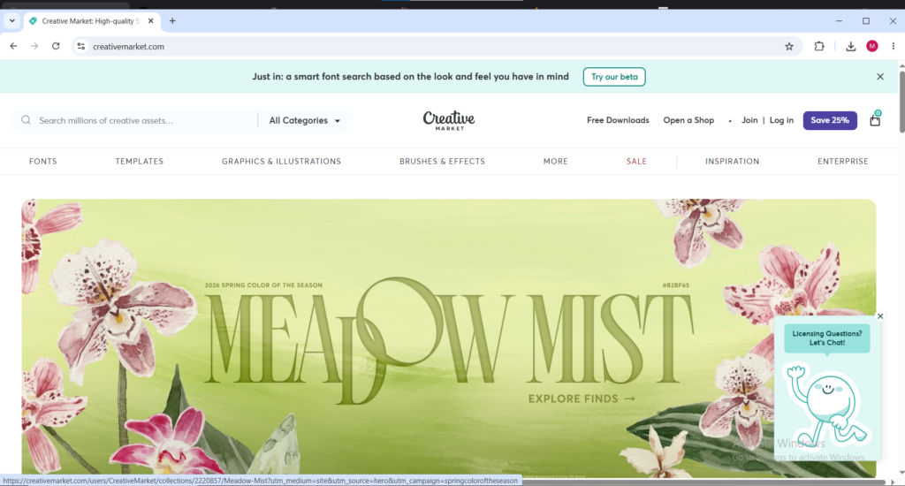
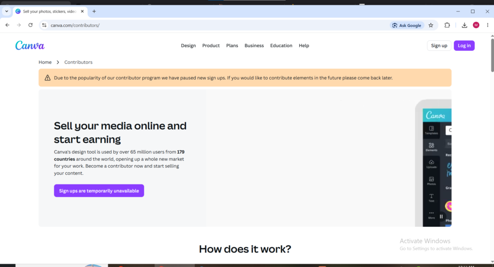

Millions of small business owners, content creators, coaches, freelancers, and entrepreneurs need professional designs daily for Instagram, presentations, resumes, newsletters, and proposals but lack the time to learn graphic design or the budget to hire designers.

Canva templates solve this instantly with one click. The gap between their needs and capabilities creates a thriving business opportunity that is wider and more valuable in 2026 than ever before.

This guide covers everything to start and grow a Canva template business: what sells, how to design without professional experience, where to sell, pricing, and how to promote to ready buyers.

**What you will learn by reading this Article**

- Why Canva Templates Are One of the Best Digital Products to Sell in 2026

- What Canva Templates Actually Sell in 2026 ( Listed 7 of them)

- How to Design Canva Templates That Sell

- Where to Sell Canva Templates in 2026 (Listed 6 and explained why them)

- How to Price Canva Templates

- How to Promote Canva Templates to Find Buyers

- What to Realistically Expect

* * *

**Why Canva Templates Are One of the Best Digital Products to Sell in 2026**

Canva templates are one of the most attractive digital products for starting an online income in 2026 due to their ideal combination of factors.

Creation cost is essentially zero, A free Canva account is enough to design and sell. Canva Pro improves speed and quality but isn’t required to begin earning.

Delivery is fully automated. Once listed on Etsy, Gumroad, or Payhip, the platform handles payments, instant delivery of the template link, and fulfillment. No packaging, shipping, or ongoing customer service needed in most cases.

The same template can be sold unlimited times from one creation effort. A few hours of work can generate daily income for months or years, creating true passive income.

**What Canva Templates Actually Sell in 2026**

The single most important principle in the Canva template business is this; The market does not care what the seller finds interesting to design. It cares what specific buyers are actively searching for and willing to pay for. Designing templates based on personal aesthetic preference without first verifying that buyers are searching for and purchasing that type of template is the most common reason new Canva template sellers generate zero sales despite hours of design work.

**The best-selling Canva template categories in 2026** are those that serve clearly defined professional audiences with specific recurring needs.

i. **Resume templates and resume packs** consistently rank among the highest-searched and highest-converting template types on Etsy. Job seekers actively invest in professional-looking resume designs because the stakes of their application are high and the willingness to pay for a template that improves their chances is strong. Resume template bundles priced between $5 and $20 generate consistent sales volume because the target audience is large and the buying decision is easy.

ii. **Social media templates** for specific platforms and industries are the highest-volume category across the entire Canva template market. Instagram post templates, Instagram story templates, LinkedIn banner templates, Pinterest templates, and TikTok cover templates all have massive buyer demand. The most successful social media template sellers niche down by industry, social media templates for real estate agents, social media templates for fitness coaches, social media templates for restaurants because industry-specific templates convert at higher rates than generic designs that claim to work for everyone.

iii. **Presentation templates and pitch deck templates** for specific professional contexts command the highest per-unit prices in the Canva template market. A well-designed coaching program presentation template, a startup pitch deck template, or a corporate training slide deck template sells for $25 to $75 because the buyer is a professional whose time is genuinely valuable and who will pay meaningfully to avoid spending hours designing slides from scratch.

iv. **Business branding templates** logo kits, business card templates, letterhead templates, email signature templates, invoice templates appeal to freelancers and small business owners who need a complete professional brand identity without hiring a branding agency. Bundling these related items into a complete brand kit and pricing the bundle at $25 to $50 creates a compelling value proposition for the buyer while generating a meaningful per-sale income for the seller.

v. **Ebook and lead magnet templates** for coaches, course creators, and consultants sell steadily because the buyer is an established professional who needs polished content to distribute to their clients and audience. These templates sell for $15 to $40 each and buyers in this category frequently return to purchase additional templates from sellers whose work they trust.

vi. **Planner templates**, habit tracker templates, budget tracker templates, and journal templates in the productivity and personal development niche sell in high volumes on Etsy because they appeal to a massive global audience with a strong purchasing appetite for self-improvement tools.

vii. **Wedding-related templates**; wedding invitation templates, wedding seating chart templates, wedding menu templates, wedding program templates generate strong seasonal sales with a consistently high buyer willingness to pay for designs that match their specific wedding aesthetic.

* * *

### How to Design Canva Templates That Sell

Designing Canva templates that sell requires understanding three things at once: what buyers are searching for, what the design needs to look like to earn instant trust, and the technical requirements for the templates to work properly after purchase.

Before designing, research on Etsy by searching the target template type. Analyze top selling listings with high sales and reviews. Study their visual style, color palettes, bundle sizes, and pricing. Base new templates on proven demand instead of personal preference.

Designs do not need to be complex. Clean, simple, and easy to customize templates sell best because buyers are not designers and want professional results with minimal effort.

A key technical rule is to use only free Canva elements. Using Pro only elements causes watermarks for buyers on free accounts. Either design with free elements or clearly state that Canva Pro is required.

Creating multiple color variations of the same template adds value with little extra work and makes the product feel more complete.

Mockup images are the most important marketing asset. Show the template in real world use (on phones, printed, or in business context). Use free tools like Smartmockups or Canva's mockup generator to create professional visuals that convert better than plain screenshots.

* * *

**Where to Sell Canva Templates in 2026**

1. **Etsy**

Website: [etsy.com](http://etsy.com)

Etsy is the dominant marketplace for Canva template sales and the platform most successful template sellers use as their primary sales channel. The platform has approximately 96 million active buyers and a massive existing audience of small business owners, content creators, and individuals actively searching for digital design products. Getting started on Etsy requires creating a seller account, paying a one-time $15 shop setup fee, and paying $0.20 per listing plus a 6.5 percent transaction fee on each sale.

<figure>

<figcaption>

**Etsy welcome page**

</figcaption>

</figure>

The advantage of Etsy is the built-in buyer traffic, listings that rank well in Etsy search receive organic views from buyers who are actively looking for exactly that type of template without any external marketing required. The disadvantage is competition, The Canva template market on Etsy is large and well-established, meaning new sellers need strong listing optimization, compelling mockup images, and competitive pricing to generate initial visibility among the millions of existing template listings.

<figure>

<figcaption>

**Canva templates search on etsy.com**

</figcaption>

</figure>

* * *

2\. **Gumroad**

Website: [gumroad.com](http://gumroad.com)

Gumroad charges a flat 10 percent on sales with no monthly subscription fee making it one of the most margin-friendly platforms for Canva template sellers. Setting up a Canva template product on Gumroad involves creating the template in Canva, getting the shareable template link, placing that link inside a simple PDF document, and uploading that PDF as the digital product file. When a buyer purchases, they receive the PDF containing the Canva link and click through to access and copy the template to their own Canva account.

Gumroad does not have the built-in buyer discovery traffic that Etsy provides sellers need to bring their own audience through social media, email lists, blogs, or other external traffic sources. For Canva template sellers who have an existing following or who plan to build their audience through Pinterest or Instagram, Gumroad provides the highest net revenue per sale of any major template platform because of its low fee structure and no setup costs.

* * *

3\. **Payhip**

Website: [payhip.com](http://payhip.com)

Payhip is a strong alternative to Gumroad with a free plan that charges 5 percent per transaction and paid plans that reduce that fee further. The platform includes a built-in affiliate marketing tool that allows Canva template sellers to recruit affiliates who promote their templates in exchange for a commission; A meaningful traffic amplification feature that Gumroad does not offer natively. Payhip handles all payment processing, delivery, and customer management automatically and allows sellers to build a branded storefront rather than just individual product pages.

* * *

4\. **Creative Market**

Website: [creativemarket.com](http://creativemarket.com)

Creative Market is the premium marketplace for design assets and Canva templates and attracts buyers who are experienced designers, marketers, and brand managers willing to pay higher prices for professional-quality design resources. Listings on Creative Market command higher per-unit prices than Etsy because the buyer base skews professional and price-sensitive buyers tend to shop on Etsy rather than Creative Market. Getting accepted as a seller on Creative Market requires an application and portfolio review which filters out lower-quality work and ensures the buyer experience remains consistently premium.

* * *

5\. **Sellfy**

Webiste [sellfy.com](http://sellfy.com)

Sellfy allows Canva template sellers to build a complete standalone digital product store without needing a separate website or e-commerce platform. The platform handles payment processing, product delivery, and storefront design in a single subscription and gives sellers complete control over their pricing, branding, and customer relationships. Unlike marketplace platforms where the platform's algorithm controls visibility, a Sellfy store is entirely owned and controlled by the seller — traffic comes from external promotion but every sale goes to the seller's storefront rather than a shared marketplace.

* * *

6\. **The Canva Creator Program**

Website: [canva.com](<http://How to Design Canva Templates That Sell>)

Canva's own Creator Program allows approved designers to submit templates directly to Canva's template library where they earn royalties every time a Canva Pro user accesses their template. The program is currently in beta and rolling out gradually which means availability varies. Applying requires submitting a portfolio of original designs for review and approval. The income from the Canva Creator Program is genuinely passive once templates are approved and live in the library, Earnings arrive from the accumulated use of all approved templates without ongoing promotion effort required.

### How to Price Canva Templates

**Summary:**

Pricing Canva templates correctly from the start greatly impacts both sales volume and revenue per sale. Pricing too low signals low quality and attracts price sensitive buyers who often leave negative reviews. Pricing too high without strong reviews and good presentation reduces buyer confidence.

Individual Canva templates such as a single resume, Instagram post, or business card design sell best in the $3 to $10 range. This pricing works well on high traffic platforms like Etsy for quick impulse buys.

Template bundles like sets of five matching Instagram templates, a 30 day social media pack, or a full brand kit sell in the $15 to $75 range. They generate much higher revenue per transaction because buyers see greater value and convenience.

Premium professional templates including detailed pitch decks, coaching workbooks, and complete brand systems sell in the $40 to $150 range to business buyers who view them as worthwhile investments.

* * *

### How to Promote Canva Templates to Find Buyers

Pinterest is the most powerful free traffic source for Canva template sellers. As a visual discovery platform, millions of users search for design inspiration and templates there. Creating vertical pins for each listing and posting them consistently drives referral traffic that generates sales for months or even years.

Instagram and TikTok work well for sharing the creation process; short videos of designing in Canva, before-and-after examples, or customization tutorials. These attract followers who trust the creator’s style and buy from a place of familiarity rather than cold traffic.

Building an email list early creates a direct, algorithm-independent channel to buyers. Offering a free template as a lead magnet grows the list fast, so every new paid launch can be promoted directly to people who have already shown interest.

* * *

**What to Realistically Expect**

Beginner Canva template sellers with limited marketing usually earn between zero and a few hundred dollars in their first 2–3 months while building views and reviews. The first five Etsy reviews are the biggest milestone as they provide social proof and boost the listing’s organic visibility.

Experienced sellers with established shops, email lists, Pinterest and social promotion, and 20+ listings typically earn $1,000 to $5,000 per month. Top earners treat it as a real business with consistent new releases and multi-channel promotion.

The most successful sellers in 2026 combine passive template sales with active client work. This mix of immediate cash flow and growing passive income creates the most stable and fastest-growing Canva template businesses.
