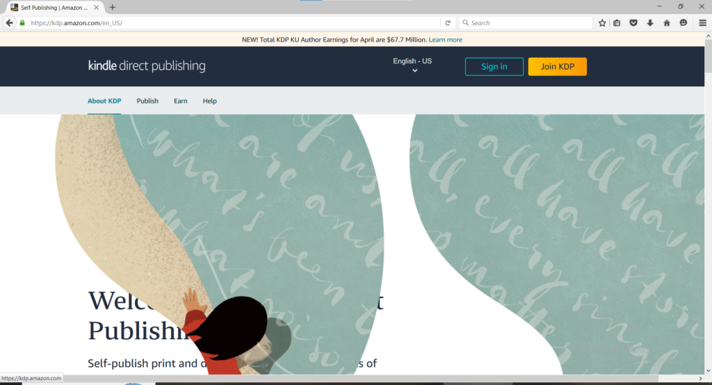
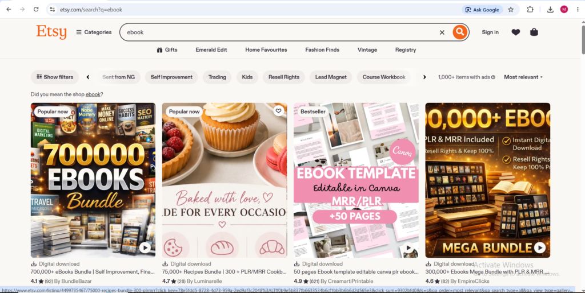
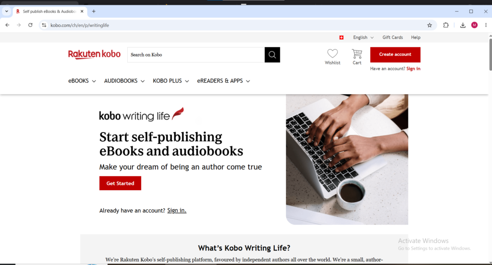
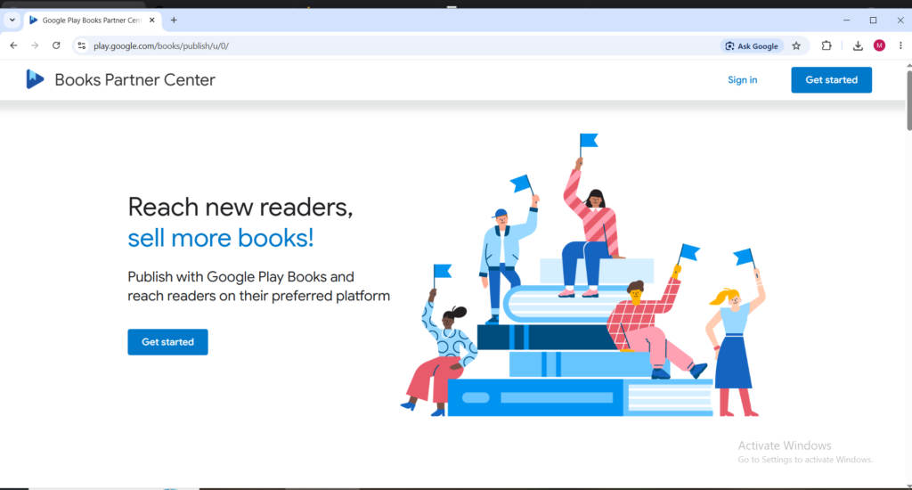
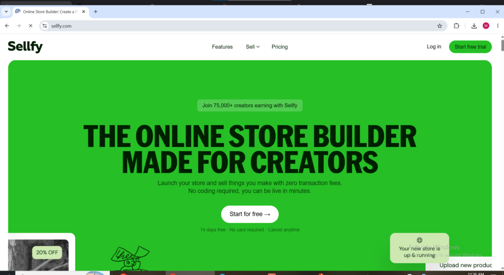

Knowledge has always been worth money. What changed in 2026 is how efficiently that knowledge can be packaged, distributed, and sold to people actively searching for it from every corner of the world. An ebook written once can sell to someone in Lagos at 3am, someone in Toronto at noon, and someone in Sydney at 7pm; all in the same hour without the author lifting a finger after publication. The global ebook market is worth over $15 billion and growing steadily year on year. Every niche has readers willing to pay for information that solves a specific problem they are actively experiencing. Making money selling ebooks online in 2026 does not require a publishing deal, a literary agent, or even a large social media following. It requires understanding what people want to read, writing something genuinely useful, and putting it where they are already looking.

**This guide covers everything needed to make money selling ebooks online in 2026;** From choosing a niche with proven demand to writing, formatting, pricing, distributing, and promoting an ebook that generates consistent passive income long after publication.

* * *

**What Is an Ebook and Why Do People Buy Them**

An ebook is a digital book people read on phones, tablets, or computers. People pay for ebooks because they provide useful knowledge, entertainment, guides, or solutions to problems at a lower price and with faster access than physical books, making them convenient and valuable for learning or enjoyment.

**Why Selling Ebooks Online Is One of the Best Passive Income Models in 2026**

Selling ebooks online produces income with a cost structure that almost no other business model can match. The profit margin on a digital product with zero manufacturing cost, zero inventory, and zero shipping expense is effectively 100 percent minus the platform's commission fee. A $9.99 ebook sold through Amazon KDP at the 70 percent royalty tier earns approximately $6.99 per sale. Sell one hundred copies per month and that is $699 in monthly passive income from a single title written once. Build a catalog of ten titles and the compounding effect produces income that scales without requiring proportional additional work.

The production cost for making money selling ebooks online in 2026 is lower than at any point in publishing history. AI writing tools like ChatGPT and Claude dramatically reduce the time required to produce a first draft. Design tools like Canva produce professional ebook covers and interior layouts without requiring graphic design experience or expensive software. Distribution platforms like Amazon KDP, Gumroad, and Payhip handle all payment processing and file delivery automatically. The infrastructure that once required a publishing company to manage now runs on a laptop and a few free or low-cost platform accounts.

* * *

**Step 1: Choose a Profitable Niche for Your Ebook**

Niche selection is the most important decision when selling ebooks online. Choosing the right niche before writing even one word prevents months of wasted effort. The biggest mistake new sellers make is picking a topic based only on personal interest instead of confirming real buyer demand.

A profitable ebook niche requires three things: genuine buyer demand, a specific problem it solves, and the ability to write about it authoritatively through experience or research. Broad topics have too much competition, while overly narrow ones have too few buyers.

The most consistently profitable niches in 2026 are: self-help and personal development, personal finance and investing, health and fitness, business and entrepreneurship, online income and side hustles, parenting, relationships, spiritual, cooking and diets, and professional certification study guides. Buyers in these niches seek solutions to real problems and are willing to pay.

To validate a niche, check Amazon Kindle bestseller lists in that category. Study top titles, covers, descriptions, and review counts. Strong sales and reviews confirm demand, while few titles and reviews signal either low demand or a potential opportunity.

* * *

**Step 2: Write Your Ebook**

Writing an ebook for selling online does not require professional writing experience or deep expertise. It only requires organizing useful information clearly so readers move from their current problem to the desired solution. That transformation is what buyers actually pay for.

The most effective structure for non-fiction and how-to ebooks is simple:

- Start with an introduction that states the reader’s problem and promises the transformation.

- Deliver practical, actionable chapters that build the solution.

- End with a conclusion that reinforces results and suggests next steps.

AI tools like ChatGPT or Claude now make production much faster. They can generate outlines and full drafts, turning a 10,000–20,000 word ebook from weeks of work into just days. However, raw AI content must be properly edited — reviewed, fact-checked, personalized, and improved — or it will feel mechanical and attract negative reviews.

Non-fiction ebooks sell best between 10,000 and 30,000 words. Focused, high-value content outperforms longer books filled with unnecessary filler.

* * *

**Step 3: Format and Design Your Ebook**

Professional formatting and cover design are the two production elements that most directly affect whether making money selling ebooks online is achievable from a new title. Readers browsing ebook listings make split-second purchasing decisions based primarily on the cover image and the description — a poorly designed cover signals an unprofessional product and reduces the conversion rate of every marketing effort made to drive traffic to the listing.

Ebook covers follow specific visual conventions for each genre and category. Non-fiction guide covers typically use clean bold typography, a clear title that communicates the benefit, and a professional background image or graphic. Finance and business ebook covers favor dark professional color palettes. Health and wellness covers favor clean whites and greens. Self-help covers often feature aspirational imagery. Studying the covers of bestselling ebooks in the target category reveals the visual language that buyers in that market trust — and designing within those conventions rather than against them produces covers that signal quality to the right audience immediately.

Canva has dedicated ebook cover templates at the correct dimensions that produce professional results without requiring graphic design skills or software. The key is matching the visual style of successful ebooks in the target category rather than creating something that looks visually distinct but commercially inappropriate for the niche.

The interior formatting of an ebook depends on the platform where it will be sold. PDF format works best for ebooks sold through Gumroad, Payhip, and Etsy because readers download and read the file directly without needing a dedicated ebook reader. EPUB format is required for distribution through Amazon KDP, Apple Books, Kobo, and Google Play Books because those platforms display the content through their own reading applications. Microsoft Word documents can be uploaded directly to Amazon KDP which converts them to the appropriate format automatically — the most beginner-friendly approach for first-time ebook sellers making money selling ebooks online without prior formatting experience.

* * *

**Step 4: Where to Sell Your Ebook Online**

**Amazon KDP**

Website: [kdp.amazon.com](http://kdp.amazon.com)

Amazon Kindle Direct Publishing (KDP) controls about 65-70% of the global ebook market and remains the most powerful platform for selling ebooks online. It puts your book in front of millions of Amazon customers who are already in buying mode and actively searching for books.

KDP’s recommendation system drives organic sales by suggesting your ebook to the right readers based on their behavior.

Royalties are 70% for ebooks priced between $2.99 and $9.99, and 35% outside that range. Enrolling in KDP Select unlocks Kindle Unlimited (paid per page read), Free Book Promotions, and Countdown Deals to boost visibility.

The main limitation is that Amazon owns the customer relationship, You don’t get buyer emails and cannot contact them outside the Amazon platform.

* * *

**Gumroad**

Website: [gumroad.com](http://gumroad.com)

Gumroad is the most popular platform for selling ebooks directly to your own audience. It charges a simple 10% fee with no monthly subscription. Setup is fast; Upload the file, write a description, set a price, and the product goes live immediately. Gumroad handles payments, file delivery, and international VAT automatically.

The biggest advantage is keeping 90% of each sale (much higher than Amazon’s 70%). The main drawback is the lack of built-in discovery, There’s no marketplace, so all sales come from traffic you drive yourself through email, social media, or your blog.

For sellers with an existing audience or organic traffic, Gumroad is often the highest-margin platform.

<figure>

<figcaption>

Gumroad.com homepage for selling ebooks online

</figcaption>

</figure>

* * *

**Payhip**

Website: [payhip.com](http://payhip.com)

Payhip is a strong alternative to Gumroad with a free plan that charges 5 percent per transaction which is half the fee of Gumroad's free tier. The platform includes a built-in affiliate marketing tool that allows ebook sellers to recruit affiliates who promote the ebook in exchange for a commission; A traffic amplification feature that Gumroad does not offer natively. Payhip also handles payment processing and automatic file delivery, supports coupon codes and discount campaigns, and allows sellers to build a branded storefront rather than just individual product pages. For ebook sellers who want to run an affiliate program to amplify their distribution without upfront advertising cost, Payhip provides the infrastructure to do so from within the platform.

<figure>

<figcaption>

Payhip.com for selling ebooks online

</figcaption>

</figure>

* * *

**Etsy**

Website: [etsy.com](http://etsy.com)

Etsy has become a significant marketplace for selling ebooks online in 2026 particularly for visual ebook formats like workbooks, planners, recipe books, and practical guides that appeal to Etsy's buyer base of small business owners, creatives, and individuals seeking practical tools and resources. Etsy's search engine receives over 500 million searches per month and a growing proportion of those searches are buyers looking specifically for digital downloads including ebooks in specific niches.

<figure>

<figcaption>

Ebooks for sale on etsy.com

</figcaption>

</figure>

Making money selling ebooks online through Etsy requires paying a $0.20 listing fee per item plus a 6.5 percent transaction fee on each sale. The advantage is access to Etsy's massive existing buyer traffic without needing to build an audience from scratch. Ebook listings that rank well in Etsy search generate consistent passive sales from buyers who are actively searching for exactly that type of content from a genuine valuable source of income for ebook sellers who optimize their listings correctly with strong titles, relevant tags, and compelling product mockup images.

* * *

**Apple Books**

Website: [authors.apple.com](http://authors.apple.com)

Apple Books distributes ebooks to hundreds of millions of Apple device users globally across iPhone, iPad, and Mac. Publishing through Apple Books Author gives ebook sellers access to a premium buyer audience that skews toward higher-income readers with strong purchasing power. Apple takes a 30 percent commission on sales and pays royalties monthly. The platform does not require exclusivity because ebooks can be sold simultaneously on Amazon KDP, Gumroad, and Apple Books without restriction. For making money selling ebooks online to a global audience that includes significant numbers of Apple device users, Apple Books represents a meaningful distribution channel that many ebook sellers overlook in favor of Amazon alone.

**Kobo Writing Life**

Website: [kobo.com/writinglife](http://kobo.com/writinglife)

Kobo is the dominant ebook platform in Canada and has strong market share in Europe, Australia, and Japan in geographic markets where Amazon's dominance is less absolute. Publishing through Kobo Writing Life gives ebook sellers access to Kobo's retail store and its network of library distribution partners through OverDrive, where library borrows generate per-read royalties. For making money selling ebooks online to readers outside the Amazon ecosystem particularly in Canada and European markets Kobo represents a meaningful supplementary distribution channel that requires minimal additional effort once the ebook is already formatted for Amazon KDP.

<figure>

<figcaption>

koko.com home page for selling ebooks online

</figcaption>

</figure>

**Google Play Books** [play.google.com/books/publish](http://play.google.com/books/publish)

Google Play Books distributes ebooks to Android device users globally through the Google Play Store which is pre-installed on virtually every Android smartphone worldwide. Google pays a 70 percent royalty in over 60 countries with no delivery fees deducted from the royalty meaning the royalty calculation is based on the full list price rather than the price minus delivery costs as Amazon calculates. For making money selling ebooks online to the enormous global Android user base, Google Play Books provides access to a reader demographic that may not overlap significantly with Kindle users particularly in markets where Android penetration is highest.

<figure>

<figcaption>

**Google play books**

</figcaption>

</figure>

**Sellfy**

Website: [sellfy.com](http://sellfy.com)

Sellfy is a dedicated digital product platform that gives ebook sellers a fully branded standalone store with no transaction fees on paid plans. The platform includes built-in email marketing, upselling features, discount codes, and anti-piracy tools including unique download links and PDF stamping that discourage buyers from sharing purchased files. For ebook sellers who want to build a branded storefront with full control over the customer experience rather than selling through third-party marketplaces, Sellfy provides the most complete set of selling tools in a single platform for making money selling ebooks online directly.

<figure>

<figcaption>

Sellfy.com homepage for selling ebooks online

</figcaption>

</figure>

**Step 5: How to Price Your Ebook**

Pricing is one of the most important decisions when selling ebooks online because it affects sales volume, revenue per sale, and perceived product quality.

On Amazon KDP, the royalty structure favors pricing between $2.99 and $9.99 for 70% royalties. A $2.99 ebook earns about $2.09 while a $9.99 ebook earns about $6.99. Most non-fiction guides perform best at $4.99 or $6.99 as this balances volume and profit better than very low or high prices.

On direct platforms like Gumroad and Payhip, prices can be much higher. Ebooks sold to an existing audience can comfortably sell for $15 to $47 for standard guides and $50 to $97 for comprehensive ones because buyers already trust the creator.

Adding an upsell at checkout such as a workbook or template pack increases average order value without extra marketing cost.

**Step 6: How to Promote Your Ebook**

Making money selling ebooks online requires active promotion in the early stages because building organic discovery on Amazon, Etsy, or Google takes time as the listing gains sales and reviews.

The most effective free promotion tactic on Amazon KDP is using the KDP Select Free Promotion. Making the ebook free for up to five days creates high download volume, improves category rankings, and drives organic paid sales afterward. It also helps gather initial reviews for social proof.

Pinterest is a strong long-term traffic source for direct platforms like Gumroad and Payhip. Vertical pins with compelling headlines linking to the product page can generate ongoing sales for months or years. Topics like personal finance, self-improvement, health, parenting, recipes, and productivity perform especially well.

Building an email list early is one of the smartest moves. Offering a free short ebook or resource as an opt-in incentive creates a list of warm prospects. Future launches can then be promoted directly to people who already know and trust you.

Guest blogging and podcast appearances in the niche also bring highly targeted, qualified traffic from interested audiences.

**How AI Tools Have Changed Making Money Selling Ebooks Online**

The biggest change in making money selling ebooks online in 2026 is how AI tools have dramatically cut production time. An ebook that once took six to eight weeks to research and write can now be drafted in just two to three days. The author’s main role shifts to research, editing, fact-checking, and improving quality.

All major platforms, including Amazon KDP, Apple Books, Kobo, and Gumroad, allow AI-assisted content. Amazon only requires a simple disclosure checkbox for substantially AI-generated books. Readers and reviewers care about quality, accuracy, and usefulness not whether AI was used.

This means a solo author can now realistically build a catalog of 10 to 20 well-researched ebooks in a short time. A strong catalog creates compounding passive income, as each new title helps promote existing ones through platform recommendations and author page traffic.

* * *

**What to Realistically Expect**

Making money selling ebooks online is a genuine passive income opportunity with a realistic timeline and earnings trajectory that varies significantly based on niche selection, ebook quality, platform choice, and promotion effort.

A first-time ebook seller publishing on Amazon KDP with minimal promotion effort can expect initial monthly earnings in the range of zero to fifty dollars in the first sixty days as the listing builds its initial sales history and review count. After accumulating ten to twenty genuine reviews and implementing basic promotional strategies, monthly earnings typically reach one hundred to five hundred dollars from a single title in a well-chosen niche.

Experienced ebook sellers with catalogs of ten or more titles, active email lists, and systematic promotion across Pinterest, social media, and their own blog report monthly passive income ranging from one thousand to five thousand dollars from their ebook catalog with the income growing as new titles are added and the existing titles continue accumulating reviews and organic ranking.

The sellers generating the highest incomes from ebooks online treat it as a business rather than a one-time project publishing consistently, building their audience systematically, and investing the proceeds from early titles into improving the quality and promotion of subsequent ones. Every title added to the catalog is a permanent income-generating asset that earns money indefinitely after publication with no ongoing maintenance required beyond occasional price adjustments and marketing refreshes.
