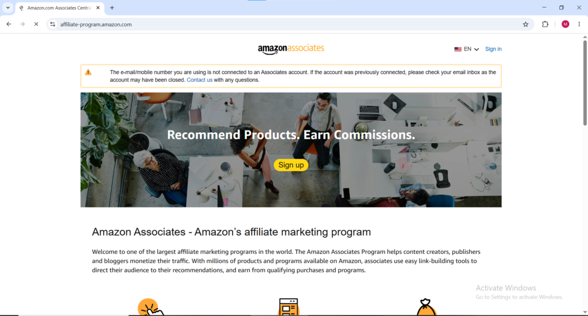
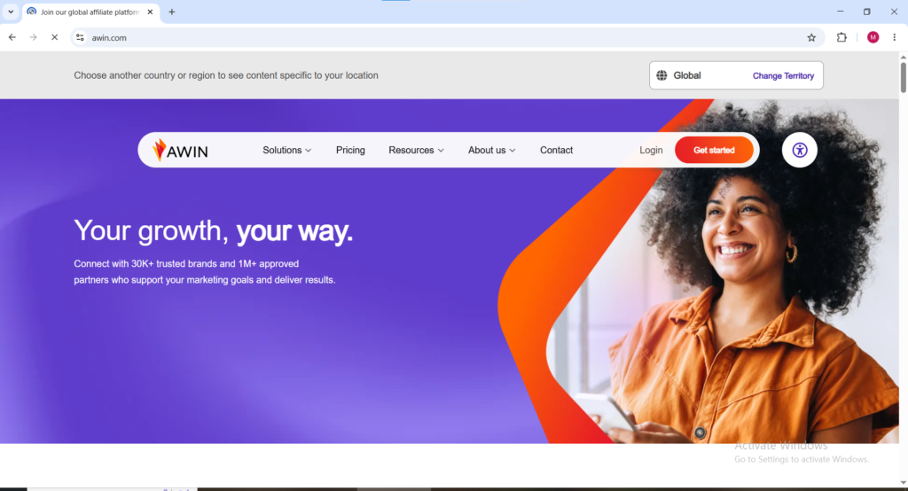
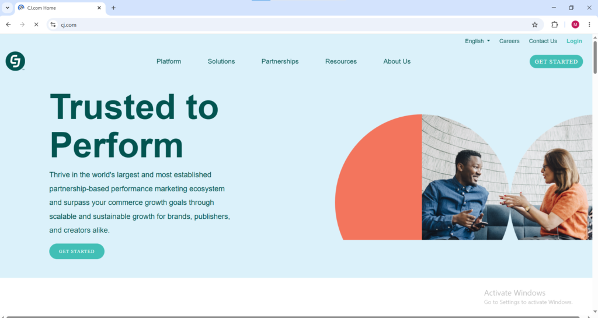
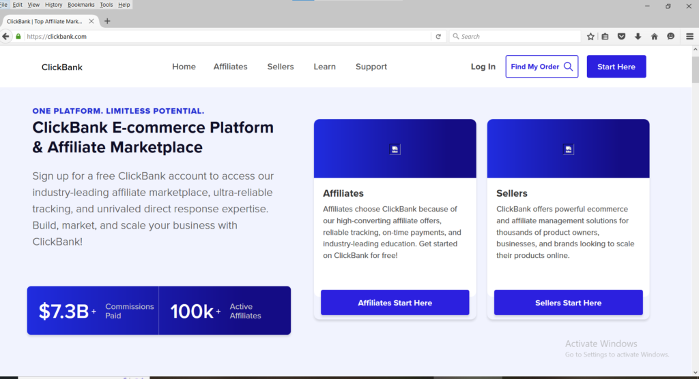
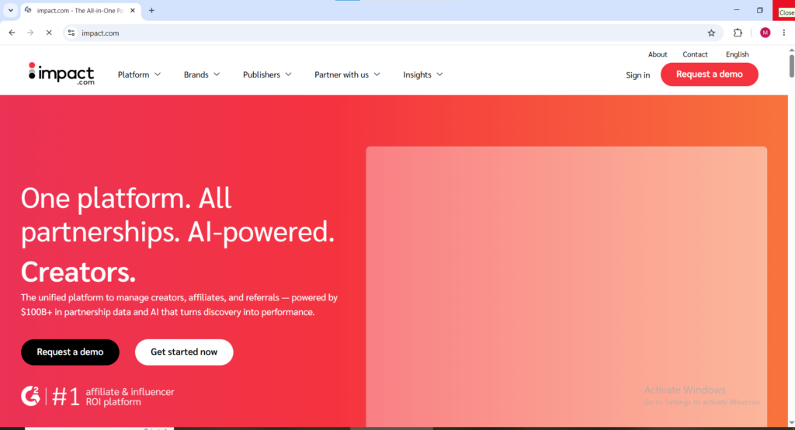
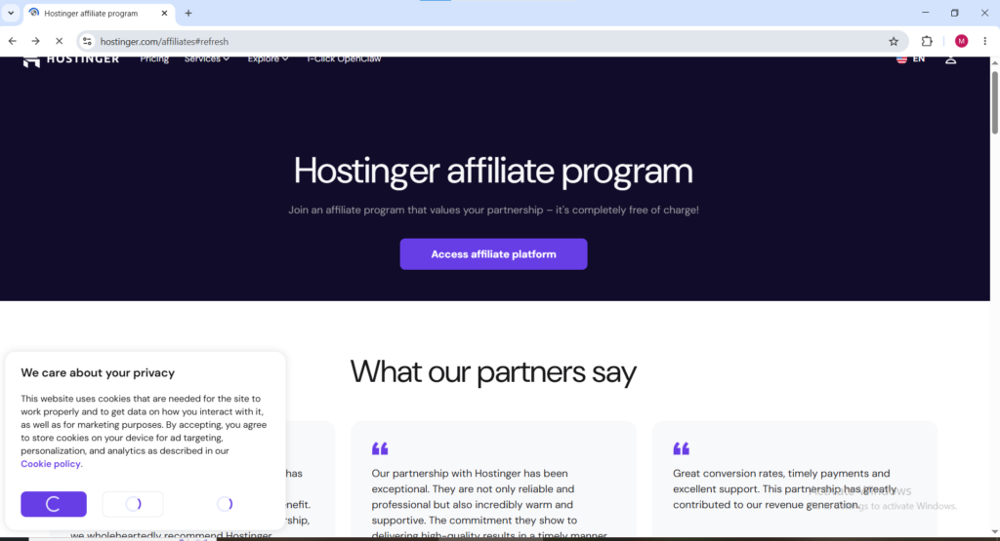

Imagine waking up to see money in your account from sales made while you slept. No alarms, no boss, no trading time for money. That’s what successful affiliate marketing passive income looks like in 2026 and it remains one of the most accessible ways to build income from anywhere in the world.

The global affiliate marketing industry is now worth $18.5 billion, with over 80% of brands running affiliate programs. Businesses actively want people to promote their products and pay generous commissions for sales.

This guide covers everything you need to know: how affiliate marketing works, realistic earnings, the best programs, and the exact steps to start building income that works while you sleep.

**What you will learn by Reading this Article**

- What Is Affiliate Marketing and How Does It Work

- How Much Can You Realistically Earn with Affiliate Marketing

- How to choose your Niche

- 7 Platforms that present good affiliate link offers

- How to Build a platform

- How to Drive Traffic

- How to Track your performance and Optimize

**ALL THIS KNOWLEDGE IS COMPLETELY FREE**

### What Is Affiliate Marketing and How Does It Work

Affiliate marketing is a performance-based model where you promote other companies’ products using a unique tracking link and earn a commission every time someone buys through your link. You don’t create the product, handle customer service, inventory, or shipping. Your only job is connecting people with the right products and earning a percentage of each sale.

Here’s how it works: You join a company’s free affiliate program, get a unique tracking link, and share it on your blog, YouTube, social media, or email. When someone clicks your link and makes a purchase, the company tracks it and pays you a commission; whether you’re sleeping or traveling.

The passive income comes from content you create once (blog posts, videos, Pinterest pins) that can continue generating clicks and commissions for months or years with no extra work.

* * *

### How Much Can You Realistically Earn with Affiliate Marketing

Honesty matters more than hype here. Beginners typically earn between zero and five hundred dollars per month in their first sixty to ninety days as they build traffic and audience trust. Intermediate affiliates who have been consistently creating content for six to twelve months commonly earn between five hundred and five thousand dollars per month. Established affiliate marketers with two or more years of consistent effort in high-commission niches regularly earn ten thousand dollars or more monthly.

Six figure monthly affiliate marketing passive income is real but represents a small percentage of participants and typically requires three or more years of consistent effort in high-commission niches like software, finance, or digital education. For most beginners a realistic first year target is two hundred to eight hundred dollars per month by month nine or ten which represents meaningful supplemental income that genuinely compounds over time as your content library and audience grow.

The most important thing to understand about affiliate marketing passive income is that it is not instant. The income arrives on a timeline that rewards consistency and punishes impatience. The affiliates who give up after sixty days of minimal earnings are the same ones who would have been earning one thousand dollars per month at month eight if they had stayed the course.

* * *

**Step 1: Choose Your Niche**

Your niche is the specific topic your affiliate content will focus on. Choosing the right niche is the most important decision in affiliate marketing — getting it wrong wastes months of work.

Beginners often pick niches that are too broad or based only on personal interest without confirming real buyer demand. Too broad (like general health or technology) means competing with huge established sites. Niches with no spending produce traffic but no commissions.

The ideal niche in 2026 sits at the intersection of three factors: strong buyer intent (people actively spend money), available affiliate programs with good commissions, and narrow enough to build authority without facing giants immediately.

High-performing niches include personal finance and online earning, software and tech tools, health and fitness, online education, home improvement, parenting, and travel.

* * *

**Step 2: Join Affiliate Programs**

Once you have your niche, the next step is joining affiliate programs that offer products relevant to your audience. Here are the best affiliate programs and networks to start with in 2026:

i. **Amazon Associates**

Amazon Associates is the most beginner friendly affiliate program in the world and the starting point for most new affiliate marketers. You can promote virtually any product sold on Amazon and earn between one and ten percent commission depending on the product category. The commissions are lower than most specialist programs but the conversion rate is high because Amazon is one of the most trusted shopping platforms on earth. When someone clicks your Amazon affiliate link they have a 24 hour cookie window meaning you earn a commission on anything they purchase on Amazon within that 24 hour period not just the product you linked to, **Click here** [affiliate-program.amazon.com](http://affiliate-program.amazon.com) **to get started.**

ii. **Awin (formerly ShareASale)**

[https://www.awin.com](https://www.awin.com)

Awin (formerly ShareASale) is a global affiliate marketing network that connects advertisers with publishers. It enables users to promote products, track performance, and earn commissions through a unified platform with advanced reporting and worldwide merchant access.

<figure>

<figcaption>

**Awin.com welcome page**

</figcaption>

</figure>

iii. **CJ Affiliate** [cj.com](http://cj.com)

CJ Affiliate formerly known as Commission Junction is one of the most established affiliate networks in the industry and hosts premium brand programs in fashion, technology, finance, and more. Commission rates and cookie durations vary by program but CJ tends to attract larger more established brands than some other networks.

<figure>

<figcaption>

Cj.com for affiliate marketing

</figcaption>

</figure>

iv. **ClickBank** [clickbank.com](http://clickbank.com)

ClickBank specializes in digital products; online courses, ebooks, software, and membership programs — and offers some of the highest commission rates in affiliate marketing, commonly between 50 and 75 percent per sale. The digital product focus makes commissions significantly larger per transaction than physical product programs. ClickBank is available to affiliates in most countries worldwide making it one of the most globally accessible affiliate programs for building affiliate marketing passive income.

<figure>

<figcaption>

**Clickbank.com For affiliate marketing**

</figcaption>

</figure>

v. **Impact** [impact.com](http://impact.com)

Impact is the affiliate network used by major software companies, subscription services, and premium brands. Programs on Impact commonly offer recurring commissions meaning you earn a percentage of a customer's subscription fee every single month for as long as they remain a subscriber. Recurring commissions are the most powerful form of affiliate marketing passive income because a single referral can generate monthly income indefinitely.

<figure>

<figcaption>

Impact.com for affiliate programs

</figcaption>

</figure>

vi. **Fiverr Affiliates** [affiliates.fiverr.com](http://affiliates.fiverr.com)

Fiverr's affiliate program pays between $15 and $150 per first time buyer you refer depending on the service category. The CPA (cost per action) model means you get paid when someone signs up and makes their first purchase a one-time payment rather than recurring. Given that Fiverr is a globally recognized platform that your audience likely already knows, conversion rates tend to be solid.

vii. **Hostinger Affiliate Program** [hostinger.com/affiliates](http://hostinger.com/affiliates)

Web hosting affiliate programs are among the highest paying in the entire affiliate marketing space. Hostinger pays up to 60 percent commission per sale which on a hosting plan can translate to $60 or more from a single referral. Your blog, youtube videos etc audience people building online income will frequently need hosting for their own blogs and websites making this a highly relevant program for your specific readership.

<figure>

<figcaption>

**Hostinger affliate program homepage**

</figcaption>

</figure>

* * *

**Step 3: Build Your Content Platform**

Affiliate marketing passive income requires a platform where you publish content containing your affiliate links. The three most effective content platforms for affiliate marketing in 2026 are blogs, YouTube channels, and email newsletters. A blog generates passive search traffic through Google, meaning posts you publish today can bring readers and affiliate clicks months or years from now without ongoing promotion. YouTube works similarly videos rank in both YouTube search and Google search and continue generating views and affiliate clicks long after publication. An email newsletter gives you a direct relationship with your audience that is not dependent on any algorithm.

For someone in the online earning niche writing on a blog, the content types that generate the most affiliate marketing commissions are comparison posts like Outlier vs DataAnnotation Which Pays More, best of lists like Best Survey Sites in Australia, how-to guides like How to Get Started on Amazon KDP, and honest review posts covering specific platforms and tools. Every single piece of content on your CashSuccess blog is an opportunity to include relevant affiliate links that generate passive income.

* * *

**Step 4: Create Content That Actually Converts**

Joining affiliate programs and having a blog is not enough on its own. The content you publish needs to be genuinely helpful, specific, and trustworthy before affiliate links inside it will convert to commissions.

The fundamental principle of affiliate marketing content that converts is this solves a real problem first and monetize second. Content that leads with the affiliate pitch and treats the actual information as secondary converts poorly because readers sense when they are being sold to rather than helped. Content that thoroughly solves a reader's specific problem, earns their trust with accurate and detailed information, and then naturally recommends a product as the solution to their problem converts consistently and builds the kind of repeat audience that generates compounding affiliate marketing passive income over time.

Comparison content converts particularly well in the online earning niche because readers who are deciding between two platforms are very close to making a decision and a clear well-researched comparison helps them choose. A post comparing two survey platforms, two AI training sites, or two digital product marketplaces naturally includes affiliate links to both options and captures readers at the exact moment they are ready to sign up.

Review content also converts well because readers searching for reviews of a specific platform have already decided they are interested they just want confirmation before committing. An honest detailed review that covers both the strengths and weaknesses of a platform converts better than a purely positive promotional post because it builds trust by acknowledging reality.

* * *

**Step 5: Always Disclose Your Affiliate Links**

This is not optional and skipping it can get you banned from affiliate programs and damage your reader trust permanently. Whenever you include affiliate links in your content you are legally and ethically required to disclose this to your readers clearly and upfront not in small print at the bottom where nobody reads it.

A simple disclosure at the top of any post containing affiliate links is all that is needed. Something like: "This post contains affiliate links. If you purchase through these links I may earn a small commission at no extra cost to you. I only recommend products I genuinely believe in."

That one sentence protects you legally, complies with affiliate program terms of service, and actually builds trust with readers rather than eroding it. Readers who know you are transparent about how you earn are more likely to click your links because they trust your recommendations are genuine rather than purely commercial.

* * *

**Step 6: Drive Traffic to Your Content**

Affiliate links inside content that nobody reads earn nothing. Traffic is what converts your content into affiliate marketing passive income and in 2026 the most sustainable and genuinely passive traffic source is search engine optimization. Getting your posts to rank on Google for terms your target audience is actively searching for.

Every post on your blog should target a specific keyword phrase that your audience types into Google. Rank Math which is already installed on your blog guides you through optimizing each post for its target keyword. The more posts you publish targeting relevant keywords your audience searches for, the more search traffic your blog accumulates and the more affiliate clicks and commissions you earn passively without ongoing promotion effort.

Pinterest is a powerful secondary traffic source specifically for blogs in the online earning, personal finance, and digital products niches. Creating simple pin graphics for each blog post and posting them on Pinterest sends consistent referral traffic to your affiliate-linked content. Pinterest traffic compounds similarly to search traffic pins you create today can drive blog visits and affiliate clicks for years.

* * *

**Step 7: Track Your Performance and Optimize**

Every affiliate program you join provides a dashboard showing how many clicks your links are receiving, how many of those clicks are converting to sales, and how much commission you have earned. Reviewing this data regularly shows you which content is generating the most affiliate income and which programs are converting best with your specific audience.

A post getting thousands of clicks but zero conversions tells you either the affiliate program is a poor fit for your audience or the placement of the link within the content needs adjustment. A post with fewer clicks but a high conversion rate tells you the audience intent is strong and publishing more content in that direction will grow your affiliate marketing passive income proportionally.

The affiliates who build consistent long-term passive income treat affiliate marketing as a data-informed business rather than a set-and-forget exercise. Small optimizations based on real performance data — adjusting link placement, testing different call-to-action wording, swapping underperforming programs for better fitting alternatives compound into significantly higher earnings over time without requiring additional content creation.

* * *

**What Nobody Tells You About Affiliate Marketing Passive Income**

The word passive in affiliate marketing passive income is accurate but it requires an important qualification. The income becomes passive after the work is done — the research, the writing, the optimization, the audience building. The upfront work is real and it takes time before the passive income begins flowing meaningfully.

Most beginners who fail at affiliate marketing quit during the three to six month window when content is published but traffic has not yet built up enough to generate consistent commissions. This window is where the work feels unrewarded. It is also where the foundation of future passive income is being laid whether the numbers show it yet or not. Search engines take time to trust new content. Audiences take time to build. Affiliate income takes time to compound.

The affiliates consistently earning meaningful passive income from affiliate marketing in 2026 are the ones who published consistently through those quiet early months without expecting instant results, who treated every post as a permanent income-generating asset rather than a piece of content that needs to perform immediately, and who kept learning from their data and improving their content quality over time. That discipline is what separates the people who make affiliate marketing passive income work from the much larger group who try it briefly and conclude it does not work.

It works. It just works on a timeline that rewards patience.
