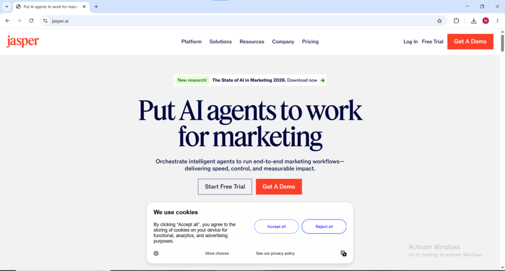
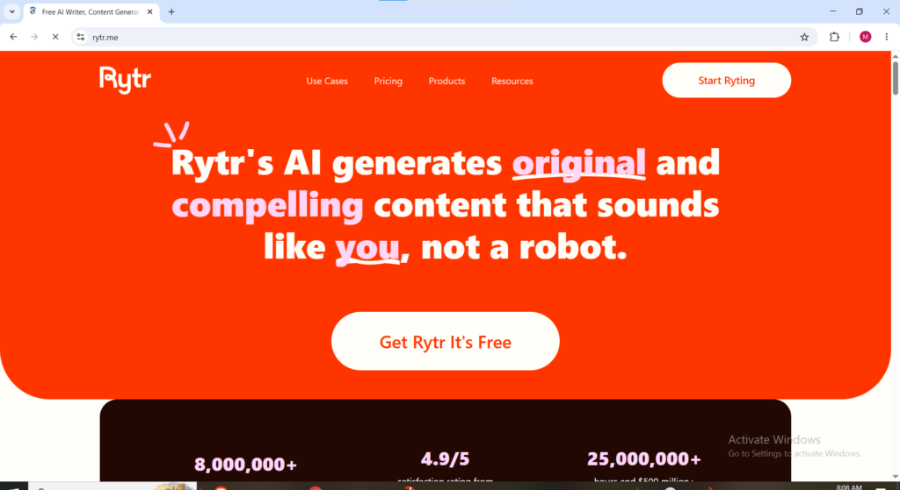
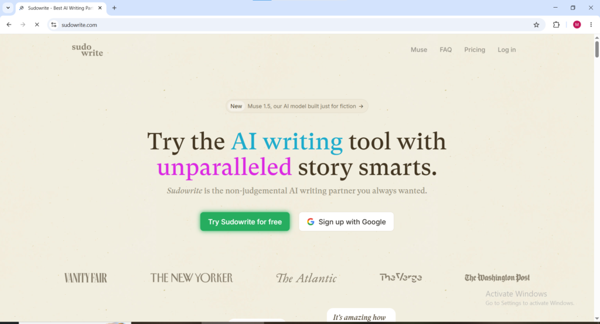

There is a big difference between how writing work looked before 2023 and how it works now. Anyone still using the old methods is leaving serious money on the table.

Before AI tools, even a fast and experienced freelance writer could only produce two or three polished blog posts per day. Today the same writer can comfortably create eight to twelve. The quality has not dropped. In many cases it has actually improved because writers no longer waste time on first drafts. They can now focus all their energy on strategy, editing, and creating excellent content.

This massive productivity boost is why AI writing tools have become one of the most powerful ways to increase income for anyone who works with words in 2026.

#### What you will know By Reading This Article

- What AI Writing Tools Actually Are.

- The Best AI Writing Tools to Know in 2026 (Listed 5 of them)

- Ways to Make Money with AI Writing Tools in 2026 (Listed 9 of them)

- Where to get clients.

- The AI Writing Tools Affiliate Opportunity.

- Amount to realistically expect to earn.

* * *

**What AI Writing Tools Actually Are**

AI writing tools are software applications that use large language models to generate, edit, summarize, rewrite, and optimize written content based on prompts and instructions provided by the user. The user describes what they want; a blog post on a specific topic, a product description for an e-commerce listing, an email sequence for a marketing campaign, a social media caption for a specific audience and the AI generates a complete draft in seconds.

The critical thing to understand about AI writing tools in 2026 is that they are not replacements for human writers instead they are multipliers. An AI writing tool in the hands of someone with no understanding of audience, tone, SEO, or commercial writing produces generic useless content that serves nobody. The same AI writing tool in the hands of someone who understands what good writing looks like and how to direct the AI effectively produces professional-quality content at a speed and volume that was physically impossible before these tools existed. The income opportunity in AI writing is not in letting the AI do everything. It is in knowing how to use the AI to do the heavy lifting while applying genuine human judgment, expertise, and editing to produce something genuinely valuable.

* * *

### **The Best AI Writing Tools to Know in 2026**

i. **ChatGPT** [chat.openai.com](http://chat.openai.com)

ChatGPT is the most widely used AI writing tool in the world and the starting point for most people entering the AI writing income space. The free version provides access to capable language models that can generate blog posts, emails, social media content, product descriptions, scripts, and almost any written format imaginable. The paid version unlocks access to more advanced models with stronger reasoning, better factual accuracy, and more consistent output quality. For anyone new to making money with AI writing tools ChatGPT is the right first tool because the learning curve is minimal, the output quality is high, and the breadth of writing tasks it handles is unmatched by any single alternative.

<figure>

<figcaption>

http://chat.openai.com for ai writing welcome page

</figcaption>

</figure>

* * *

ii. **Claude**[claude.ai](http://claude.ai)

Claude is built by Anthropic and has developed a strong reputation among professional writers specifically for the naturalness and flow of its long-form output. Where some AI writing tools produce text that feels mechanical or formulaic when generating longer pieces, Claude produces content that reads more like a skilled human writer with better narrative structure, smoother transitions, and a more consistent voice throughout extended pieces. For AI writing professionals working on blog posts, articles, ebooks, scripts, and long-form content Claude is often preferred over ChatGPT for the final quality of the output. The free tier provides meaningful access and paid plans unlock higher usage limits for professional volume work.

* * *

iii. **Jasper** [jasper.ai](http://jasper.ai)

Jasper is one of the most established dedicated AI writing platforms built specifically for marketing and business content. Unlike general AI tools that handle any topic, Jasper has been trained heavily on marketing copy, sales content, email sequences, advertising text, and brand communication making it particularly strong for commercial writing work. Jasper includes templates for dozens of specific content formats like Facebook ad copy, email subject lines, AIDA framework sales copy, product descriptions, blog post outlines that speed up the production of specific content types significantly. The platform is used by marketing teams at major companies which gives it credibility when pitching AI writing services to business clients.

* * *

iv. **Copy.ai** [copy.ai](http://copy.ai)

Copy.ai is a popular AI writing tool with a generous free tier that makes it one of the most accessible starting points for anyone beginning to build an income from AI writing tools. The platform specializes in short-form marketing copy like product descriptions, ad headlines, email subject lines, social media captions, and calls to action and produces polished commercial copy quickly from brief inputs. Copy.ai also includes longer-form content workflows for blog posts and articles. The free plan provides enough monthly credits to produce meaningful output for testing the platform and building an initial portfolio before upgrading.

* * *

v. **Writesonic** [writesonic.com](http://writesonic.com)

Writesonic combines AI writing capabilities with built-in SEO optimization features making it a particularly strong tool for anyone offering content writing services where search engine performance is a key deliverable for clients. The platform integrates keyword research data directly into its content generation workflow — a meaningful advantage for AI writers who are producing blog content specifically intended to rank on Google. Writesonic also includes an AI article writer that generates full SEO-optimized posts from a keyword input with minimal additional prompting making it one of the fastest tools for producing volume blog content at professional quality.

* * *

vi. **Rytr** [rytr.me](http://rytr.me)

Rytr is the most affordable dedicated AI writing tool with a free plan and paid plans starting at $9 per month — significantly cheaper than Jasper or Copy.ai premium tiers. The platform covers over 40 use cases and 20 languages making it particularly useful for AI writing professionals who work with international clients or need to produce content in multiple languages. Rytr's simplicity and low cost make it an excellent starting tool for beginners entering the AI writing income space before investing in more expensive specialized platforms.

<figure>

<figcaption>

Rytr.me for ai writing welcome page

</figcaption>

</figure>

* * *

v. **Sudowrite** sudowrite.com

Sudowrite is built specifically for creative and fiction writing — novels, short stories, screenplays, and narrative content — filling a gap that most AI writing tools focused on marketing content leave entirely uncovered. For AI writers who want to work in the fiction, ghostwriting, or creative content space, Sudowrite produces more contextually aware and narratively coherent fiction than general-purpose AI writing tools that were trained primarily on non-fiction and marketing content. The platform includes specific features for expanding scenes, developing characters, suggesting plot directions, and rewriting passages in different styles.

* * *

**Ways to Make Money with AI Writing Tools in 2026**

**Method 1: Freelance AI Content Writing**

Freelance content writing is the most immediately accessible way to make money with AI writing tools and the income potential for skilled AI-assisted writers in 2026 is genuinely significant. Businesses of every size need consistent content blog posts, website copy, email sequences, product descriptions, social media content, whitepapers, case studies, and more. The demand for writers who can produce this content quickly and at professional quality exceeds the supply of people who can deliver it reliably.

AI writing tools change the economics of freelance writing in two important directions simultaneously. First they allow writers to produce more content in less time a freelancer who previously could manage four or five clients now manages eight to twelve because the drafting time per piece has been dramatically reduced. Second they allow writers to offer more competitive rates per piece while maintaining higher margins because the time cost per deliverable has decreased significantly.

Earning potential for AI-assisted freelance writers ranges from $1,000 to $8,000 per month depending on niche, client quality, and volume. Technology, finance, healthcare, and SaaS content consistently command the highest per-word and per-post rates in the freelance writing market. Writers who specialize in high-value niches and use AI writing tools to produce that content efficiently operate at income levels that generalist writers working manually cannot match.

The most important principle of freelance AI content writing is that the AI produces the draft and the human produces the final deliverable. Submitting raw AI output to clients without genuine editing, fact-checking, voice matching, and structural improvement produces content that any editor will immediately identify as unpolished AI output and that reputation destroys client relationships. Using AI writing tools as a productivity accelerator while applying genuine professional judgment to every piece is what builds a sustainable and growing freelance writing business.

* * *

**Method 2: AI Copywriting Services**

Copywriting is writing specifically intended to persuade readers to take a specific action it is one of the highest-paying writing disciplines and AI writing tools have dramatically reduced the production time for high-quality commercial copy without reducing the earning potential of skilled copywriters.

Email sequences, sales page copy, advertising scripts, landing page text, and product launch copy all fall under commercial copywriting and each of these formats commands significantly higher rates than standard blog content because the financial impact of good copy on a client's business is direct and measurable. A well-written email sequence that converts readers into buyers is worth thousands of dollars to the business that uses it and that value justifies paying a copywriter meaningfully for producing it.

AI writing tools accelerate copywriting work by generating multiple headline variations instantly, producing first draft email sequences from a brief, suggesting different angles for sales arguments, and helping writers overcome the blank-page paralysis that is one of the most time-consuming aspects of manual copywriting work. The writer's skill in selecting, editing, and refining the AI output into genuinely persuasive copy remains the primary value being sold, AI tools simply remove the slowest and most mechanical parts of the production process.

* * *

**Method 3: AI-Powered Blogging**

Starting a blog and using AI writing tools to build its content library faster than manual writing allows is one of the most scalable long-term income strategies available in 2026. A blog that would take three years to build to meaningful traffic with manually written content can reach that same point in twelve to eighteen months with consistent AI-assisted publishing because the volume of SEO-optimized content the site accumulates is significantly higher in any given time period.

The income model for an AI-powered blog combines multiple revenue streams that compound over time; Display advertising through Google AdSense or Mediavine as traffic grows, affiliate marketing commissions from recommending relevant products and services, sponsored content partnerships with brands, and digital product sales to the audience the blog has built. Each of these income streams builds on the others and the blog's content library continues generating passive income indefinitely after each post is published.

The most important principle for AI-powered blogging is that topic and keyword selection must be driven by genuine search demand data rather than what the AI can easily generate content about. Using tools like Ahrefs, SEMrush, or even the free version of Ubersuggest to identify keywords with meaningful search volume and reasonable competition before assigning topics to AI writing tools is what separates blogs that rank and generate income from those that accumulate hundreds of posts and remain invisible to Google.

* * *

**Method 4: Social Media Content Management**

Businesses and creators need consistent, engaging social media content published across multiple platforms simultaneously and most of them either do not have the time to produce it manually or do not have the writing skills to make it genuinely engaging. AI writing tools solve both problems and social media content management using AI is one of the most accessible service businesses anyone can start in 2026 with minimal upfront investment.

A social media content manager using AI writing tools can realistically manage between eight and fifteen clients simultaneously by using the tools to generate initial content batches that are then edited, personalized to each brand's voice, and scheduled through tools like Buffer or Hootsuite. Monthly retainer fees for social media content management range from $300 to $1,500 per client depending on the number of platforms covered, the posting frequency, and the level of content customization required.

The service package structure that works best for social media content managers using AI writing tools is a monthly retainer covering a defined number of posts per week across specified platforms with a clear revision policy and performance reporting component. That defined scope prevents scope creep, justifies recurring monthly billing, and gives clients clear expectations for what they are receiving.

* * *

**Method 5: Email Marketing Copywriting**

Email marketing consistently generates the highest return on investment of any digital marketing channel and businesses that understand this actively invest in quality email sequences and ongoing newsletter content. AI writing tools have made producing high-volume email content faster than ever while the demand for genuinely effective email copy that drives opens, clicks, and conversions has only grown as inboxes become more competitive.

An AI email copywriter can produce welcome sequences, abandoned cart sequences, promotional campaigns, weekly newsletters, and re-engagement campaigns for multiple clients simultaneously by using AI writing tools to generate drafts and then applying genuine copywriting expertise to optimize subject lines, calls to action, and persuasive elements that the AI produces inconsistently without human refinement.

Email copywriting rates range from $50 to $500 per email depending on length, complexity, and the commercial impact the email is expected to have. An AI writing professional producing email sequences for e-commerce clients working at volume can build a meaningful monthly income from a relatively small number of clients because the recurring nature of email marketing means satisfied clients rebook monthly rather than seeking a new writer for each campaign.

* * *

**Method 6: SEO Content Services**

Businesses that understand SEO actively seek writers who can produce content specifically optimized to rank on Google for commercially valuable search terms. AI writing tools with built-in SEO features like Writesonic, combined with keyword research tools like Ahrefs or SEMrush, allow AI content writers to produce large volumes of keyword-targeted content faster and more systematically than manual writers working without AI assistance.

An SEO content service packages this capability as a monthly deliverable, A set number of SEO-optimized articles per month targeting a list of agreed keywords for a flat monthly fee. The recurring monthly model creates predictable income that builds over time as satisfied clients increase their content volumes and refer the service to other business owners in their network.

Rates for SEO content services range from $100 to $500 per article depending on length, research depth, and the competitive difficulty of the target keywords. Agencies and marketing departments that need significant content volumes regularly pay $2,000 to $10,000 per month for managed SEO content programs that include keyword research, content production, and performance monitoring.

* * *

**Method 7: AI Writing for Ebooks and Digital Products**

Using AI writing tools to produce ebooks, guides, templates, and educational content for sale as digital products is one of the most scalable passive income strategies available to AI writers in 2026. An ebook written with AI writing tools assistance takes a fraction of the time it would take to produce manually, A professional-quality 15,000-word guide that would take a manual writer two weeks can be produced in two to three days with AI writing tools doing the heavy lifting and the human author doing research, structuring, and editing work.

Those ebooks sell indefinitely on platforms like Gumroad, Amazon KDP, and Payhip generating royalties from each sale without requiring any additional work after the initial production and listing. A library of ten well-researched ebooks in a specific niche generates compounding passive income that grows as each new title also drives sales of related titles in the same catalog.

* * *

**Method 8: AI Translation and Multilingual Content**

AI writing tools with translation capabilities allow writers to produce content in multiple languages from a single English source, Opening international clients and markets that monolingual writers cannot serve. Businesses expanding into non-English markets need website copy, marketing materials, and content in local languages and the combination of AI translation with human review and cultural adaptation is a service that commands premium rates because the output quality is significantly higher than machine translation alone.

Writers who offer multilingual content services using AI writing tools position themselves for a much larger global client pool than English-only writers while charging rates that reflect the specialist nature of the service.

* * *

**Method 9: Prompt Engineering as a Service**

As businesses adopt AI writing tools for internal content production they discover that the quality of output depends enormously on the quality of the prompts that generate it. Prompt engineering, designing and optimizing the instruction sets that produce consistently excellent AI writing output has emerged as a standalone billable service in 2026 that commands rates between $50 and $300 per hour for experienced practitioners.

A prompt engineering service helps businesses build their internal AI content systems, Creating prompt libraries for their most frequently needed content types, designing workflows that integrate AI writing tools with their existing content production processes, and training their teams on effective prompting techniques. This service is particularly valuable to marketing agencies, content teams at growing companies, and professional services firms that need to produce high volumes of quality written content consistently.

* * *

**Where to Find Clients for AI Writing Services**

Fiverr is the most accessible starting point for AI writing professionals building their first client base. Creating specific gigs for blog writing, email copywriting, social media content, SEO articles, and product descriptions with clear deliverables, realistic turnaround times, and competitive introductory pricing generates initial reviews that unlock organic platform visibility. The first five reviews on Fiverr are the most important milestone — they establish credibility and significantly increase inquiry volume from new potential clients.

Upwork is better suited for higher-value contracts in the $500 to $5,000 range. Writing strong proposals that demonstrate understanding of the client's specific content needs, referencing relevant examples of similar work, and explaining exactly how AI writing tools will be used to deliver faster and higher-quality results than competitors consistently produces better results than generic proposals that treat every job posting identically.

LinkedIn is the strongest platform for building a professional reputation in AI writing services. Publishing regular posts demonstrating AI writing expertise ; before-and-after examples, workflow explanations, client result case studies builds visibility with decision makers at companies that need content services. Direct outreach to marketing managers, content directors, and business owners with a specific relevant example of what an AI writing service could produce for their specific business converts at meaningfully higher rates than generic pitching.

Cold email outreach to businesses in a specific niche whose content needs are clearly visible; thin blog archives, inactive social media presence, product descriptions that clearly needed professional attention generates warm leads from businesses who are already experiencing the problem being offered a solution to.

* * *

**The AI Writing Tools Affiliate Opportunity**

Every major AI writing tool on this list has an affiliate program and writing a blog post recommending these tools with affiliate links embedded naturally throughout the content is one of the most financially aligned content strategies available to anyone in the AI writing space. A reader who lands on a guide about making money with AI writing tools and clicks through to sign up for Jasper, Copy.ai, or Writesonic generates a recurring commission for the affiliate every month that reader remains a paying subscriber.

Jasper pays 25 percent recurring commission on all referred subscriptions. Copy.ai has an affiliate program through their website. Writesonic pays recurring commissions on referred plans. Rytr offers affiliate commissions through their program. These recurring commission structures mean that building an audience interested in AI writing tools and consistently recommending the right tools to that audience creates monthly income that compounds as the referred subscriber base grows.

* * *

**What to Realistically Expect**

Most AI writing professionals earn their first client payment within one to three weeks of actively pitching services on Fiverr or Upwork. Building to a consistent $1,000 to $3,000 monthly income from AI writing services typically takes three to six months of consistent client acquisition and quality delivery. Reaching $5,000 or more monthly requires either a strong niche specialization, a client base that refers consistently, or a blog or audience that generates inbound inquiries without active outreach.

The single most common mistake in making money with AI writing tools is submitting AI output to clients without adequate editing and refinement. Raw AI content is recognizable to experienced editors and content managers and submitting it unedited damages professional reputation in ways that take significant time to recover from. Treating AI writing tools as productivity multipliers rather than complete solutions is the mindset that produces sustainable long-term income from this approach.
