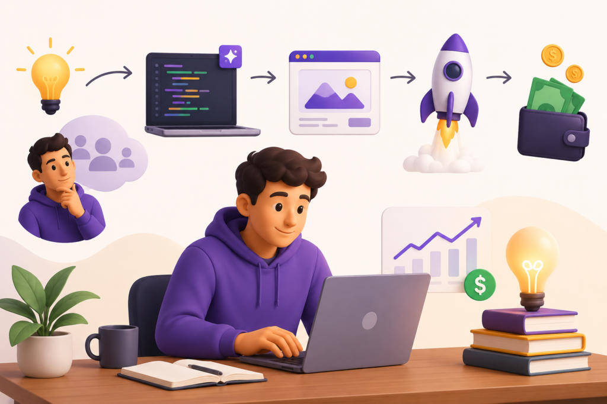
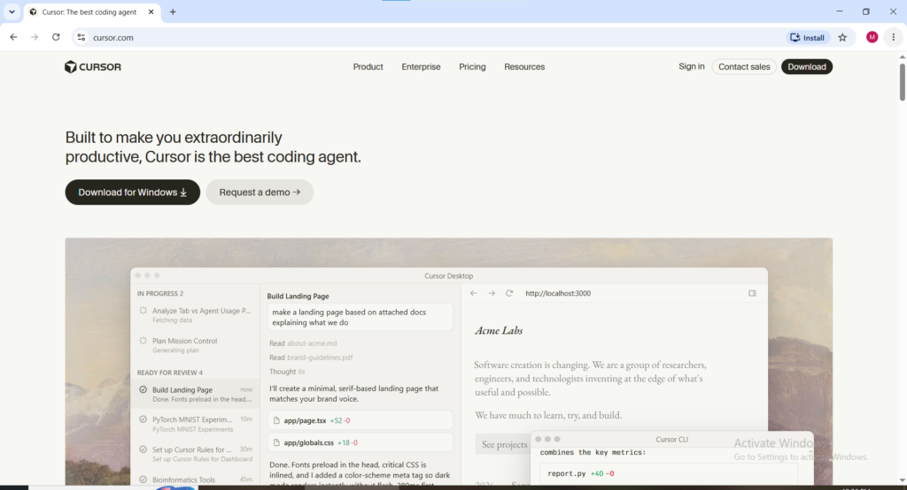
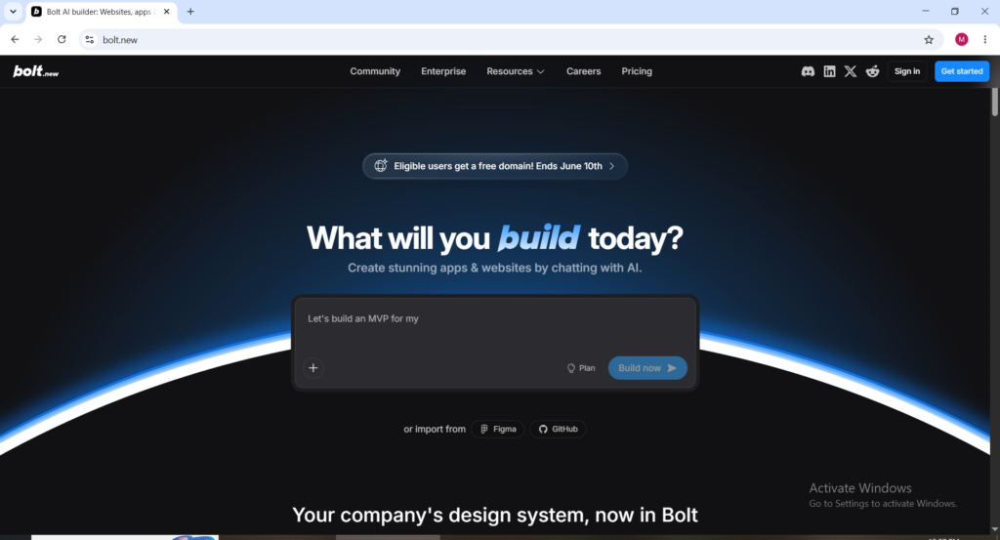
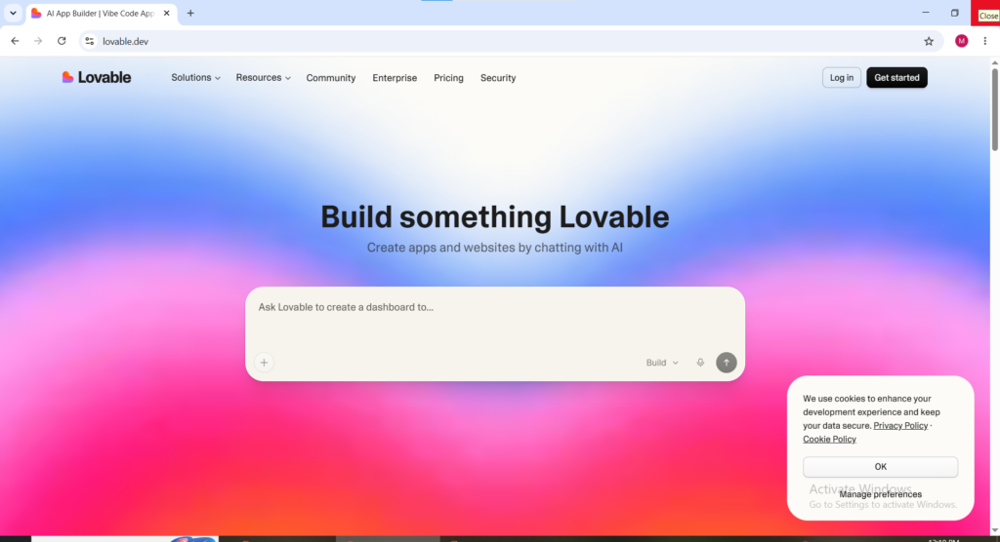
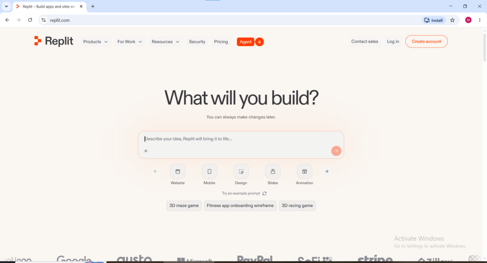
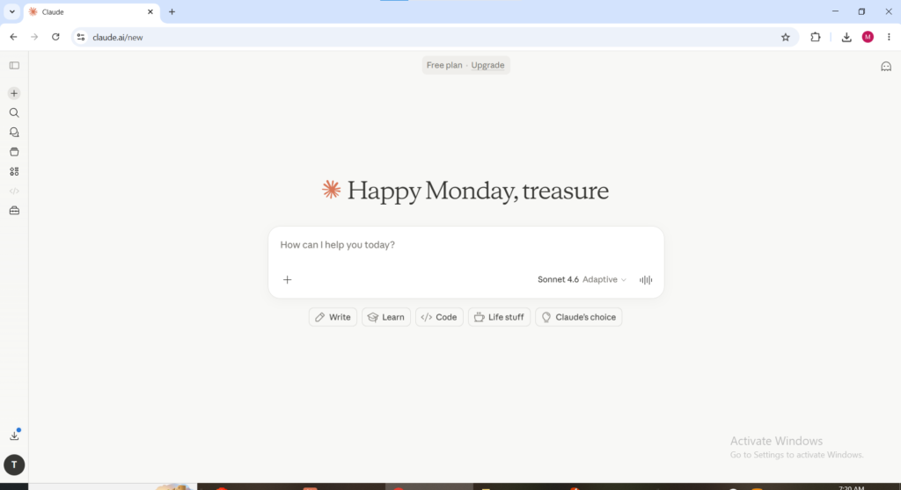

In February 2025, Andrej Karpathy described 'vibe coding' as building software by describing what you want in plain English and letting AI turn it into a working application. Collins Dictionary named it Word of the Year for 2025, and by 2026 it became a legitimate way for complete beginners to generate real income without traditional coding skills.

One founder grew a vibe-coded product to 300,000 users and sold it for $80 million with zero employees. While that is an extreme case, beginners commonly report earning $600 to $2,000 per month from side projects within their first three months.

**This guide explains what vibe coding is**, the essential tools you need, and the proven income models working in 2026 including exact earnings ranges and strategies that separate successful vibe coders from those who don’t make money.

* * *

**What Vibe Coding Actually Is**

Vibe coding is the practice of building real software by describing what you want in plain conversational language and letting AI generate the actual code. Instead of learning programming languages and syntax, you simply explain the app to an AI tool and it creates a working codebase.

The result is fully functional software that runs in browsers, on phones, and on servers. Your job is to describe the idea clearly, review the output, and guide the AI through conversation until it matches what you need.

In 2026, vibe coding is commercially powerful because it dramatically reduces time and cost. A custom web app that once took a developer team three months and $30,000 can now be built by one non-technical person in a weekend. This has opened software development to thousands of people who previously lacked coding skills.

* * *

### The Vibe Coding Tools You Need

The tool selection for vibe coding determines the type of projects that can be built and the quality of the output. Here are the most important platforms in 2026:

**Cursor**

Website: [cursor.com](https://cursor.com) Also available as an application

Cursor is the most widely used AI-powered code editor among professional vibe coders in 2026 and is the tool that experienced builders most commonly recommend as the primary development environment. It works like a standard code editor but with an AI assistant built in that understands the entire codebase and can write, edit, debug, and explain code through natural language conversation. Cursor works best for builders who want maximum control over their projects and are comfortable reviewing the code the AI produces even if they cannot write it themselves.

* * *

**Bolt.new**

Website: [bolt.new](https://bolt.new)

Bolt.new is the fastest path from idea to working application for complete beginners entering vibe coding for the first time. The platform requires no setup, no installation, and no technical configuration — open the browser, describe the application, and Bolt builds and deploys it automatically. The speed of Bolt.new makes it the ideal tool for testing vibe coding business ideas quickly before investing more time in a full build on a more sophisticated platform.

* * *

**Lovable**

Website: [lovable.dev](https://lovable.dev)

Lovable is specifically designed for building production-ready web applications through natural language and has become one of the most popular vibe coding platforms for non-technical founders building micro-SaaS products. The platform handles front-end design, back-end functionality, and database setup simultaneously from a single conversational interface. Lovable integrates with Supabase for database management and Stripe for payment processing making it possible to build and monetize a complete software product without touching any code directly.

* * *

**Replit**

Website: [replit.com](https://replit.com) Also available as an application

Replit is a browser-based development platform with strong AI features that makes collaborative vibe coding possible without any local software installation. The platform is particularly strong for building and hosting web applications simultaneously in the same environment build the app in Replit and deploy it publicly from the same interface without needing separate hosting setup. Replit's free tier is sufficient for building and testing vibe coding projects before committing to paid hosting for production applications.

* * *

**Claude Code**

Website: [claude.ai](https://claude.ai) Also available as an application

Claude Code is Anthropic's command-line tool for agentic coding and represents one of the most capable AI coding assistants available for vibe coding in 2026. It operates directly in the terminal environment and can write entire codebases, fix bugs, add features, and refactor existing code through natural language instructions. Experienced vibe coders use Claude Code for complex projects that require more sophisticated reasoning than browser-based tools provide.

* * *

### The 7 Ways to Make Money with Vibe Coding in 2026

#### Method 1: Freelance Vibe Coding Services

Freelance vibe coding is the fastest way to start earning in 2026. Businesses constantly need landing pages, dashboards, Chrome extensions, booking systems, and simple web apps, but most cannot afford full-time developers or agencies.

Using vibe coding tools, you can deliver in hours what used to take days and charge based on value. Freelancers on Upwork and Fiverr commonly charge $300–$800 for landing pages, $300–$1,000 for dashboards and internal tools, and $500–$3,000 for custom booking or lead systems.

**Income range:**

- Full-time: $5,000 to $20,000 per month

- Part-time: $600 to $5,000 per month

* * *

#### Method 2: Micro-SaaS Products

Micro-SaaS is the vibe coding business model with the highest passive income ceiling and the most documented success stories in 2026. The concept is straightforward just identify a very specific small problem that a defined audience of people experiences regularly, build a simple software tool that solves that problem using vibe coding, and charge a monthly subscription fee for access to that tool.

The economics of micro-SaaS work because vibe coding has reduced the cost of building to near zero. A traditional developer building a niche software tool for dog walkers, freelance photographers, or dental offices could not justify the development cost for an audience too small to generate enterprise-level revenue. A vibe coder whose development cost is their time and a $20 monthly AI tool subscription can profitably serve an audience of fifty paying customers at $10 per month generating $500 monthly recurring revenue from a single weekend project.

The proven micro-SaaS vibe coding strategy in 2026 is build a minimum viable product in a weekend, launch on Product Hunt to generate initial awareness, reach $500 to $2,000 in monthly recurring revenue, and then either continue growing the subscription base or sell the product on Acquire.com for 24 to 48 times the monthly revenue. A tool earning $1,000 per month in recurring subscriptions sells for $24,000 to $48,000 at those multiples. Experienced vibe coders build, grow, sell, and repeat this cycle continuously.

Income range: $500 to $20,000 per month per product depending on audience size, pricing, and retention.

* * *

**Method 3: AI Agents as a Service**

AI agents are software programs that perform specific tasks autonomously without requiring human intervention for each action. Building and selling AI agents is one of the fastest growing vibe coding income models in 2026 because businesses are actively looking for automation solutions that eliminate repetitive manual work from their operations.

A vibe coder building appointment booking agents for dental offices charges $3,000 per setup plus $300 per month for maintenance. With eight clients that produces $2,400 in monthly recurring maintenance income plus $24,000 in setup fees over the first year. The agent itself is a system that automatically qualifies leads, books appointments, sends reminders, and handles rescheduling can be built in two to three days using current vibe coding tools. The business owner is not paying for the code. They are paying for the labor the agent replaces which in a busy dental office represents many hours of receptionist time every single week.

Other high-demand AI agent types for vibe coders include support agents that handle customer refund requests for e-commerce stores, lead qualification agents that score and route inbound inquiries for real estate agencies, and content scheduling agents that automate social media posting for small business marketing.

Income range: $2,000 to $15,000 per month for vibe coders with six to ten active agent maintenance clients.

* * *

**Method 4: Selling Templates and Starter Kits**

Selling vibe coding templates is the purest passive income model in the entire vibe coding ecosystem. A Next.js SaaS starter template with authentication, billing, and dashboard built with Cursor sells 40 to 80 copies per month at $49 generating $2,000 to $4,000 per month from a single template created once with zero marginal cost per additional sale.

The template market for vibe coding in 2026 extends across multiple formats. Starter kits that give other vibe coders a pre-built foundation for their own projects. Landing page templates that businesses customize for their specific products. Dashboard templates that data teams use as the starting point for internal reporting tools. Email templates with AI integration built in. Prompt templates that help other vibe coders communicate more effectively with AI tools.

Platforms for selling vibe coding templates include Gumroad, Lemon Squeezy, and direct sales through a personal website. The audience of people learning and using vibe coding is growing rapidly in 2026 and the demand for quality templates that save time is consistently higher than the supply of well-built options.

Income range: $500 to $5,000 per month per template depending on niche, quality, and marketing reach.

* * *

**Method 5: Teaching Vibe Coding**

In a gold rush, sell shovels. Millions of people are learning vibe coding in 2026, creating strong demand for quality educational content that remains underserved.

Vibe coders who have mastered the workflow can earn by teaching it. This includes YouTube tutorials that generate ad revenue and affiliate commissions, online courses on Udemy, Teachable, or Gumroad, paid community memberships with ongoing support, and one-on-one consulting sessions at $150 to $400 per hour.

The biggest advantage is that teaching builds your personal brand and authority, which also attracts freelance clients and template buyers. Teaching reinforces all other vibe coding income streams.

Income range: $1,000 to $10,000 per month for consistent creators with an established audience.

* * *

**Method 6: Building and Selling Vibe-Coded Startups**

The highest ceiling vibe coding income model is building a complete software product, growing it to meaningful revenue, and selling it. The example that defined this model in 2026 is a founder who built a vibe-coded platform, grew it to 300,000 users, and sold it for $80 million to a major acquirer with zero employees involved in building or operating the product.

That outcome is exceptional. The realistic version of this model for most vibe coders involves building a micro-SaaS product to $1,000 to $5,000 in monthly recurring revenue and selling it on acquisition marketplaces like Acquire.com or TrustMRR for 24 to 48 times the monthly revenue. At $2,000 in monthly recurring revenue that represents a sale price of $48,000 to $96,000 for a product a single person built in weeks using vibe coding tools.

The key to this model is validation before building. Finding three people willing to pay for the product before opening any vibe coding tool is the single most important step — it separates products that sell from impressive technical demonstrations that generate zero revenue regardless of how well-built they are.

* * *

**Method 7: Workflow Automation Consulting**

Many businesses are sitting on manual processes that cost them hours of staff time every week — processes that a vibe coder can automate in days using AI-powered tools. Workflow automation consulting targets businesses that need internal tools, automated spreadsheet workflows, data processing systems, and operational dashboards but cannot justify the cost of traditional software development for solutions that primarily serve internal users rather than generating direct revenue.

The workflow automation model charges per project rather than a subscription a typical engagement involves identifying the manual process being automated, building the solution using vibe coding tools, deploying and testing it with the client's team, and providing documentation and a brief training session. Project fees range from $500 for simple automation tools to $3,000 for complex multi-system integrations. Many workflow automation clients become recurring customers who return with additional automation needs as their trust in the vibe coder's capability grows.

* * *

**The Tools and Costs to Get Started**

Getting started with vibe coding in 2026 does not require significant upfront investment. The essential stack for a beginner entering this space costs under $50 per month.

An AI code generator is the foundation [Bolt.new](https://Bolt.new) and Replit both have free tiers adequate for learning and first projects. Cursor starts at $20 per month for professional use. Supabase provides database and authentication infrastructure on a free tier sufficient for most early projects. For freelancers Upwork and Fiverr accounts are free to create. For selling digital products and templates Gumroad charges 10 percent per sale with no subscription required.

The time investment for a beginner to go from no vibe coding experience to a first paying project is typically two to four weeks of regular practice — building small projects that progressively increase in complexity until the workflow becomes natural and the output quality is consistently deliverable to paying clients.

* * *

**What to Realistically Expect**

Vibe coding is a genuine income opportunity but it requires the same realistic expectations as any skill-based income model. Complete beginners consistently report earning their first $300 to $800 within four to six weeks of starting if they focus on building deliverable freelance projects rather than spending all their time learning without applying the skill commercially.

The most common mistake new vibe coders make is building impressive tools that nobody asked for and then wondering why nobody pays for them. Validation before building and finding people willing to pay before opening the vibe coding tool is the practice that separates vibe coders generating consistent income from those who build a portfolio of technically impressive projects that generate zero revenue.

The market for vibe coding services, products, and teaching is projected to grow significantly as AI tools continue improving and the gap between what non-technical people can build and what was previously possible only for trained developers continues narrowing. Getting in now, building genuine skills, and establishing a client base or product revenue before the market becomes more competitive is the strategic advantage available to anyone who starts in 2026.
