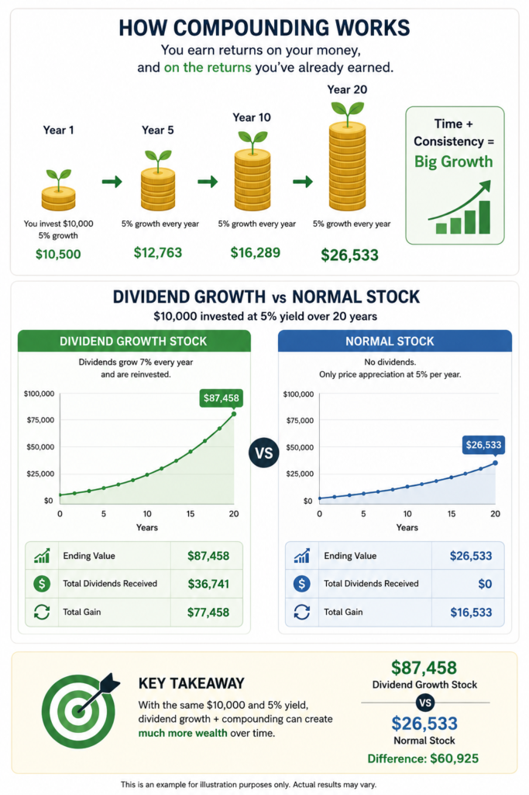
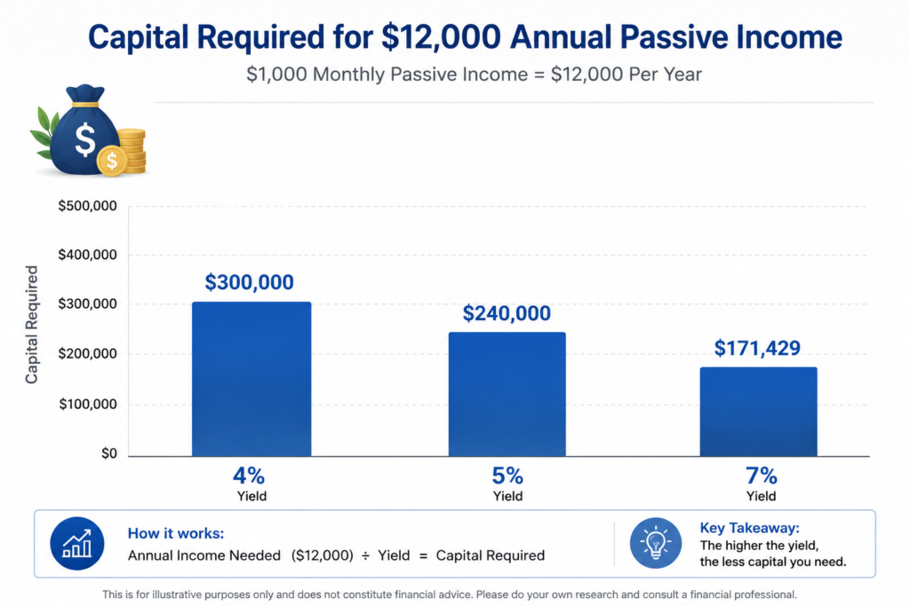

In 2026, generating passive income from stocks remains one of the most Imagine waking up to notifications showing fresh dividend payments deposited into your account money earned while you slept, traveled, or focused on what matters most. In 2026, this reality is within reach for investors who strategically build portfolios around dividend-paying stocks, ETFs, REITs, and other income vehicles.

With markets evolving amid technological advancements, shifting interest rates, and global economic dynamics, passive income from stocks offers both immediate cash flow and long-term wealth compounding. This comprehensive guide walks you through everything needed to start or scale your dividend income stream, from foundational concepts to advanced portfolio strategies tailored for today's opportunities.

### The Power of Dividend Investing in 2026

Dividend investing stands out as a proven method for generating passive income. Companies distribute portions of their profits to shareholders as dividends, typically quarterly, monthly, or annually. These payments provide regular income without requiring you to sell shares, while reinvesting them fuels compounding growth over time.

In 2026, several factors make this strategy particularly compelling. Quality dividend payers in defensive sectors, infrastructure, and technology-adjacent areas offer attractive yields alongside growth potential. Low-cost ETFs simplify diversification, and vehicles like REITs and BDCs deliver higher immediate income for those seeking larger payouts.

**Key benefits include:**

- **Reliable cash flow** that can cover expenses or be reinvested.

- **Inflation protection** through companies that regularly increase dividends.

- **Lower volatility** compared to pure growth stocks, especially with established payers.

- **Accessibility** for investors worldwide via online brokers.

- **Compounding effect**:- Often called the "eighth wonder of the world" where your money works harder over decades.

Unlike active trading, which demands constant attention and timing the market, dividend strategies reward patience and quality selection. Historical data shows Dividend Aristocrats and Kings companies with long streaks of increasing payouts and have delivered resilient performance through economic cycles.

### How Dividends Actually Work

A dividend yield is calculated as the annual dividend per share divided by the current stock price, expressed as a percentage. For example, a stock yielding 5% on a $100,000 investment generates $5,000 in annual passive income.

Dividends come in several forms:

- **Qualified dividends** often receive favorable tax treatment.

- **Growth dividends** from companies raising payouts annually.

- **High-yield options** providing immediate income, though they require scrutiny for sustainability.

**Dividend Aristocrats** are S&P 500 companies with at least 25 consecutive years of dividend increases. **Dividend Kings** boast 50+ years, representing elite resilience.

**Beyond individual stocks, powerful vehicles expand options:**

- **REITs (Real Estate Investment Trusts)** must distribute at least 90% of taxable income, often paying monthly. Realty Income (O), known as "The Monthly Dividend Company," offers consistent payouts and a strong track record of growth, currently yielding around 5%.

- **BDCs (Business Development Companies)** finance mid-market businesses and pass through high yields, frequently in the 8-10% range. Ares Capital (ARCC) stands out as a leader with strong portfolio management.

- **ETFs** bundle hundreds of stocks for instant diversification at rock-bottom fees.

Monthly payers like Realty Income or certain BDCs create smoother income streams ideal for covering regular bills.

### Step-by-Step: Building Your Passive Income Portfolio

**Step 1: Clarify Your Goals and Timeline** Determine your target income — whether $500 monthly for supplemental cash or $5,000+ for retirement replacement. Assess risk tolerance and horizon. Longer timelines (5-10+ years) allow more aggressive compounding.

**Step 2: Build a Financial Foundation** Secure an emergency fund covering 3-6 months of expenses in liquid savings. Pay down high-interest debt before committing significant capital to stocks.

**Step 3: Select the Right Brokerage Platform** Choose a platform with zero-commission trading, automatic dividend reinvestment (DRIP), and strong research tools. Many platforms now cater to investors worldwide with global market access.

For global investors, [Interactivebrokers.com](https://www.interactivebrokers.com) stands out as one of the best due to its extremely low fees, direct access to international markets, and professional-grade tools. Many readers also prefer [etoro.com](https://www.etoro.com) because of its clean, beginner-friendly interface, social trading features, and ease of use for building a dividend portfolio.

**Step 4: Master Key Research Metrics** **Master Essential Research Metrics** Focus on payout ratio (ideally below 70%), consistent free cash flow, earnings growth, competitive moat, and balance sheet strength.

Tools like [seekingalpha.com](https://seekingalpha.com) excel here with its deep dividend analysis, safety scores, and premium stock research. [**Tradingview.com**](https://www.tradingview.com) is also excellent for its powerful charting tools and easy-to-use stock screeners.ly high yields signaling potential cuts.

**Step 5: Implement Dollar-Cost Averaging (DCA)** Invest fixed amounts regularly, regardless of market conditions. This reduces timing risk and builds positions methodically.

**Step 6: Diversify Thoughtfully** Spread investments across sectors (consumer staples, utilities, healthcare, infrastructure, technology) and geographies. Aim for 15-30 holdings or use ETFs as core building blocks.

**Step 7: Monitor and Adjust Minimally** True passive investing means quarterly or annual reviews, not daily checks. Rebalance as needed while allowing quality companies to compound.

### Top Strategies for Passive Income in 2026

#### Dividend Growth Investing: The Long-Term Winner

Prioritize companies with proven histories of raising dividends. These provide growing income that outpaces inflation while supporting capital appreciation. Examples include consumer staples giants and healthcare leaders among the Dividend Kings.

This approach excels for investors with longer horizons, turning modest initial yields into substantial income streams over time.

#### High-Yield Strategies for Immediate Income

For faster cash flow, consider:

- **Realty Income (O)** — Monthly dividends, diversified retail properties, approximately 5% yield with decades of increases.

- **Ares Capital (ARCC)** — Leading BDC with yields often near 9-10%, backed by secured loans.

- Infrastructure and energy midstream plays offering stable, fee-based revenue.

Balance higher yields with rigorous safety checks.

#### ETF Portfolios: Simple and Effective

ETFs dominate for hands-off investors:

- **Schwab U.S. Dividend Equity ETF (SCHD)** — Quality focus, ultra-low fees (~0.06%), strong yield and growth.

- **Fidelity High Dividend ETF (FDVV)** — Balances income and appreciation.

- **Vanguard High Dividend Yield ETF (VYM)** — Broad exposure.

- Covered-call ETFs like JEPI for enhanced yields through options strategies.

A beginner-friendly mix: 40% SCHD, 25% high-yield REIT/BDC exposure, 20% broad market, 15% international dividends.

#### Hybrid Approaches

Combine growth stocks that have initiated dividends with traditional payers. Layer in monthly payers for steady cash flow and international ETFs for broader diversification.

### Sample Portfolios and the Math Behind Your Goals

**Conservative Portfolio (Safety First, ~3-5% Yield)** Heavy allocation to Dividend Kings/Aristrocrats, utilities, and broad ETFs. Ideal for preserving capital while generating reliable income.

**Balanced Portfolio (~4-6% Yield)**

- 35% SCHD or similar quality dividend ETF

- 25% Individual growth-oriented dividend payers

- 20% REITs (e.g., Realty Income)

- 10% BDCs (e.g., ARCC)

- 10% International

**Aggressive Income Portfolio (6%+ Yield)** Higher weighting in REITs, BDCs, and select high-yield names, with increased monitoring.

**How Much Capital Do You Need?** To generate $1,000 monthly ($12,000 annually):

- At 4% average yield → Approximately $300,000

- At 5% yield → Approximately $240,000

- At 7% yield (higher risk) → Approximately $171,000

Smaller starts work too. Investing $500 monthly at a blended 7% total return (yield + growth) can build life-changing income over 10-20 years through compounding. Track "yield on cost" — the effective return on your original investment as dividends grow.

### Risk Management: Protecting and Growing Your Income

All investments carry risks. Market volatility can cause price swings, but strong dividend payers often maintain or grow payouts during downturns. Diversification across 15+ holdings or ETFs mitigates single-stock risk.

Watch for:

- Dividend cuts (signaled by high payout ratios).

- Interest rate sensitivity in REITs and utilities.

- Sector concentration.

- Inflation eroding purchasing power (countered by growth payers).

Practical tools include position sizing (no more than 5% in any single stock), annual rebalancing, and maintaining cash reserves. Focus on total return — income plus appreciation — rather than yield alone.

### Tax Considerations for Global Investors

Tax rules vary by country and residency. US-sourced dividends typically face 30% withholding for non-US investors, often reduced to 15% or lower via tax treaties. File appropriate forms like W-8BEN to claim benefits.

Capital gains on stocks are frequently more tax-efficient or exempt for many international investors. Use tax-advantaged accounts where available in your jurisdiction. REITs and BDCs may have additional complexities. Always consult a qualified tax professional, as proper structuring can significantly impact net returns.

### Real-World Success Stories

Many investors have transformed their finances through disciplined dividend strategies. A balanced $250,000 portfolio at 4.5-5% yield can deliver over $1,000 monthly, with income growing annually through raises and reinvestment.

Others start smaller maybe $20,000 initial investment plus monthly contributions into SCHD and Realty Income and reach meaningful income within a decade. Dividend Kings have historically provided stability, often maintaining payouts through recessions.

Global investors frequently blend US blue-chips with home-country opportunities for optimized results.

### Advanced Tips for Maximizing Returns in 2026

- **Sector opportunities**: Healthcare (aging populations), infrastructure, AI-related payers, and consumer essentials.

- **Automation**: Set up auto-invest and DRIP features.

- **ESG integration**: Align income with values through sustainable dividend payers.

- **Ongoing education**: Track metrics like dividend safety scores and free cash flow coverage.

- **Portfolio review**: Use spreadsheets to monitor yield on cost and total income.

Stay informed through reputable sources without overreacting to daily noise.

### Common Pitfalls and How to Avoid Them

- Chasing unsustainable high yields.

- Lack of diversification.

- Emotional selling during market dips.

- Ignoring taxes and fees.

- Neglecting growth alongside income.

A written investment plan and rules-based approach help maintain discipline.

### Frequently Asked Questions

**Can beginners start with small amounts?** Yes. Consistent DCA turns modest contributions into substantial portfolios over time.

**Are dividends guaranteed?** No, but high-quality companies with long histories offer strong reliability.

**How often should I check my portfolio?** Quarterly reviews support a truly passive experience.

**REITs or individual stocks?** REITs simplify real estate exposure with professional management.

**Covered calls for extra income?** They boost yields but may limit upside; suitable as part of a balanced strategy.

### Your Action Plan to Get Started Today

1. Open or review your brokerage account.

3. Complete your emergency fund.

5. Research core holdings like SCHD and Realty Income.

7. Make your first investment and automate future contributions.

9. Enable DRIP for automatic compounding.

11. Set up a simple tracking system.

13. Commit to annual reviews and continuous learning.

### Conclusion: Start Building Your Dividend Stream Today

Passive income from stocks in 2026 is achievable through quality selection, diversification, and patience. Whether targeting modest supplemental income or substantial financial freedom, the strategies outlined here provide a clear path forward.

The power of compounding turns consistent action into remarkable results. Begin with research, invest in proven vehicles like SCHD, Realty Income, and quality dividend growers, and let time work in your favor. Your future self will benefit from the steady income and growing wealth.

This article is for educational purposes only and not personalized financial advice. Investing involves risk, including potential loss of principal. Conduct your own due diligence or consult qualified professionals regarding your specific circumstances, taxes, and investment goals. Yields and market conditions change; always verify current data.

### Recommended Resources

- [https://www.interactivebrokers.com](https://www.interactivebrokers.com) – Best overall for serious global investors thanks to rock-bottom commissions and wide access to US and international stocks.

- [https://www.etoro.com](https://www.etoro.com) – Ideal for beginners and intermediate investors with its simple platform and copy-trading features.

- [https://seekingalpha.com](https://seekingalpha.com) – Top choice for in-depth dividend research, stock analysis, and safety ratings.

- [https://www.morningstar.com](https://www.morningstar.com) – Excellent for detailed ETF and mutual fund ratings.

- [https://www.dividend.com](https://www.dividend.com) and [https://www.suredividend.com](https://www.suredividend.com) – Great resources for Dividend Aristocrats and Kings lists.

- [https://www.amazon.com](https://www.amazon.com) – Search for “The Intelligent Investor by Benjamin Graham” – A timeless classic every serious investor should read.
