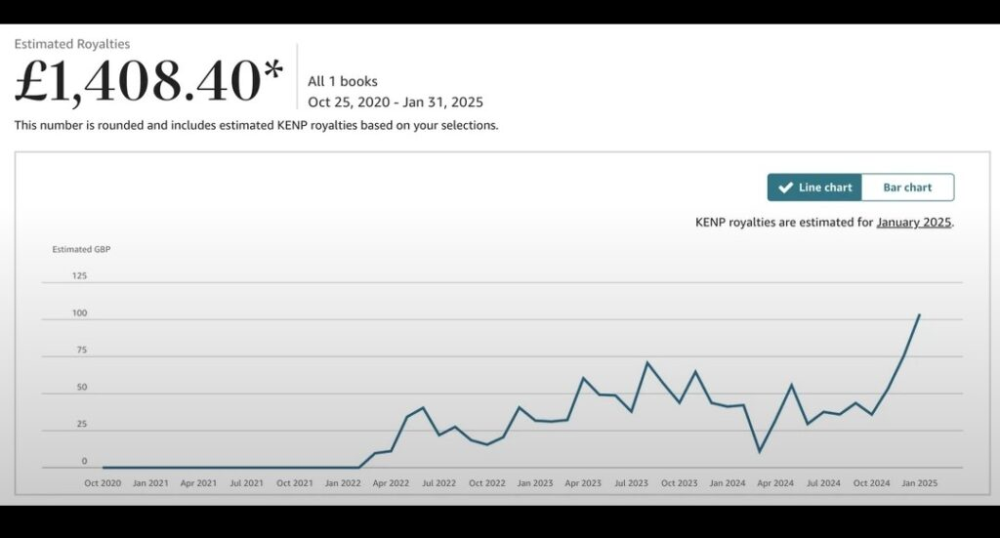
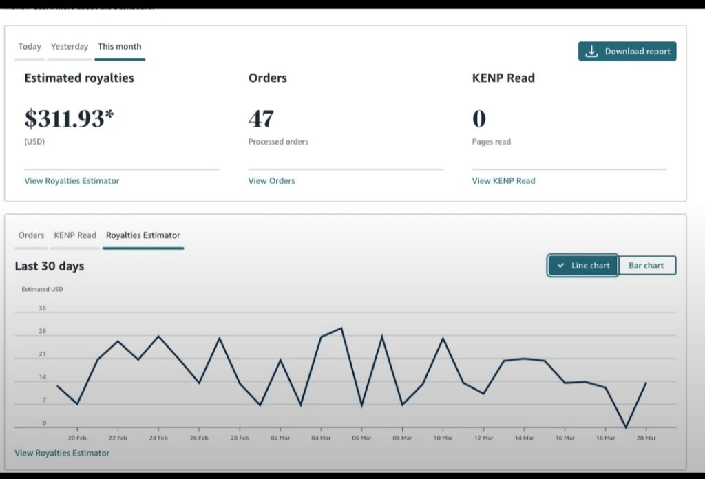
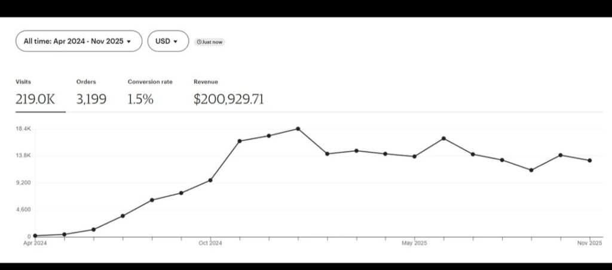
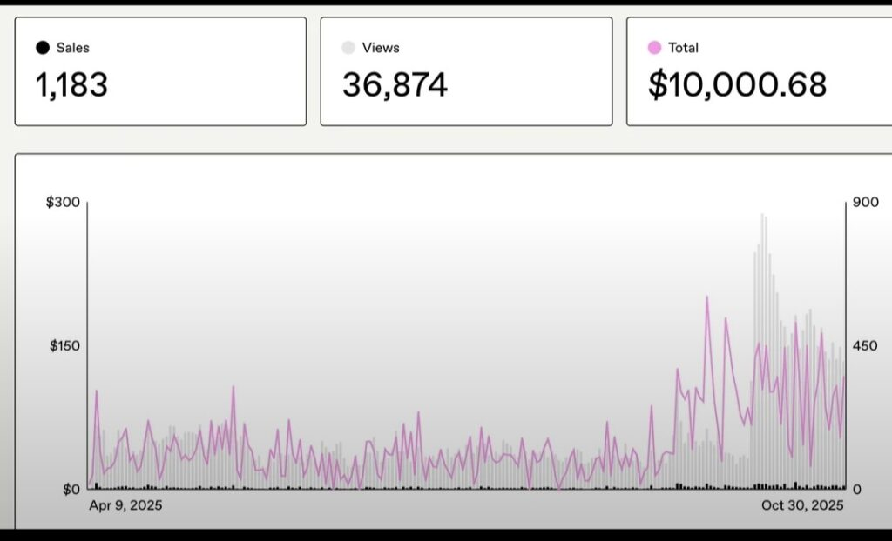
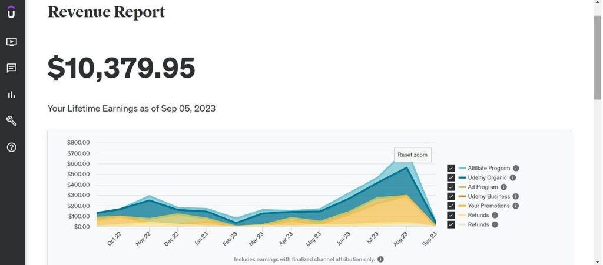
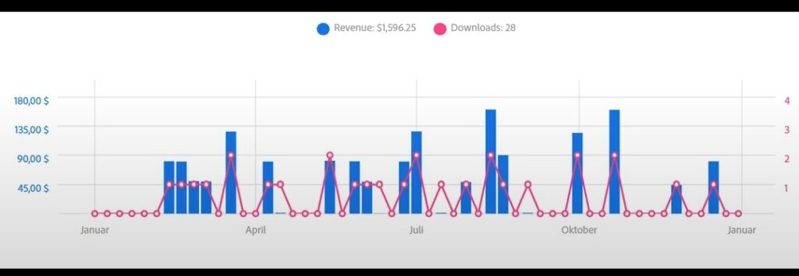
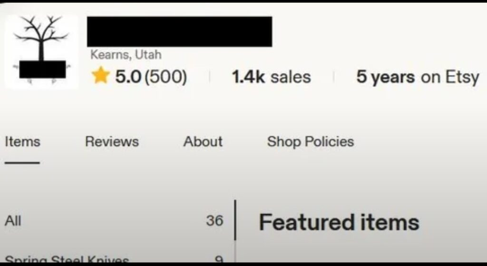
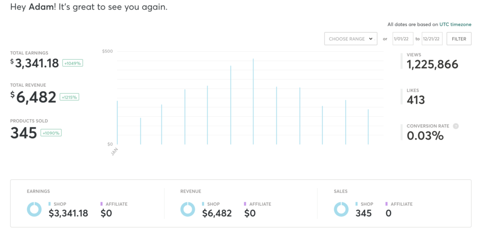

Passive income is money that keeps coming in whether you are sleeping, traveling, or doing nothing. In 2026, one of the best ways to build it is by selling digital products online. You create them once and they can sell repeatedly with no warehouse, shipping, or inventory management.

Digital products offer very high profit margins of 80 to 95 percent. This is far better than physical products which usually have only 30 to 50 percent margins after all costs.

This post covers **the ten best digital products** to sell online for passive income, where to sell them, and how to get started even if you are beginning from zero.

* * *

**What Exactly Is a Digital Product**

A digital product is any item that is sold and delivered entirely online with no physical component involved. The buyer pays, receives a download link or access code instantly, and the transaction is complete. You never touch a package, visit a post office, or worry about stock running out. Examples include ebooks, templates, online courses, printables, stock photos, and more. Once created, a single digital product can be sold to ten people or ten thousand; The effort required on your end does not change either way. That scalability is what makes passive income with digital products genuinely different from almost every other online earning model.

* * *

**1\. eBooks**

Where to sell: Amazon KDP, Apple Books ([authors.apple.com](http://authors.apple.com)), Gumroad, Payhip, Sellfy

Ebooks are the most accessible entry point into passive income with digital products and they have been quietly making money for creators for over a decade. You write a book once; a guide, a how-to, a niche handbook, a story; upload it to a platform, set your price, and every sale from that point forward is pure passive income with zero additional effort. Platforms like Amazon KDP and Apple Books put your ebook in front of millions of buyers who are already searching for exactly what you wrote. The key is choosing a topic with real demand self-help, personal finance, fitness, technology, and online earning are among the highest performing ebook categories globally in 2026. If you have knowledge or experience in any area worth sharing, an ebook is the fastest path to your first passive income with digital products.

<figure>

<figcaption>

An Amazon Kdp publisher displayed earnings from 1 book

</figcaption>

</figure>

* * *

<figure>

<figcaption>

**ANOTHER USER THAT CELEBRATES THEIR ONE MONTH SAME ON AMAZON KDP, NOT MUCH BUT SOMETHING**

</figcaption>

</figure>

**2\. Canva Templates**

Where to sell: Etsy, Creative Market, Gumroad, Payhip

Canva templates are one of the fastest moving digital products in the passive income space right now and the reason is simple small businesses and content creators desperately need professional looking designs but cannot afford to hire designers for every post, presentation, or flyer they need. You design the template once in Canva, export it as a shareable link or PDF, list it on Etsy or Creative Market, and every sale is completely automated from that point. Social media templates, resume templates, business card designs, media kits, pitch deck layouts, and lead magnet templates are among the highest selling categories. The most successful Canva template sellers on Etsy are generating consistent five figure monthly passive income from products they built months or even years ago.

<figure>

<figcaption>

**A SELLER ON ESTY THAT MADE OVER $200K WITHIN APR 2024 -NOV 2025**

</figcaption>

</figure>

**3\. Notion Templates**

Where to sell: Gumroad, Etsy, Payhip, your own website

Notion templates are one of the fastest growing passive income digital product categories of 2026 and the demand is only accelerating. Business owners, students, freelancers, and productivity enthusiasts use Notion to manage their entire lives and businesses, But building functional Notion systems from scratch takes hours. A well designed template that solves a specific problem; A content calendar, a client management system, a personal finance tracker, a second brain setup can sell repeatedly to thousands of buyers who want the result without the setup time. You build the template once in Notion, duplicate the link, list it for sale, and earn passive income every time someone buys. Some Notion template creators have turned single templates into products generating thousands of dollars monthly with no ongoing maintenance required.

<figure>

<figcaption>

**DASHBOARD OF A SELLER ON GUMROAD THAT MADE $10,000 FROM JUST 1,183 SALES**

</figcaption>

</figure>

**4\. Printables**

Where to sell: Etsy, Payhip, Sellfy, Gumroad

Printables are digital files that buyers download and print themselves at home planners, journals, budget trackers, habit trackers, wall art, checklists, kids activity sheets, and more. They are one of the most beginner friendly passive income digital products available because they require no advanced design skills, no coding knowledge, and no technical setup beyond a free Canva account. The profit margin is effectively 100 percent since there are no production costs whatsoever. Etsy is the dominant marketplace for printables and the platform has millions of buyers actively searching for exactly these types of products every single day. Sellers who niche down targeting specific audiences like homeschooling parents, wedding planners, small business owners, or fitness enthusiasts consistently outperform those who try to sell generic designs to everyone.

**5\. Online Courses**

Where to sell: Udemy, Teachable, Thinkific, Gumroad, Payhip

Online courses are among the most profitable passive income digital products available in 2026 and the e-learning industry is projected to be worth $840 billion by 2030 a number that tells you everything about the scale of demand that exists. If you have knowledge or expertise in any area; coding, photography, cooking, language learning, digital marketing, fitness, music production, online earning; You can package that knowledge into a structured course and sell it indefinitely. Udemy puts your course in front of millions of active learners immediately with no marketing effort required on your part. Teachable and Thinkific give you full control over pricing and branding if you prefer to sell independently. A single well-made course can generate passive income for years from a one-time creation effort..

<figure>

<figcaption>

**UDEMY USERS EARNING FROM SELLING COURSES ON [UDEMY.COM](http://UDEMY.COM)**

</figcaption>

</figure>

* * *

**6\. Stock Photos and AI Images**

Where to sell: Shutterstock, Adobe Stock, Freepik, Alamy, Getty Images

Every blog, website, social media post, advertisement, and marketing campaign needs images and the demand for quality stock photos is constant, global, and growing. If you are a photographer or can create quality images using AI image generation tools, uploading your work to stock photo platforms creates a passive income stream that earns royalties every single time someone downloads your image. You upload once and earn repeatedly. AI-generated images are now accepted on several major stock platforms in specific categories making this one of the most accessible passive income digital product opportunities of 2026 even for people with no photography background whatsoever.

<figure>

<figcaption>

**A USERS DASHBOARD OF EARNINGS FROM SELLING ON ADOBE STOCK PREMIUM**

</figcaption>

</figure>

* * *

**7\. Lightroom Presets**

Where to sell: Etsy, Creative Market, Gumroad, your own website

Lightroom presets are one-click photo filters that instantly transform the look and feel of photographs and content creators, travel bloggers, wedding photographers, and Instagram users buy them constantly. You create a preset once in Adobe Lightroom, export the file, list it for sale, and earn passive income every time a photographer wants your specific aesthetic applied to their images instantly without manual editing. The market for presets is genuinely large some preset creators on Etsy have accumulated tens of thousands of sales from a single product listing they created years ago. If you have a distinctive photography style or color grading preference, turning that into a sellable preset pack is one of the quickest passive income digital products you can create.

* * *

**8\. Spreadsheet Templates**

Where to sell: Etsy, Gumroad, Payhip, Creative Market

Spreadsheet templates; Particularly budget trackers, business expense trackers, invoice templates, social media analytics dashboards, and project management sheets built in Google Sheets or Microsoft Excel are quietly one of the most consistently profitable passive income digital products on Etsy right now. The story of Pretty Arrow, a spreadsheet template business that grew from zero to over $100,000 per year and 29,000 sales, is a well-documented example of what is possible in this niche with consistency and a clear target audience. People are willing to pay for a beautifully designed functional spreadsheet because building one from scratch is time-consuming and intimidating to most buyers. If you are comfortable with spreadsheets, this passive income digital product category is significantly underestimated.

<figure>

<figcaption>

**ETSY USER WITH OVER 500 REVIEWS FROM 1,4K SALES!**

</figcaption>

</figure>

* * *

**9\. AI Prompt Packs**

Where to sell: PromptBase, Etsy, Gumroad, Payhip

AI prompt packs are one of the newest and fastest growing passive income digital product categories of 2026. As more people use tools like ChatGPT, Midjourney, and Claude daily, the demand for well-crafted prompts that get better results faster is growing rapidly. You research and write a collection of high-quality prompts for a specific use case; content creation, business planning, image generation, coding help, social media writing package them into a PDF or text file, and sell the pack repeatedly with zero ongoing effort. PromptBase is the dedicated marketplace specifically for buying and selling AI prompts. Etsy and Gumroad are also strong platforms for selling prompt packs to a broader audience. This is one of the most current and relevant passive income digital products available right now and early movers in well-defined niches are building real income from it.

**10\. Fonts and Graphics**

Where to sell: Creative Market, Etsy, Gumroad, FontSpace

Custom fonts and graphic design elements icons, illustration packs, logo templates, background textures, watercolor elements, and digital clipart are evergreen passive income digital products that sell continuously to designers, business owners, bloggers, and content creators who need unique visual assets for their projects. Creative Market is the dominant marketplace in this space and some font and graphic designers on the platform earn thousands of dollars monthly from products they created years ago and never touched again. If you have any background in graphic design or lettering, this passive income digital product category has genuine long-term earning potential.

<figure>

<figcaption>

**DASHBOARD DISPLAYING PROFITS OF SOMEONE THAT SELLS ON [CREATIVEMARKET.COM](http://CREATIVEMARKET.COM)**

</figcaption>

</figure>

* * *

**Where to Sell Your Digital Products**

You do not need to pick just one platform. The smartest passive income with digital products strategy is listing your products on multiple platforms simultaneously so buyers can find you wherever they are already shopping.

**Etsy**: [etsy.com](https://etsy.com) — Largest dedicated marketplace for digital downloads globally. Millions of active buyers searching daily. Best for printables, templates, fonts, graphics and presets.

**Gumroad** — gumroad.com — Simple setup with no monthly fees. Takes a small percentage per sale. Best for ebooks, courses, prompt packs and any digital product you want to sell directly.

**Payhip**: [payhip.com](https://payhip.com) Similar to Gumroad with strong built-in affiliate marketing tools. Good for ebooks, templates and courses.

**Amazon KDP**: [kdp.amazon.com](http://kdp.amazon.com) — The world's largest book marketplace. Best specifically for ebooks and print-on-demand books. Global reach is unmatched.

**Apple Books**: [authors.apple.com](http://authors.apple.com) — Millions of Apple device users globally browsing for ebooks daily. Completely free to publish and Apple takes a 30 percent commission per sale only.

**Creative Market**: [creativemarket.com](http://creativemarket.com) — Premium marketplace for design assets. Best for fonts, templates, graphics and Canva assets. Buyers here spend more per purchase than most other platforms.

**Sellfy**: [sellfy.com](http://sellfy.com) — All-in-one platform for selling digital products directly from your own storefront. Good for creators who want full brand control.

**Udemy**: [udemy.com](http://udemy.com) — World's largest online learning marketplace. Best specifically for video-based online courses. Handles all marketing and promotion on your behalf.

**PromptBase**: [promptbase.com](http://promptbase.com) — Dedicated marketplace for AI prompts. The only platform specifically built around buying and selling prompt packs.

* * *

**How to Get Started Today**

The most common mistake people make when starting with passive income digital products is waiting until everything is perfect before launching anything. The reality is that an imperfect product listed for sale today will always outperform a perfect product that exists only in your head.

Pick one product from this list that aligns with something you already know, already have, or can create within the next seven days. Create it, price it, list it on at least two platforms, and start learning from real buyer behavior. Your second product will be better than your first. Your tenth will be better than your fifth.

The passive income with digital products model rewards action over perfection. Every product you create is a permanent asset that earns for you indefinitely. Start with one. Build from there.

**NB: We share some earnings screenshots from third-party sources to show what’s possible. These are for inspiration only and not a guarantee of results.**
