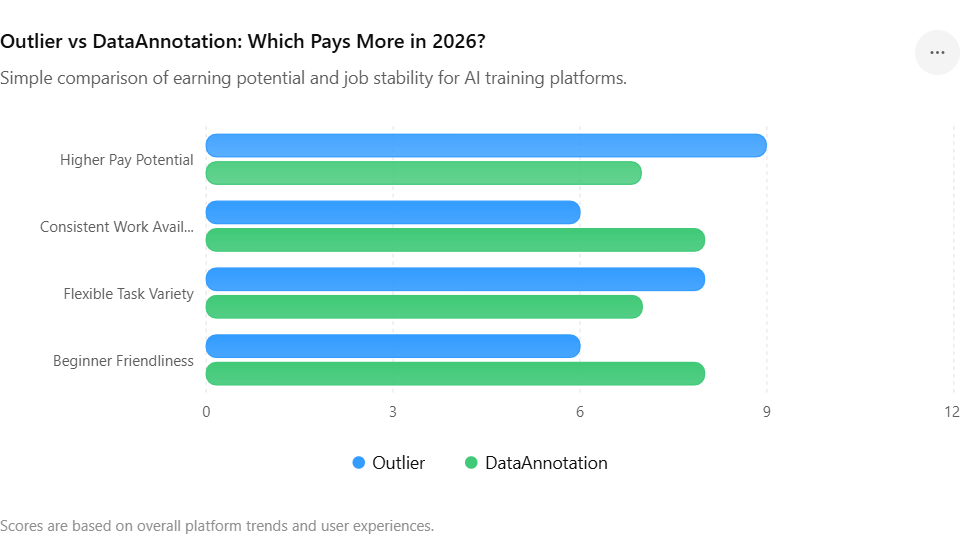

Artificial intelligence is changing remote work faster than almost any industry online. In 2026, thousands of people are now earning money from AI training platforms instead of relying only on traditional freelancing, surveys, or gig work. Two names dominate the discussion more than almost any others: Outlier and DataAnnotation.

## What You Will Learn in This Article

- Which platform pays more in 2026

- How Outlier works

- How DataAnnotation works

- Real earning potential

- Which platform is better for beginners

- Coding job opportunities

- Application and acceptance difficulty

- Work stability comparison

- Pros and cons of both platforms

- Which platform is best for long-term remote income

- Whether you can use both platforms together

- Common mistakes beginners make

- Community opinions and experiences

- Frequently asked questions about both platforms

Across Reddit discussions, YouTube videos, remote work forums, and online communities, people constantly debate one question:

**Which platform actually pays more — Outlier or DataAnnotation?**

The answer is more complicated than many people expect. Both platforms can pay significantly better than traditional online side hustles, but they differ in:

- project availability

- task difficulty

- hiring standards

- consistency

- earning potential

- work style

Some workers claim they make over $1,000 weekly on AI training tasks. Others struggle to get accepted or receive consistent projects. That is why understanding the differences between these platforms matters before spending time applying.

**In this detailed comparison, we will break down:**

- how Outlier works

- how DataAnnotation works

- realistic earnings

- which platform is easier for beginners

- payment systems

- application difficulty

- pros and cons

- community opinions

- long-term earning potential

- whether these platforms can replace full-time jobs

If you are searching for the best AI remote work opportunities in 2026, this guide will help you understand which platform may fit you better.

* * *

## What Is Outlier?

[Outlier Official Website](https://outlier.ai/?utm_source=chatgpt.com)

Outlier is an AI training platform that hires remote workers to help improve artificial intelligence systems. Workers complete tasks that teach AI models how humans reason, write, solve problems, and evaluate information.

The platform became widely known because many users started reporting unusually high hourly rates compared to traditional online gigs.

**Common tasks on Outlier include:**

- evaluating AI-generated responses

- writing prompts for AI systems

- checking factual accuracy

- ranking chatbot answers

- coding and debugging

- reviewing complex reasoning

- language improvement tasks

- specialist academic projects

**Outlier often recruits people with:**

- writing skills

- coding experience

- research backgrounds

- teaching experience

- STEM knowledge

- multilingual abilities

Unlike many microtask websites that pay extremely low rates, Outlier projects can sometimes pay professional-level hourly rates depending on expertise.

<figure>

<figcaption>

Click view opportunities if you are new

</figcaption>

</figure>

* * *

### What Is DataAnnotation?

[DataAnnotation Official Website](https://www.dataannotation.tech/?utm_source=chatgpt.com)

DataAnnotation is another rapidly growing AI training platform focused on improving machine learning systems through human feedback.

Workers help train AI systems by:

- evaluating chatbot responses

- comparing AI-generated answers

- writing prompts

- reviewing text quality

- solving reasoning problems

- coding AI tasks

- classifying information

DataAnnotation gained popularity after workers online shared screenshots of relatively high hourly earnings compared to survey sites and low-paying freelance gigs.

Many users are attracted because:

- the work is fully remote

- schedules are flexible

- there are no fixed working hours

- some projects pay far above minimum wage

- coding projects can pay exceptionally well

The platform has become especially popular among:

- students

- freelancers

- remote workers

- stay-at-home parents

- programmers

- writers

* * *

## Why Are These Platforms Suddenly So Popular?

The explosion of AI tools has created massive demand for human feedback. AI systems still make:

- factual mistakes

- reasoning errors

- biased responses

- coding issues

- language inaccuracies

Companies developing AI models need humans to constantly review and improve outputs.

That is where platforms like:

- Outlier

- DataAnnotation

come in.

Unlike traditional data-entry websites, AI training work can require:

- analytical thinking

- creativity

- technical understanding

- communication skills

- advanced reasoning

Because the work is more complex, the pay is often significantly higher than:

- online surveys

- microtask platforms

- ad-clicking sites

- low-end freelance jobs

This is one major reason these platforms have become extremely competitive in 2026.

* * *

## Outlier vs DataAnnotation: Quick Comparison

| Feature | Outlier | DataAnnotation |
| --- | --- | --- |
| Main Focus | AI training | AI training |
| Work Type | Evaluations, coding, reasoning | Evaluations, writing, coding |
| Typical Pay | $15–$50+/hour | $20–$45+/hour |
| Coding Jobs | Yes | Yes |
| Beginner Friendly | Moderate | Slightly easier |
| Flexibility | High | High |
| Acceptance Difficulty | Medium–High | Medium |
| Task Stability | Can fluctuate heavily | Often more stable |
| Best For | Specialists & technical workers | Writers & general users |
| Remote Work | Yes | Yes |

* * *

## Which Platform Pays More?

This is the question most people care about.

The short answer:  
**Outlier often has higher peak earning potential, while DataAnnotation may provide steadier average earnings.**

However, your actual income depends heavily on:

- your skills

- project availability

- your location

- whether you can access coding tasks

- how many hours you work

- how quickly you complete tasks

For highly technical workers, especially programmers, Outlier can sometimes offer extremely high-paying projects.

Meanwhile, many workers say DataAnnotation feels more consistent and easier to maintain long-term.

* * *

## Realistic Earnings on Outlier

Earnings on Outlier vary dramatically between projects.

Some common reported rates include:

- $15–$20/hour for simpler projects

- $20–$35/hour for writing or reasoning tasks

- $35–$50+/hour for coding and specialist work

Advanced projects may require:

- coding assessments

- university-level expertise

- complex analytical skills

- subject specialization

Many people online become excited after seeing screenshots of high hourly rates. However, there are important realities beginners should understand:

- high-paying projects are competitive

- projects may disappear suddenly

- not everyone qualifies

- work volume changes constantly

Some users report earning hundreds weekly, while others struggle to get enough tasks.

This inconsistency is one of the biggest frustrations with AI remote work.

* * *

## Realistic Earnings on DataAnnotation

DataAnnotation also offers relatively high rates compared to most online side hustles.

Typical reported ranges include:

- around $20/hour for standard projects

- $25–$35/hour for advanced writing or reasoning

- $30–$45/hour for coding work

Many workers prefer DataAnnotation because:

- tasks may feel more straightforward

- workflows can be simpler

- instructions are sometimes clearer

- project organization feels smoother

One reason DataAnnotation attracts beginners is because not every project requires deep technical expertise.

Strong writing and reasoning alone may be enough to qualify for some tasks.

* * *

## Which Platform Is Better for Beginners?

For complete beginners, DataAnnotation may have a slight advantage.

Why?  
Because many tasks focus heavily on:

- writing quality

- reasoning

- grammar

- evaluating AI responses

This means you do not necessarily need:

- programming skills

- advanced technical knowledge

- specialist expertise

Meanwhile, Outlier sometimes leans more heavily into:

- difficult reasoning tasks

- academic expertise

- technical evaluations

- coding-heavy projects

That does not mean beginners cannot succeed on Outlier. But many new users report DataAnnotation feeling less intimidating initially.

If you are:

- good at writing

- detail-oriented

- patient

- capable of following instructions carefully

then both platforms can still be worth trying.

* * *

## Which Platform Is Better for Coders?

For programmers, both platforms become far more profitable.

Common programming languages requested include:

- Python

- JavaScript

- SQL

- Java

- C++

- TypeScript

Coding projects usually pay much more because AI companies heavily need developers to:

- test code outputs

- correct AI-generated code

- improve programming responses

- review logic accuracy

Many experienced coders consider:

- Outlier

- DataAnnotation

among the best flexible remote opportunities currently available.

However, coding assessments can be difficult.

* * *

## The Application Process

Both platforms usually require some form of assessment.

These may include:

- grammar tests

- reasoning evaluations

- writing samples

- coding assessments

- personality screening

- problem-solving exercises

One mistake many applicants make is rushing through the tests.

These companies are searching for workers who can:

- follow instructions carefully

- reason logically

- communicate clearly

- spot errors accurately

Small mistakes can reduce acceptance chances significantly.

* * *

## Why Some Applicants Get Rejected

One frustrating thing about AI work platforms is that rejection reasons are rarely explained clearly.

Possible reasons include:

- weak writing quality

- inconsistent answers

- grammar issues

- poor reasoning

- incomplete applications

- low project demand

- country restrictions

Sometimes applicants are rejected simply because:

- the platform already has enough workers

- project demand temporarily decreased

This means rejection does not always mean you lack ability.

* * *

## Community Opinions and Reddit Discussions

Across online communities, opinions on both platforms vary heavily.

Some workers love the flexibility and high pay potential.

Others complain about:

- inconsistent task availability

- sudden project removals

- slow support responses

- unclear communication

Common positive feedback about Outlier:

- high-paying technical tasks

- advanced project opportunities

- specialist work

Common positive feedback about DataAnnotation:

- smoother workflows

- simpler interfaces

- easier onboarding experience

One important thing to remember:  
online experiences vary dramatically because users may:

- live in different countries

- qualify for different projects

- have different skill levels

* * *

## Can These Platforms Replace a Full-Time Job?

For some people, yes.

But for most workers, relying entirely on one AI training platform is risky.

The biggest reason is inconsistency.

Projects can:

- disappear suddenly

- pause without warning

- become overcrowded

- change pay structures

That is why many experienced workers treat these platforms as:

- side income

- supplemental freelance work

- backup remote income

Some people absolutely earn full-time income from them, especially highly skilled workers.

However, beginners should avoid assuming earnings will remain stable forever.

* * *

## Which Platform Has More Stable Work?

This is one of the biggest debates.

Many workers say:

- Outlier offers higher earning spikes

- DataAnnotation offers steadier work flow

But stability changes constantly because AI companies continuously:

- launch new projects

- end old projects

- adjust staffing needs

One month may be excellent.  
Another month may be slow.

That unpredictability exists on both platforms.

* * *

## Work-Life Balance and Flexibility

One major reason these platforms are attractive is flexibility.

Workers can usually:

- choose their own hours

- work remotely

- stop and start freely

- combine work with school or jobs

This flexibility appeals to:

- students

- digital nomads

- parents

- freelancers

- remote workers

Unlike traditional jobs, there are often:

- no fixed schedules

- no commuting

- no office requirements

However, self-discipline becomes very important.

* * *

## The Mental Difficulty of AI Tasks

Many outsiders assume AI training work is easy.

In reality, some projects can become mentally exhausting.

Tasks may require:

- deep focus

- comparing detailed answers

- spotting subtle inaccuracies

- fact-checking

- analyzing logic carefully

After several hours, mental fatigue can become significant.

This is especially true for:

- coding tasks

- reasoning evaluations

- complex writing reviews

The higher-paying tasks are often the most mentally demanding.

* * *

## Taxes and Legal Considerations

Income earned from:

- Outlier

- DataAnnotation

is generally treated as freelance or self-employment income.

Depending on your country, you may need to:

- report earnings

- pay taxes

- track invoices

- maintain financial records

Ignoring taxes can become a serious issue later.

If earnings grow significantly, consider speaking with a local tax professional.

* * *

## Biggest Advantages of Outlier

#### Higher Peak Earnings

Technical users may access extremely high-paying projects.

### Specialist Opportunities

Experts in:

- STEM

- coding

- research

- academia

may benefit heavily.

### Advanced AI Work

Some users enjoy the more intellectually challenging projects.

* * *

## Biggest Disadvantages of Outlier

- Inconsistent Projects

- Work availability may fluctuate heavily.

- Complex Tasks

- Some projects are difficult for beginners.

- Competitive Qualification Process

- Advanced projects often require passing difficult assessments.

* * *

## Biggest Advantages of DataAnnotation

- Beginner Friendliness

- Some tasks are easier for non-technical users.

- Smoother Workflow

- Many users report cleaner task organization.

- Good Pay for Writing Skills

- Strong writers can perform well even without coding.

## Biggest Disadvantages of DataAnnotation

- Acceptance Is Not Guaranteed

- Many applicants never receive projects.

- Work Availability Can Still Fluctuate

- Stability is not perfect.

- Competition Is Increasing

- As AI work becomes popular, more people apply.

* * *

## Can You Use Both Platforms Together?

Yes and many experienced remote workers recommend doing exactly that.

Combining:

- Outlier

- DataAnnotation

can reduce income instability.

When one platform becomes slow, the other may still have active projects.

Many workers also combine AI platforms with:

- freelance writing

- YouTube automation

- survey platforms

- affiliate marketing

- digital products

- online tutoring

Diversifying income is usually safer than depending entirely on one source.

* * *

## Alternatives to Outlier and DataAnnotation

Other AI-related remote platforms include:

- Appen

- Alignerr

- TELUS Digital

- Remotasks

- Scale AI

- Clickworker

However, many users believe:

- Outlier

- DataAnnotation

currently offer some of the strongest earning potential for qualified workers.

* * *

## Future of AI Remote Work in 2026 and Beyond

AI training jobs are likely to continue growing rapidly.

As AI systems become more advanced, companies still need humans to:

- evaluate outputs

- improve reasoning

- reduce mistakes

- train models ethically

- improve factual accuracy

This means skilled workers may continue finding opportunities in this space.

However, competition is increasing quickly.

The people most likely to succeed long term are those who develop:

- technical skills

- writing ability

- research capability

- analytical thinking

- coding knowledge

* * *

### Frequently Asked Questions

#### Is Outlier legit?

Yes, Outlier is widely discussed as a legitimate AI training platform. However, worker experiences vary depending on project access and qualifications.

* * *

## Is DataAnnotation legit?

Yes, DataAnnotation is generally considered a legitimate remote AI work platform.

* * *

## Does Outlier pay more than DataAnnotation?

Outlier sometimes offers higher peak rates for specialized and technical projects, while DataAnnotation may provide steadier opportunities for average users.

* * *

## Which platform is easier for beginners?

Many beginners find DataAnnotation slightly easier because some projects focus more on writing and evaluation rather than advanced technical skills.

* * *

## Can you work on both platforms?

Yes. Many workers use both platforms to improve income consistency.

* * *

## Do you need coding skills?

No, but coding skills can dramatically increase earning potential on both platforms.

* * *

## Can AI training work become full-time income?

For some skilled workers, yes. However, project inconsistency makes it risky to rely on only one platform.

* * *

### Final Verdict

When comparing Outlier and DataAnnotation, there is no universal winner because the better platform depends heavily on your skills and goals.

If you are:

- highly technical

- experienced in coding

- academically specialized

then Outlier may provide higher peak earnings.

If you prefer:

- smoother workflows

- simpler onboarding

- more beginner-friendly tasks

then DataAnnotation may feel better overall.

For most people, the smartest strategy in 2026 is not choosing only one platform.

Instead, combining multiple online income sources including AI training work creates better long-term stability.

As artificial intelligence continues expanding, remote AI work opportunities will likely grow even further. Those who improve their:

- writing

- coding

- analytical thinking

- research skills

will probably have the strongest earning potential in the years ahead.
