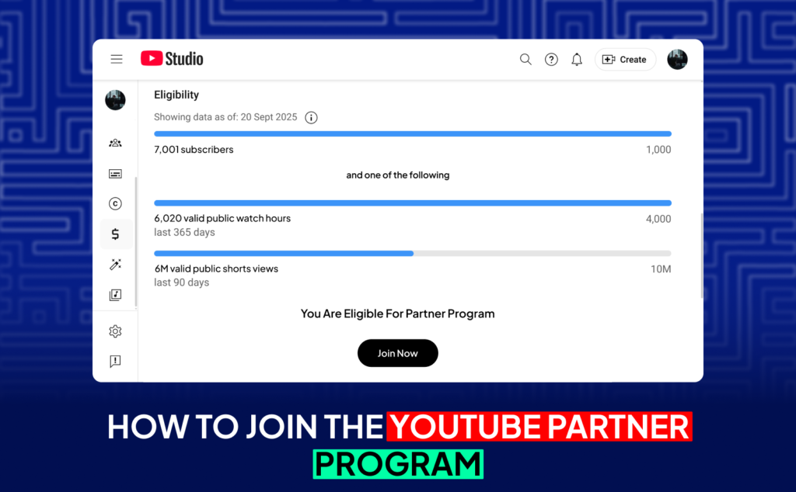
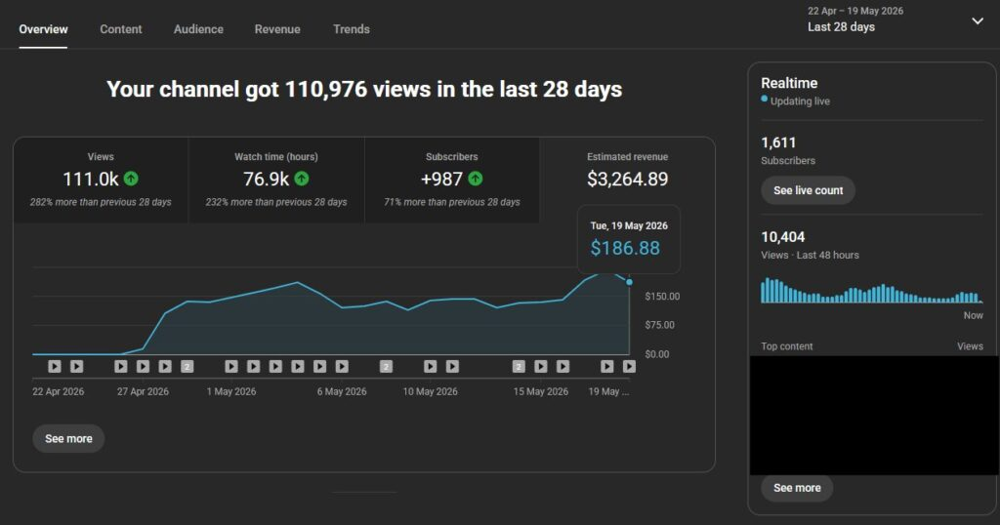
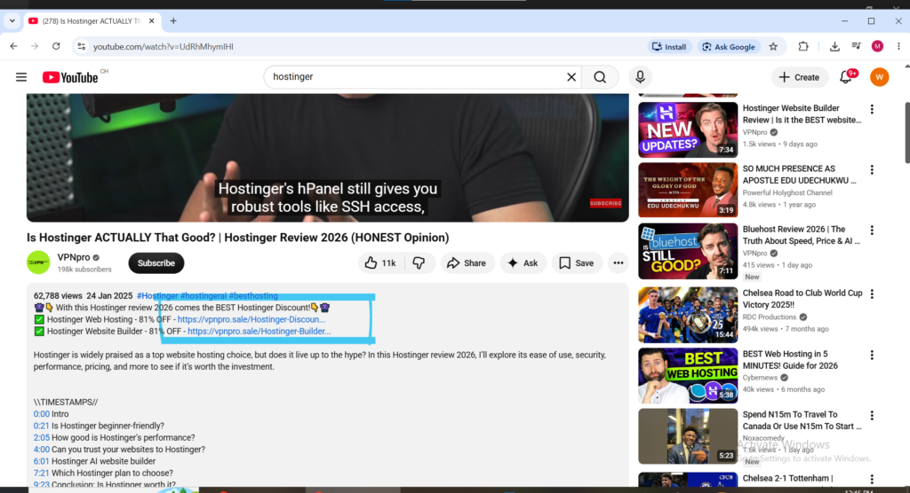

Most people misunderstand YouTube income. They believe success requires filming and uploading every day is the only active income.

True passive income on YouTube works differently. One Youtube channel can Open you up to many other ways to make money aside channel monetization and those other Ways which the Smart Know are listed in this article and **we listed about 7 ways extra**. This compounding effect makes YouTube one of the strongest passive income platforms in 2026.

With over 2.5 billion viewers worldwide, you don’t need millions of subscribers to earn serious money. Smart creators stack multiple income streams for stability.

This guide breaks down every major YouTube passive income stream, plus 8 more ways to make money on YouTube, what each pays, how to qualify, and how to build a channel that earns consistently without burning you out.

## What You will Learn Reading This Article

- What YouTube Passive Income Actually Means

- How to Qualify for the YouTube Partner Program

- 7 other income Streams on Youtube Many People Don't Know About

- The Niche Decision That Determines Everything

* * *

**What YouTube Passive Income Actually Means**

Passive income on YouTube means earning from videos that already exist, without constantly creating new content. A single tutorial can keep generating ad revenue, affiliate commissions, sponsorships, and product sales for months or years.

Most people only know about ad monetization, but the biggest earners make more money from multiple additional income streams.

The goal is to create evergreen videos and automated systems that work in the background, turning your channel into a long-term income engine instead of a daily grind.

However, it’s not instant. It usually takes 12–24 months of consistent effort to build a content library before the real compounding and passive phase begins.

**Step 1: Qualify for the YouTube Partner Program**

The YouTube Partner Program is the gateway that unlocks most of YouTube's native passive income features including ad revenue, channel memberships, and Super Thanks. Without being accepted into the YouTube Partner Program the direct passive income streams YouTube itself provides are not accessible.

To be eligible to apply for the YouTube Partner Program a channel must reach 1,000 subscribers and accumulate either 4,000 valid public watch hours in the last 12 months or 10 million valid public Shorts views in the last 90 days. The channel must also have an active Google AdSense account linked and must adhere to all YouTube channel monetization policies including community guidelines, terms of service, and copyright rules.

For many creators reaching 10 million Shorts views in 90 days is actually faster than accumulating 4,000 watch hours of long-form content. Focusing on YouTube Shorts in the early channel growth phase can accelerate the path to YouTube Partner Program eligibility significantly compared to publishing only long-form videos.

Once accepted into the YouTube Partner Program the passive income streams described throughout this guide become fully accessible and stackable on top of each other.

* * *

**Passive Income Stream 1: Ad Revenue Through AdSense** (The Popularly Known way)

Ad revenue is the most popular YouTube passive income stream. Advertisers pay to show ads on videos. YouTube takes 45% and the creator gets 55%.

Earnings are measured by CPM (cost per mille); The average is around $15.34 per 1,000 views, but it varies greatly by niche. Finance, business, technology, and legal content often earn $20+ CPM, while entertainment and gaming usually earn $1–$5. This is why niche choice heavily impacts income.

Established channels can earn $48,500 to $89,000 per year from ads. New channels start much lower.

The real passive power comes when videos rank in search; A single optimized video can generate ad revenue for years with no extra work.

<figure>

<figcaption>

**Creators Earnings dashboard**

</figcaption>

</figure>

* * *

**Passive Income Stream 2: Affiliate Marketing**

Affiliate marketing is one of the most scalable passive income streams on YouTube. You recommend products and tools using tracking links and earn commissions on every sale. A single well-ranked video can generate income for years with no updates.

The process is simple: Join relevant affiliate programs, add your unique links in video descriptions, and earn when viewers purchase. The video continues working indefinitely.

It works best with search intent. Comparison videos, tutorials, and honest reviews attract ready-to-buy viewers and convert well even for faceless channels.

Many programs, especially SaaS tools, offer 20-40% recurring commissions, allowing one video and one customer to generate income for years. You can start earning affiliate commissions from your very first video without needing YouTube Partner Program approval.

<figure>

<figcaption>

**The blue marking is a sample of an affiliate link on [Youtube.com](http://Youtube.com) and the Creator Earns commissions when its used.**

</figcaption>

</figure>

Affiliate marketing requires no YouTube Partner Program membership and no minimum subscriber count. A brand new channel publishing its first video can include affiliate links in the description and start earning commissions from day one if viewers click and purchase. This makes affiliate marketing the most accessible passive income stream for channels that have not yet qualified for the YouTube Partner Program.

* * *

**Passive Income Stream 3: YouTube Premium Revenue**

When a YouTube Premium subscriber watches content a creator receives a portion of their subscription fee. This YouTube Premium revenue is distributed based on how much watch time a channel accumulates from these subscribers. It is another passive income stream that grows as overall viewership increases, rewarding creators for producing high-quality engaging videos that keep viewers watching.

YouTube Premium revenue requires no additional setup or action beyond being accepted into the YouTube Partner Program. Once accepted this income stream runs automatically in the background alongside ad revenue. The amount earned from YouTube Premium is typically modest compared to ad revenue and affiliate marketing but it adds a passive layer of income that requires zero incremental effort to maintain once the channel is monetized.

* * *

**Passive Income Stream 4: Channel Memberships**

Channel memberships allow viewers to pay a recurring monthly fee to access exclusive perks including members-only posts, early video access, exclusive content, custom badges in the live chat, and special emojis. The revenue share for channel memberships is 70 percent to the creator compared to the 55 percent share from ad revenue making memberships a significantly more financially efficient income source per paying viewer.

The passive income component of channel memberships is the recurring monthly nature of the payments. A viewer who joins as a member in January continues paying each month they remain a member without the creator needing to do anything to renew that payment. Building even 100 loyal channel members each paying $4.99 per month generates $499 in monthly recurring passive income alongside all other revenue streams.

Even 100 loyal members can generate consistent monthly income. Channel memberships represent the foundation of predictable passive income for YouTube creators because the revenue recurs automatically every month without requiring new views or new content to trigger each payment.

* * *

**Passive Income Stream 5: Digital Products**

Digital products create a direct income stream for YouTube creators. These include courses, templates, guides, and niche-specific resources. Unlike ad revenue this model allows creators to control pricing and margins. Many creators combine YouTube with product funnels to maximize passive income. Digital products allow faceless creators to turn valuable content into scalable passive income without ever showing their face.

The connection between YouTube content and digital product sales is one of the most powerful passive income combinations available in 2026. A YouTube channel that publishes genuinely helpful content in a specific niche builds an audience of viewers who trust the creator's knowledge and recommendations. That trust converts into digital product sales at a significantly higher rate than cold traffic from advertising because the viewer has already consumed free valuable content from the creator and formed a positive impression before ever being asked to purchase anything.

Digital products that perform particularly well for YouTube passive income include video editing presets priced between $15 and $50, Photoshop and Canva templates priced between $10 and $25, email templates priced between $20 and $50, courses priced between $50 and $500, and PDF guides priced between $5 and $20. The best practice is to solve a specific problem the audience is consistently struggling with and create a product that addresses that problem directly.

* * *

**Passive Income Stream 6: Sponsorships**

Brands are willing to pay for niche audiences. Even smaller channels can secure sponsorship deals if they target a specific segment. Sponsorships often generate higher revenue per video than ads making them an important part of a comprehensive YouTube passive income strategy.

Once a channel reaches 10,000 subscribers brands approach creators to feature their products. Some YouTube creators earn more from sponsorships than from all other monetization methods combined. The passive income element of sponsorships comes from sponsored videos that remain live and visible on the channel indefinitely after the sponsorship fee has been paid. A sponsored video published twelve months ago continues generating ad revenue and affiliate commissions alongside the original sponsorship payment that was received when the video was first published.

* * *

**Passive Income Stream 7: YouTube Shopping**

YouTube Shopping lets creators sell products directly on their channel — displayed beneath videos, in a dedicated Store tab, and tagged within video content itself. In 2026 YouTube has expanded shopping features to include product tagging within videos allowing creators to highlight products at specific timestamps. Requirements include 1,000 subscribers, YouTube Partner Program membership, and connection to an approved merchandise partner or a Shopify store.

For YouTube passive income this feature is particularly powerful because products are displayed automatically beneath every video that has shopping tags enabled. A viewer watching a tutorial from six months ago sees the product shelf beneath the video and can purchase without the creator being present or actively promoting the product in that moment. That automated display and purchase flow is passive income working exactly as intended.

* * *

**Passive Income Stream 8: Content Licensing and Syndication**

Creators can license footage, clips, or original content to media platforms or other creators. This turns content into reusable assets. Viral or high-quality footage can generate repeated income without additional effort from the creator who originally produced it.

Expanding beyond YouTube means tapping into entirely new revenue streams by reaching international audiences and maximizing the value of every piece of content already created. Platforms like MSN, MEGOGO, and Chinese streaming services provide massive opportunities for additional distribution and monetization. Translating content allows earnings from the same video multiple times — the more languages added the more potential revenue streams unlocked.

* * *

**The Niche Decision That Determines Everything**

Every passive income strategy covered in this guide works significantly better in some niches than others. The financial return from 100,000 YouTube views varies enormously depending on the topic of the content those views are watching.

YouTube's algorithm rewards topical authority. A channel that posts exclusively about one specific topic will grow faster than one that alternates between different subjects. Picking one niche and going deep consistently is what causes the algorithm to understand who to recommend the channel to.

The highest-earning YouTube passive income niches in 2026 based on CPM rates and affiliate commission availability are personal finance and investing, software and technology reviews, artificial intelligence and AI tools, health and fitness, real estate, legal advice, and business and entrepreneurship. These niches combine high advertiser CPM rates with strong affiliate program availability meaning the passive income earned per view is significantly higher than in general entertainment or lifestyle niches.

* * *

**Evergreen Content: The Foundation of YouTube Passive Income**

One of the most popular YouTube passive income models is creating evergreen content that stays relevant forever. Evergreen content is videos that answer questions people search for consistently over months and years rather than content tied to news events or trending topics that generates views for a brief period and then becomes irrelevant.

A video answering the question "how does compound interest work" will be searched and watched in 2026, 2027, and 2028 because the underlying question never becomes irrelevant. A video covering a news story from three months ago will generate views for a week and then stop entirely. Building a YouTube channel's passive income on a foundation of evergreen content means the view count and associated passive income from that content compounds continuously rather than spiking briefly and dying.

The combination of evergreen content, search optimization using tools like VidIQ and TubeBuddy to target consistently searched keywords, and multiple monetization streams layered on top of each other ad revenue, affiliate links, digital products, memberships — is the formula that produces genuine sustainable YouTube passive income rather than income that fluctuates violently with every algorithm change.

* * *

**24/7 Live Streams as a Passive Income Source**

Running a 24/7 stream of pre-recorded content such as lo-fi music, ASMR, or motivational sessions allows creators to passively generate ad revenue around the clock. YouTube prioritizes live content in its recommendation algorithm which means better visibility and more engagement over time compared to regular uploaded videos. Tools like Gyre make it easy to loop content indefinitely enabling a live stream to run without the creator being present at any point during the stream.

This is one of the most overlooked passive income strategies available to YouTube creators in 2026. Setting up a 24/7 live stream of royalty-free music, ambient soundscapes, or curated motivational content requires a one-time setup investment and then runs automatically generating ad revenue every hour of every day without any ongoing presence or attention from the creator.

* * *

**What to Realistically Expect**

According to the US Census Bureau 20 percent of US households make passive income with a median earning of $4,200 per year. That is a meaningful supplement and for some people it is the foundation of financial freedom.

For YouTube specifically the first six to twelve months of consistent publishing typically generate modest income as the channel builds its content library, subscriber base, and search rankings. Month twelve onwards is typically where the compounding nature of YouTube passive income becomes genuinely visible as a growing library of ranking videos generates increasing ad impressions, affiliate clicks, and product sales simultaneously without proportional increases in the effort being invested.

The creators who build sustainable YouTube businesses are not necessarily the ones with the most subscribers. They are the ones who understood early that YouTube monetization is not one thing — it is multiple income streams working together simultaneously. Building each income stream described in this guide incrementally as the channel grows produces YouTube passive income that is both meaningful in size and resilient to algorithm changes because no single stream is responsible for the majority of total earnings.
