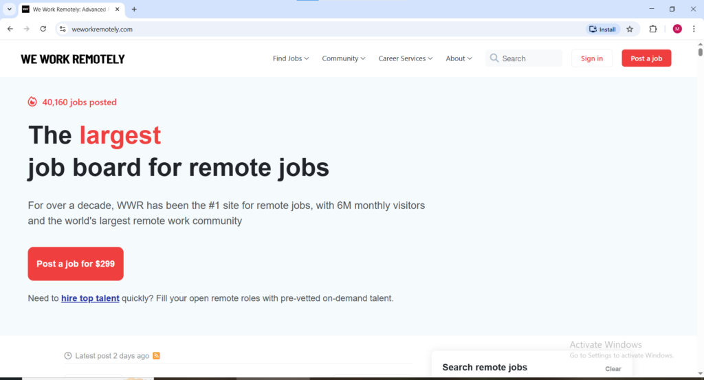
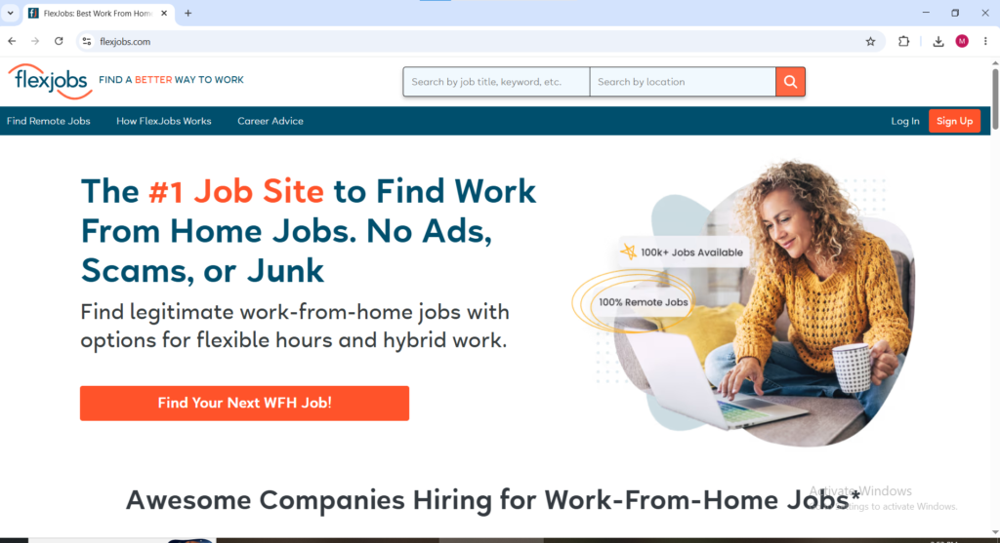
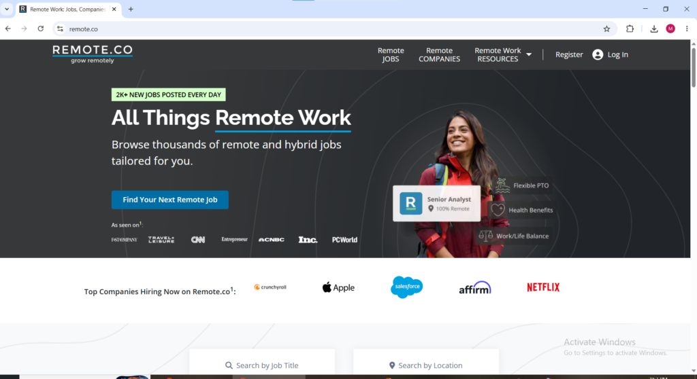
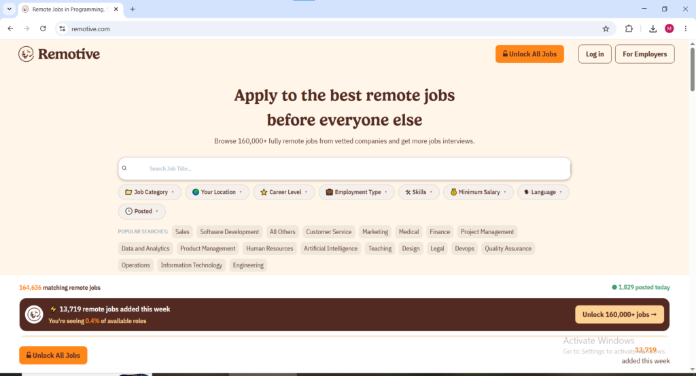
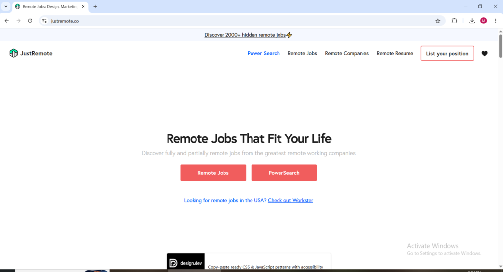
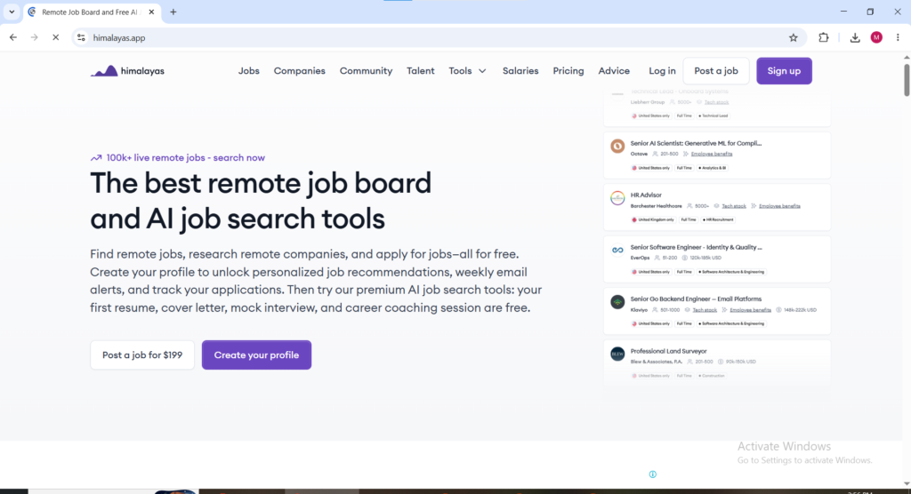

The remote work dream sounds perfect until reality hits. You scroll Indeed for hours, send dozens of applications, and hear crickets. Or worse — you land something that turns out to be a scam asking for money upfront.

I get it. The job market feels rigged against normal people. Companies preach "work from anywhere" while flooding boards with ghost jobs or lowball offers. But here's the brutal truth most gurus won't tell you: **the majority of successful remote workers aren't applying on the overcrowded giants**. They're using a handful of specialized platforms that actually connect talent with companies ready to pay.

In this guide, I'll break down the best remote job websites for 2026, what types of roles dominate each, and most importantly **exactly how you get paid** on every single one. No fluff, no outdated lists. Just actionable info so you can start applying smarter today.

### Why Most Remote Job Strategies Fail in 2026

Remote work exploded post-pandemic, but competition did too. Generic sites like Indeed and LinkedIn are saturated with applicants. Many listings aren't truly remote or get buried.

Specialized remote job boards curate better opportunities. Some focus on tech and digital nomad roles, others on non-tech positions like customer support or admin. Freelance platforms offer faster entry but come with their own rules.

The key difference? **Payment reliability and methods**. Knowing how money flows prevents headaches with international transfers, fees, or non-payment.

**Let's dive into the platforms that actually deliver.**

### 1\. We Work Remotely ([weworkremotely.com](http://weworkremotely.com))

One of the oldest and most trusted remote-only job boards. With millions of monthly visitors, it features roles in programming, design, marketing, copywriting, customer support, and product management.

**Best for**: Tech-savvy professionals and digital roles. Many "Anywhere in the World" positions.

**How to get paid**: It depends entirely on the employer. Full-time salaried roles usually use direct bank deposit or company payroll systems (e.g., Rippling, Deel, or Gusto). International hires often get paid via Wise (formerly TransferWise) for low fees or PayPal. Contractors negotiate payment terms during offers common options include bi-weekly/monthly bank transfers or Payoneer. Always clarify during interviews.

Pro tip: Set up email alerts for specific categories to beat the rush.

### 2\. FlexJobs ([flexjobs.com](http://flexjobs.com))

If you're tired of scams, FlexJobs is your safe haven. They manually screen every listing.

**Best for**: Non-tech remote jobs like administrative, accounting, education, healthcare support, and part-time/flexible roles. Excellent for parents, career changers, or those seeking lower-stress positions.

**Cost**: Subscription (around $50/year or trial options), but worth it for quality.

**How to get paid**: Direct with the employer. Salaried positions use standard payroll and direct deposit. Freelance/contract roles often pay via PayPal, bank transfer, or integrated tools like Wise. Many US-based companies handle taxes and benefits internally.

Many users report higher response rates here because listings have fewer applicants.

### 3\. Remote.co ([remote.co](http://remote.co))

From the creators of the popular Remote podcast and resources, this board lists opportunities from remote-first companies.

**Best for**: Operations, marketing, support, and tech roles at established remote companies.

**How to get paid**: Employer-dependent. Full-time roles typically offer competitive salaries with direct deposit or global payroll providers. Contractors use Wise, PayPal, or Payoneer for seamless international payments. Many companies here are experienced with distributed teams and handle cross-border payments smoothly.

### 4\. Remotive ([remotive.com](http://remotive.com))

Clean interface with strong filters and worldwide focus.

**Best for**: Tech, growth, design, and support roles. Good mix of startups and bigger companies.

**How to get paid**: Same as above — direct employer arrangements. Look for companies using modern payroll like Deel or Remote.com, which simplify payments and compliance for global talent.

### 5\. NoDesk ([nodesk.co](http://nodesk.co))

Daily updated listings with a focus on quality over quantity. No login required to browse.

**Best for**: Digital nomads and professionals seeking fresh opportunities at innovative companies.

**How to get paid**: Employer handles it. Strong on transparent listings that often mention salary ranges and benefits.

### 6\. JustRemote ([justremote.co](http://justremote.co)) & Working Nomads

Similar free boards with clean designs and good international filters.

**Payment**: Employer-direct. These are great for discovering companies open to global hires.

### 7\. Upwork ([upwork.com](http://upwork.com)) – The Freelance Powerhouse

If you want to start earning **this week** instead of waiting months for full-time offers, Upwork is unmatched.

**Best for**: Writers, developers, designers, virtual assistants, marketers, data entry, and almost any digital skill.

**How to get paid**: Excellent protection. Clients fund jobs in escrow.

- Hourly contracts: Bill weekly, paid after 5-10 day security period.

- Fixed-price: Milestones release funds upon approval.

**Withdrawal options**: Direct to bank (ACH free for US, low fees elsewhere), PayPal, Payoneer, or wire transfer. Platform fee is typically 10% (sliding down with more earnings). One of the safest for beginners due to dispute resolution.

Build your profile with a strong portfolio — top freelancers here clear $5k–$10k+/month.

### 8\. Fiverr ([fiverr.com](http://fiverr.com))

Gig-based marketplace where you create service packages.

**Best for**: Creative work, one-off tasks, video editing, graphic design, voiceovers, programming gigs.

**How to get paid**: Buyer pays Fiverr first. Funds clear to your account after delivery (or milestones). 20% platform fee. Withdraw to bank, PayPal, Payoneer, etc. Fast turnaround gigs can get you paid within days.

### 9**.** Himalayas ([himalayas.app](http://himalayas.app))

Himalayas has become one of the top remote job boards in 2026. It offers over 80,000 remote job opportunities along with powerful free AI tools such as resume builder cover letter generator mock interviewer and career coach. The platform stands out for its clean modern design detailed company profiles tech stack information benefits data and strong focus on remote first companies.

**Best for** tech marketing design product sales customer support and many other digital roles. It is especially useful for job seekers who want to research companies deeply before applying and for those who like AI assistance to speed up applications.

**How to get paid** payment is handled directly by the employer. Full time roles typically use direct deposit or modern global payroll providers like Deel Remote.com or Rippling. Contractors usually receive payments through Wise PayPal or Payoneer. Many companies listed on Himalayas are experienced with international hires so payment processes tend to be smooth and reliable.

**Niche platforms**: Arc.dev or Crossover for higher-paying tech/dev roles; specialized boards for teaching, healthcare, etc.

### 10\. DAILY REMOTE ([dailyremote.com](http://dailyremote.com))

DailyRemote delivers exactly what its name promises with new remote jobs posted every single day. It features a high volume of opportunities across more than 15 categories and attracts both established companies and startups.

**Best for** software development design customer support sales marketing writing data entry virtual assistant and many non tech remote positions. It is ideal for job seekers who want fresh listings quickly and those open to a wide variety of roles and experience levels.

**How to get paid** as with other job boards payment is arranged directly with the hiring company. Because DailyRemote attracts many remote friendly employers you will frequently find teams already equipped for global payments using tools like Wise Payoneer or company payroll systems. Always discuss payment frequency method and currency during the offer conversation.

Pangian is a fast growing global remote work network and community that connects professionals with remote opportunities worldwide. Beyond job listings it builds a supportive community of remote workers and digital nomads across more than 190 countries.

**Best for** diverse international roles across many industries. It appeals to people who value community networking and opportunities that emphasize diversity flexibility and global collaboration.

**How to get paid** payment is managed directly by the employer. Pangian attracts companies open to worldwide talent so you will often see support for international payment methods including Wise PayPal Payoneer and bank transfers. The community aspect can also help you learn best practices for getting paid smoothly as a remote worker.

### How to Actually Get Paid as a Remote Worker (Global Tips)

Payment friction kills many remote careers. Here's how to minimize it:

1. **Set up the right tools early**:
    - Wise: Lowest fees for international transfers, multi-currency accounts.
    
    - Payoneer: Popular with platforms and clients.
    
    - PayPal: Convenient but higher fees for withdrawals.
    
    - Local bank account with good international support.

3. **For full-time employment**:
    - Ask about payroll provider in interviews (Deel, Remote.com, Oyster make global hiring easy).
    
    - Clarify tax responsibilities — some companies withhold, others expect you to handle as contractor.

5. **For freelancers**:
    - Always use platform escrow/protection for first projects.
    
    - Invoice professionally and track everything.
    
    - Consider forming an LLC or equivalent for tax benefits as earnings grow.

7. **Common pitfalls**:
    - Currency conversion fees can eat 3-8%. Use Wise to avoid.
    
    - Late payments, build relationships and have clear contracts.
    
    - Taxes: Track income. Tools like QuickBooks or Wave help.

### Pro Strategies to Land Remote Jobs Faster

- **Tailor applications**: Customize resumes with remote-friendly keywords (asynchronous communication, self-starter, results-driven).

- **Build proof**: Portfolio > degrees in most cases. Use Notion, GitHub, or personal site.

- **Network**: Engage on LinkedIn, Twitter/X, and relevant communities.

- **Apply daily**: Treat job hunting like a job 10-20 targeted applications per week beats spamming 100.

- **Upskill**: Learn high-demand skills like AI tools, no-code, or specific software.

- **Avoid scams**: Never pay to work. Legit companies don't ask for money or personal financial info upfront.

### Real Talk: Is Remote Work Still Worth It in 2026?

Yes, But only if you approach it strategically. Salaries for skilled remote roles still beat many local markets, especially when paired with lower cost-of-living locations. However, entry-level pure remote jobs are competitive. Many succeed by starting freelance on Upwork/Fiverr to build experience and testimonials, then transitioning to full-time.

The people "ignoring" this advice are still refreshing Indeed endlessly. The ones reading (and acting on) this are building location-independent careers.

### Final Action Plan

1. Pick 3-4 platforms from this list based on your skills.

3. Optimize your profiles today.

5. Set up Wise/Payoneer this week.

7. Apply consistently for 30 days and track results.

9. Adjust based on responses.

Remote work isn't dead, The lazy strategies are. The opportunities are there for those willing to use the right tools and put in focused effort.

Which platform will you try first? Drop a comment below with your niche or biggest struggle,Happy to give more targeted advice.

_**Disclaimer:** Always do your due diligence. Payment methods and terms can change. This post contains affiliate links where noted, but all recommendations come from real user feedback and research._
