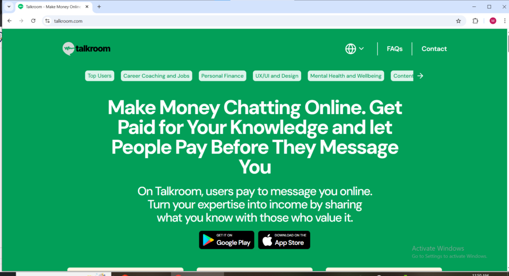
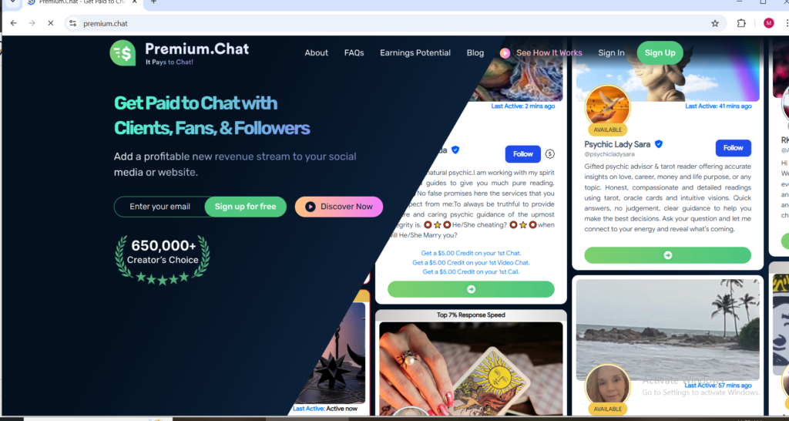
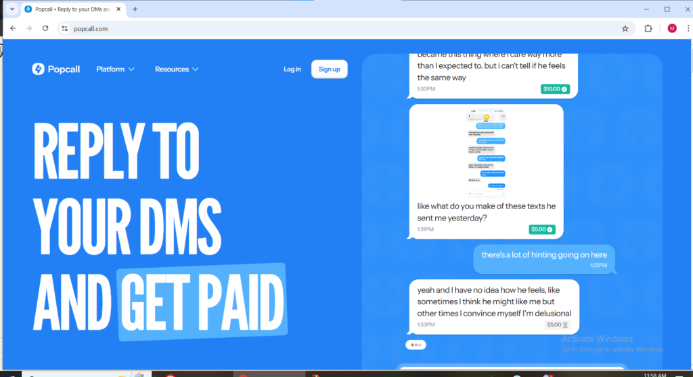
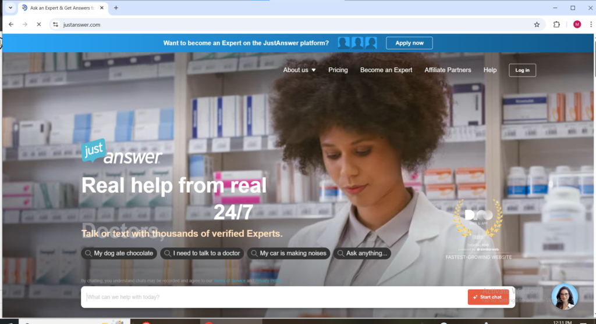
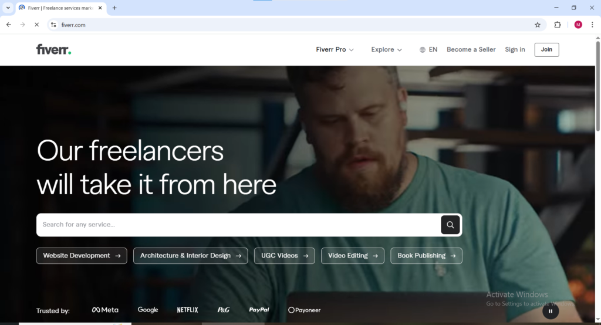
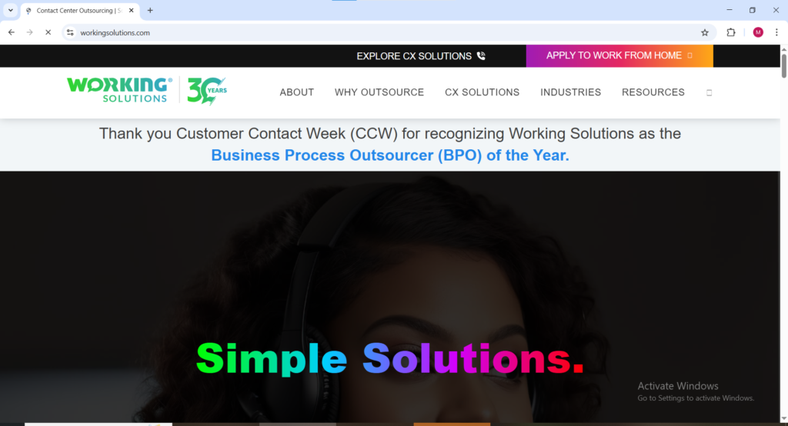
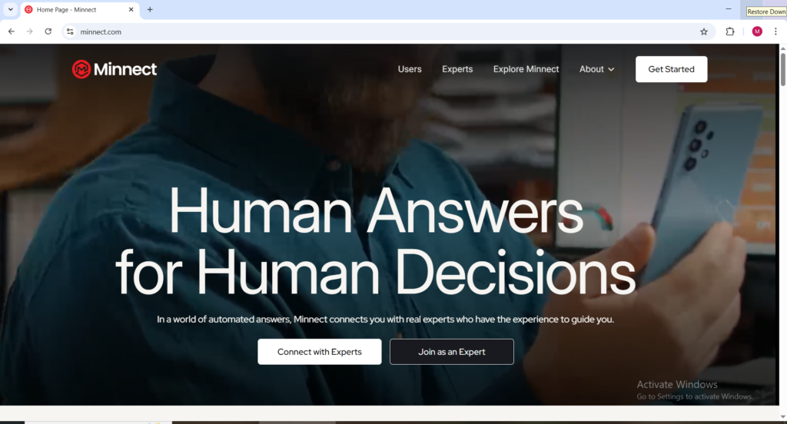
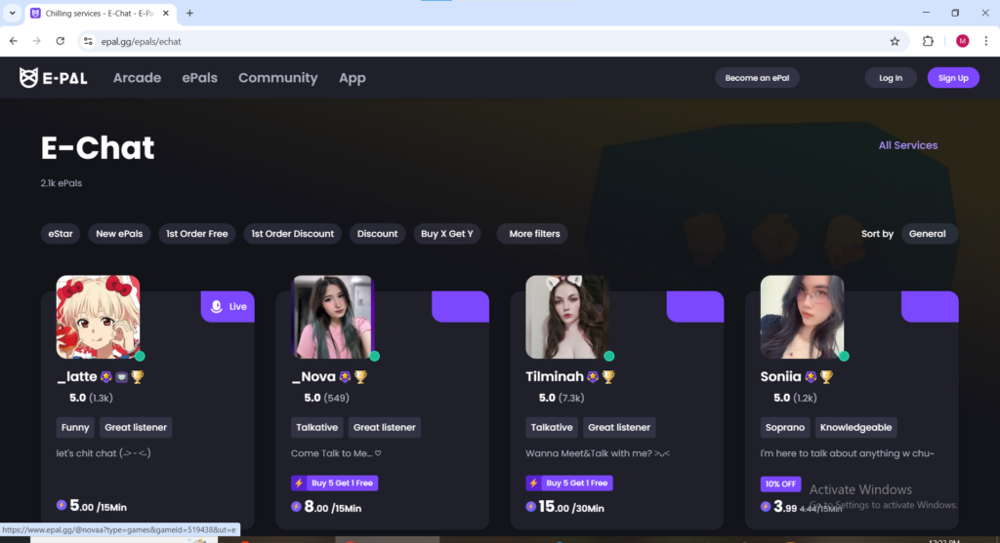

Your phone is already in your hand. You are already texting. The only difference between what you are doing right now and getting paid to text is that some platforms will put money in your account for the same conversations you are having for free everywhere else. Getting paid to text and chat online in 2026 is a legitimate side hustle that requires nothing more than a device, an internet connection, and the ability to communicate clearly and consistently on this post **we will be showing you 13 ways** and telling you everything u need to know.

The platforms where you can get paid to text fall into several distinct categories. Some pay you to provide expert advice or professional consultation through text. Some hire you as a customer support agent for real brands. Some pay you per message or per minute for general conversation. Some are apps you download on your phone while others are websites you access on any browser. This guide covers every legitimate platform where you can get paid to text in 2026, identifies whether each one is a website or an app, and explains exactly what the work involves so you know what to expect before signing up.

Getting paid to text and chat online is one of the most accessible ways to earn from home in 2026 with no degree, no special equipment, and no fixed schedule required in most cases. Active participants across these platforms consistently report earning between $200 and $500 per month as a side income with top performers exceeding that range significantly depending on how many platforms they use and how consistently they are available.

* * *

## 1\. Talkroom ([talkroom.com](http://talkroom.com))

Available as: Website and Mobile App (iOS and Android)

Talkroom is a premium platform where people pay to message you directly to get advice, share your knowledge, or simply have a conversation and you set your own rates for the access you provide. This is one of the most flexible get paid to text platforms available because you are entirely in control of what you charge and what topics you are willing to discuss. Coaches, consultants, subject matter experts, and creators with established audiences use Talkroom to monetize the questions and conversations they were previously having for free.

The Talkroom app is available on both iOS and Android making it one of the more mobile-friendly options for getting paid to text on the go. You create a profile, set your per-message or per-minute rate, share your Talkroom link on your social media or wherever your audience finds you, and start earning when people pay to access your inbox. There is no minimum follower count required to join Talkroom but having an existing audience makes building income on the platform significantly faster since you are bringing your own clients rather than waiting for the platform to match you with strangers.

<figure>

<figcaption>

TALKROOM.COM, Make money chatting

</figcaption>

</figure>

## 2\. Premium.Chat ([premium.chat](http://premium.chat))

Available as: Website

Premium.Chat lets you charge clients between $1 and $5.99 per minute for text and video chats or a flat fee of up to $50 per session, making it one of the higher-earning get paid to text platforms for people with genuine expertise to offer. The platform is particularly well suited for coaches, consultants, therapists, spiritual advisors, fitness experts, financial advisors, and any professional who regularly answers questions from clients and wants to monetize that access properly.

Premium.Chat takes between 20 and 40 percent of your earnings depending on your monthly revenue level the platform keeps 40 percent for creators earning under $20,000 per month which is the bracket most new users fall into. That commission rate is worth factoring into your pricing when setting your per-minute or per-session rate so your net earnings reflect the value of your time accurately. Premium.Chat supports international users and provides a professional-looking profile page that you can share as a link anywhere online.

<figure>

<figcaption>

Premium.chat welcome page

</figcaption>

</figure>

### 3\. Popcall ([popcall.com](http://popcall.com))

Available as: Mobile App (iOS)

Popcall is the easiest way to start getting paid to text because it mimics the messaging apps you and your clients already use daily. Most creators and coaches share their Popcall link in their social media bios, have real-time text conversations with people who reach out, and get paid per message reply. You can also accept pay-per-minute FaceTime-style calls or call back when you are free and all call and message preferences are completely customizable.

The platform keeps 20 percent of your earnings which is one of the more competitive commission rates in the get paid to text space. Popcall is currently available as an iOS app so Android users will need to check current availability. The iMessage-style interface makes the experience feel natural and familiar rather than like a formal platform login which reduces friction for both you and the people paying to message you. If you already have a social media presence of any size and regularly receive questions from followers, Popcall turns those free interactions into paid income with minimal friction.

<figure>

<figcaption>

Popcall.com website welcome page

</figcaption>

</figure>

### 4\. Cloudworkers ( [cloudworkers.com](http://cloudworkers.com) )

Available as: Website

Cloudworkers is a platform that hires people to handle chat-based tasks and customer interactions on behalf of its clients. Unlike advice platforms where you bring your own audience, Cloudworkers connects you directly with available work by matching you to text-based tasks that companies need completed. The work involves managing chat conversations, responding to customer inquiries, and handling text-based interactions within guidelines provided by the platform and its clients.

Getting paid to text through Cloudworkers is more structured than creator-based platforms because you are working within set parameters rather than setting your own rates and topics. This structure also makes it more beginner friendly for people who are new to getting paid to text and do not yet have an established audience or client base to bring to a platform. Payment rates and methods vary by project so reviewing the specific terms of each available task before committing is important.

* * *

### 5\. Chatdesk ([chatdesk.com](http://chatdesk.com))

Available as: Website

Chatdesk is a freelance customer support platform that hires people to provide chat support for real established brands via SMS, social media, and other text-based channels, paying per ticket or per message handled. The brands using Chatdesk are legitimate businesses that need responsive customer support coverage and the work involves answering genuine customer questions, resolving straightforward issues, and providing helpful responses within brand guidelines.

Getting paid to text through Chatdesk is one of the most professionally credible options on this list because you are doing genuine brand customer support work rather than general conversation. The work requires clear professional written communication, the ability to follow guidelines consistently, and a reliable response time. Chatdesk is a website-based platform and the application process involves demonstrating your communication skills before being matched with available brand clients.

### 6\. 1Q App (1q.com)

Available as: Mobile App (iOS and Android)

1Q sends you market research questions from brands directly to your phone and pays you instantly for each answer with no minimum payout threshold — money goes straight to your PayPal account the moment you answer. Each question pays around $0.25 which is modest but the instant payment with zero waiting is genuinely unusual in the get paid to text space and makes 1Q one of the most frictionless entry points available.

The 1Q app is available on both iOS and Android and the getting started process is one of the fastest on this entire list download the app, create a profile, and you can start receiving paid questions almost immediately. The pay per question is low compared to expert advice platforms but the simplicity, speed, and instant PayPal payout make it worth having active alongside higher-paying platforms. Think of 1Q as a quick background earner that requires almost no effort rather than a primary income source for getting paid to text.

* * *

### 7\. JustAnswer ([justanswer.com](http://justanswer.com))

Available as: Website and Mobile App (iOS and Android)

JustAnswer pays verified experts to answer questions from real people in fields like law, medicine, auto mechanics, technology, veterinary care, and more via text chat. The platform connects people who need professional level answers with qualified experts who can provide them, and getting paid to text through JustAnswer requires genuine expertise in your field since the platform verifies credentials before approving experts to answer questions.

Pay on JustAnswer ranges from $5 to $30 per question depending on your field and the complexity of the answer required. Medical, legal, and financial experts consistently command the higher end of that range. JustAnswer is available as both a website and a mobile app on iOS and Android making it accessible across all devices. If you have professional qualifications in any field this is one of the highest-paying legitimate get paid to text opportunities available because you are monetizing credentials you already have rather than starting from scratch building an audience.

Note it is available as an iOS and Android app

* * *

### 8\. Fiverr ([fiverr.com](http://fiverr.com))

Available as: Website and Mobile App (iOS and Android)

Fiverr belongs on this get paid to text list because offering text-based services is one of the most overlooked and accessible ways to earn on the platform. You can create gigs offering virtual assistant services via chat, customer support responses, text-based advice sessions, social media chat management, community moderation, and more. Buyers pay upfront through Fiverr's secure escrow system and you deliver the service through text-based communication.

Getting paid to text through Fiverr gives you more control over your pricing, your working hours, and the type of communication work you accept than most dedicated chat platforms. Fiverr is available as both a website and a highly functional mobile app on iOS and Android letting you manage your gigs, communicate with buyers, and deliver work entirely from your phone. Fiverr takes 20 percent of each transaction which is comparable to most get paid to text platforms. Building reviews on your first few gigs is the key to unlocking consistent orders respond fast, deliver quality work, and the platform's search algorithm begins promoting your gigs organically over time.

And note it is available as an iOS and Android app

* * *

### 9\. Working Solutions

[workingsolutions.com](http://workingsolutions.com) Available as: Website

Working Solutions is among the highest-earning options on this entire get paid to text list because they offer actual contract work rather than gig-based chat apps. Both platforms hire remote agents to handle customer support, sales, and chat-based interactions for major companies including Disney, AT&T, and Carnival Cruise, paying between $7 and $30 per hour depending on the client program the only down side is they focus on clients from usa and canada.

Getting paid to text through Working Solutions and Arise is more structured than creative platforms and comes with more requirements. Arise classifies workers as independent contractors and requires completing a paid certification course costing between $20 and $50 for each client program before you begin working. The course cost is typically earned back within the first couple of working sessions once you are placed with a client. You will need a quiet dedicated workspace, a reliable wired internet connection, and a computer that meets the platform's technical specifications. Both platforms are website-based and primarily serve workers in supported countries so check availability for your specific location before applying.

<figure>

<figcaption>

workingsolutions.com webpage

</figcaption>

</figure>

* * *

## 10\. McMoney (mcmoney.org)

Available as: Mobile App (iOS and Android)

McMoney is one of the most unique platforms on this get paid to text list because the way you earn is completely different from every other option here. McMoney pays you to receive and reply to test SMS messages sent by telecommunications companies, software developers, and businesses who need to verify that their messaging systems are working correctly across different devices, carriers, and geographic locations. You do not need any special skills or expertise you simply receive the test SMS on your phone and confirm that you received it through the app.

The McMoney app is available on both iOS and Android and the process of getting started is among the simplest on this entire list. Download the app, register your phone number, and McMoney begins sending test SMS messages to your phone when testing opportunities that match your location and carrier become available. Pay per message is modest but the work requires almost zero active effort your phone simply receives messages and you tap to confirm receipt. McMoney is a genuine background earner that works quietly alongside your other get paid to text platforms without requiring any active time investment.

* * *

### 11\. Fibler ([fibler.com](http://fibler.com))

Available as: Website and Mobile App

Fibler connects people who have questions with experts who can answer them via text, call, or video and pays up to $3 per text session, $9 per voice call, and $15 per video call depending on the format the client chooses. You set your own rates on Fibler and build a client base over time as your reputation on the platform grows. The platform is well suited for anyone with genuine expertise in finance, fitness, business, relationships, health, technology, or any field where people regularly seek knowledgeable guidance.

Getting paid to text through Fibler requires patience in the early stages because you are building a client base from scratch rather than being matched with existing platform traffic automatically. Creating a strong detailed profile that clearly communicates your area of expertise and what clients can expect from a session with you is the most important step in generating your first paid text sessions. Fibler is available as both a website and a mobile application making it accessible on any device.

* * *

### 12\. Minnect ( [minnect.com](http://minnect.com) )

Available as: Website and Mobile App (iOS and Android)

Minnect is a platform specifically built around getting paid to answer questions from your audience or from people who want access to your expertise. You create a profile on Minnect, set your rate for answering questions via text, and people who want your specific knowledge or perspective pay to submit their questions directly to you. The platform is designed for experts, entrepreneurs, coaches, and professionals who want to monetize the knowledge they are already sharing for free elsewhere.

Getting paid to text through Minnect is particularly appealing for anyone who already has a following on social media, runs a blog, or has an established professional reputation because the platform is built around the concept of paying for exclusive access to specific people whose insights are genuinely valuable. Minnect is available as both a website and a mobile app on iOS and Android. Earnings depend entirely on how well you promote your Minnect profile to people who already want to ask you questions the platform provides the payment infrastructure but the audience development is your responsibility.

<figure>

<figcaption>

Minnect.com

</figcaption>

</figure>

* * *

### 13\. E-Pal

[epal.gg](http://epal.gg) Available as: Website (E-Pal)

E-Pal occupy a distinct corner of the get paid to text space focused specifically on gaming companionship, virtual friendship, and shared activity sessions. On E-Pal you create a profile as a gaming companion and people pay to have you join them in their favorite games, coach them on specific titles, or simply chat while playing.

Getting paid to text through these platforms is most viable for people who are already active gamers or who enjoy being a conversational companion in a structured context. You set your own rates on both platforms and choose which services you offer and which requests you accept. E-Pal is particularly well established in the gaming community and has a large active user base actively searching for companions across a wide range of game titles. FriendPC has a same-day payment policy which is genuinely appreciated compared to platforms that hold earnings for days or weeks after a session is completed.

* * *

**How to Maximize Your Earnings from Get Paid to Text Platforms**

The most effective strategy for getting paid to text consistently in 2026 is platform diversification combined with a clear positioning of what you offer. Signing up for multiple platforms simultaneously rather than testing one before moving to the next ensures you are always pulling income from more than one source regardless of which platform is busy or slow on any given day.

For expert-based platforms like JustAnswer, Fibler, Premium.Chat, and Minnect the quality and completeness of your profile is the single biggest factor in how much you earn. A detailed profile that clearly communicates your credentials, your area of expertise, and what a client can expect from a session with you converts significantly better than a vague generic description. Spend real time on your profile before expecting paid sessions to arrive.

For app-based platforms like 1Q and McMoney enable notifications so you respond to available opportunities immediately when they appear. Both platforms operate on availability-based matching and quick responses consistently generate more earning opportunities than delayed ones.

For freelance platforms like Fiverr getting your first three to five reviews is the priority above everything else in the early weeks. Accept reasonable rates initially, deliver exceptional work, and request reviews from satisfied buyers. Those early reviews are the foundation that unlocks organic platform visibility and consistent order volume over time.

Getting paid to text will not replace a full-time income on any single platform but as a combined portfolio of multiple platforms running simultaneously it represents a meaningful and genuinely flexible side income that grows with your reputation and your audience over time.
